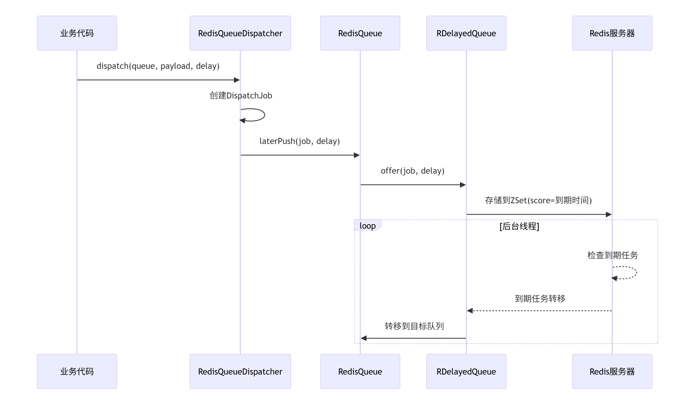
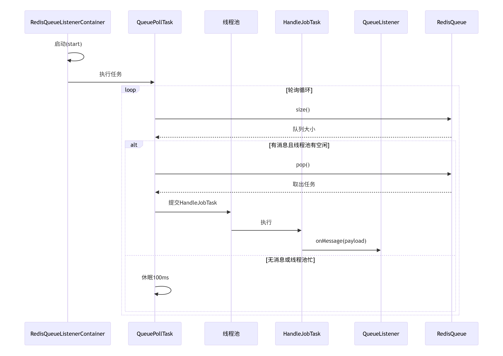
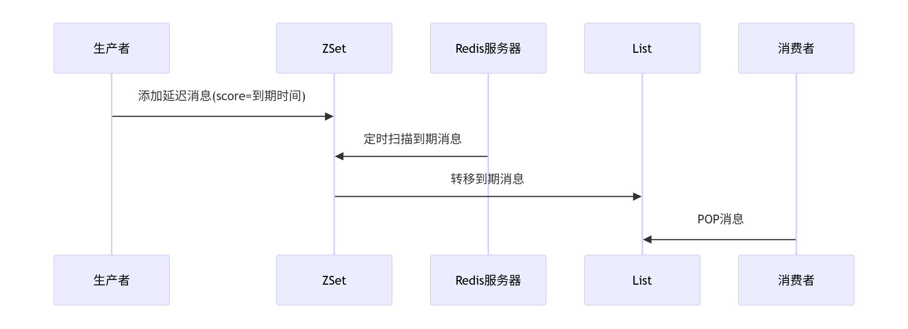
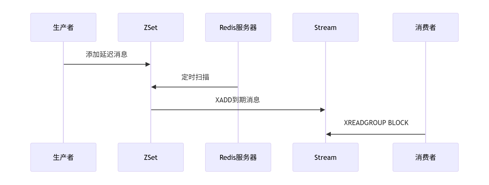

# Redis延迟队列

## 基本原理

- **QueueListener**：消息监听器接口
  - `queueName()`：返回监听的队列名称
  - `onMessage(T msg)`：处理消息的方法
  - `onError(T msg, Throwable e)`：错误处理方法

- **QueueListenerContainer**：监听器容器
  - `register()`：注册队列监听器

- **Task**：任务接口
  - `isActive()`：检查任务是否激活
  - `cancel()`：取消任务
  - `run()`：执行任务

- **Job**：任务实体接口
  - `getJobId()`：任务ID
  - `getPayload()`：任务内容
  - `getQueue()`：所属队列

- **Queue**：队列接口
  - `push()`：立即推送任务
  - `laterPush()`：延迟推送任务
  - `pop()`：取出任务

- **QueueDispatcher**：队列分发器

  - `dispatch()`：分发任务到队列

### 延迟队列实现逻辑

> - **延迟存储**：
>   - 任务被放入Redisson的`RDelayedQueue`
>   - 实际存储在Redis的**有序集合(ZSet)**中，score值为任务的到期时间戳
>
> - **到期转移**：
>   - Redisson后台线程定期扫描ZSet
>   - 检测到期任务（score <= 当前时间）
>   - 将到期任务转移到目标队列中
>
> - **延迟时间计算**：
>   - 当调用`laterPush(job, Duration.ofMinutes(30))`时
>   - 延迟时间 = 当前时间 + 30分钟
>   - 这个时间作为score存入ZSet

### 监听机制实现逻辑

> - **轮询机制**：
>   - `QueuePollTask`持续检查队列大小
>   - 当有消息且线程池有空闲线程时取出任务
>   - 每次循环后休眠100ms，避免CPU空转
>
> - **任务处理**：
>   - 取出的任务交给`HandleJobTask`
>   - 在独立线程中调用监听器的`onMessage()`
>   - 捕获异常并调用`onError()`
>
> - **资源控制**：
>   - 检查线程池活跃线程数（`executor.getActiveCount()`）
>   - 确保线程池不会超负荷工作

## Steam对比

| 特性             | 当前实现（List+ZSet）          | Redis Stream                     |
| :--------------- | :----------------------------- | :------------------------------- |
| **消息模型**     | 简单队列模型（FIFO）           | 日志流模型（支持消息回溯）       |
| **延迟实现**     | ZSet存储延迟消息+定时转移      | 需额外ZSet支持（原生不支持延迟） |
| **消息可靠性**   | 较低（POP后即删除）            | 高（ACK机制+消息持久化）         |
| **消费模式**     | 竞争消费（多个消费者争抢消息） | 支持消费者组+负载均衡            |
| **读取方式**     | 主动轮询（间隔100ms）          | 阻塞读取（BLOCK参数）            |
| **消息回溯**     | 不支持                         | 支持（消息ID定位+历史消息读取）  |
| **死信处理**     | 需手动实现                     | 内置机制（消息重试+死信队列）    |
| **内存效率**     | 较高（简单数据结构）           | 较低（存储消息元数据）           |
| **复杂度**       | 低（实现简单）                 | 高（API复杂）                    |
| **版本要求**     | Redis 2.0+                     | Redis 5.0+                       |
| **吞吐量**       | 更高（无额外开销）             | 中等（ACK机制带来开销）          |
| **典型使用场景** | 延迟任务、简单通知             | 金融交易、订单流水、审计日志     |

