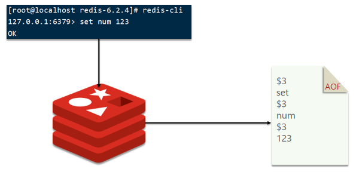

# Redis持久化

## RDB

> RDB全称Redis Database Backup file（Redis数据备份文件），也被叫做Redis数据快照。简单来说就是把内存中的所有数据都记录到磁盘中。当Redis实例故障重启后，从磁盘读取快照文件，恢复数据

快照文件称为RDB文件，默认是保存在当前运行目录


> Redis停机时会执行一次RDB

### 配置

Redis内部有触发RDB的机制，可以在redis.conf文件中找到，格式如下：

```
# 900秒内，如果至少有1个key被修改，则执行bgsave ， 如果是save "" 则表示禁用RDB
save 900 1
save 300 10
save 60 10000

# 是否压缩，建议不开启，压缩也会消耗cpu
rdbcompression yes

# RDB文件名称
dbfilename dump.rdb

# 文件保存的路径目录
dir ./

```

### 执行过程

bgsave开始时会fork主进程得到子进程，子进程共享主进程的内存数据。完成fork后读取内存数据并写入 RDB 文件。fork采用的是copy-on-write技术：

- 当主进程执行读操作时，访问共享内存；
- 当主进程执行写操作时，则会拷贝一份数据，执行写操作


## AOF

> AOF全称为Append Only File（追加文件）。Redis处理的每一个写命令都会记录在AOF文件，可以看做是命令日志文件



### 配置

AOF默认是关闭的，需要修改`redis.conf`配置文件来开启AOF：

```
# 是否开启AOF功能，默认是no
appendonly yes
# AOF文件的名称
appendfilename "appendonly.aof"
```

AOF的命令记录的频率也可以通过`redis.conf`文件来配：

```
# 表示每执行一次写命令，立即记录到AOF文件
appendfsync always
# 写命令执行完先放入AOF缓冲区，然后表示每隔1秒将缓冲区数据写到AOF文件，是默认方案
appendfsync everysec
# 写命令执行完先放入AOF缓冲区，由操作系统决定何时将缓冲区内容写回磁盘
appendfsync no
```

写入模式：


```

```

## 对比

> RDB和AOF各有自己的优缺点，如果对数据安全性要求较高，在实际开发中往往会结合两者来使用

