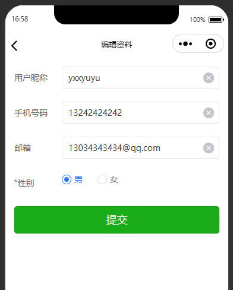

# 用户信息修改

## 请求Api

```js
import upload from '@/utils/upload'
import request from '@/utils/request'

// 用户密码重置
export function updateUserPwd(oldPassword, newPassword) {
  const data = {
    oldPassword,
    newPassword
  }
  return request({
    url: '/system/user/profile/updatePwd',
    method: 'put',
    params: data
  })
}

// 查询用户个人信息
export function getUserProfile() {
  return request({
    url: '/system/user/profile',
    method: 'get'
  })
}

// 修改用户个人信息
export function updateUserProfile(data) {
  return request({
    url: '/system/user/profile',
    method: 'put',
    data: data
  })
}

// 用户头像上传
export function uploadAvatar(data) {
  return upload({
    url: '/system/user/profile/avatar',
    name: data.name,
    filePath: data.filePath
  })
}

```

## 前端界面

```vue
<template>
  <view class="container">
    <view class="example">
      <uni-forms ref="form" :model="user" labelWidth="80px">
        <uni-forms-item label="用户昵称" name="nickName">
          <uni-easyinput v-model="user.nickName" placeholder="请输入昵称" />
        </uni-forms-item>
        <uni-forms-item label="手机号码" name="phonenumber">
          <uni-easyinput v-model="user.phonenumber" placeholder="请输入手机号码" />
        </uni-forms-item>
        <uni-forms-item label="邮箱" name="email">
          <uni-easyinput v-model="user.email" placeholder="请输入邮箱" />
        </uni-forms-item>
        <uni-forms-item label="性别" name="sex" required>
          <uni-data-checkbox v-model="user.sex" :localdata="sexs" />
        </uni-forms-item>
      </uni-forms>
      <button type="primary" @click="submit">提交</button>
    </view>
  </view>
</template>

<script>
  import { getUserProfile } from "@/api/system/user"
  import { updateUserProfile } from "@/api/system/user"

  export default {
    data() {
      return {
        user: {
          nickName: "",
          phonenumber: "",
          email: "",
          sex: ""
        },
        sexs: [{
          text: '男',
          value: "0"
        }, {
          text: '女',
          value: "1"
        }],
        rules: {
          nickName: {
            rules: [{
              required: true,
              errorMessage: '用户昵称不能为空'
            }]
          },
          phonenumber: {
            rules: [{
              required: true,
              errorMessage: '手机号码不能为空'
            }, {
              pattern: /^1[3|4|5|6|7|8|9][0-9]\d{8}$/,
              errorMessage: '请输入正确的手机号码'
            }]
          },
          email: {
            rules: [{
              required: true,
              errorMessage: '邮箱地址不能为空'
            }, {
              format: 'email',
              errorMessage: '请输入正确的邮箱地址'
            }]
          }
        }
      }
    },
    onLoad() {
      this.getUser()
    },
    onReady() {
      this.$refs.form.setRules(this.rules)
    },
    methods: {
      getUser() {
        getUserProfile().then(response => {
          this.user = response.data
        })
      },
      submit(ref) {
        this.$refs.form.validate().then(res => {
          updateUserProfile(this.user).then(response => {
            this.$modal.msgSuccess("修改成功")
          })
        })
      }
    }
  }
</script>

<style lang="scss">
  page {
    background-color: #ffffff;
  }

  .example {
    padding: 15px;
    background-color: #fff;
  }

  .segmented-control {
    margin-bottom: 15px;
  }

  .button-group {
    margin-top: 15px;
    display: flex;
    justify-content: space-around;
  }

  .form-item {
    display: flex;
    align-items: center;
    flex: 1;
  }

  .button {
    display: flex;
    align-items: center;
    height: 35px;
    line-height: 35px;
    margin-left: 10px;
  }
</style>

```

> 