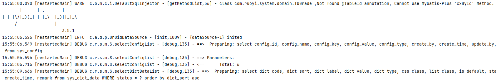

# 集成MyBatisPlus

Mybatis-Plus是在Mybatis的基础上进行扩展，只做增强不做改变，可以兼容Mybatis原生的特性。同时支持通用CRUD操作、多种主键策略、分页、性能分析、全局拦截等。极大帮助我们简化开发工作

官方教程：[插件集成 | RuoYi](https://doc.ruoyi.vip/ruoyi/document/cjjc.html#集成mybatis-plus实现mybatis增强)

## 整合依赖

`ruoyi-common`下的`pom.xml`模块添加整合依赖

```xml
        <!-- mybatis-plus 增强CRUD -->
        <dependency>
            <groupId>com.baomidou</groupId>
            <artifactId>mybatis-plus-boot-starter</artifactId>
            <version>3.5.1</version>
        </dependency>
```

排除分页插件的`mybatis`依赖

```xml
        <!-- pagehelper 分页插件 -->
        <dependency>
            <groupId>com.github.pagehelper</groupId>
            <artifactId>pagehelper-spring-boot-starter</artifactId>
            <exclusions>
                <exclusion>
                    <groupId>org.mybatis</groupId>
                    <artifactId>mybatis</artifactId>
                </exclusion>
            </exclusions>
        </dependency>
```

## 添加配置项

`ruoyi-admin`文件`application.yml`，修改mybatis配置为mybatis-plus

```yaml
## MyBatis配置
#mybatis:
#  # 搜索指定包别名
#  typeAliasesPackage: com.ruoyi.**.domain
#  # 配置mapper的扫描，找到所有的mapper.xml映射文件
#  mapperLocations: classpath*:mapper/**/*Mapper.xml
#  # 加载全局的配置文件
#  configLocation: classpath:mybatis/mybatis-config.xml

# MyBatis Plus配置
mybatis-plus:
  # 搜索指定包别名
  typeAliasesPackage: com.ruoyi.**.domain
  # 配置mapper的扫描，找到所有的mapper.xml映射文件
  mapperLocations: classpath*:mapper/**/*Mapper.xml
  # 加载全局的配置文件
  configLocation: classpath:mybatis/mybatis-config.xml
```

添加`Mybatis Plus`配置`MybatisPlusConfig.java`。 **PS：原来的`MyBatisConfig.java`需要删除掉或者注释掉`@Configuration`注解**

`com.ruoyi.framework.config`目录下`MyBatisConfig.java`

```java
package com.ruoyi.framework.config;

import java.io.IOException;
import java.util.ArrayList;
import java.util.Arrays;
import java.util.HashSet;
import java.util.List;
import javax.sql.DataSource;
import org.apache.ibatis.io.VFS;
import org.apache.ibatis.session.SqlSessionFactory;
import org.mybatis.spring.SqlSessionFactoryBean;
import org.mybatis.spring.boot.autoconfigure.SpringBootVFS;
import org.springframework.beans.factory.annotation.Autowired;
import org.springframework.context.annotation.Bean;
import org.springframework.context.annotation.Configuration;
import org.springframework.core.env.Environment;
import org.springframework.core.io.DefaultResourceLoader;
import org.springframework.core.io.Resource;
import org.springframework.core.io.support.PathMatchingResourcePatternResolver;
import org.springframework.core.io.support.ResourcePatternResolver;
import org.springframework.core.type.classreading.CachingMetadataReaderFactory;
import org.springframework.core.type.classreading.MetadataReader;
import org.springframework.core.type.classreading.MetadataReaderFactory;
import org.springframework.util.ClassUtils;
import com.ruoyi.common.utils.StringUtils;

/**
 * Mybatis支持*匹配扫描包
 * 
 * @author ruoyi
 */
//@Configuration
public class MyBatisConfig
{
    @Autowired
    private Environment env;

    static final String DEFAULT_RESOURCE_PATTERN = "**/*.class";

    public static String setTypeAliasesPackage(String typeAliasesPackage)
    {
        ResourcePatternResolver resolver = (ResourcePatternResolver) new PathMatchingResourcePatternResolver();
        MetadataReaderFactory metadataReaderFactory = new CachingMetadataReaderFactory(resolver);
        List<String> allResult = new ArrayList<String>();
        try
        {
            for (String aliasesPackage : typeAliasesPackage.split(","))
            {
                List<String> result = new ArrayList<String>();
                aliasesPackage = ResourcePatternResolver.CLASSPATH_ALL_URL_PREFIX
                        + ClassUtils.convertClassNameToResourcePath(aliasesPackage.trim()) + "/" + DEFAULT_RESOURCE_PATTERN;
                Resource[] resources = resolver.getResources(aliasesPackage);
                if (resources != null && resources.length > 0)
                {
                    MetadataReader metadataReader = null;
                    for (Resource resource : resources)
                    {
                        if (resource.isReadable())
                        {
                            metadataReader = metadataReaderFactory.getMetadataReader(resource);
                            try
                            {
                                result.add(Class.forName(metadataReader.getClassMetadata().getClassName()).getPackage().getName());
                            }
                            catch (ClassNotFoundException e)
                            {
                                e.printStackTrace();
                            }
                        }
                    }
                }
                if (result.size() > 0)
                {
                    HashSet<String> hashResult = new HashSet<String>(result);
                    allResult.addAll(hashResult);
                }
            }
            if (allResult.size() > 0)
            {
                typeAliasesPackage = String.join(",", (String[]) allResult.toArray(new String[0]));
            }
            else
            {
                throw new RuntimeException("mybatis typeAliasesPackage 路径扫描错误,参数typeAliasesPackage:" + typeAliasesPackage + "未找到任何包");
            }
        }
        catch (IOException e)
        {
            e.printStackTrace();
        }
        return typeAliasesPackage;
    }

    public Resource[] resolveMapperLocations(String[] mapperLocations)
    {
        ResourcePatternResolver resourceResolver = new PathMatchingResourcePatternResolver();
        List<Resource> resources = new ArrayList<Resource>();
        if (mapperLocations != null)
        {
            for (String mapperLocation : mapperLocations)
            {
                try
                {
                    Resource[] mappers = resourceResolver.getResources(mapperLocation);
                    resources.addAll(Arrays.asList(mappers));
                }
                catch (IOException e)
                {
                    // ignore
                }
            }
        }
        return resources.toArray(new Resource[resources.size()]);
    }

    @Bean
    public SqlSessionFactory sqlSessionFactory(DataSource dataSource) throws Exception
    {
        String typeAliasesPackage = env.getProperty("mybatis.typeAliasesPackage");
        String mapperLocations = env.getProperty("mybatis.mapperLocations");
        String configLocation = env.getProperty("mybatis.configLocation");
        typeAliasesPackage = setTypeAliasesPackage(typeAliasesPackage);
        VFS.addImplClass(SpringBootVFS.class);

        final SqlSessionFactoryBean sessionFactory = new SqlSessionFactoryBean();
        sessionFactory.setDataSource(dataSource);
        sessionFactory.setTypeAliasesPackage(typeAliasesPackage);
        sessionFactory.setMapperLocations(resolveMapperLocations(StringUtils.split(mapperLocations, ",")));
        sessionFactory.setConfigLocation(new DefaultResourceLoader().getResource(configLocation));
        return sessionFactory.getObject();
    }
}
```

MybatisPlusConfig.java

```java
package com.ruoyi.framework.config;

import com.baomidou.mybatisplus.annotation.DbType;
import com.baomidou.mybatisplus.extension.plugins.MybatisPlusInterceptor;
import com.baomidou.mybatisplus.extension.plugins.inner.BlockAttackInnerInterceptor;
import com.baomidou.mybatisplus.extension.plugins.inner.OptimisticLockerInnerInterceptor;
import com.baomidou.mybatisplus.extension.plugins.inner.PaginationInnerInterceptor;
import org.springframework.context.annotation.Bean;
import org.springframework.context.annotation.Configuration;
import org.springframework.transaction.annotation.EnableTransactionManagement;

/**
 * Mybatis Plus 配置
 * 
 * @author ruoyi
 */
@EnableTransactionManagement(proxyTargetClass = true)
@Configuration
public class MybatisPlusConfig
{
    @Bean
    public MybatisPlusInterceptor mybatisPlusInterceptor()
    {
        MybatisPlusInterceptor interceptor = new MybatisPlusInterceptor();
        // 分页插件
        interceptor.addInnerInterceptor(paginationInnerInterceptor());
        // 乐观锁插件
        interceptor.addInnerInterceptor(optimisticLockerInnerInterceptor());
        // 阻断插件
        interceptor.addInnerInterceptor(blockAttackInnerInterceptor());
        return interceptor;
    }

    /**
     * 分页插件，自动识别数据库类型 https://baomidou.com/guide/interceptor-pagination.html
     */
    public PaginationInnerInterceptor paginationInnerInterceptor()
    {
        PaginationInnerInterceptor paginationInnerInterceptor = new PaginationInnerInterceptor();
        // 设置数据库类型为mysql
        paginationInnerInterceptor.setDbType(DbType.MYSQL);
        // 设置最大单页限制数量，默认 500 条，-1 不受限制
        paginationInnerInterceptor.setMaxLimit(-1L);
        return paginationInnerInterceptor;
    }

    /**
     * 乐观锁插件 https://baomidou.com/guide/interceptor-optimistic-locker.html
     */
    public OptimisticLockerInnerInterceptor optimisticLockerInnerInterceptor()
    {
        return new OptimisticLockerInnerInterceptor();
    }

    /**
     * 如果是对全表的删除或更新操作，就会终止该操作 https://baomidou.com/guide/interceptor-block-attack.html
     */
    public BlockAttackInnerInterceptor blockAttackInnerInterceptor()
    {
        return new BlockAttackInnerInterceptor();
    }
}
```

## 启动效果



## 合并配置

如果多`configLocation`配置会报错，而`mybatis-config.xml`无法添加枚举处理器，只能在`applicatio.yml`中集成所有配置

mybatis-config.xml

```xml
<?xml version="1.0" encoding="UTF-8" ?>
<!DOCTYPE configuration
PUBLIC "-//mybatis.org//DTD Config 3.0//EN"
"http://mybatis.org/dtd/mybatis-3-config.dtd">
<configuration>
    <!-- 全局参数 -->
    <settings>
        <!-- 使全局的映射器启用或禁用缓存 -->
        <setting name="cacheEnabled"             value="true"   />
        <!-- 允许JDBC 支持自动生成主键 -->
        <setting name="useGeneratedKeys"         value="true"   />
        <!-- 配置默认的执行器.SIMPLE就是普通执行器;REUSE执行器会重用预处理语句(prepared statements);BATCH执行器将重用语句并执行批量更新 -->
        <setting name="defaultExecutorType"      value="SIMPLE" />
		<!-- 指定 MyBatis 所用日志的具体实现 -->
        <setting name="logImpl"                  value="SLF4J"  />
        <!-- 使用驼峰命名法转换字段 -->
		<!-- <setting name="mapUnderscoreToCamelCase" value="true"/> -->
	</settings>
	
</configuration>
```

application.yml

```yaml
# MyBatis Plus配置
mybatis-plus:
  configuration:
    cache-enabled: true
    use-generated-keys: true
    default-executor-type: SIMPLE
    log-impl: org.apache.ibatis.logging.slf4j.Slf4jImpl
    # 默认开启了驼峰命名法转换字段
#    map-underscore-to-camel-case: true
    # 配置全局枚举处理器
    default-enum-type-handler: com.baomidou.mybatisplus.core.handlers.MybatisEnumTypeHandler
  global-config:
    db-config:
      # 定义属性为deleteFlag的代表为逻辑删除
      logic-delete-field: deleteFlag
      logic-delete-value: 1
      logic-not-delete-value: 0
  # 搜索指定包别名
  typeAliasesPackage: com.ruoyi.**.domain
  # 配置mapper的扫描，找到所有的mapper.xml映射文件
  mapperLocations: classpath*:mapper/**/*Mapper.xml
  # 加载全局的配置文件
#  configLocation: classpath:mybatis/mybatis-config.xml
```

> 执行器（Executor）是MyBatis的核心接口之一，负责SQL语句的执行和映射
>
> **SimpleExecutor**：
>
> - 每次执行update或select操作时，即时创建并关闭Statement对象，实现简易，但频繁操作数据库资源
> - 适用于简单SQL场景，如开发或测试环境，便于调试
> - 注意：高并发情况下，SimpleExecutor可能会因为频繁创建和关闭Statement而降低性能
>
> **ReuseExecutor**：
>
> - 通过复用Statement对象提升性能，相同SQL复用，减少资源开销
> - 需注意SQL正确性和内存管理，避免数据不一致性和内存泄漏
> - 适用：执行相似SQL且对性能有要求的场景
>
> **BatchExecutor**：
>
> - 支持批量操作，提高数据插入或更新效率，减少网络交互
> - 注意批量操作异常处理和事务回滚，以及内存使用
> - 适用：大量数据批量操作，如数据库迁移或数据同步
