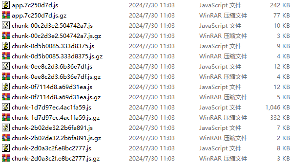

# vue.config.js配置

## Vue2

> node16

### 打包压缩

```js
  configureWebpack: {
    name: name,
    resolve: {
      alias: {
        '@': resolve('src')
      }
    },
    plugins: [
      // http://doc.ruoyi.vip/ruoyi-vue/other/faq.html#使用gzip解压缩静态文件
      new CompressionPlugin({
        cache: false,                                  // 不启用文件缓存
        test: /\.(js|css|html|jpe?g|png|gif|svg)?$/i,  // 压缩文件格式
        filename: '[path][base].gz[query]',            // 压缩后的文件名
        algorithm: 'gzip',                             // 使用gzip压缩
        minRatio: 0.8,                                 // 压缩比例，小于 80% 的文件不会被压缩
        deleteOriginalAssets: false                    // 压缩后删除原文件
      })
    ],
  },
```

> 打包效果：
>
> 

### css打包配置

> 发现组件里的样式会编译成两个样式：一个全局样式和一个局部样式。可能会导致样式污染问题，即组件的样式影响了其他同名的样式。如果出现样式异常，可以尝试修改打包方式，将样式内联到js中

```js
  css: {
    // loaderOptions: {
    //   sass: {
    //     sassOptions: { outputStyle: "expanded" }
    //   }
    // }
    extract:false, // CSS将不会被提取到单独的文件中，而是以内联样式的方式包含在JavaScript文件中。
    sourceMap:false // 帮助调试器映射编译后的代码到源代码。关闭可以减少构建时间并减少文件大小
  },
```

> 所有的样式都会以内联样式的方式包含在JavaScript文件中，这样可以避免样式提取过程中可能出现的错误。不过，这也会失去将样式分离出来以利用浏览器缓存的优势

