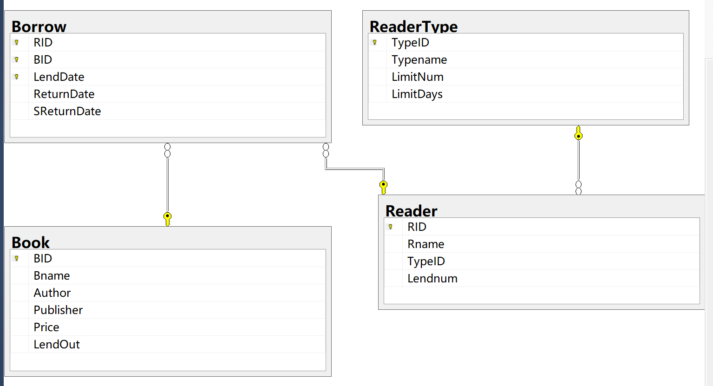

# 数据表的创建与使用

|            | 增/建  |   改   |   删   |
| :--------: | :----: | :----: | :----: |
|   数据库   | CREATE | ALTER  |  DROP  |
| 数据库文件 |  ADD   | REMOVE | MODIFY |
|     表     | CREATE | ALTER  |  DROP  |
|   表数据   | INSERT | UPDATA | DELETE |

## 数据表的约束

**(注意：以下内容中带“[]”的内容是可以省略的)**

#### 1，NULL/NOT NULL约束

当某一字段的值要输入值才有意义的时候，则可以设置为NOT NULL

语法格式为：[CONSTRAINT <约束名>] [NULL/NOT NULL]

例如：SNo VARCHAR(6) CONSTRAINT S_CONS NOT NULL

在字段的后面，也可以不加约束名称，直接写约束类型**SNo VARCHAR(6) NOT NULL**

#### 2，UNIQUE约束

用于指明基本表在某一列或多个列的组合上的取值必须唯一

语法格式为：列：[CONSTRAINT<约束名>] UNIQUE			表约束：[CONSTRAINT<约束名>] UNIQUE(<列名>[{,<列名>}])**（一般单独一条语句放末尾）**

例如：SN NVARCHAR(10) CONSTRAINT SN_UNIQ UNIQUE

约束名称可以省略**SN NVARCHAR(10) UNIQUE**

#### 3，PRIMARY KEY约束（主键约束）

用于定义表的主键，每个表中必须有一个，起唯一标识作用，**其值不能为NULL**，**也不能重复**，以此保证实体的完整性

语法格式为：列：CONSTRAINT <约束名> PRIMARY KEY			列组合：[CONSTRAINT <约束名>] PRIMARY KEY(<列名>[{,<列名>}])**（一般单独一条语句放末尾）**

例如：CONSTRAINT SC_Prim PRIMARY KEY(SNo,CNo)

可以进一步省略为：**CNo VARCHAR(6) NOT NULL PRIMARY KEY(NAME,AGE)**

#### 4，FOREIGN KEY约束(外键约束)

指定某一列或几列作为外部键，其中，包含外部键的表成为从表，包含外部键所引用的主键或唯一键的表称为主表，**从表当中外部键的名称和主表当中主键的名称是相同的，是在从表的定义中实现，这样从表的数据只能在主表的范围内**

语法格式为：**[CONSTRAINT<约束名>] FOREIGN KEY REFERENCES <主表名>(<列名>[{,<列名>}])**

例如：建立一个SC表，定义SNo、CNo为SC的外部键

```sql
CREATE TABLE SC
( SNo VARCHAR(6) NOT NULL CONSTRAINT S_Fore FOREIGN KEY REFERENCES S(SNo),
  CNo VARCHAR(6) NOT NULL CONSTRAINT C_Fore FOREIGN KEY REFERENCES C(CNo),
  Score NUMERIC(4,1),
  CONSTRAINT S_C_Prim PRIMARY KEY(SNo,CNo)
)
```

#### 5，CHECK约束

CHECK约束用来**检查字段值所允许的范围**，如一个字段只能输入整数，而且限定在0~100的整数，以此来保证域的完整性

语法格式为：**[CONSTRAINT<约束名>]CHECK(<条件>)**

例如：建立一个SC表，定义Score的取值范围为0~100之间

```sql
CREATE TABLE SC
( SNo VARCHAR(6),
  CNo VARCHAR(6),
  Score NUMERIC(4,1) CONSTRAINT Score_Chk CHECK(Score>=0 AND Score <=100)
)
```


## 创建数据表

语法格式为：

```sql
CREATE TABLE <表名>
(<列定义>[{,<列定义>|<表约束>}]
)
-- <列名> <数据类型> [DEFAULT] [{<列约束>}]
```

例如：用SQL命令创建一个学生表S

```sql
CREATE TABLE S
(	SNo CHAR(6).
 	SN VARCHAR(10),
 	Sex NCHAR(1) DEFAULT '男'，-- 当缺省时自动填充为'男'
 	Age INT,
 	DEPT NVARCHAR(20)
)
```

## 修改数据表

SQL使用ALTER TABLE命令来完成这一功能，有如下三种修改方式

### 1，ADD方式

ADD方式用于增加新列和完整性约束

语法格式为：**ALTER TABLE <表名> ADD <列定义>|<完整性约束定义>**

例如：在S表中添加一个班号列和住址列

```sql
ALTER TABLE S
ADD
CLASS_No VARCHAR(6),
Address NVARCHAR(20)
```

在SC表中增加完整性约束定义，使Score在0~100之间

```sql
ALTER TABLE SC
CONSTRAINT Score_chk CHECK(Score BETWEEN 0 AND 100)
```

### 2，ALTER方式

ALTER方式用于修改某些列

语法格式为：**ALTER TABLE <表名>**

**ALTER COLUMN <列名><数据类型>[NULL|NOT NULL]**

例如：把S表中的SN列加宽到12个字符

```sql
ALTER TABLE S
ALTER COLUMN
SN NVARCHAR(12)
```

**(注意：不能修改列名，不能修改其数据类型，只能修改NULL/NOT NULL约束，其他类型约束在修改之前必须先将约束删除，然后再重新添加修改过的约束定义)**

### 3，DROP方式

DROP方式只用于删除完整性约束定义

语法格式为：**ALTER TABLE <表名>**

**DROP CONSTRAINT <约束名>**

例如：删除S表中的主键

```sql
ALTER TABLE S
DROP CONSTRAINT S_Prim
```

## 删除基本表

删除表的SQL命令语法格式为：**DROP TABLE <表名>**

例如：删除表S

````sql
DROP TABLE S
````

## 操作表数据

### 添加表数据

**INSERT INTO 添加一行新数据**			**INSERT INTO<表名>[(<列名1>[,<列名2>...])]（来自于一个子查询(SELECT语句)）**

例如：在SC表中添加一条选课记录('S7','C1')

```sql
INSERT INTO SC(SNo,CNo) VALUES('S7','C1')
```

例如：多元组的方式

```sql
INSERT INTO th_Course VALUES ('c7','面向对象编程',64),('c8','人工智能导论',64),('c9','Hadoop基础',48)
```

或者

```sql
INSERT INTO th_Course(CNo,CN,CT) VALUES ('c7','面向对象编程',64),('c8','人工智能导论',64),('c9','Hadoop基础',48)
```

**(多个插入语句用';'分隔开来(无符号也行))**

### 修改表数据

**UPDATE<表名>**

**SET<列名>=<表达式>[,<列名>=<表达式>]...**

**[WHERE<条件>]**

修改一行：

例如：把刘伟老师转到信息系

```sql
UPDATE T
SET Dept='信息'-- 设置某某的Dept等于'信息'，修改多个数据用','隔开
WHERE SN='刘伟'-- 修改的是刘伟老师的信息
-- (注意为单引号)
```

修改多行：

例如：将所有学生年龄增加1岁

```sql
UPDATE S
SET AGE=AGE+1
```

例如：把教师表中工资小于或等于1000元的讲师的工资提高20%

```sql
UPDATE T
SET Sal=Sal*1.2
WHERE (Prof='讲师') AND (Sal<=1000)
```

例如：把所有教师的工资提高到平均工资的1.2倍(用子查询提供要修改的值)

```sql
UPDATE T
SET Sal=(SELECT 1.2*AVG(Sal)-- 查询出平均工资后并乘以1.2再返回
        FROM T)
```

### 删除表数据

**DELETE**

**FROM<表名>**

**[WHERE <条件>]**

删除一行：

例如：删除刘伟老师的记录

```sql
DELETE
FROM T
WHERE TN='刘伟'
```

删除多行：

例如：删除没有授课记录的老师

```sql
DELETE
FROM TC
WHERE TC.TN is NULL
```

利用子查询选择要修改的行：

例如：删除刘伟老师的授课记录

```sql
DELETE
FROM TC
WHERE(TNo=
      (SELETE TNo-- 查询出来刘伟老师的授课号
      FROM T
      WHERE TN='刘伟')
      )
```

## 综合运用

```sql
USE Library-- 使用的数据库
GO 
	CREATE TABLE ReaderType-- 创建表ReaderType
	(
    TypeID int NOT NULL PRIMARY KEY, -- 定义列TypeID数据类型为int，不允许为空，且设为主键
	Typename char(8) NULL, -- 定义列Typename数据类型为char，允许为空
	LimitNum int NULL,
	LimitDays int NULL
	)
	
	CREATE TABLE Reader
	(
    -- 列级定义和约束
	RID char(10) NOT NULL PRIMARY KEY,
	Rname char(10) NULL,
	TypeID int NULL,
	Lendnum int NULL,
    
    -- 表级定义和约束
	FOREIGN KEY(TypeID) REFERENCES
	ReaderType(TypeID) ON DELETE NO ACTION 
	)
	
	CREATE TABLE Book
	(
    BID CHAR(13) NOT NULL PRIMARY KEY,
	Bname varchar(42) NULL,
	Author varchar(20) NULL,
	Publisher varchar(28) NULL,
	Price decimal(7,2) NULL CHECK (Price>0),
	LendOut bit
	)
	
	CREATE TABLE Borrow
	( 
     -- 列级定义和约束
     RID CHAR(10) NOT NULL 
	 FOREIGN KEY REFERENCES Reader(RID) ON UPDATE CASCADE ON DELETE CASCADE,	-- mysql设置外键为 RID CHAR(10) NOT NULL REFERENCES Reader(RID)
	 BID CHAR(13) NOT NULL 
	 FOREIGN KEY REFERENCES Book(BID) ON UPDATE CASCADE,
     
     -- 默认值约束，设置借期的默认值为当前日期
	 LendDate datetime NOT NULL DEFAULT(GETDATE()),
	 ReturnDate datetime NULL,
	 SReturnDate datetime NULL,
     
     -- 表级定义和约束
	 PRIMARY KEY(RID,BID,LendDate) -- 将多个列定义为主键
	 )
```

运行后表之间关系如下


