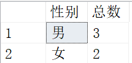
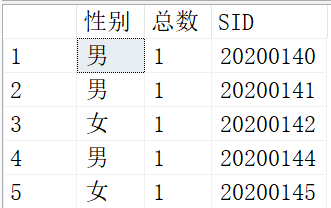
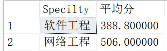
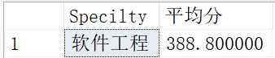
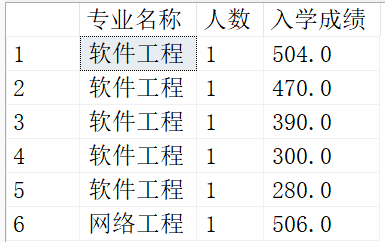

# SELECT查询语句

## 单表简单查询

### SELECT

SELECT是列选，对选中的列进行组合输出

```sql
SELECT [ALL|DISTINCT][TOP n] 表达式列表-- 投影查询
[INTO 新表名]-- 保存查询
FROM 基本表列表|视图表列名-- 连接查询
[WHERE 查询条件]-- 选择查询
[GROUP BY 分组列表名]-- 分组统计查询
[HAVING 逻辑表达式]-- 限定查询
[ORDER BY 排序列表名[ASC|DESC]]-- 排序查询
```

### FROM，*，AS，DISTINCT，.

FROM是代表选择的表，*是代表选择表中所有的列，AS可对新表中的列重新起名（列后空格也能达到同样的效果），**DISTINCT用来消除同一列中相同值的重复行**，可理解为调用表的对象中的内容，表对象的定义只需在表后面加空格

```sql
SELECT a.SID
FROM Student a
```

### WHERE

WHERE是对列中的内容选择的条件

常用的比较运算符有：

|                     运算符                      |   含义   |
| :---------------------------------------------: | :------: |
| =、>、<、>=、<=、!=、<>(与!=含义一致，推荐使用) | 比较大小 |
|                  AND、OR、NOT                   | 多重条件 |
|                   BETWEEN AND                   | 确定范围 |
|                       IN                        | 确定集合 |
|                      LIKE                       | 字符匹配 |
|                     IS NULL                     |   空值   |

当不知道完全精确的值时，可以通过**LIKE**和NOT LIKE可以进行**部分匹配查询**

格式为：**<属性名> LIKE <字符串常量>**，字符串中的通配符为：

|  通配符   |          功能          |              实例               |
| :-------: | :--------------------: | :-----------------------------: |
|     %     |   代表0个或多个字符    |   'ab%'，'ab'后可接任意字符串   |
| _(下划线) |      代表一个字符      | 'a_b'，'a'与'b'之间可有一个字符 |
|    []     |  表示在某一范围的字符  |      [0-9]，0~9之间的字符       |
|    [^]    | 表示不在某一范围的字符 |    [^0-9]，不在0~9之间的字符    |

例一：查询选修C1或C2的学生的学号、课程号和成绩

```sql
SELECT SNo,CNo,Score
FROM SC
WHERE CNo IN('C1','C2')-- 注意这里是在集合范围内的一个
```

也可以写成

```sql
SELECT SNo,CNo,Score
FROM SC
WHERE CNo='C1' OR CNo='C2'
```

例二：查询第一个字符为张第二个字符为任意的教师的教师号和姓名

```sql
SELECT TNo，TName
FROM T
WHERE TName LIKE '张_'
```

### 常用库函数及统计汇总查询

| 函数名称 |       功能       |
| :------: | :--------------: |
|   AVG    |  按列计算平均值  |
|   SUM    | 按列计算值的总和 |
|   MAX    | 求一列中的最大值 |
|   MIN    | 求一列中的最小值 |
|  COUNT   |  按列值统计个数  |

**（注意：在使用库函数进行查询时，通常要给查询的每一项内容加别名，否则查询结果就不显示列名）**

一般来说，**库函数具有聚合的性质**，所以在输出时不能存在下列“个体”和“集合”的冲突

```sql
SELECT Sname,MAX(AScores) AS 最高分
FROM Student
```

需要全部为“个体”，或者全部为“集合”

```sql
SELECT COUNT(Sname) AS 总人数,MAX(AScores) AS 最高分
FROM Student
```

**（COUNT(*)用来统计元组的个数，不消除重复行，不允许使用DISTING关键字）**

## 单表复杂查询

### GROUP BY

可以将查询结果按属性列或属性列组合在**行的方向上进行分组**，每组在属性列或者属性**列组合上具有相同的值**

```sql
SELECT SEX AS 性别,COUNT(SEX) AS 总数
FROM Student
GROUP BY SEX
```

这个会按依据列SEX具有相同的属性值来进行分组并合并显示



如下不能输出，因为直接输出SID列会依据个体匹配输出，而GROUP BY将SEX合并为组了

```sql
SELECT SEX AS 性别,COUNT(SEX) AS 总数,SID
FROM Student
GROUP BY SEX
```

这样才能成功输出

```sql
SELECT SEX AS 性别,COUNT(SEX) AS 总数,SID
FROM Student
GROUP BY SEX,SID
```



**（注意：使用GROUP BY后，在SELECT子句中投影的内容只有两种2种：一种是在出现在GROUP BY列名表中的列名：另一种是聚合函数）**

因为Sname的每个属性都不同，所以这里将Sname中的每个值都看成一个“集合”，可以成功输出

```sql
SELECT Sname,AVG(AScores) AS 平均分
FROM Student
GROUP BY Sname
```

这里将Specilty中相同的值汇成一个“集合”，再通过AVG对每个“集合”进行求平均分

```sql
SELECT Specilty,AVG(AScores) AS 平均分
FROM Student
GROUP BY Specilty
```



### HAVING

HAVING与WHERE的功能类似，但WHERE与HAVING子句的根本区别在于作用对象不同。**WHERE子句作用于基本表或视图**，从中选择满足条件的元组；**HAVING子句作用于组**，选择满足条件的组，必须用在GROUP BY子句之后，但GROUP BY子句可没有HAVING语句

这里将GROUP BY分组中元组个数大于二（人数多于2人）进行选择，排除了人数低于2的专业

```sql
SELECT Specilty,AVG(AScores) AS 平均分
FROM Student
GROUP BY Specilty
HAVING COUNT(*)>2
```



### DESC、ASC

当需要对查询结果排序时，应该使用ORDER BY子句，**DESC为降序**，**ASC为升序**，**缺省时升序**

例一：查询学生表Student中学生信息，按照专业升序，入学成绩降序排列

```sql
SELECT Specilty AS 专业名称,COUNT(Specilty) AS 人数,AScores AS 入学成绩
FROM Student
GROUP BY Specilty,AScores
ORDER BY Specilty ASC,AScores DESC
```



### INTO

查询结果往往需要一个表来保存下来以便使用，使用INTO子句可以将查询结果存储在一个新建的基本表中

语法也很简单，[INTO 新表名]，会生成到所查询的表的目录下

```sql
SELECT SID,Sname,SEX,Birthday
INTO Student_1
FROM Student
```

