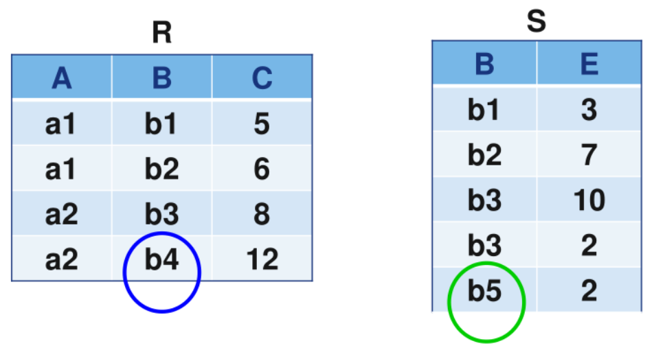

# ANSI连接查询


## 内连接

FROM 表名1 [INNER] JOIN 表名2 ON 连接表达式，从表1和表2的笛卡尔积中，选出符合连接条件的数据行，如果数据行无法满足连接条件，则将其丢弃。

语法：**FROM 表名1 [INNER] JOIN 表名2 ON 连接表达式**

### 等值连接

**允许有重复列**

例如：从图书管理数据库“Library”中查询每个读者的详细信息（读者及读者类型）

```sql
SELECT x.*,y.*
FROM Reader x INNER JOIN ReaderType y ON x.TypeID=y.TypeID
```

### 自然连接

**不允许有重复列**

例如：从图书管理数据库“Library”中查询每个读者的详细信息（读者及读者类型）

```sql
SELECT x.*,y.Typename,y.LimitNum,y.LimitDays
FROM Reader x INNER JOIN ReaderType y ON x.TypeID=y.TypeID
```

## 外连接

外连接返回FROM子句中指定的至少一个表（或视图）中的所有行（不包括ON之后的连接条件），只要这些行符合任何WHERE选择或HAVING限定条件。外连接又分为左外连接、右外连接和全外连接。

### 左外连接

左外连接对连接中**左边的表不加限制**，连接结果保留表1，表2无法对应的行的列值为NULL

语法：**FROM 表名1 LEFT[OUTER] JOIN 表名2 ON 连接表达式**

例如：在教务管理数据库“EDUC”中，用学生表“Student”作左外连接，可以查询出学生选课的情况，包括没有选课的学生信息

```sql
SELECT Student.SID,Student.Sname,SC.*
FROM Student LEFT OUTER JOIN SC ON Student.SID=SC.SID
```


### 右外连接

右外连接对连接中**右边的表不加限制**，连接结果保留表2，表1无法对应的行的列值为NULL

语法：**FROM 表名1 RIGHT [OUTER] JOIN 表名2 ON 连接表达式**

例如：从表“Borrow”和表“Book”中查询出图书被借阅的情况，包括没有被借的图书情况

```sql
SELECT x.RID,x.BID,y.BID,y.Bname,y.Author
FROM Borrow x RIGHT OUTER JOIN Book y ON x.BID=y.BID
```


### 全外连接

全外连接对连接的**左右表都不加限制**，连接结果都保留，表中无法对应的行的列值为NULL

语法：**FROM 表名1 FULL [OUTER] JOIN 表名2 ON 连接表达式**

例如：对表R和表S进行全外连接

```sql
SELECT R.*,S.*
FROM R FULL OUTER JOIN S ON R.B=S.B
```




## 自连接

一张表的两个副本之间进行的连接，**必须为表指定两个不同的别名**，使之在逻辑上成为两张表

语法：**FROM 表名1 别名1 JOIN 表名1 别名2 ON 连接表达式**

例如：查询表SC中选修了两门及以上的学生信息

```sql
SELECT DISTINCT x.SID,y.CID,x.Scores-- 不能使用'*',记得加'DISTINCT'
FROM SC x INNER JOIN SC y ON x.SID=y.SID-- 连接列为主键
WHERE x.CID<>y.CID-- 注意这里得使用和连接列（SID）不同的判断列（CID）
```

**(自连接无法直接连接其他表的信息，但可以通过两次查询运算联立)**


例如：查询表Borrow和Reader中借阅了两本书以上的学生信息

```sql
SELECT y.RID,y.Rname,x.BID
INTO DATE
FROM  Borrow x LEFT JOIN Reader y ON y.RID=x.RID
GROUP BY y.RID,y.Rname,x.BID

SELECT DISTINCT x.RID,x.Rname,x.BID
FROM DATE x INNER JOIN DATE y ON x.RID=y.RID
WHERE x.BID<>y.BID
```


## 交叉连接

交叉连接就是对两个表进行笛卡尔积计算，结果集的行数等于表1的行数乘以表2的行数

语法：FROM 表名1 CROSS JOIN 表名2   或   FROM 表名1，表名2

## 多表连接

最多可以连接64个表

语法：FROM 表名1 JOIN 表名2 ON 连接表达式 JOIN 表名3 ON 连接表达式...

例如：对读者表Reader、借阅表Borrow和图书表Book三个表进行等值连接

```sql
SELECT t1.RID,t1.Rname,t3.Bname,t2.LendDate
FROM Reader t1 JOIN Borrow t2 ON t1.RID=t2.RID JOIN Book t3 ON t2.BID=t3.BID
```


