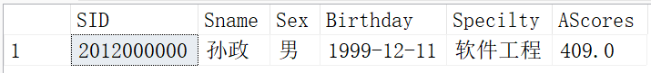
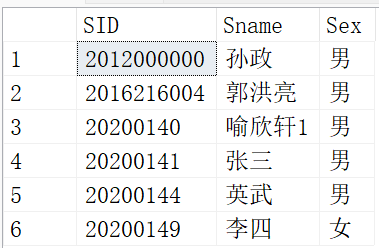
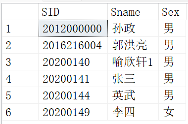
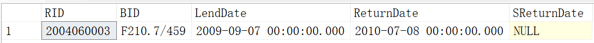
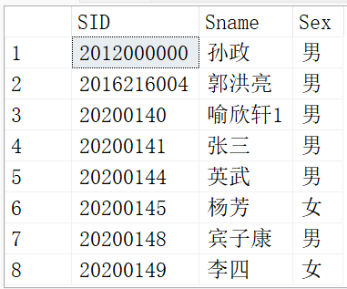
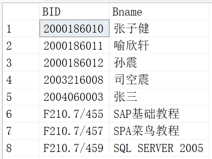

# 复杂查询

## 子查询

若一条select语句的where子句中又包含了另一个select语句，此时就出现了查询的嵌套（外层的select语句嵌套了内层select语句）。外层的select语句被称为父查询或主查询；内层的select语句称为子查询。

例如：从选课表“SC”中查询出学号最小的学生的选课情况

```sql
SELECT *
FROM Student
WHERE SID=(SELECT MIN(SID) 
           FROM Student)
```



**借助关键字[NOT] IN来查询列值包含或不包含在集合中**

格式：**列名 [NOT] IN (子查询)**

例如：查询出没有选修课程号16020018学生学号，姓名，性别

```sql
SELECT SID,Sname,Sex
FROM Student
WHERE SID NOT IN(SELECT SID 
                 FROM SC 
                 WHERE CID='16020018')
```



**借助关键字[NOT] EXISTS来查询当子查询的结果存在（不为空集）时，返回逻辑“真”值；否则返回逻辑“假”值(判断父查询表和子查询表之间是否存在联立查询结果，存在就返回逻辑“真”并通过父查询输出；否则返回逻辑“假”值)**

格式：**列名 [NOT] EXISTS (子查询)**

例如：查询出没有选修课程号16020018学生学号，姓名，性别

```sql
SELECT SID,Sname,Sex
FROM Student
WHERE NOT EXISTS
	(SELECT SID 
     FROM SC -- 这里不可以让Student和SC连接
     WHERE Student.SID=SC.SID AND CID='16020018')-- 因为子查询中没有引入Student，所以子查询语句不能单独运行
```



**借助比较运算符来查询（ALL|ANY|SOME）**

当列名的值在关系上满足子查询中的**所有值**时，逻辑表达式的值为“真”；否则为“假”

格式：**列名 比较运算符（ALL）（子查询）**

例如：从借阅表“Borrow”中查询出读者编号RID最大的读者的借书情况

```sql
SELECT * FROM Borrow
WHERE RID>=ALL(SELECT RID FROM Reader)

SELECT * FROM Borrow
WHERE RID=(SELECT MAX(RID) FROM Reader)-- 两者等同
```




当列名的值在关系上满足子查询中的**任何一个值**时，逻辑表达式的值为真，否则为假。比较运算符为“=”时，**“列名=ANY（子查询）”和“列名 IN（子查询）”**所描述的条件是相同的，且ANY和SOME的用法相同

格式：**列名 比较运算符（ANY|SOME）（子查询）**

例如：查询出没有选修课程号16020018学生学号，姓名，性别

```sql
SELECT SID,Sname,Sex
FROM Student
WHERE SID<>ANY(SELECT SID -- ANY可以用SOME替代
                 FROM SC 
                 WHERE CID='16020018')
                 
SELECT SID,Sname,Sex
FROM Student
WHERE SID NOT IN(SELECT SID 
                 FROM SC 
                 WHERE CID='16020018')-- 两者等同
```



## 联合查询

对n次查询结果进行并运算，一次UNION运算中的所有查询必须要求相同的字段数量，但是**字段无需具有相同的数据类型**，**ALL表示运算结果包括重复行**

格式：**SELECT_1 UNION [ALL] ...SELECT_n**

```sql
SELECT BID,Bname
FROM Book
WHERE Publisher='人民邮电出版社'
UNION ALL-- 不消除重复行
SELECT RID,Rname-- 都具有两列
FROM Reader
ORDER BY BID-- 排序的列必须显示出来
```



