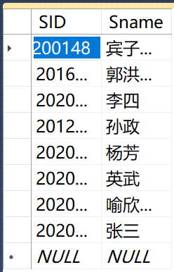
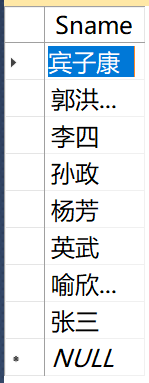
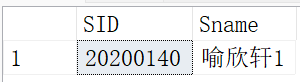

# 视图

## 基本概念

视图简而言之就是用户看到的数据。是数据库看到并允许使用的局部数据的逻辑结构的描述，是保护数据库安全性的一个有力措施，视图来自一个或者多个表，是由基本表（实表）产生的虚表。视图并不在数据库中存储，视图内容在其被使用（被查询）时动态生成

## 视图的特点

视图是由基本表（实表）产生的虚表

视图的列可以来自不同的基本表

视图的建立和删除不影响基本表

对视图内容的修改（添加、删除和更新）间接影响基本表

## 视图的作用

简化用户的操作，提高效率。可以把经常使用的查询定义为视图（就像编写C函数），使得用户不必为以后的操作每次都重新编写代码。

提高数据库的安全性。通过视图，用户只能查询和修改他们所能见到的数据，而其他数据既看不到也取不到

提高数据的独立性。视图可以使应用程序和数据库在一定程度上独立。

## 创建视图

语法：**CREATE VIEW 视图名 AS SELECT 查询子句**

```sql
CREATE VIEW 学生信息
AS--别忘了AS
SELECT SID,Sname
FROM Student
```



## 修改视图

语法：**CREATE VIEW 视图名 AS SELECT 查询子句**

```sql
ALTER VIEW 学生信息
AS
SELECT Sname
FROM Student
```



## 删除视图

语法：**DROP VIEW 视图名**

```sql
DROP VIEW 学生信息
```

## 应用视图

应用视图查询数据

```sql
SELECT *
FROM 学生信息 -- 可以直接调用视图简化操作
WHERE SID='20200140'
```



应用视图添加数据行

```sql
INSERT 学生信息 VALUES ('内容'...)
```

应用视图更新数据

```sql
UPDATE 学生信息
SET Sname='郭洪亮',SID='2016216004' -- 设置行数据
WHERE Sname='郭洪暗' -- 找出需要修改的那行
```

应用视图删除数据行

```sql
DELETE FROM 学生信息
WHERE Sname='郭洪暗' -- 注意这里删除的是整个一行
```

