# SQL编程语言

## T-SQL语言介绍

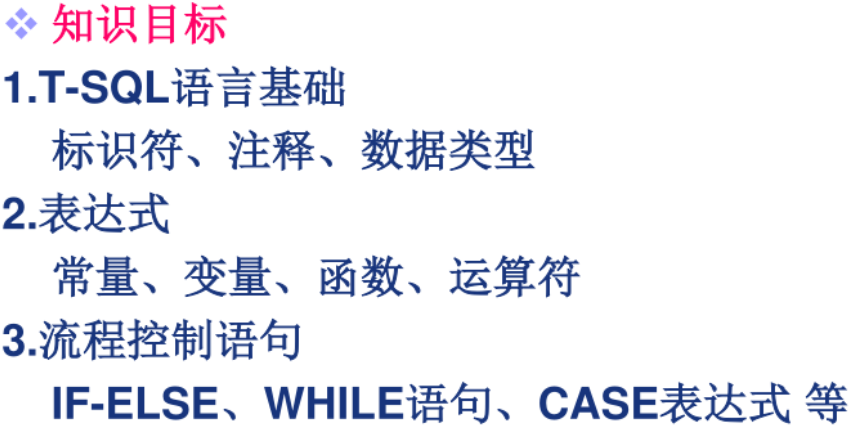

## T-SQL编程基础

### 有效标识符

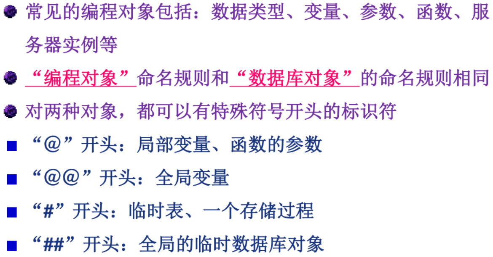

### 注释

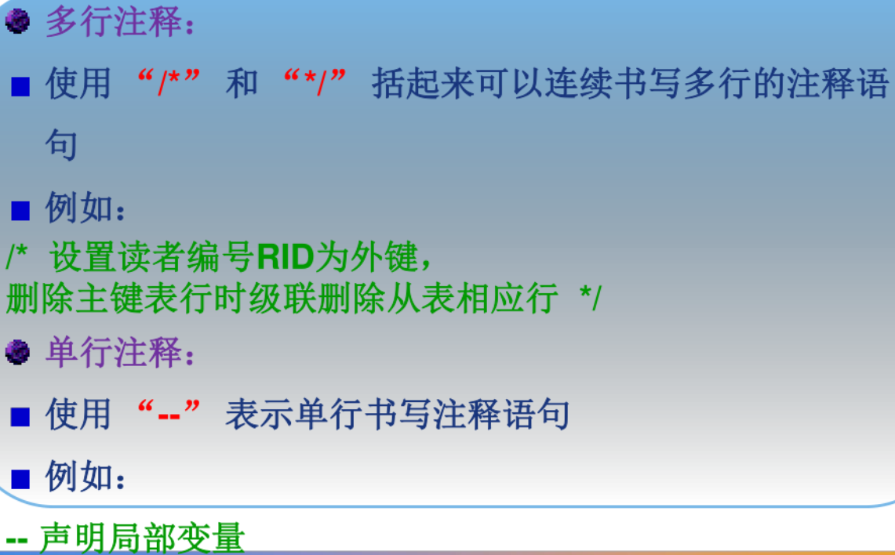

### 数据类型

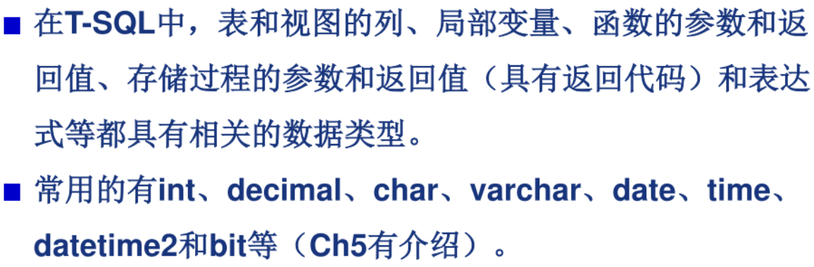

## 表达式

### 常量

也称之为文字值或标量值，是表示一个特定数据值的符号。常量的格式取决于它所表示值的数据类型。

### 变量

变量是指：在程序运行过程中其值可以改变的量。T-SQL的变量分为：**局部变量、全局变量**。

#### 局部变量

局部变量是用户定义的变量，其**作用范围仅在程序内部**。在程序中通常用来**存储从表中查询到的数据**或**暂存程序执行过程的数据**。

SELECT赋值语句：语法：**SELECT @变量名1=表达式1，@变量名2=表达式2**

例如：声明一个变长字符型@var，用SELECT赋值语句为它赋值从表“Reader”中查询出编号'2000186010'的读者姓名，再用SELECT输出语句输出变量@var的值

```sql
DECLARE @var1 varchar(8)
SELECT @var1=Rname -- 将查询的结果赋值给局部变量(会失去显示功能)
FROM Reader
WHERE RID='2000186010'
SELECT @var1 AS '读者姓名' -- 显示局部变量的结果
```

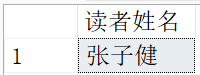

SET赋值语句：语法：**SET @变量名=表达式**（SET赋值语句只能给**一个变量**赋值）

例如：用SET赋值语句为局部变量@no赋值，再用SELECT查询语句查询出读者表中读者号为@no的读者信息

```sql
DECLARE @no varchar(10)
SET @no='2000186012'
SELECT RID,Rname
FROM Reader
WHERE RID=@no
```

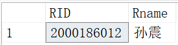

#### 全局变量

全局变量是SQL Server系统提供并赋值的变量，以@@开头，例如@@servername提供服务器名，全局变量@@version提供SQL Server的版本信息，@@language提供SQL Server的语言信息。用户不能建立全局变量，也不能用SET赋值语句和SELECT赋值语句修改全局变量的值，通常可以将全局变量的值赋值给局部变量，一遍保存和处理。

例如：显示SQL Server版本

```sql
SELECT @@version
```

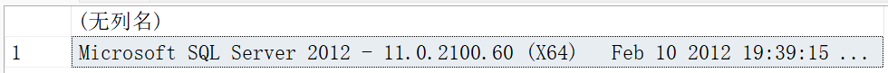

## 函数

聚合函数：COUNT**(个数)**、SUM**(总和)**、AVG**(平均值)**、MAX和MIN

数学函数：STDEV**(计算标准偏差)**、VAR**(方差)**

日期函数：DATEPART(日期元素,日期参数)**(整数值)**、DATENAME(日期元素,日期参数)**(字符串)**、GETDATE()**(当前时间)**、YEAR(日期参数)**(年)**、MONTH(日期参数)**(月)**、DAY(日期参数)**(日)**

字符串函数：LEFT(字符表达式,整型表达式)**(左边开始指定个数字符)**、RIGHT(字符表达式,整型表达式)**(右边开始指定个数字符)**、SUBSTRING(字符表达式,起始点,整型表达式)**(从起始点开始指定个数字符)**、LEN(字符表达式)**(字符串使用长度)**

数据类型转换函数：CAST**(表达式 AS 数据类型)**，CONVERT**(数据类型,表达式)**

其他内置函数：ISNULL(空值,指定的值)

### datepart日期元素

|  日期元素   |   缩写   |      含义      |
| :---------: | :------: | :------------: |
|    YEAR     | YY或YYYY |       年       |
|   QUARTER   |  QQ或Q   |      季度      |
|    MONTH    |  MM或M   |       月       |
|  DAYOFYEAR  |  DY或Y   |   一年内的天   |
|     DAY     |  DD或D   |       天       |
|    WEEK     |  WK或WW  |      星期      |
|   WEEKDAY   |    DW    | 一个星期内的天 |
|    HOUR     |    HH    |      小时      |
|   MINUTE    |  MI或N   |      分钟      |
|   SECOND    |  SS或S   |       秒       |
| MILLISECOND |    MS    |      毫秒      |

### DATEPART(日期元素，日期参数)

以整数值的形式返回”日期元素“指定的“日期参数”部分

例如：输出伦敦奥运会的开始日期

```sql
DECLARE @OPENDAY date
SET @OPENDAY='2012/7/27'
SELECT CAST(DATEPART(yy,@OPENDAY) AS char(4))+'年'+ -- CAST()将int型的结果转化为了char型达到输出的目的
CAST(DATEPART(mm,@OPENDAY) AS char(1))+'月'+ -- 等同DAY(@OPENDAY),上下两个也是同理
CAST(DATEPART(dd,@OPENDAY) AS char(2)) AS '伦敦奥运会'
```

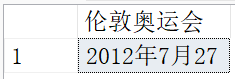

### DATENAME(日期元素，日期参数)

以字符串的形式返回”日期元素“指定的“日期参数”部分

例如：返回伦敦奥运会为星期几

```sql
SET LANGUAGE US_ENGLISH -- 将语言转化为英文(对字符串生效)(可以切换“简体中文”)
DECLARE @OPENDAY date
SET @OPENDAY='2012/7/27'
SELECT DATEPART(DW,@OPENDAY) AS WEEKDAY
```

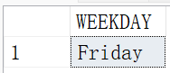

**(注：DATEPART和DATENAME的主要区别在于返回值类型)**

### GETDATE()、YEAR(日期参数)、MONTH(日期参数)、DAY(日期参数)

例如：返回当前时间

```sql
SELECT GETDATE() AS 当前时间,YEAR(GETDATE()) AS 年,
MONTH(GETDATE()) AS 月,DAY(GETDATE()) AS 日
```

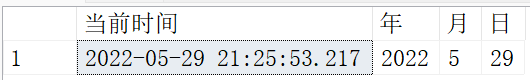

### LEFT(字符表达式,整型表达式)、RIGHT(字符表达式,整型表达式)、SUBSTRING(字符表达式,起始点,整型表达式)、LEN(字符表达式)

例如：返回字符串的左边和右边的三位字符，以及中间的五位字符和字符串长度

```sql
DECLARE @STRINGTEST char(13)
SET @STRINGTEST='124-3476-986'
SELECT LEFT(@STRINGTEST,3) AS 左三位,RIGHT(@STRINGTEST,3) AS 右三位, -- 第13个字符为空
SUBSTRING(@STRINGTEST,3,5) AS 中间三位,LEN(@STRINGTEST) -- 不计字符串后面的空格
```

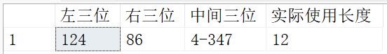

### CAST(表达式 AS 数据类型)，CONVERT(数据类型,表达式)

例如：将表达式的数据类型转化为指定的数据类型

```sql
DECLARE @IntTest int
SET @IntTest='3'
SELECT '结果:'+CAST(@IntTest AS char(2)) AS 原结果, -- 转化为char
(CONVERT(int,@IntTest)+10) AS 结果加10 -- 转回int
```

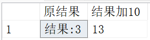

### ISNULL(空值,指定的值)

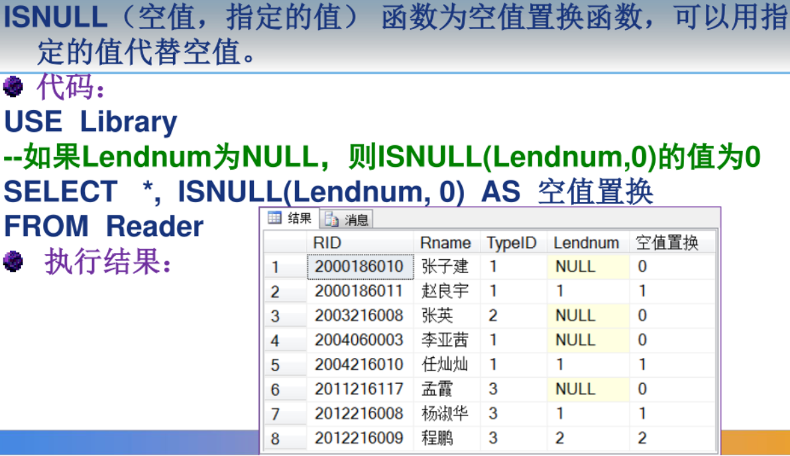

## 流程控制语句

### 顺序语句

SET语句：用于给局部变量赋值，还可以设定用户执行T-SQL命令时SQL Server的处理选项，一般有以下几种设定方式：

**SET 选项 ON|OFF** ：选项开关打开或者关闭

**SET 选项 值** ：设定选项的具体值

**SET @变量名=表达式** ：为变量赋值，但一个SET只能给**一个变量**赋值

例如：显示受T-SQL语句影响的行数的消息

```sql
SET NOCOUNT OFF -- 显示受影响行数的消息
SELECT * FROM Student
```

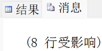

SELECT语句：输出和赋值语句

语法：**SETLECT 表达式1,表达式2,...,表达式n**

PRINT语句：向客户端返回**一个字符类型**表达式的值，最长为255个字符。如果表达式中的全局变量、局部变量或函数的值不是字符串的话，必须先用数据类型转换函数CONVERT将其转换为字符串

语法：**PRINT 表达式**

## IF...ELSE语句

用来判断当某一条件成立时执行某程序，条件不成立时执行另一段程序。

语法：**IF<逻辑表达式>**

​				**<命令行或程序块>**

​			**[ELSE[逻辑表达式]**

​				**<命令行或程序块>]**

例如：用IF...ELSE语句查询图书中有没有SQL书，统计其数量，否则显示没有SQL书

```sql
USE Library
GO
DECLARE @book int,@book1 int
IF EXISTS(SELECT * FROM Book WHERE Bname LIKE '%SQL%')
BEGIN -- BEGIN...END语句可以将范围内的代码视为“块”
	SELECT @book=COUNT(*)
	FROM Book
	WHERE Bname LIKE '%SQL%'
	PRINT '英语书数量'+RTRIM(CAST(@book AS char(4)))+'册' -- RTRIM函数去掉字符串右边的空格
END
ELSE
	PRINT '没有SQL书'
```

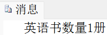

## WHILE语句

WHILE命令

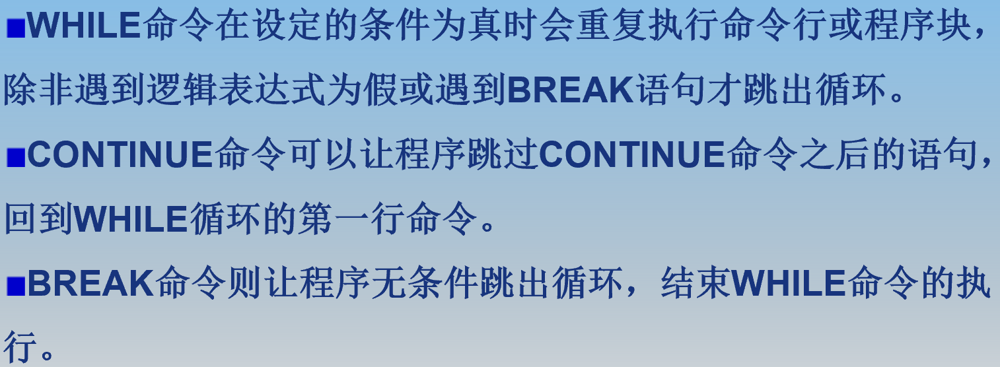

语法：**WHILE  <逻辑表达式>**
				**BEGIN**
   				**<命令行或程序块>**
			**[BREAK]**
			**[CONTINUE]**
				**END**

一个简单的循环程序：

```sql
DECLARE  @x  int
SET  @x=0
WHILE  @x<3 -- 当@x>=3时终止循环
   BEGIN
     	SET  @x=@x+1
     	PRINT   'x=' + CONVERT(char(1), @x) -- 类型转换函数CONVERT
   END
-- 运行结果：
-- x=1
-- x=2
-- x=3
```

## 其他控制语句

**GOTO**：将执行语句无条件跳转到标签处，并从标签位置继续处理

**WAITFOR**：WAITFOR  DELAY <延时时间> | TIME <到达时间>

暂停程序执行，直到所设定的等待时间已过或所设定的时间已到才继续往下执行。

**RETURN**：RETURN命令用于结束当前程序的执行，并返回到一个调用它的程序，可指定一个返回值。

- RETURN的执行是即时且完全的，可在任何时候用于从过程、批处理或语句块中退出，RETURN之后的语句不执行。
- 如果用于存储过程，RETURN不能返回空值

## CASE表达式

相当于C语言中的多分支结构Switch

语法： **CASE   <输入表达式>**
    		**WHEN   < when表达式1>   THEN   结果表达式1**
    		**WHEN   < when表达式2>   THEN   结果表达式2**
    		**…**
			**ELSE  结果表达式n**
			**END**  

- 首先计算“输入表达式”，然后将其值依次与“when表达式”的值进行比较，当“输入表达式”的值等于“when表达式”的值时，返回第一个满足条件THEN后的“结果表达式”的值。
- 如果比较运算结果都不为真，则返回ELSE后的表达式的值。如果省略此参数并且比较运算的计算结果都不为真，表达式的值为 NULL。

语法：**CASE**
      	**WHEN  逻辑表达式1    THEN   结果表达式1**
     	 **WHEN  逻辑表达式2    THEN   结果表达式2**
     	 **…**
	     **ELSE  结果表达式n**
		 **END**

- 依次对每个WHEN子句求逻辑表达式的值，当计算结果为真时，表达式的值为第一个满足条件的THEN结果表达式的值。
- 如果运算结果都不为真，则表达式的值为ELSE后结果表达式的值。如果省略此参数并且比较运算的计算结果都不为真，表达式的值为NULL。
