# Mysql的主从复制

## 准备工作

在进行主从复制之前，需要提前准备两台虚拟机：


## 配置主库Master

### 修改配置文件my.cnf

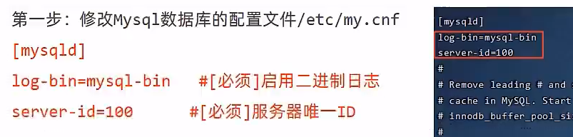

```
vim /etc/my.cnf
```

添加内容：

```
log-bin=mysql-bin
server-id=100
```

> - `server-id`：是MySQL服务器的一个唯一标识符，用于在复制环境中区分不同的服务器实例
> - `log-bin`：选项用于指定MySQL服务器记录二进制日志（binlog）的文件名
>
> 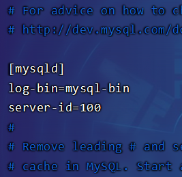
>
> 其它配置项：
>
> - `binlog-format`：用于指定二进制日志的格式，它有三个可能的值：`STATEMENT`、`ROW`和`MIXED`
>   - `STATEMENT`格式记录的是SQL语句本身，`ROW`格式记录的是数据行的变化，而`MIXED`格式是前两种格式的混合。
>   - `MIXED`格式是MySQL默认的日志格式，它根据执行的SQL语句来决定使用`STATEMENT`还是`ROW`格式。对于一些不确定性的SQL语句或者可能导致数据不一致的语句，MySQL会自动切换到`ROW`格式来确保复制的准确性

### 重启mysql服务

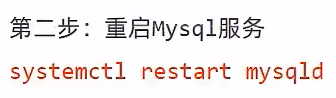

```
systemctl restart mysqld
```

### 执行用户权限sql

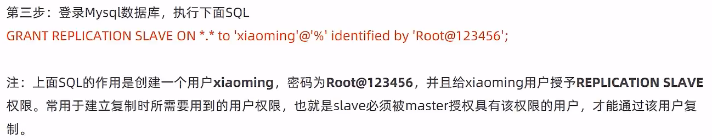

```
mysql -uroot -proot


GRANT REPLICATION SLAVE ON *.* to 'xiaoming'@'%'identified by 'Root@123456';
```

> - `GRANT`：SQL命令的关键字，用于授予权限
> - `REPLICATION SLAVE`：这是要授予的权限类型。`REPLICATION SLAVE`权限允许用户从主服务器请求二进制日志的内容，这是从服务器进行数据复制所必需的
> - `ON *.*`：这个部分指定了权限的范围。`*.*`意味着用户`xiaoming`被授予了所有数据库和所有表的复制权限。如果你只想授予对特定数据库的复制权限，你可以将`*.*`替换为`database_name.*`
> - `'xiaoming'@'%'`：这是要授予权限的用户账户。`'xiaoming'`是用户名，`'%'`是一个通配符，表示任何主机都可以使用这个用户账户连接到MySQL服务器。如果你想要限制只有特定的主机可以连接，可以将`'%'`替换为具体的IP地址或主机名
> - `identified by 'Root@123456'`：这个部分设置了用户`xiaoming`的密码，这里密码是`Root@123456`
>
> 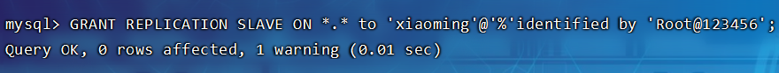

### 查看Master状态

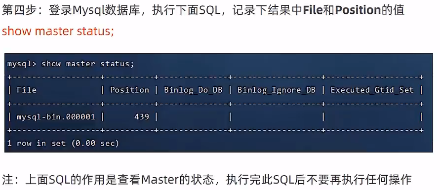

```
show master status;
```

> 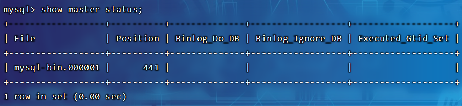

## 配置从库Slave

### 修改配置文件auto.cnf

> 这是为了让因为服务器复制而导致的`server_uuid`一致，**通过正常安装两个mysql是不会一致的，此步骤即可省略**

```
uuidgen # 生成一个UUID

mysql -uroot -proot # 登录mysql
SELECT @@server_uuid; # mysql中查看自身的UUID
```

> ```
> chmod +w /var/lib/mysql/auto.cnf # 添加写入权限
> vim /var/lib/mysql/auto.cnf
> 
> 
> server-uuid=2e6895f7-ac7a-4db4-8a92-27a8d8ee911f
> 
> 
> systemctl restart mysqld
> ```
>
> 
>
> 重启服务后查看：
>
> 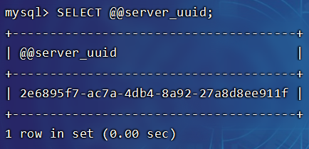

### 修改配置文件my.cnf

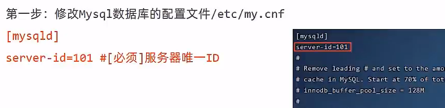

```
vim /etc/my.cnf
```

添加内容：

```
server-id=101
```

> 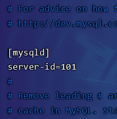

### 重启mysql服务


```
systemctl restart mysqld
```

### 执行关联sql

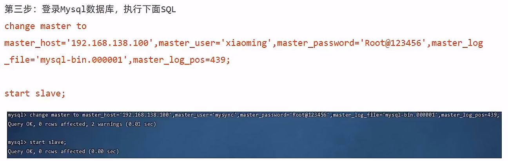

根据前面主库的信息来填写：

```
mysql -uroot -proot


change master to master_host='192.168.138.100',master_user='xiaoming',master_password='Root@123456',master_log_file='mysql-bin.000001',master_log_pos=441;
```

> 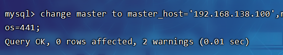
>
> 从0开始复制：
>
> ```
> CHANGE MASTER TO
> MASTER_HOST='master_host_ip',
> MASTER_USER='xiaoming',
> MASTER_PASSWORD='Root@123456',
> MASTER_LOG_FILE='mysql-bin.000001',
> MASTER_LOG_POS=4; -- 通常从位置4开始，因为这是日志文件的起始位置
> ```
>
> 如果原先配置过从库，会存在线程在运行，需要先关闭线程才能执行关联sql：
>
> ```
> stop slave;
> ```

启动服务：

```
start slave;
```


### 查看Slave状态

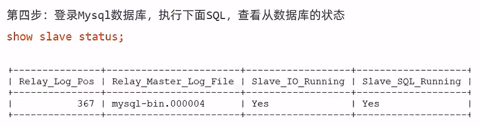

```sql
show slave status;
```

> 输出的内容会比较乱，将输出的内容复制到文本编辑器中打开，查看其中的关键信息都为"Yes"即代表成功
>
> 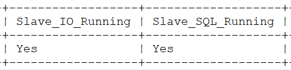
>
> 此时从库会复制主库的操作，但是主库不会复制从库的操作

### 角色权限限制

```sql
CREATE USER 'slave_read'@'%' IDENTIFIED BY '123456';

GRANT SELECT ON cebc.* TO 'slave_read'@'%';

FLUSH PRIVILEGES;
```

> - `CREATE USER 'slave_read'@'%' IDENTIFIED BY '123456';` 创建了一个新用户`slave_read`，密码为`123456`，`'%'`表示这个用户可以从任何主机连接
> - `GRANT SELECT ON cebc.* TO 'slave_read'@'%';` 授予`slave_read`用户对`cebc`数据库的所有表进行SELECT查询的权限。没有授予INSERT、UPDATE或DELETE权限，因此用户无法进行修改、删除或新增操作
> - `FLUSH PRIVILEGES;` 命令告诉MySQL重新加载授权表，以确保刚才的权限更改立即生效

## 手动同步

查看主从运行状态，在从库运行：

```sql
SHOW SLAVE STATUS;
```

展示主从信息：

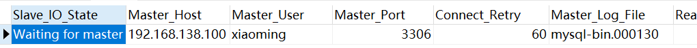


关键参数：

- **Master_Log_File**：当前正在读取的主库二进制日志文件名(**MASTER_LOG_FILE**)
- **Read_Master_Log_Pos**：当前正在读取的主库二进制日志文件的位置(**MASTER_LOG_POS**)
- **Relay_Log_File**：当前正在使用的从库中继日志文件名
- **Relay_Log_Pos**：当前正在写入的从库中继日志的位置
- **Read_Master_Log_File**：从库即将读取的主库二进制日志文件的名称(这个参数通常与 `Master_Log_File` 相同，除非从库正在处理主库的日志切换)
- **Slave_IO_Running**：I/O线程的状态（应显示为“Yes”）
- **Slave_SQL_Running**：SQL线程的状态（应显示为“Yes”）

停止服务：

```sql
SHOW SLAVE STATUS;

STOP SLAVE;
```

在维护或升级完成后，使用之前记录的信息重新配置从库，并启动服务：

```sql
CHANGE MASTER TO 
MASTER_LOG_FILE='mysql-bin.000130', -- 记录的二进制日志文件名
MASTER_LOG_POS=1641; -- 记录的位置

START SLAVE;
```

> 启动后自动同步：
>
> 

## 异常中断

有时会出现连接正常，但是无法同步的情况：

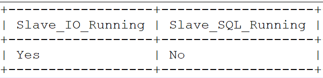

往后拖动可以查看报错原因：

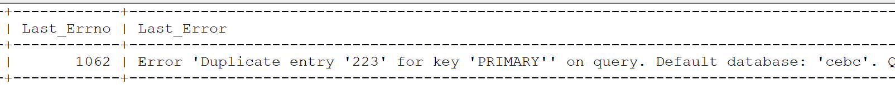

> 错误信息`“Duplicate entry ‘223’ for key ‘PRIMARY’”`表示在尝试插入数据时，由于主键约束失败而导致插入操作失败，尝试插入一个已经存在于`ce_goods_tuilog`表中的主键值而导致的异常

如果错误由于单个事务引起的，可以尝试使用如下sql跳过导致问题的那个事务：

```sql
STOP SLAVE SQL_THREAD;
SET GLOBAL sql_slave_skip_counter = 1;
START SLAVE SQL_THREAD;
```

> 注意，当执行`SET GLOBAL sql_slave_skip_counter = 1;`命令时：
>
> - 如果从服务器在尝试应用一个事务时遇到错误，这个命令会使得从服务器跳过当前的事务，并继续尝试应用下一个事务。这是跳过错误事务的情况
> - 如果当前的事务没有错误，这个命令执行后，从服务器仍然会正常应用当前的事务，然后继续到下一个事务，它不会跳过正常的事务
>
> 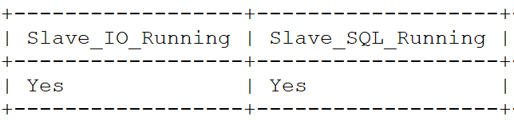