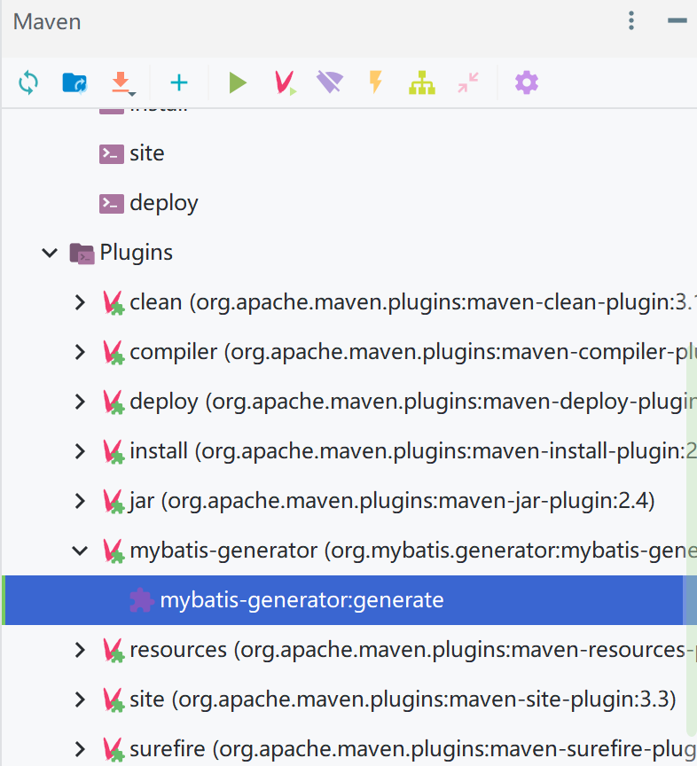
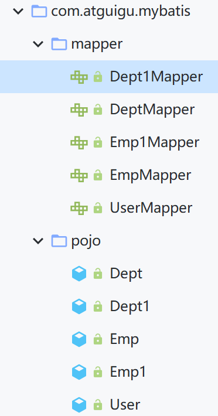
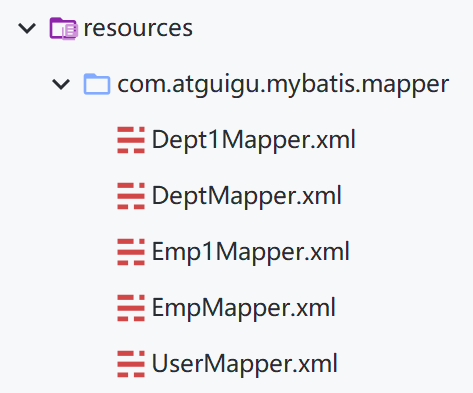
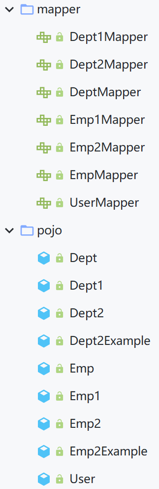
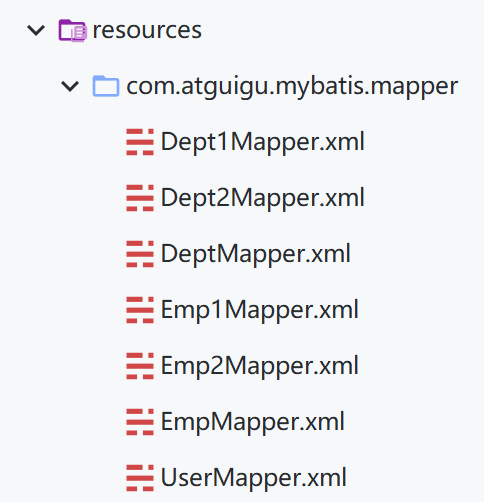
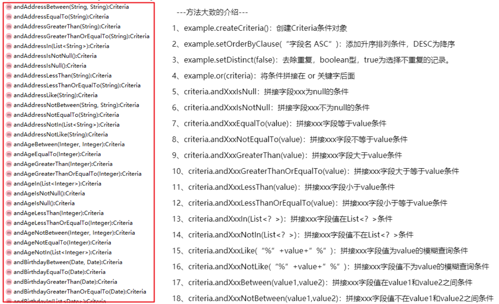

# MyBatis逆向工程

> 正向工程：先创建Java实体类，由框架负责根据实体类生成数据库表。Hibernate是支持正向工程的。
>
> 逆向工程：先创建数据库表，由框架负责根据数据库表，反向生成如下资源：
>
> - Java实体类
> - Mapper接口
> - Mapper映射文件

## 逆向工程的创建

### 添加依赖和插件

pom.xml

```xml
		<!-- 如果爆红则需要在前面的<dependencys>中引入 -->
		<!-- 逆向工程的包 -->
		<dependency>
			<groupId>org.mybatis.generator</groupId>
			<artifactId>mybatis-generator-core</artifactId>
			<version>1.3.2</version>
		</dependency>

<!-- 控制Maven在构建过程中相关配置 -->
<build>
	<!-- 构建过程中用到的插件(注意是<build>的直接目录下>!如果存在<pluginManagement>包裹<plugins>，可以在<build>子目录直接创建<plugins>即可) -->
	<plugins>

		<!-- 具体插件，逆向工程的操作是以构建过程中插件形式出现的 -->
		<plugin>
			<groupId>org.mybatis.generator</groupId>
			<artifactId>mybatis-generator-maven-plugin</artifactId>
			<version>1.3.0</version>

			<!-- 插件的依赖 -->
			<dependencies>
				<!-- 逆向工程的核心依赖 -->
				<dependency>
					<groupId>org.mybatis.generator</groupId>
					<artifactId>mybatis-generator-core</artifactId>
					<version>1.3.2</version>
				</dependency>
				<!-- MySQL驱动 -->
				<dependency>
					<groupId>mysql</groupId>
					<artifactId>mysql-connector-java</artifactId>
					<version>8.0.16</version>
				</dependency>
			</dependencies>
		</plugin>

	</plugins>
</build>
```

### 创建逆向工程的配置文件

在`resources`目录下创建`generatorConfig.xml`(文件名称固定)，这里配置的是简洁版

generatorConfig.xml

```xml
<?xml version="1.0" encoding="UTF-8"?>
<!DOCTYPE generatorConfiguration
PUBLIC "-//mybatis.org//DTD MyBatis Generator Configuration 1.0//EN"
"http://mybatis.org/dtd/mybatis-generator-config_1_0.dtd">
<generatorConfiguration>
	<!--
		targetRuntime: 执行生成的逆向工程的版本
			MyBatis3Simple: 生成基本的CRUD（清新简洁版）
			MyBatis3: 生成带条件的CRUD（奢华尊享版）
	-->
	<context id="DB2Tables" targetRuntime="MyBatis3Simple">

		<!-- 数据库的连接信息(按需修改) -->
		<jdbcConnection driverClass="com.mysql.cj.jdbc.Driver"
						connectionURL="jdbc:mysql://localhost:3306/mybatis?serverTimezone=UTC"
						userId="root"
						password="123456">
		</jdbcConnection>

		<!-- javaBean的生成策略-->
		<javaModelGenerator targetPackage="com.atguigu.mybatis.pojo" targetProject=".\src\main\java">
			<property name="enableSubPackages" value="true" />
			<property name="trimStrings" value="true" />
		</javaModelGenerator>

		<!-- SQL映射文件的生成策略 -->
		<sqlMapGenerator targetPackage="com.atguigu.mybatis.mapper" targetProject=".\src\main\resources">
			<property name="enableSubPackages" value="true" />
		</sqlMapGenerator>

		<!-- Mapper接口的生成策略 -->
		<javaClientGenerator type="XMLMAPPER" targetPackage="com.atguigu.mybatis.mapper" targetProject=".\src\main\java">
			<property name="enableSubPackages" value="true" />
		</javaClientGenerator>

		<!-- 逆向分析的表 -->
		<!-- 
			 tableName：设置为*号，可以对应所有表，此时不写domainObjectName
			 domainObjectName：指定生成出来的实体类(JavaBean)的类名 
		-->
		<table tableName="t_emp" domainObjectName="Emp1"/>
		<table tableName="t_dept" domainObjectName="Dept1"/>
	</context>
</generatorConfiguration>
```

## 逆向工程的使用

### 执行MBG插件的generate目标

如果配置无误，则可以在Maven中找到此插件`mybatis-generatorConfig`，双击运行即可



运行效果：





生成了五个方法：

- 增：`int insert(Dept1 record);`
- 删：`int deleteByPrimaryKey(Integer deptId);`
- 改：`int updateByPrimaryKey(Dept1 record);`
- 根据主键查询单个数据：`Dept1 selectByPrimaryKey(Integer deptId);`
- 查询全部数据：`List<Dept1> selectAll();`

## 完整版逆向工程

将`generatorConfig.xml`内`<context>`中`	<targetRuntime>`值修改为`"MyBatis3"`即可

完整版在精简版的基础上额外提供了`xxxExample.java`，这个包定义了一个内部类GeneratedCriteria，这个内部类就定义了一系列条件的方法，这些条件最后都会拼接在SQL中，但是一般不用它，都用它的子类Criteria来进行操作，Criteria继承了内部类GeneratedCriteria。





`Emp2Mapper.java`存在如下方法：

- `int countByExample(Emp2Example example)`：按条件返回查询到的行数
- `int deleteByExample(Emp2Example example)`：按条件删除并返回行数
- `int deleteByPrimaryKey(Integer empId)`：按主键删除并返回行数
- `int insert(Emp2 record)`：插入数据并返回行数(**使用的版本不会返回插入的那一行的id**)
- `int insertSelective(Emp2 record)`：插入值不为null的字段并返回行数
- `List<Emp2> selectByExample(Emp2Example example)`：按条件查询，传入null表示查询所有
- `Emp2 selectByPrimaryKey(Integer empId);`：按主键查询
- `int updateByExampleSelective(@Param("record") Emp2 record, @Param("example") Emp2Example example)`：按条件更新值不为null的字段
- `int updateByExample(@Param("record") Emp2 record, @Param("example") Emp2Example example)`：按条件更新(属性值为null也会传入字段)
- `int updateByPrimaryKeySelective(Emp2 record)`：按主键更新值不为null的字段
- `int updateByPrimaryKey(Emp2 record)`：按主键更新(属性值为null也会传入字段)

`Emp2Example.java`存在如下方法：



MyBatisTest.java

```java
	@Test
    public void generatorTest(){
        SqlSession sqlSession = SqlSessionUtils.getSqlSession();
        Emp2Mapper emp2Mapper = sqlSession.getMapper(Emp2Mapper.class);

        //根据主键来查询(给Emp2重写了toString方法)-->select emp_id, emp_name, gender, dept_id from t_emp where emp_id = ?
        Emp2 emp2 = emp2Mapper.selectByPrimaryKey(2);
        System.out.println(emp2);
        //根据条件来查询人(这里写"null"没有条件则是直接查询出所有人)-->select emp_id, emp_name, gender, dept_id from t_emp
        List<Emp2> emp2List = emp2Mapper.selectByExample(null);
        System.out.println(emp2List);
		
        //创建一个条件对象emp2Example
        Emp2Example emp2Example = new Emp2Example();
        //通过createCriteria()方法创建一个类的对象并反复调用其中的方法来可以添加多个条件
        emp2Example.createCriteria().andEmpNameLike("%y%").andEmpIdEqualTo(1);
        //在前面语句的后面添加or语句
        emp2Example.or().andEmpNameLike("%an%");
        //将条件对象放入条件查询的方法中-->select emp_id, emp_name, gender, dept_id from t_emp WHERE ( emp_name like ? and emp_id = ? ) or( emp_name like ? )
        List<Emp2> emp2List1 = emp2Mapper.selectByExample(emp2Example);
        System.out.println(emp2List1);

        /*
            测试修改功能：
                选择性修改：只将JavaBean中不为null的数据对数据库进行修改操作
                覆盖性修改：JavaBean中为null值的数据一样会输入到数据库中去
        */
        Emp2 emp2One = new Emp2();
        emp2One.setEmpId(1);
        emp2One.setEmpName("yxx");
        //这里都是根据主键来确定要修改的行数，还可以按前面的输入Example对象先查询再修改，对应的方法为updateByExample()
        //选择性修改
        emp2Mapper.updateByPrimaryKeySelective(emp2One);
        //覆盖性修改
        emp2Mapper.updateByPrimaryKey(emp2One);

        //添加操作-->insert into t_emp (emp_id, emp_name, gender, dept_id) values (?, ?, ?, ?)
        emp2One.setEmpId(null);
        System.out.println(emp2Mapper.insert(emp2One));//返回值为受影响行数
    }
```

```
DEBUG 01-14 22:23:27,140 ==>  Preparing: select emp_id, emp_name, gender, dept_id from t_emp where emp_id = ? (BaseJdbcLogger.java:137) 
DEBUG 01-14 22:23:27,187 ==> Parameters: 2(Integer) (BaseJdbcLogger.java:137) 
DEBUG 01-14 22:23:27,233 <==      Total: 1 (BaseJdbcLogger.java:137) 
Emp2{empId=2, empName='xuan', gender='男', deptId=10}
DEBUG 01-14 22:23:27,265 ==>  Preparing: select emp_id, emp_name, gender, dept_id from t_emp (BaseJdbcLogger.java:137) 
DEBUG 01-14 22:23:27,265 ==> Parameters:  (BaseJdbcLogger.java:137) 
DEBUG 01-14 22:23:27,265 <==      Total: 3 (BaseJdbcLogger.java:137) 
[Emp2{empId=1, empName='yxx', gender='null', deptId=null}, Emp2{empId=2, empName='xuan', gender='男', deptId=10}, Emp2{empId=3, empName='yxx', gender='null', deptId=null}]
DEBUG 01-14 22:23:27,280 ==>  Preparing: select emp_id, emp_name, gender, dept_id from t_emp WHERE ( emp_name like ? and emp_id = ? ) or( emp_name like ? ) (BaseJdbcLogger.java:137) 
DEBUG 01-14 22:23:27,280 ==> Parameters: %y%(String), 1(Integer), %an%(String) (BaseJdbcLogger.java:137) 
DEBUG 01-14 22:23:27,280 <==      Total: 2 (BaseJdbcLogger.java:137) 
[Emp2{empId=1, empName='yxx', gender='null', deptId=null}, Emp2{empId=2, empName='xuan', gender='男', deptId=10}]
DEBUG 01-14 22:23:27,280 ==>  Preparing: update t_emp SET emp_name = ? where emp_id = ? (BaseJdbcLogger.java:137) 
DEBUG 01-14 22:23:27,296 ==> Parameters: yxx(String), 1(Integer) (BaseJdbcLogger.java:137) 
DEBUG 01-14 22:23:27,296 <==    Updates: 1 (BaseJdbcLogger.java:137) 
DEBUG 01-14 22:23:27,296 ==>  Preparing: update t_emp set emp_name = ?, gender = ?, dept_id = ? where emp_id = ? (BaseJdbcLogger.java:137) 
DEBUG 01-14 22:23:27,296 ==> Parameters: yxx(String), null, null, 1(Integer) (BaseJdbcLogger.java:137) 
DEBUG 01-14 22:23:27,296 <==    Updates: 1 (BaseJdbcLogger.java:137) 
DEBUG 01-14 22:23:27,296 ==>  Preparing: insert into t_emp (emp_id, emp_name, gender, dept_id) values (?, ?, ?, ?) (BaseJdbcLogger.java:137) 
DEBUG 01-14 22:23:27,296 ==> Parameters: null, yxx(String), null, null (BaseJdbcLogger.java:137) 
DEBUG 01-14 22:23:27,296 <==    Updates: 1 (BaseJdbcLogger.java:137) 
1
```

