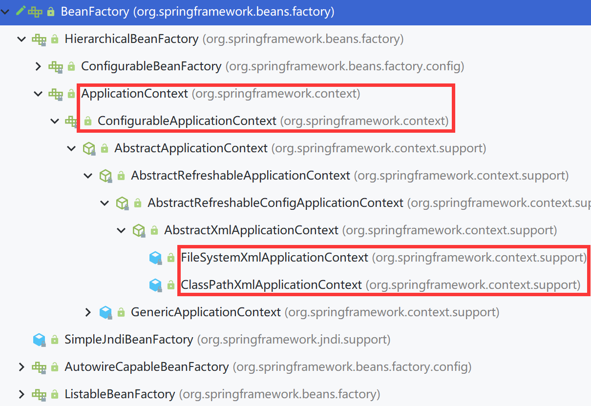

# IOC容器

IOC：Inversion of Control，翻译过来是**反转控制**

## IOC思想

> 获取资源的传统方式：在应用程序中的组件需要获取资源时，传统的方式是组件**主动的从容器中获取所需要的资源**，在这样的模式下开发人员往往需要知道在具体容器中特定资源的获取方式，增加了学习成本，同时降低了开发效率

> 反转控制方式获取资源：反转控制的思想完全颠覆了应用程序组件获取资源的传统方式：反转了资源的获取方向——改由容器主动的将资源推送给需要的组件，开发人员不需要知道容器是如何创建资源对象的，只需要提供接收资源的方式即可，极大的降低了学习成本，提高了开发的效率。这种行为也称为**查找的被动形式**

> DI：Dependency Injection，翻译过来是**依赖注入**。**DI 是 IOC 的另一种表述方式**：即组件**以一些预先定义好的方式**（例如：setter 方法）**接受来自于容器的资源注入**。相对于IOC而言，这种表述更直接
>
> **IOC 就是一种反转控制的思想， 而 DI 是对 IOC 的一种具体实现**

传统方式：

- Controller-->Service-->Dao，在实现逻辑业务需要在控制层创建Service对象，Controller依赖于Service

依赖注入：**为当前对象所依赖的对象赋值的过程称为注入**

- 提前以设置好的方式被动的接收Spring的注入，**依赖什么对象Spring就帮忙注入什么对象**

## IOC容器在Spring中的实现

Spring 的 IOC 容器就是 IOC 思想的一个落地的产品实现。IOC 容器中管理的组件也叫做 bean。在创建 bean 之前，首先需要创建 IOC 容器。Spring 提供了 IOC 容器的两种实现方式：

### BeanFactory

这是 IOC 容器的基本实现，是 Spring 内部使用的接口。面向 Spring 本身，不提供给开发人员使用

### ApplicationContext

BeanFactory 的子接口，提供了更多高级特性。面向 Spring 的使用者，几乎所有场合都使用 ApplicationContext 而不是底层的 BeanFactory

### ApplicationContext的主要实现类

|             类型名              |                             简介                             |
| :-----------------------------: | :----------------------------------------------------------: |
| ClassPathXmlApplicationContext  |    通过读取类路径下的 XML 格式的配置文件创建 IOC 容器对象    |
| FileSystemXmlApplicationContext |   通过文件系统路径读取 XML 格式的配置文件创建 IOC 容器对象   |
| ConfigurableApplicationContext  | ApplicationContext 的子接口，包含一些扩展方法 refresh() 和 close() ，让 ApplicationContext 具有启动、关闭和刷新上下文的能力。 |
|      WebApplicationContext      | 专门为 Web 应用准备，基于 Web 环境创建 IOC 容器对象，并将对象引入存入 ServletContext 域中。 |

