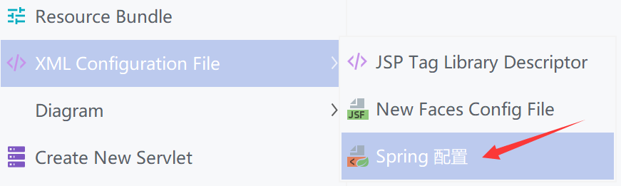
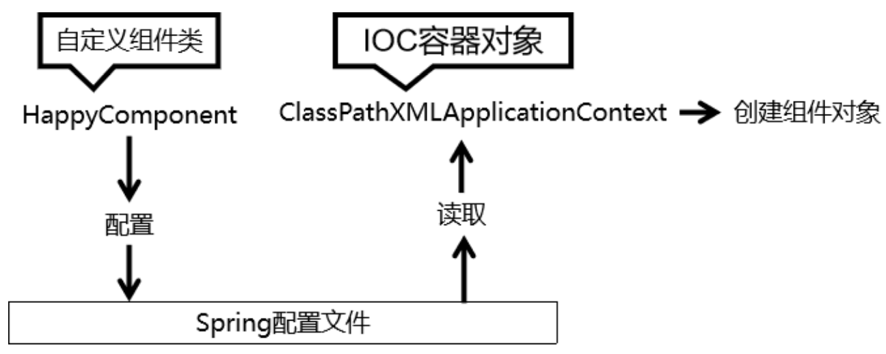
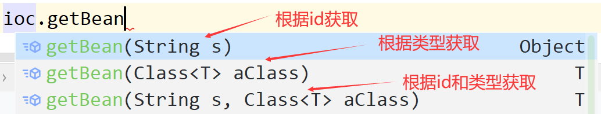

# 基于XML管理Bean

## 配置Springframework

### 引入依赖

```xml
	<!-- 基于Maven依赖传递性，导入spring-context依赖即可导入当前所需所有jar包 -->
	<dependency>
		<groupId>org.springframework</groupId>
		<artifactId>spring-context</artifactId>
		<version>5.3.1</version>
	</dependency>
```

### 创建Spring配置文件

在`resources`目录下新建`applicationContext.xml`



```xml
<?xml version="1.0" encoding="UTF-8"?>
<beans xmlns="http://www.springframework.org/schema/beans"
       xmlns:xsi="http://www.w3.org/2001/XMLSchema-instance"
       xsi:schemaLocation="http://www.springframework.org/schema/beans http://www.springframework.org/schema/beans/spring-beans.xsd">

</beans>
```

### 测试Spring

创建`Hello.java`

```java
package com.atguigu.spring;

public class Hello {
    public void sayHello(){
        System.out.println("Hello,Spring");
    }
}
```

在`applicationContext.xml`添加语句

```xml
	<!--
		配置Hello所对应的bean，即将Hello的对象交给Spring的IOC容器管理
		通过bean标签配置IOC容器所管理的bean
		属性：
			id：设置bean的唯一标识
			class：设置bean所对应类型的全类名
	-->
	<bean id="Hello" class="com.atguigu.spring.Hello"></bean>
```

新建测试类`SpringTest.java`

```java
    @Test
    public void testHello(){
        //获取对应配置文件中的IOC容器
        ApplicationContext ioc = new ClassPathXmlApplicationContext("applicationContext.xml");
        //获取IOC容器中的Bean
        Hello hello = (Hello) ioc.getBean("Hello");
        hello.sayHello();
    }
```

### 实现过程



### 注意事项

Spring 底层默认**通过反射技术调用组件类的无参构造器**来创建组件对象，这一点需要注意。如果在需要无参构造器时，没有无参构造器，则会抛出下面的异常：

> org.springframework.beans.factory.BeanCreationException: Error creating bean with name 'Hello' defined in class path resource [applicationContext.xml]: Instantiation of bean failed; nested exception is org.springframework.beans.BeanInstantiationException: Failed to instantiate [com.atguigu.spring.Hello]: No default constructor found; nested exception is java.lang.NoSuchMethodException: com.atguigu.spring.Hello.<init>()

## 获取Bean的三种方式



### 根据id获取

由于 id 属性指定了 bean 的唯一标识，所以根据 bean 标签的 id 属性可以精确获取到一个组件对象，但是根据 id 属性获取到的对象**需要进行强转才能使用**

```java
        Hello hello = (Hello) ioc.getBean("Hello");
```

### 根据类型进行获取

由于大多数情况下唯一的 id 对应唯一的类型，所以可以直接根据类型查找，且方法会自动匹配类型，**不需要进行强转**

```java
        Hello hello1 = ioc.getBean(Hello.class);
```

当根据类型获取bean时，要求IOC容器中指定类型的bean有且只能有一个，当IOC容器中一共配置了两个时，IOC容器无法确定唯一的一个时，会报错

```xml
    <bean id="Hello" class="com.atguigu.spring.Hello"></bean>
    <bean id="Hello1" class="com.atguigu.spring.Hello"></bean>
```

```
org.springframework.beans.factory.NoUniqueBeanDefinitionException: No qualifying bean of type 'com.atguigu.spring.Hello' available: expected single matching bean but found 2: Hello,Hello1
```

当一个都没有配置到IOC容器时，会报错

```
org.springframework.beans.factory.NoSuchBeanDefinitionException: No qualifying bean of type 'com.atguigu.spring.Hello' available
```

### 根据id和类型进行获取

```java
        Hello hello2 = ioc.getBean("Hello",Hello.class);
```

## 获取实现接口的Bean

创建接口`HelloInterface.java`由`Hello.java`实现

```java
public interface HelloInterface {
    void sayHello();
}
```

则可以通过多态来获取实现接口的bean-->向上转型

```java
        //ioc.getBean(Hello.class)的写法相当于指定"id"为"Hello"("Hello"需先挂载在<bean>标签)
		HelloInterface hello = ioc.getBean(HelloInterface.class);//查找实现HelloInterface的类
```

如果一个接口有多个实现类，这些实现类都配置了 bean，则需要通过**getBean方法内的名称**或者**根据id和类型**获取唯一的bean

## 原理

根据类型来获取bean时，在满足bean唯一性的前提下，其实只是看：`『对象 instanceof 指定的类型』`的返回结果，只要返回的是true就可以认定为和类型匹配，能够获取到