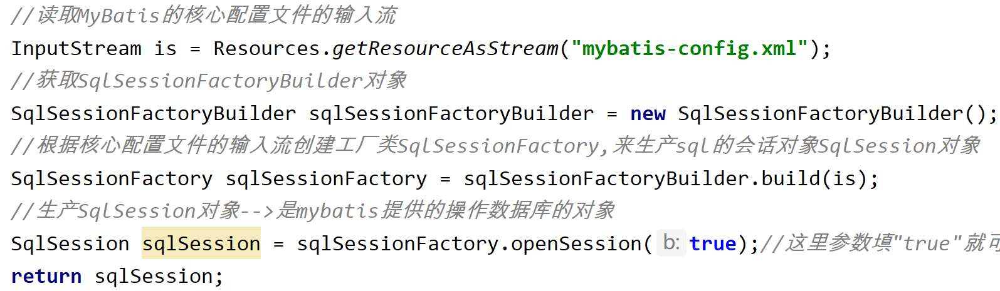

# FactoryBean

> FactoryBean是Spring提供的**一种整合第三方框架的常用机制**
>
> 和普通的bean不同，配置一个FactoryBean类型的bean，在获取bean的时候得到的并不是class属性中配置的这个类的对象，而是getObject()方法的返回值。通过这种机制，Spring可以**把复杂组件创建的详细过程和繁琐细节都屏蔽起来**，只把最简洁的使用界面展示出来。

> 与BeanFactory的区别：前者是IOC容器的基本实现，**是用于帮助进行管理bean的**，而FactoryBean是一个"工厂类"所对应的bean，是需要交给IOC容器管理的

FactoryBean是一个接口，需要创建一个类实现该接口，其中有三个接口：

- `getObject()`：返回"生产"的对象交给IOC容器管理
- `getObjectType()`：设置"工厂"所提供对象的类型
- `isSingleton()`：所提供的对象是否单例

优点：

- 普通Factory：先把Factory配置为一个bean，再通过IOC容器获取FactoryBean，最后**通过FactoryBean对象的方法去获取Factory提供的对象**
- 优化后Factory：只需要把实现FactoryBean接口（在方法中声明"工厂"对象）的类配置为bean，就可以直接（系统会自动调用`getObject()`方法获取提供的bean配置到IOC容器中去）获取到Factory提供的对象了（**省略了获取Factory的过程**）

**将来整合Mybatis时，Spring就是通过FactoryBean机制来帮助创建SqlSessionFactory对象的**——当把FactoryBean的实现类配置为bean时，会将当前类中`getObject()`所返回的对象交给IOC容器管理



FactoryHello.java

```java
import org.springframework.beans.factory.FactoryBean;

public class FactoryHello implements FactoryBean<Hello> {
    @Override
    public Hello getObject() throws Exception {
        //返回工厂"生产"的对象交给IOC容器管理
        return new Hello();
    }

    @Override
    public Class<?> getObjectType() {
        //设置所提供对象的类型
        return Hello.class;
    }
}
```

applicationContext.xml

```xml
    <!--将FactoryBean交给IOC容器进行管理，系统会自动调用getObject()方法将提供的bean配置到IOC容器中去-->
    <bean id="FactoryHello" class="com.atguigu.spring.FactoryHello"></bean>
```

SpringTest.java

```java
    @Test
    public void testFactoryBean(){
        ApplicationContext ioc = new ClassPathXmlApplicationContext("applicationContext.xml");
        //不需要再获取FactoryHello对象，而是直接获取到"生产"的方法
        Hello hello = ioc.getBean("FactoryHello",Hello.class);
        hello.sayHello();
    }
```

```
Hello,Spring
```
