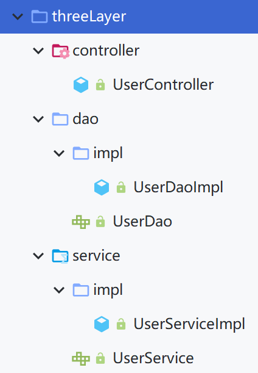

# 基于XML的自动装配

> 自动装配：
>
> 根据指定的策略，在IOC容器中匹配某一个bean，自动**为指定的bean中所依赖的类类型或接口类型属性赋值**

> 使用bean标签的autowire属性设置自动装配效果(**默认为no和defalse不进行装配——bean中的属性不会自动匹配某个bean为属性赋值**)
>
> - byType：**根据类型匹配**IOC容器中的某个兼容类型的bean，为属性自动赋值
> - byName：将**自动装配的属性的属性名**，**作为bean的id在IOC容器中**匹配相对应的bean进行赋值

## 配置场景

### 控制层

UserController.java

```java
package com.atguigu.threeLayer.controller;

import com.atguigu.threeLayer.service.UserService;

public class UserController {
    //在controller里面创建service对象，再通过service中创建dao类并调用其中的方法
    //之前的硬编码方式就是通过：private UserService userService = new UserServiceImpl()
    //这样写死的方式不利于更新维护，也不利于添加新的功能(扩展新的实现类)
    //现在只需要设置好get和set方法就可以以bean的方式将UserController交给IOC容器进行管理，通过依赖注入的方式进行赋值
    private UserService userService;

    public UserService getUserService() {
        return userService;
    }

    public void setUserService(UserService userService) {
        this.userService = userService;
    }

    //场景模拟：通过调用userService中的saveUser()方法保存用户信息
    public void saveUser(){
        userService.saveUser();
    }
}
```

### 业务层

UserService.java

```java
package com.atguigu.threeLayer.service;

public interface UserService {
    /**
     * 保存用户信息
     */
    void saveUser();
}
```

UserServiceImpl.java

```java
package com.atguigu.threeLayer.service.impl;

import com.atguigu.threeLayer.dao.UserDao;
import com.atguigu.threeLayer.service.UserService;

public class UserServiceImpl implements UserService {

    private UserDao userDao;

    public UserDao getUserDao() {
        return userDao;
    }

    public void setUserDao(UserDao userDao) {
        this.userDao = userDao;
    }

    //userService通过调用userDao中的方法实现数据库的保存操作
    @Override
    public void saveUser() {
        userDao.saveUser();
    }
}
```

### 数据层

UserDao.java

```java
package com.atguigu.threeLayer.dao;

public interface UserDao {
    /**
     * 实现数据库的保存操作
     */
    void saveUser();
}
```

UserDaoImpl.java

```java
package com.atguigu.threeLayer.service.impl;

import com.atguigu.threeLayer.dao.UserDao;
import com.atguigu.threeLayer.service.UserService;

public class UserServiceImpl implements UserService {

    private UserDao userDao;

    public UserDao getUserDao() {
        return userDao;
    }

    public void setUserDao(UserDao userDao) {
        this.userDao = userDao;
    }

    //userService通过调用userDao中的方法实现数据库的保存操作
    @Override
    public void saveUser() {
        userDao.saveUser();
    }
}
```

### 文件一览



### IOC容器进行管理

创建`spring-autowire-xml.xml`

```xml
    <!--通过XML的方式自动装配-->

    <!--将前面的bean交给IOC容器进行管理-->
    <bean id="UserController" class="com.atguigu.threeLayer.controller.UserController">
        <!--手动配置关系-->
        <property name="userService" ref="UserServiceImpl"></property>
    </bean>

    <bean id="UserServiceImpl" class="com.atguigu.threeLayer.service.impl.UserServiceImpl">
        <!--手动配置关系-->
        <property name="userDao" ref="UserDaoImpl"></property>
    </bean>
    
    <bean id="UserDaoImpl" class="com.atguigu.threeLayer.dao.impl.UserDaoImpl">

    </bean>
```

### 进行测试

创建`AutowireTest.java`

```java
    @Test
    public void testAutowireByXML(){
        ApplicationContext ioc = new ClassPathXmlApplicationContext("spring-autowire-xml.xml");
        UserController userController = ioc.getBean(UserController.class);
        userController.saveUser();
    }
//运行结果：保存成功
```

## byType自动装配

> - 自动装配方式：byType
>   - byType：**根据类型匹配**IOC容器中的某个兼容类型的bean，为属性自动赋值
>
> 若在IOC中，没有任何一个兼容类型的bean能够为属性赋值，则该属性不装配，即值为默认值 null
>
> 若在IOC中，有多个兼容类型的bean能够为属性赋值，则抛出异常 NoUniqueBeanDefinitionException

spring-autowire-xml.xml

```xml
	<!--通过byType方式自动赋值：property中属性的类型与IOC容器中的某个bean相匹配-->
    <bean id="UserController" class="com.atguigu.threeLayer.controller.UserController" autowire="byType">
    </bean>

    <bean id="UserServiceImpl" class="com.atguigu.threeLayer.service.impl.UserServiceImpl" autowire="byType">
    </bean>

	<bean id="UserDaoImpl" class="com.atguigu.threeLayer.dao.impl.UserDaoImpl">

    </bean>
```

## byName自动装配

> - 自动装配方式：byName
>   - byName：将**自动装配的属性的属性名**，**作为bean的id在IOC容器中**匹配相对应的bean进行赋值

**只有当类型匹配的bean有多个时，此时可以使用byName实现自动专配（这种情况很少见）**

spring-autowire-xml.xml

```xml
    <!--通过byName方式自动赋值：property中属性的名称与IOC容器中的某个bean的id匹配-->
    <bean id="UserController" class="com.atguigu.threeLayer.controller.UserController" autowire="byName">
    </bean>

    <bean id="userService" class="com.atguigu.threeLayer.service.impl.UserServiceImpl" autowire="byName">
    </bean>
    
    <bean id="userDao" class="com.atguigu.threeLayer.dao.impl.UserDaoImpl">

    </bean>
```

