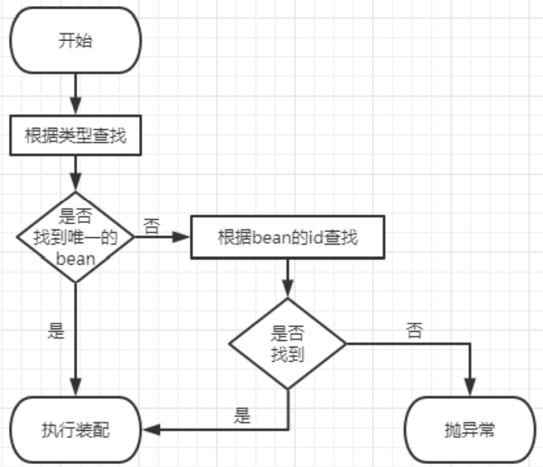

# 基于注解的自动装配

通过@Autowired注解即可完成自动装配

## @Autowired注解标识的位置

- 成员变量上：直接标记@Autowired注解即可完成自动装配，**不需要提供setXxx()方法**
- 成员变量set方法上：直接标记@Autowired注解即可完成自动装配
- 成员变量赋值的有参构造上：直接标记@Autowired注解即可完成自动装配

UserController.java

```java
package com.atguigu.threeLayer.controller;

import com.atguigu.threeLayer.service.UserService;
import org.springframework.beans.factory.annotation.Autowired;
import org.springframework.stereotype.Controller;

@Controller("userController1")
public class UserController {
    @Autowired
    private UserService userService;

    public void saveUser(){
        userService.saveUser();
    }
}
```

AutowireTest.java

```java
    @Test
    public void testAutowireByAnnotation(){
        ApplicationContext ioc = new ClassPathXmlApplicationContext("spring-ioc-annotation.xml");
        UserController userController = ioc.getBean("userController1",UserController.class);
        userController.saveUser();
    }
```

## @Autowired注解原理

默认通过byType的方式，在IOC容器中通过类型匹配某个bean为属性赋值，若有多个类型匹配的bean，会转换为byName的方式实现自动装配的效果



当存在多个类型匹配的bean且这些id都和要赋值的属性名称匹配，此时会抛出异常：NoUniqueBeanDefinitionException，这时可以在`@Autowired`注解下面添加`@Qualifier`注解，通过它的**value属性值指定某个bean的id**(byName方式)

## @Autowired注解注意事项

> @Autowired中有属性required，默认值为true(**`@Autowired(required = true)`**)，表示一定要完成装配，装配不上会报NoSuchBeanDefinitionException错误
>
> 可以将属性required的值设置为false，表示能装就装，装不上就不装(会报空指针异常)，但是实际开发时，基本上所有需要装配组件的地方都是必须装配的，用不上这个属性