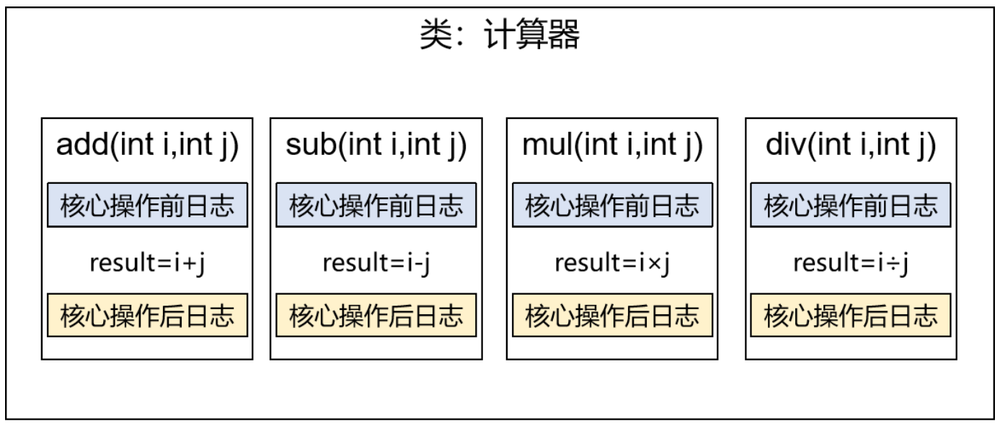
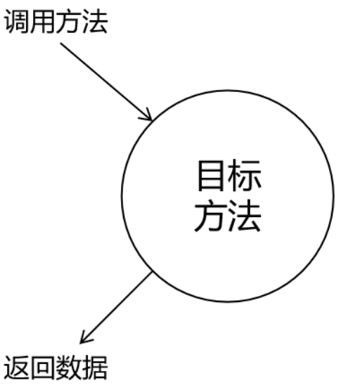
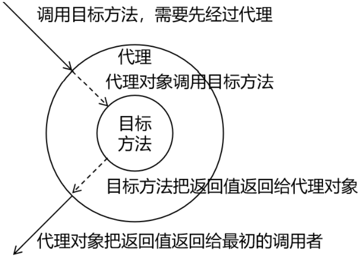
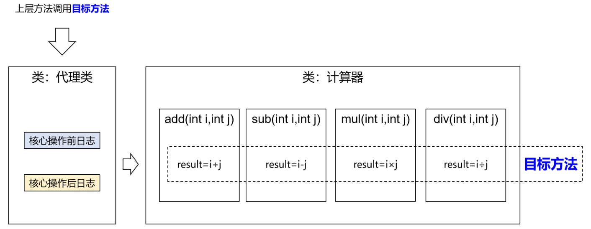

# 代理模式

> 二十三种设计模式中的一种，属于结构型模式。它的作用就是通过提供一个代理类，**在调用目标方法的时候，不再是直接对目标方法进行调用，而是通过代理类间接调用**。让不属于目标方法核心逻辑的代码从目标方法中剥离出来——解耦。调用目标方法时先调用代理对象的方法，减少对目标方法的调用和打扰，同时让附加功能能够集中在一起也有利于统一维护

## 配置场景



Calculator.java

```java
package com.atguigu.spring.proxy;

public interface CalculatorImpl {
    int add(int i,int j);
    int sub(int i,int j);
    int mul(int i,int j);
    int div(int i,int j);
}
```

CalculatorImpl.java

```java
package com.atguigu.spring.proxy;

public class CalculatorImpl implements Calculator {
    @Override
    public int add(int i, int j) {
        System.out.println("[日志] add 方法开始了，参数是：" + i + "," + j);
        int result = i + j;
        System.out.println("方法内部 result = " + result);
        System.out.println("[日志] add 方法结束了，结果是：" + result);
        return result;
    }
    @Override
    public int sub(int i, int j) {
        System.out.println("[日志] sub 方法开始了，参数是：" + i + "," + j);
        int result = i - j;
        System.out.println("方法内部 result = " + result);
        System.out.println("[日志] sub 方法结束了，结果是：" + result);
        return result;
    }
    @Override
    public int mul(int i, int j) {
        System.out.println("[日志] mul 方法开始了，参数是：" + i + "," + j);
        int result = i * j;
        System.out.println("方法内部 result = " + result);
        System.out.println("[日志] mul 方法结束了，结果是：" + result);
        return result;
    }
    @Override
    public int div(int i, int j) {
        System.out.println("[日志] div 方法开始了，参数是：" + i + "," + j);
        int result = i / j;
        System.out.println("方法内部 result = " + result);
        System.out.println("[日志] div 方法结束了，结果是：" + result);
        return result;
    }
}
```

存在的代码缺陷：

- 对核心业务功能有干扰，导致程序员在开发核心业务功能时分散了精力
- 附加功能分散在各个业务功能方法中，不利于统一维护

可以通过解耦——把附加功能从业务功能代码中抽取出来，要抽取的代码在方法内部，靠以前**把子类中的重复代码**抽取到父类的方式没法解决，所以需要引入新的技术——代理模式

使用代理前：



使用代理后：



相关术语：

- 代理：将非核心逻辑剥离出来以后，封装这些非核心逻辑的类、对象、方法
- 目标：被代理“套用”了非核心逻辑代码的类、对象、方法

## 静态代理

"一对一"的方式——当前的代理类只能作为目标类的代理

将`CalculatorImpl.java`中有关日志的代码删除，将日志相关的代码写入代理类当中

CalculatorStaticProxy.java

```java
package com.atguigu.spring.proxy;

public class CalculatorStaticProxy implements Calculator{
    //为了保证代理类和功能类目标实现一致，代理类需要和目标类实现相同的接口

    //将被代理的目标对象声明为成员变量
    private Calculator target;

    public CalculatorStaticProxy(Calculator target) {
        this.target = target;
    }

    @Override
    public int add(int i, int j) {
        //附加功能由代理类中的代理方法来实现
        System.out.println("[日志] add 方法开始了，参数是：" + i + "," + j);
        //通过目标对象来实现核心业务逻辑
        int addResult = target.add(i, j);
        System.out.println("[日志] add 方法结束了，结果是：" + addResult);
        return addResult;
    }
//省略其他方法
}
```

SpringTest.java

```java
    @Test
    public void testProxy(){
        CalculatorStaticProxy csp = new CalculatorStaticProxy(new CalculatorImpl());
        csp.add(2,3);
    }
```

```
[日志] add 方法开始了，参数是：2,3
方法内部 result = 5
[日志] add 方法结束了，结果是：5
```

> 静态代理确实实现了解耦，但是由于代码都写死了，完全不具备任何的灵活性。就拿日志功能来说，**将来其他地方也需要附加日志，那还得再声明更多个静态代理类**，那就产生了大量重复的代码，日志功能还是分散的，没有统一管理
>
> 提出进一步的需求：**将日志功能集中到一个代理类中**，将来有任何日志需求，都通过这一个代理类来实现。这就需要使用动态代理技术了

## 动态代理



动态代理有两种：

- jdk动态代理：要求必须有接口，最终生成的代理类和目标类实现相同的接口在com.sun.proxy包下，类名为$proxy2
- cglib动态代理：最终生成的代理类会继承目标类，并且和目标在相同的包下

FactoryProxy.java

```java
package com.atguigu.spring.proxy;

import java.lang.reflect.InvocationHandler;
import java.lang.reflect.Method;
import java.lang.reflect.Proxy;
import java.util.Arrays;

public class FactoryProxy {

    private Object target;

    public FactoryProxy(Object target) {
        this.target = target;
    }
    public Object getProxy(){
        /**
         * newProxyInstance()：创建一个代理实例
         * 其中有三个参数：
         * 1、classLoader：加载动态生成的代理类的类加载器
         * 2、interfaces：目标对象实现的所有接口的class对象所组成的数组
         * 3、invocationHandler：设置代理对象实现目标对象方法的过程，即代理类中如何重写接口中的抽象方法
         */
        ClassLoader classLoader = target.getClass().getClassLoader();
        Class<?>[] interfaces = target.getClass().getInterfaces();
        InvocationHandler invocationHandler = new InvocationHandler() {
            @Override
            public Object invoke(Object proxy, Method method, Object[] args)
                    throws Throwable {
            /**
             * proxy：代理对象
             * method：代理对象需要实现的方法，即其中需要重写的方法
             * args：method所对应方法的参数
             */
                Object result = null;
                try {
                    System.out.println("[动态代理][日志] "+method.getName()+"，参数："+ Arrays.toString(args));
                            result = method.invoke(target, args);
                    System.out.println("[动态代理][日志] "+method.getName()+"，结果："+ result);
                } catch (Exception e) {
                    e.printStackTrace();
                    System.out.println("[动态代理][日志] "+method.getName()+"，异常："+e.getMessage());
                } finally {
                    System.out.println("[动态代理][日志] "+method.getName()+"，方法执行完毕");
                }
                return result;
            }
        };
        return Proxy.newProxyInstance(classLoader,interfaces,invocationHandler);
    }
 }
```

SpringTest.java

```java
    @Test
    public void testProxy(){
        FactoryProxy factoryProxy = new FactoryProxy(new CalculatorImpl());
        Calculator calculator = (Calculator) factoryProxy.getProxy();
        calculator.add(1,2);
    }
```

```java
[动态代理][日志] add，参数：[1, 2]
方法内部 result = 3
[动态代理][日志] add，结果：3
[动态代理][日志] add，方法执行完毕
```

