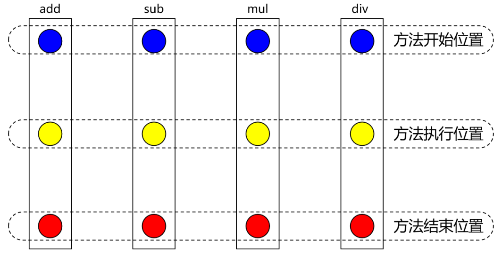
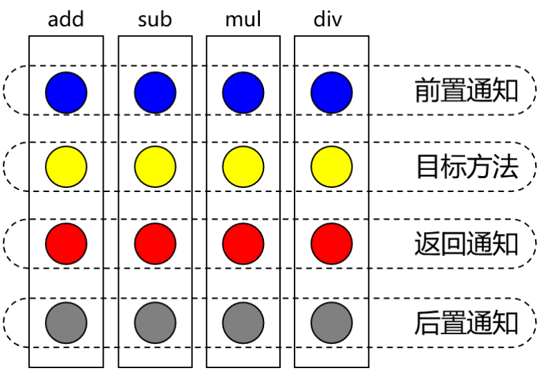
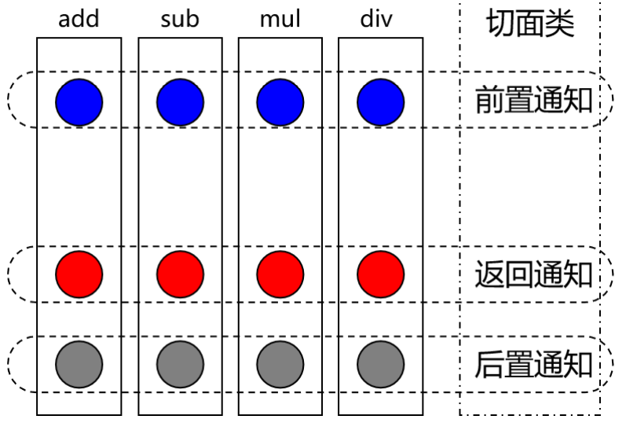
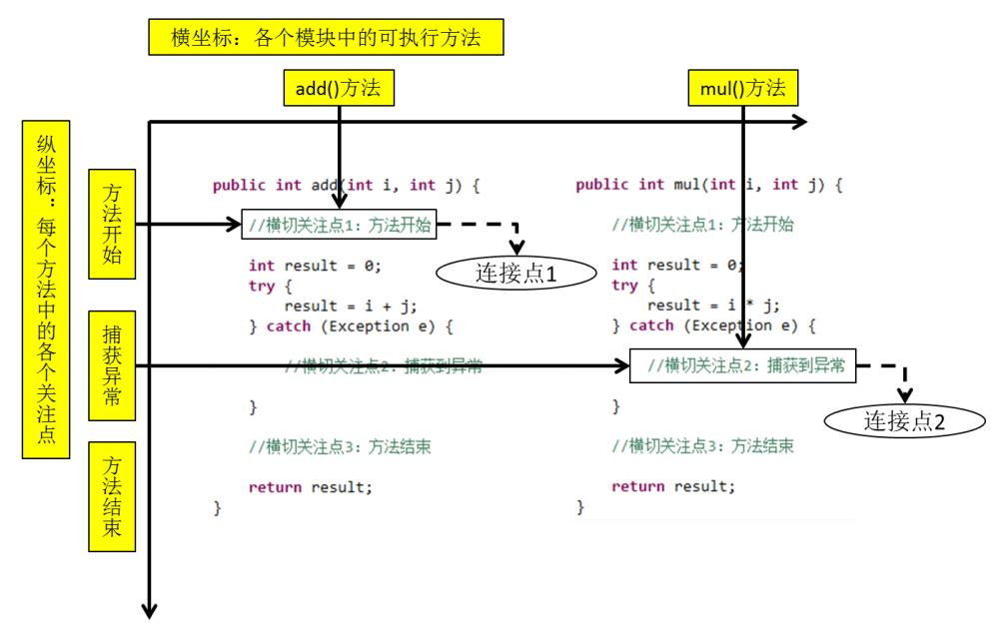

# AOP

AOP（Aspect Oriented Programming）是一种设计思想，是软件设计领域中的面向切面编程，它是面向对象编程的一种补充和完善，它以通过**预编译方式和运行期动态代理方式**实现在**不修改源代码**的情况下给程序**动态统一添加额外功能**的一种技术

> OOP：纵向继承	AOP：横向抽取

## 相关术语

- **横切关注点**：从每个方法中抽取出来的同一类非核心业务。在同一个项目中，我们可以使用多个横切关注点对相关方法进行多个不同方面的增强（这个概念不是语法层面天然存在的，而是根据附加功能的逻辑上的需要：有十个附加功能，就有十个横切关注点）

- **通知**：每一个横切关注点上要做的事情都需要写一个方法来实现，这样的方法就叫通知方法

  - 前置通知：在被代理的目标方法前执行
  - 返回通知：在被代理的目标方法成功结束后执行
  - 异常通知：在被代理的目标方法异常结束后执行
  - 后置通知：在被代理的目标方法最终结束后执行
  - 环绕通知：使用`try...catch...finally`结构围绕整个被代理的目标方法，包括上面四种通知对应的所有位置

  

- **切面**：封装通知方法的类

- **目标**：被代理的目标对象
- **代理**：向目标对象应用通知之后创建的代理对象
- **连接点**：这也是一个纯逻辑概念，不是语法定义的。把方法排成一排，每一个横切位置看成x轴方向，把方法从上到下执行的顺序看成y轴，x轴和y轴的交叉点就是连接点

- **切入点**：定位连接点的方式。每个类的方法中都包含多个连接点，所以连接点是类中客观存在的事物（从逻辑上来说）。 如果把连接点看作数据库中的记录，那么切入点就是查询记录的 SQL 语句。 Spring 的 AOP 技术可以通过切入点定位到特定的连接点。切点通过`org.springframework.aop.Pointcut`接口进行描述，它使用类和方法作为连接点的查询条件

## 作用

> 简化代码：把方法中固定位置的重复的代码**抽取**出来，让被抽取的方法更专注于自己的核心功能，提高内聚性
>
> 代码增强：把特定的功能封装到切面类中，看哪里有需要，就往上套，被**套用**了切面逻辑的方法就被切面给增强了