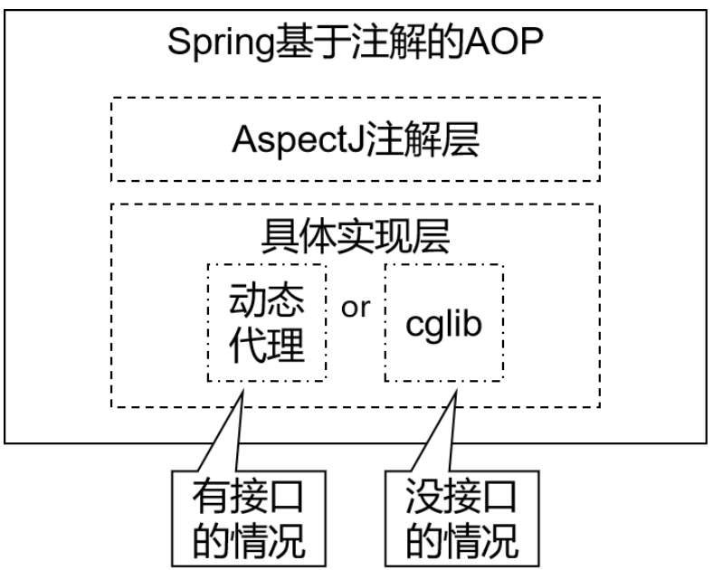
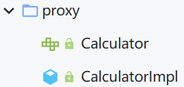
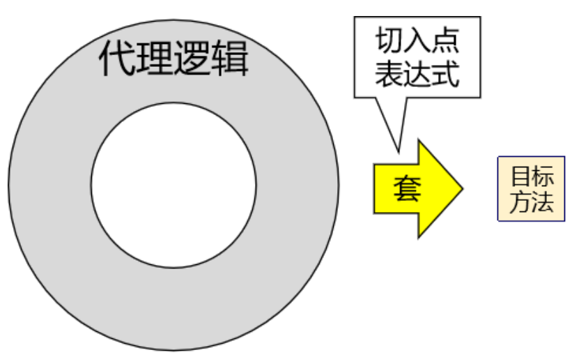
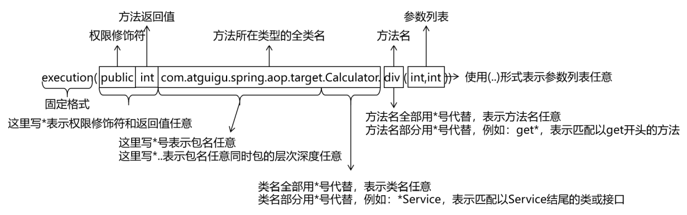
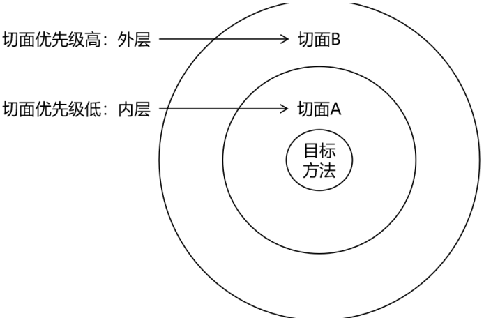
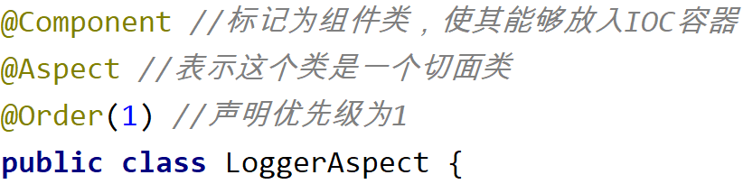

# 基于注解的AOP实现

## 技术说明



- 动态代理（InvocationHandler）：JDK原生的实现方式，需要被代理的目标类必须实现接口。因为这个技术要求**代理对象和目标对象实现同样的接口**（兄弟两个拜把子模式）
- cglib：通过**继承被代理的目标类**（认干爹模式）实现代理，所以不需要目标类实现接口
- AspectJ：本质上是静态代理，将**代理逻辑"织入"被代理的目标类**编译得到的字节码文件，所以最终效果是动态的。weaver就是织入器。Spring只是借用了AspectJ中的注解

## 准备工作

在IOC所需依赖的基础上再加入下面的依赖：

pom.xml

```xml
	<!-- spring-aspects会传递过来aspectjweaver -->
	<dependency>
		<groupId>org.springframework</groupId>
		<artifactId>spring-aspects</artifactId>
		<version>5.3.1</version>
	</dependency>
```

使用之前创建过的类作为被代理的目标资源



在此基础上对`CalculatorImpl.java`添加`@Component`注释

```java
import org.springframework.stereotype.Component;

@Component //标记为组件类，使其能够放入IOC容器
public class CalculatorImpl implements Calculator {
    @Override
    public int add(int i, int j) {
        int result = i + j;
        System.out.println("方法内部 result = " + result);
        return result;
    }
    //省略类似的sub、mul、
}
```

创建切面类`LoggerAspect.java`，并使用注解进行标记

```java
package com.atguigu.spring.proxy;

import org.aspectj.lang.annotation.Aspect;
import org.springframework.stereotype.Component;

@Component //标记为组件类，使其能够放入IOC容器
@Aspect //表示这个类是一个切面类
public class LoggerAspect {
    
}
```

创建`spring-aop-annotation.xml`

```xml
<?xml version="1.0" encoding="UTF-8"?>
<beans xmlns="http://www.springframework.org/schema/beans"
       xmlns:xsi="http://www.w3.org/2001/XMLSchema-instance"
       xmlns:context="http://www.springframework.org/schema/context"
       xsi:schemaLocation="http://www.springframework.org/schema/beans http://www.springframework.org/schema/beans/spring-beans.xsd http://www.springframework.org/schema/context https://www.springframework.org/schema/context/spring-context.xsd">
    <!--
        基于注解的AOP的实现：
        1、将目标对象和切面交给IOC容器管理（注解+扫描）
        2、开启AspectJ的自动代理，为目标对象自动生成代理
        3、将切面类通过注解@Aspect标识
    -->

    <context:component-scan base-package="com.atguigu.spring.proxy"/>
</beans>
```

## 前置通知

spring-aop-annotation.xml

```xml
    <!--开启基于注解的AOP功能-->
    <aop:aspectj-autoproxy/>
```

LoggerAspect.java

```java
package com.atguigu.spring.proxy;

import org.aspectj.lang.annotation.Aspect;
import org.aspectj.lang.annotation.Before;
import org.springframework.stereotype.Component;

@Component //标记为组件类，使其能够放入IOC容器
@Aspect //表示这个类是一个切面类
public class LoggerAspect {

    //标记为前置通知的方法，value值为切入点表达式
    @Before("execution(public int com.atguigu.spring.proxy.CalculatorImpl.add(int,int))") //得具体到某个包和类中的方法
    public void beforeAdviceMethod(){
        System.out.println("LoggerAspect，前置通知");
    }
}
```

SpringTest.java

```java
    @Test
    public void testAOPByAnnotation(){
        ApplicationContext ioc = new ClassPathXmlApplicationContext("spring-aop-annotation.xml");
        //AOP会根据注解和需要获取的类型自动去找对应的实现类(实现类标记为组件类)，所以这里必须得获取接口类，不能是它的实现类(注意：IOC通过annotation获取bean只要满足【对象 instanceof 指定的类型】)
        Calculator calculator = ioc.getBean(Calculator.class);
        calculator.add(1,2);
    }
```

```
LoggerAspect，前置通知
方法内部 result = 3
```

## 各种通知

- 前置通知：使用@Before注解标识，在被代理的目标方法**前**执行
- 返回通知：使用@AfterReturning注解标识，在被代理的目标方法**成功结束**后执行(`try`语句的最后一句)
- 异常通知：使用@AfterThrowing注解标识，在被代理的目标方法**异常结束**后执行(`catch`语句)
- 后置通知：使用@After注解标识，在被代理的目标方法**最终结束**后执行(`finally`语句)
- 环绕通知：使用@Around注解标识，使用`try...catch...finally`结构围绕整个被代理的目标方法，包括上面四种通知对应的所有位置

> 各种通知的执行顺序：
>
> - Spring版本5.3.x以前：
>   - 前置通知
>   - 目标操作
>   - 后置通知
>   - 返回通知或异常通知
> - Spring版本5.3.x以后：（现在在使用的）
>   - 前置通知
>   - 目标操作
>   - 返回通知或异常通知
>   - 后置通知

## 切入点表达式语法



语法细节：



- 用`"*"`号代替“权限修饰符”和“返回值”部分表示“权限修饰符”和“返回值”不限
- 在包名的部分，一个`“*”`号只能代表包的层次结构中的一层，表示这一层是任意的
  - 例如：`*.Hello`匹配`com.Hello`，不匹配`com.atguigu.Hello`
- 在包名的部分，使用`"*.."`表示包名任意、包的层次深度任意
- 在类名的部分，类名部分整体用`"*"`号代替，表示类名任意
- 在类名的部分，可以使用`"*"`号代替类名的一部分
  - 例如：`*Service`匹配所有名称**以Service结尾的类或接口**
- 在方法名部分，可以使用`"*"`号表示方法名任意
- 在方法名部分，可以使用`"*"`号代替方法名的一部分
  - 例如：`*Operation`匹配所有方法名**以Operation结尾的方法**
- 在方法参数列表部分，使用`"(..)"`表示参数列表任意
- 在方法参数列表部分，使用`"(int,..)"`表示参数列表以一个int类型的参数开头
- 在方法参数列表部分，基本数据类型和对应的包装类型是不一样的
  - 切入点表达式中使用 int 和实际方法中 Integer 是不匹配的
- 在方法返回值部分，如果想要明确指定一个返回值类型，那么必须同时写明权限修饰符
  - 例如：`execution(public int ..Service.*(.., int)) `正确
  - 例如：`execution(* int ..Service.*(.., int))` 错误

**公共切入点表达式**：

- 通过在方法上添加`@Pointcut`注解将其value值标记为公共表达式，在使用时调用方法名调用即可

## 获取通知相关的信息

### 获取连接点信息

在方法的形参列表添加`JoinPoint joinPoint`

LoggerAspect.java

```java
import org.aspectj.lang.JoinPoint;
import org.aspectj.lang.Signature;
import org.aspectj.lang.annotation.Aspect;
import org.aspectj.lang.annotation.Before;
import org.aspectj.lang.annotation.Pointcut;
import org.springframework.stereotype.Component;
import java.util.Arrays;

@Component //标记为组件类，使其能够放入IOC容器
@Aspect //表示这个类是一个切面类
public class LoggerAspect {
    //重用切入点表达式
    @Pointcut("execution(* com.atguigu.spring.proxy.CalculatorImpl.*(..))")
    public void testPointCut(){}

    //标记为前置通知的方法，value值为切入点表达式
    @Before("testPointCut()") //得具体到某个包和类中的方法
    public void beforeAdviceMethod(JoinPoint joinPoint){
        //获取连接点所对应方法的签名信息
        Signature signature = joinPoint.getSignature();
        //获取方法名字
        String methodName = signature.getName();
        //获取目标方法到的实参信息
        String args = Arrays.toString(joinPoint.getArgs());
        //打印输出
        System.out.println("Logger-->前置通知，方法名："+methodName+"，参数："+args);
    }
}
```

SpringTest.java

```java
    @Test
    public void testAOPByAnnotation(){
        ApplicationContext ioc = new ClassPathXmlApplicationContext("spring-aop-annotation.xml");
        //AOP底层使用的是动态代理，所以要获取代理对象，而获取代理对象需要通过接口来获取(实现类标记为组件类)，所以这里不能获取它的实现类
        Calculator calculator = ioc.getBean(Calculator.class);
        calculator.add(1,2);
    }
```

```
Logger-->前置通知，方法名：add，参数：[1, 2]
方法内部 result = 3
```

### 获取目标方法的返回值

`@AfterReturning`中的属性`returning`，用来将通知方法的某个**形参**指定为接收目标方法的**返回值的参数**

LoggerAspect.java

```java
    @AfterReturning(value = "testPointCut()",returning = "result")
    public void afterReturningMethod(JoinPoint joinPoint, Object result){
        String methodName = joinPoint.getSignature().getName();
        System.out.println("Logger-->返回通知，方法名："+methodName+"，结果："+result);
    }
```

```
Logger-->前置通知，方法名：add，参数：[1, 2]
方法内部 result = 3
Logger-->返回通知，方法名：add，结果：3
```

### 获取目标方法的异常

`@AfterThrowing`中的属性`throwing`，用来将通知方法的某个**形参**指定为接收目标方法的**返回值的参数**

在`SpringTest.java`中使用`div(1,0)`触发异常

LoggerAspect.java

```java
	@AfterThrowing(value = "testPointCut()",throwing = "ex")
	public void afterThrowingMethod(JoinPoint joinPoint, Throwable ex){
	String methodName = joinPoint.getSignature().getName();
	System.out.println("Logger-->异常通知，方法名："+methodName+"，异常："+ex);
	}
```

```
Logger-->前置通知，方法名：div，参数：[1, 0]
Logger-->异常通知，方法名：div，异常：java.lang.ArithmeticException: / by zero
```

## 环绕通知

LoggerAspect.java

```java
    @Around("testPointCut()")
    public Object aroundMethod(ProceedingJoinPoint proceedingJoinPoint){//ProceedingJoinPoint为可执行的连接点对象
        String methodName = proceedingJoinPoint.getSignature().getName();
        String args = Arrays.toString(proceedingJoinPoint.getArgs());
        Object result = null;
        try{
            System.out.println("环绕通知-->前置通知，方法名："+methodName+"，参数："+args);
            //目标方法的执行，如果调用的目标方法存在返回值，则一定要将返回值返回给外界调用者
            result = proceedingJoinPoint.proceed();
            System.out.println("环绕通知-->返回通知，方法名："+methodName+"，结果："+result);
        } catch (Throwable throwable) {
            throwable.printStackTrace();
            System.out.println("环绕通知-->异常通知，方法名："+methodName+"，异常："+throwable);
        } finally {
            System.out.println("环绕通知-->后置通知，方法名："+methodName);
        }
        return result;
    }
```

SpringTest.java

```java
    @Test
    public void testAOPByAnnotation(){
        ApplicationContext ioc = new ClassPathXmlApplicationContext("spring-aop-annotation.xml");
        //AOP底层使用的是动态代理，所以要获取代理对象，而获取代理对象需要通过接口来获取(实现类标记为组件类)，所以这里不能获取它的实现类
        Calculator calculator = ioc.getBean(Calculator.class);
        calculator.div(1,1);
    }
```

```
方法内部 result = 1
环绕通知-->返回通知，方法名：div，结果：1
环绕通知-->后置通知，方法名：div
```

单例通知和环绕通知一起执行(**此时顺序不可预估**)：

```
环绕通知-->前置通知，方法名：div，参数：[1, 1]
Logger-->前置通知，方法名：div，参数：[1, 1]
方法内部 result = 1
Logger-->返回通知，方法名：div，结果：1
环绕通知-->返回通知，方法名：div，结果：1
环绕通知-->后置通知，方法名：div
```

## 切面的优先级



相同目标方法上同时存在多个切面时，切面的优先级控制切面的内外嵌套顺序

- 优先级高的切面：外面
- 优先级低的切面：里面

使用@Order注解可以控制切面的优先级：（默认为Integer最大值）

- @Order(**较小的数**)：**优先级高**
- @Order(较大的数)：优先级低

- 
