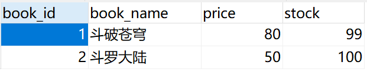

# 基于注解的声明式事务

## 准备工作

将之间的使用的数据库表`t_user`更改为`t_user1`，使用的依赖和对应的`jdbc.properties`不变即可

### 准备数据库

BookSql.sql

```sql
	CREATE TABLE `t_book` (
		`book_id` int(11) NOT NULL AUTO_INCREMENT COMMENT '主键',
		`book_name` varchar(20) DEFAULT NULL COMMENT '图书名称',
		`price` int(11) DEFAULT NULL COMMENT '价格',
		`stock` int(10) unsigned DEFAULT NULL COMMENT '库存（无符号）', -- unsigned代表插入的数值必须大于或者等于0
		PRIMARY KEY (`book_id`)
) ENGINE=InnoDB AUTO_INCREMENT=3 DEFAULT CHARSET=utf8;
	insert into `t_book`(`book_id`,`book_name`,`price`,`stock`) values (1,'斗破苍穹',80,100),(2,'斗罗大陆',50,100);

	CREATE TABLE `t_user` ( 
        `user_id` int(11) NOT NULL AUTO_INCREMENT COMMENT '主键',
		`username` varchar(20) DEFAULT NULL COMMENT '用户名',
		`balance` int(10) unsigned DEFAULT NULL COMMENT '余额（无符号）',
		PRIMARY KEY (`user_id`)
) ENGINE=InnoDB AUTO_INCREMENT=2 DEFAULT CHARSET=utf8;
	insert into `t_user`(`user_id`,`username`,`balance`) values (1,'admin',50);
```

### 创建组件

BookController.java

```java
package com.atguigu.tx.controller;

import com.atguigu.tx.service.BookService;
import org.springframework.beans.factory.annotation.Autowired;
import org.springframework.stereotype.Controller;

@Controller
public class BookController {

    @Autowired
    private BookService bookService;

    public void buyBook(Integer bookId, Integer userId){
        bookService.buyBook(bookId, userId);
    }
}
```

BookDao.java

```java
package com.atguigu.tx.dao;

public interface BookDao {
    /*根据图书的id查询图书的价格*/
    Integer getPriceByBookId(Integer bookId);
    /*更新图书的库存*/
    void updateStock(Integer bookId);
    /*更新用户的余额*/
    void updateBalance(Integer userId, Integer price);
}
```

BookDaoImpl.java

```java
package com.atguigu.tx.dao.Impl;

import com.atguigu.tx.dao.BookDao;
import org.springframework.beans.factory.annotation.Autowired;
import org.springframework.jdbc.core.JdbcTemplate;
import org.springframework.stereotype.Repository;

@Repository
public class BookDaoImpl implements BookDao {

    @Autowired
    private JdbcTemplate jdbcTemplate;

    @Override
    public Integer getPriceByBookId(Integer bookId) {
        String sql = "select price from t_book where book_id = ?";
        return jdbcTemplate.queryForObject(sql, Integer.class, bookId);
    }

    @Override
    public void updateStock(Integer bookId) {
        String sql = "update t_book set stock = stock - 1 where book_id = ?";
        jdbcTemplate.update(sql, bookId);
    }

    @Override
    public void updateBalance(Integer userId, Integer price) {
        String sql = "update t_user set balance = balance - ? where user_id = ?";
        jdbcTemplate.update(sql, price, userId);
    }
}
```

BookService.java

```java
package com.atguigu.tx.service;

public interface BookService {

    void buyBook(Integer bookId, Integer userId);
}

```

BookServiceImpl.java

```java
package com.atguigu.tx.service.impl;

import com.atguigu.tx.dao.BookDao;
import com.atguigu.tx.service.BookService;
import org.springframework.beans.factory.annotation.Autowired;
import org.springframework.stereotype.Service;

@Service
public class BookServiceImpl implements BookService {

    @Autowired
    private BookDao bookDao;

    @Override
    public void buyBook(Integer bookId, Integer userId) {
        //这里每个sql语句的事务都是独立的

        //查询图书的价格
        Integer price = bookDao.getPriceByBookId(bookId);
        //更新图书的库存
        bookDao.updateStock(bookId);
        //更新用户的余额
        bookDao.updateBalance(userId, price);
    }
}
```

所有组件文件：


### Spring配置文件

spring-tx-annotation.xml

```xml
<?xml version="1.0" encoding="UTF-8"?>
<beans xmlns="http://www.springframework.org/schema/beans"
       xmlns:xsi="http://www.w3.org/2001/XMLSchema-instance"
       xmlns:context="http://www.springframework.org/schema/context"
       xsi:schemaLocation="http://www.springframework.org/schema/beans http://www.springframework.org/schema/beans/spring-beans.xsd http://www.springframework.org/schema/context https://www.springframework.org/schema/context/spring-context.xsd">

    <!--扫描组件-->
    <context:component-scan base-package="com.atguigu.tx"/>

    <!-- 导入外部属性文件 -->
    <context:property-placeholder location="classpath:jdbc.properties" />

    <!-- 配置数据源 -->
    <bean id="druidDataSource" class="com.alibaba.druid.pool.DruidDataSource">
        <property name="url" value="${jdbc.url}"/>
        <property name="driverClassName" value="${jdbc.driver}"/>
        <property name="username" value="${jdbc.username}"/>
        <property name="password" value="${jdbc.password}"/>
    </bean>

    <!-- 配置 JdbcTemplate -->
    <bean id="jdbcTemplate" class="org.springframework.jdbc.core.JdbcTemplate">
        <!-- 装配数据源 -->
        <property name="dataSource" ref="druidDataSource"/>
    </bean>
</beans>
```

## 测试无事务情况

> 用户购买图书，先查询图书的价格，再更新图书的库存和用户的余额
>
> 假设用户id为1的用户，购买id为1的图书，用户余额为50，而图书价格为80，购买图书之后，用户的余额为-30，数据库中余额字段设置了无符号，因此无法将-30插入到余额字段，此时执行sql语句会抛出SQLException

TxByAnnotationTest.java

```java
package com.atguigu.TxByAnnotation.test;

import com.atguigu.tx.controller.BookController;
import org.junit.Test;
import org.junit.runner.RunWith;
import org.springframework.beans.factory.annotation.Autowired;
import org.springframework.test.context.ContextConfiguration;
import org.springframework.test.context.junit4.SpringJUnit4ClassRunner;

//设置当前测试类的运行环境-->在spring的测试环境中运行，就可以通过注入的方式直接获取IOC容器中的bean
@RunWith(SpringJUnit4ClassRunner.class)
//设置Spring测试环境的配置文件
@ContextConfiguration("classpath:spring-tx-annotation.xml")
public class TxByAnnotationTest {

    @Autowired
    private BookController bookController;

    @Test
    public void testBuyBook(){
        //定义用户的余额为unsigned，但是用户余额只有50，余额不足以购买80的书
        //由于一个sql语句独占一个事务，"库存(stock)"减少了，但是"付款"失败了
        bookController.buyBook(1,1);
    }
}
```



> 因为没有添加事务，图书的库存更新了，但是用户的余额没有更新。显然这样的结果是错误的，购买图书是一个完整的功能，更新库存和更新余额要么都成功要么都失败

## 实现事务功能

spring-tx-annotation.xml

```xml
    <!--配置事务管理器-->
    <bean id="transactionManager" class="org.springframework.jdbc.datasource.DataSourceTransactionManager">
        <property name="dataSource" ref="druidDataSource"/>
    </bean>

    <!--开启事务的注解驱动-->
    <!--通过transaction-manager将事务管理器和事务的注解驱动联系起来，默认为transactionManager(前面使用的默认id，所以该属性可以省略)-->
    <tx:annotation-driven transaction-manager="transactionManager"/>
```


### `@Transactional`注解标识的位置

- `@Transactional`标识在方法上，则**只会影响该方法**
- `@Transactional`标识的类上，则会影响类中**所有的方法**

> 因为service层表示业务逻辑层，一个方法表示一个完成的功能，因此处理事务一般**在service层**处理在BookServiceImpl的buybook()添加注解@Transactional

BookServiceImpl.java

```java
    @Override
    @Transactional //注解的这个方法中的所有sql语句是一个事务
    public void buyBook(Integer bookId, Integer userId) {
        //查询图书的价格
        Integer price = bookDao.getPriceByBookId(bookId);
        //更新图书的库存
        bookDao.updateStock(bookId);
        //更新用户的余额
        bookDao.updateBalance(userId, price);
    }
```

此时再运行就不会出现只扣了"库存(stock)"，没有"付款"的情况
