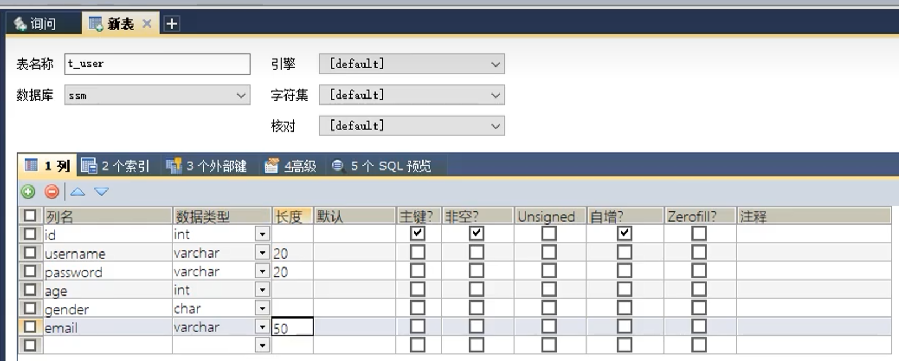

# MyBatis搭建

## 开发环境

示例环境：


### MySql注意事项


### Maven

**Maven前置配置参考JavaWeb博客**

- 将`packaging`打包方式更改为jar


- 在`pom.xml`文件中`<dependencies>`标签下引入依赖

```xml
<dependencies><!--放<project>下面即可-->
	<!-- Mybatis核心 -->
	<dependency>
		<groupId>org.mybatis</groupId>
		<artifactId>mybatis</artifactId>
		<version>3.5.7</version>
	</dependency>
    
	<!-- junit测试(这个在前面Maven配置中就存在，可以删除重复的) -->
	<dependency>
		<groupId>junit</groupId>
        <artifactId>junit</artifactId>
		<version>4.12</version>
		<scope>test</scope>
	</dependency>
    
	<!-- MySQL驱动 -->
	<dependency>
		<groupId>mysql</groupId>
		<artifactId>mysql-connector-java</artifactId>
		<version>8.0.16</version>
	</dependency>
</dependencies>
```

- 在main目录下创建一个test目录**（一般会自动识别为测试根目录Test Resources Root）**，在test目录下创建一个java，标记为**测试目录（Test Sources Root）**


## 创建一个表和对应的JavaBean类

创建数据库和表如图所示：



在Java目录下创建对应的JavaBean(一定要有无参构造方法)


## 创建MyBatis核心配置文件

在MyBatis官方帮助文档下面有核心配置代码


在resources目录下创建`mybatis-config.xml`文档，放入这段代码，并依据自己的数据库来配置好

```xml
<!--xml文件声明-->
<?xml version="1.0" encoding="UTF-8" ?>
<!--当前的约束和ddt文件(规定当前配置文件中能使用的标签)-->
<!DOCTYPE configuration
        PUBLIC "-//mybatis.org//DTD Config 3.0//EN"
        "https://mybatis.org/dtd/mybatis-3-config.dtd">

<configuration>
    <!--配置连接数据库的环境-->
    <environments default="development">

        <environment id="development">
            <!--事务管理器-->
            <transactionManager type="JDBC"/>
            <!--数据源-->
            <dataSource type="POOLED">
                <!--按照自己的数据库配置-->
                <!--<property name="driver" value="${driver}"/>
                <property name="url" value="${url}"/>
                <property name="username" value="${username}"/>
                <property name="password" value="${password}"/>-->
                <property name="driver" value="com.mysql.cj.jdbc.Driver"/>
                <property name="url" value="jdbc:mysql://localhost:3306/ssm?serverTimezone=UTC"/>
                <property name="username" value="root"/>
                <property name="password" value="yuxingxuan"/>
            </dataSource>
        </environment>

    </environments>

    <!--引入mybatis的映射文件(sql语句)-->
    <mappers>
<!--        <mapper resource="org/mybatis/example/BlogMapper.xml"/>-->

        <!--这里配置文件和映射文件都是处于resources目录下，直接写目录和文件名就可以访问到映射文件-->
        <mapper resource="mappers/UserMapper.xml"/>
    </mappers>

</configuration>
```

## 创建mapper接口

**MyBatis中的mapper接口相当于以前的dao**。但是区别在于，**mapper仅仅是接口**，我们不需要提供实现类。

在存放JavaBean的同级目录下创建`mapper`目录，在此目录下创建接口`UserMapper.java`

```java
package com.atguigu.mabatis.mapper;

public interface UserMapper {
    //添加用户信息
    int insertUser();
}
```

## 创建MyBatis的映射文件

相关概念：ORM（Object Relationship Mapping）对象关系映射。

- 对象：Java的实体类对象
- 关系：关系型数据库
- 映射：二者之间的对应关系

| Java概念 | 数据库概念 |
| :------: | :--------: |
|    类    |     表     |
|   属性   |  字段/列   |
|   对象   |  记录/行   |

> 1、映射文件的命名规则：
>
> 表所对应的实体类的类名+Mapper.xml
>
> 例如：表t_user，映射的实体类为User，所对应的映射文件为UserMapper.xml
>
> 因此一个映射文件对应一个实体类，对应一张表的操作
>
> MyBatis映射文件用于编写SQL，访问以及操作表中的数据
>
> MyBatis映射文件存放的位置是src/main/resources/mappers目录下 
>
> 2、 MyBatis中可以面向接口操作数据，要保证两个一致：
>
> > mapper接口的全类名和映射文件的命名空间（namespace）保持一致
>
> > mapper接口中方法的方法名和映射文件中编写SQL的标签的id属性保持一致

在resources目录下创建一个专门存放映射文件的目录`mappers`，然后在此目录下创建与上面接口文件一致的`UserMapper.xml`

然后依旧是在官方文档下面找到配置代码，复制到映射文件中


```xml
<?xml version="1.0" encoding="UTF-8" ?>
<!DOCTYPE mapper
 PUBLIC "-//mybatis.org//DTD Mapper 3.0//EN"
 "https://mybatis.org/dtd/mybatis-3-mapper.dtd">

<!--第一个一致：mapper接口的全类名要与映射文件的namespace保持一致-->
<mapper namespace="com.atguigu.mybatis.mapper.UserMapper">
<!--<mapper namespace="org.mybatis.example.BlogMapper">-->
<!--    <select id="selectBlog" resultType="Blog">-->
<!--        select * from Blog where id = #{id}-->
<!--    </select>-->

    <!--第二个一致：mapper接口中的方法名需要和sql语句的id保持一致-->
    <insert id="insertUser">
        insert into t_user values (null,'admin','123456',23,'男','1312@qq/com')
    </insert>
    <!--最后一定要将映射文件映入到核心配置文件中-->
</mapper>
```

**映射文件写好后需要再去配置核心配置文件**

## 通过junit测试功能测试

在test目录下的java目录下创建包`com.atguigu.mybatis.test`，创建MyBatisTest测试类：

```java
package com.atguigu.mybatis.test;

import com.atguigu.mybatis.mapper.UserMapper;
import org.apache.ibatis.io.Resources;
import org.apache.ibatis.session.SqlSession;
import org.apache.ibatis.session.SqlSessionFactory;
import org.apache.ibatis.session.SqlSessionFactoryBuilder;
import org.junit.Test;

import java.io.IOException;
import java.io.InputStream;

public class MyBatisTest {
    @Test
    public void testInsert() throws IOException {
        ///读取MyBatis的核心配置文件的输入流
        InputStream is = Resources.getResourceAsStream("mybatis-config.xml");
        //获取SqlSessionFactoryBuilder对象
        SqlSessionFactoryBuilder sqlSessionFactoryBuilder = new SqlSessionFactoryBuilder();
        //根据核心配置文件的输入流创建工厂类SqlSessionFactory,来生产sql的会话对象SqlSession对象
        SqlSessionFactory sqlSessionFactory = sqlSessionFactoryBuilder.build(is);
        //生产SqlSession对象-->是mybatis提供的操作数据库的对象
        SqlSession sqlSession = sqlSessionFactory.openSession();//这里参数填"true"就可以实现自动提交事务
        
        //可以将上面的代码封装成一个类，实现通过输入MyBatis的核心配置文件来获取SqlSession对象
        
        //获取UserMapper的代理模式创建接口的实现类对象
        UserMapper userMapper = sqlSession.getMapper(UserMapper.class);//创建UserMapper接口的实现类
        //调用UserMapper接口中的方法，就可以根据UserMapper的全类名匹配元素文件
        //通过调用的方法名匹配映射文件中的SQL标签，并执行标签中的SQL语句
        int result = userMapper.insertUser();
        //提交事务(JDBC是默认自动提交的，但是前面通过sqlSessionFactory获取sqlSession对象时没有设置自动提交，所以这里得手动提交)
        sqlSession.commit();

        System.out.println("结果："+result);	//运行结果：结果：1

        //关闭会话
        sqlSession.close();
        
        //SqlSession其实提供一些方法可以去直接实现sql语句，但是现在采用的是面向接口编程去实现sql语句
        //在早期的mybatis中是通过SqlSession本身提供的方法去实现sql语句的，只需要通过sql语句的唯一标识找到sql语句并执行即可。标识是——namespeace.sqlID
        //这样的话就不需要创建接口的实现类对象userMapper然后再去调用接口的方法insertUser()了
        //int result = sqlSession.insert("com.atguigu.mybatis.mapper.UserMapper.insertUser");
    }
}
```

> SqlSession：代表Java程序和数据库之间的会话。（HttpSession是Java程序和浏览器之间的会话）
>
> SqlSessionFactory：是“生产”SqlSession的“工厂”。
>
> 工厂模式：如果创建某一个对象，使用的过程基本固定，那么我们就可以把创建这个对象的 相关代码封装到一个“工厂类”中，以后都使用这个工厂类来“生产”我们需要的对象。

## 运行结果


## 加入log4j日志功能

在`pom.xml`文件中加入依赖：


加入log4j的配置文件：

> log4j的配置文件名为log4j.xml，存放的位置是src/main/resources目录下(不能是子目录下)

```xml
<?xml version="1.0" encoding="UTF-8" ?>
<!DOCTYPE log4j:configuration SYSTEM "log4j.dtd">

<log4j:configuration xmlns:log4j="http://jakarta.apache.org/log4j/">

	<appender name="STDOUT" class="org.apache.log4j.ConsoleAppender">
		<param name="Encoding" value="UTF-8" />
		<layout class="org.apache.log4j.PatternLayout">
			<param name="ConversionPattern" value="%-5p %d{MM-dd HH:mm:ss,SSS}%m (%F:%L) \n" />
		</layout>
	</appender>
    
	<logger name="java.sql">
		<level value="debug" />
	</logger>
	<logger name="org.apache.ibatis">
		<level value="info" />
	</logger>
    
	<root>
		<level value="debug" />
		<appender-ref ref="STDOUT" />
	</root>
</log4j:configuration>
```

配置完成之后在执行sql语句时会在控制台会输出一些相关的日志信息：


> **日志的级别**：
>
> FATAL(致命)>ERROR(错误)>WARN(警告)>INFO(信息)>DEBUG(调试)
>
> 从左到右打印的内容越来越详细

## 所有文件一览

