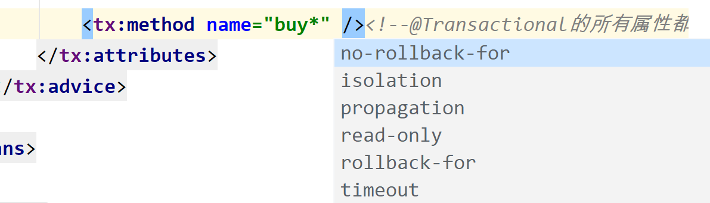

# 基于XML的声明式事务

> 主要是使用XML去代替注解，来实现起到代替注解的作用，实际使用频率很低

将`BookServiceImpl.java`中的`@Transactional`注解删除，确保用户余额充足

spring-tx-xml.xml

```xml
<?xml version="1.0" encoding="UTF-8"?>
<beans xmlns="http://www.springframework.org/schema/beans"
       xmlns:xsi="http://www.w3.org/2001/XMLSchema-instance"
       xmlns:context="http://www.springframework.org/schema/context" xmlns:tx="http://www.springframework.org/schema/tx"
       xmlns:aop="http://www.springframework.org/schema/aop"
       xsi:schemaLocation="http://www.springframework.org/schema/beans http://www.springframework.org/schema/beans/spring-beans.xsd http://www.springframework.org/schema/context https://www.springframework.org/schema/context/spring-context.xsd http://www.springframework.org/schema/tx http://www.springframework.org/schema/tx/spring-tx.xsd http://www.springframework.org/schema/aop https://www.springframework.org/schema/aop/spring-aop.xsd">

    <!--扫描组件-->
    <context:component-scan base-package="com.atguigu.tx"/>

    <!-- 导入外部属性文件 -->
    <context:property-placeholder location="classpath:jdbc.properties" />

    <!-- 配置数据源 -->
    <bean id="druidDataSource" class="com.alibaba.druid.pool.DruidDataSource">
        <property name="url" value="${jdbc.url}"/>
        <property name="driverClassName" value="${jdbc.driver}"/>
        <property name="username" value="${jdbc.username}"/>
        <property name="password" value="${jdbc.password}"/>
    </bean>

    <!-- 配置 JdbcTemplate -->
    <bean id="jdbcTemplate" class="org.springframework.jdbc.core.JdbcTemplate">
        <!-- 装配数据源 -->
        <property name="dataSource" ref="druidDataSource"/>
    </bean>

    <!--配置事务管理器-->
    <bean id="transactionManager" class="org.springframework.jdbc.datasource.DataSourceTransactionManager">
        <property name="dataSource" ref="druidDataSource"/>
    </bean>

    <!--通过xml配置-->
    <aop:config>
        <!-- 配置事务通知和切入点表达式(把事务管理器当中的环绕通知通过切入点表达式作用到连接点) -->
        <aop:advisor advice-ref="tx" pointcut="execution(* com.atguigu.tx.service.impl.*.*(..))"/>
    </aop:config>

    <!--
        tx:advice标签：配置事务通知
            id属性：给事务通知标签设置唯一标识，便于引用
            transaction-manager属性：关联事务管理器
        在这里关联事务管理器之后就可以配置事务管理器的事务通知了
    -->
    <tx:advice id="tx" transaction-manager="transactionManager">
        <tx:attributes>
            <!--
                tx:method标签：配置具体的事务方法(相当于@Transactional注解在某个方法上)
                    name属性：指定方法名，可以使用星号代表多个字符
            -->
            <tx:method name="buy*" no-rollback-for="java.lang.ArithmeticException"/><!--@Transactional的所有属性都可以在这里设置-->
        </tx:attributes>
    </tx:advice>

</beans>
```

@Transactional的所有属性都可以在这里设置



- read-only属性：设置只读属性
- rollback-for属性：设置回滚的异常**(ClassName)**
- no-rollback-for属性：设置不回滚的异常**(ClassName)**
- isolation属性：设置事务的隔离级别
- timeout属性：设置事务的超时属性
- propagation属性：设置事务的传播行为

TxByXMLTest.java

```java
package com.atguigu.TxByXML.test;

import com.atguigu.tx.controller.BookController;
import org.junit.Test;
import org.junit.runner.RunWith;
import org.springframework.beans.factory.annotation.Autowired;
import org.springframework.test.context.ContextConfiguration;
import org.springframework.test.context.junit4.SpringJUnit4ClassRunner;

//设置当前测试类的运行环境-->在spring的测试环境中运行，就可以通过注入的方式直接获取IOC容器中的bean
@RunWith(SpringJUnit4ClassRunner.class)
//设置Spring测试环境的配置文件
@ContextConfiguration("classpath:spring-tx-xml.xml")
public class TxByXMLTest {

    @Autowired
    private BookController bookController;

    @Test
    public void testBuyBook(){
        //定义用户的余额为unsigned，但是用户余额只有50，余额不足以购买80的书
        //由于一个sql语句独占一个事务，"库存(stock)"减少了，但是"付款"失败了
        bookController.buyBook(2,1);
    }
}
```

> 运行之后遇到数学运算异常不会回滚

注意：基于xml实现的声明式事务，必须引入aspectJ的依赖

```xml
    <!-- spring-aspects会传递过来aspectjweaver -->
    <dependency>
		<groupId>org.springframework</groupId>
		<artifactId>spring-aspects</artifactId>
		<version>5.3.1</version>
	</dependency>
```

