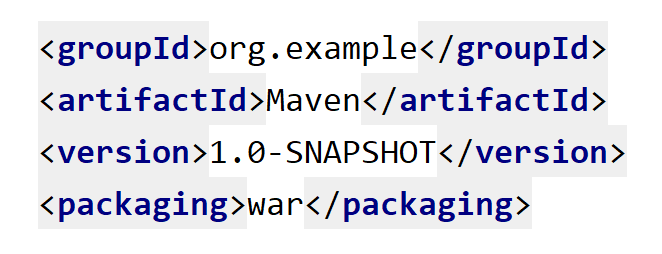
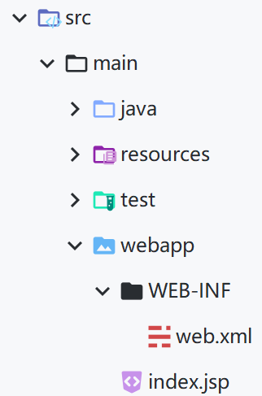
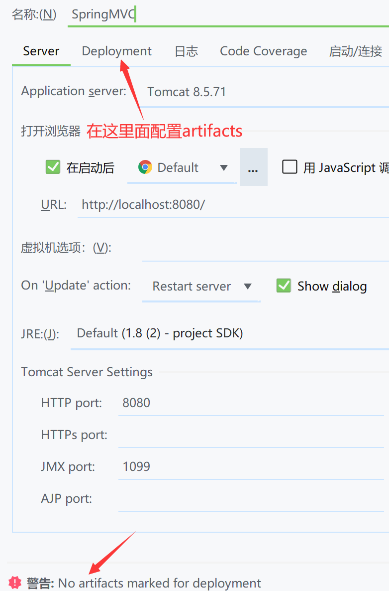
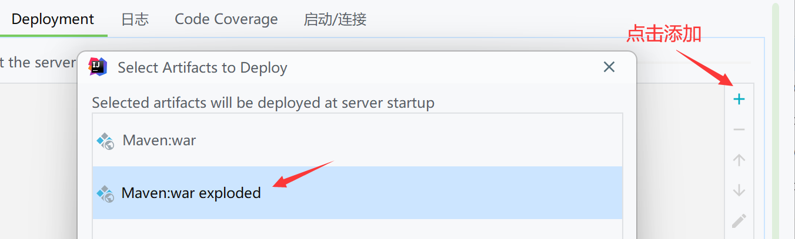
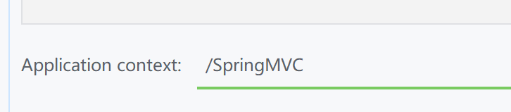

# SpringMVC配置

**在`pom.xml`里面将之前的"jar"打包方式更改为"war"**



因为之前在JavaWeb创建Maven时就是按web工程来创建的（详细可参考`5.IDEA里面使用Maven.md`博客），所以不需要再创建`webapp`目录了，完整目录如下：



## 引入依赖

pom.xml

```xml
	<!-- SpringMVC -->
	<dependency>
		<groupId>org.springframework</groupId>
		<artifactId>spring-webmvc</artifactId>
		<version>5.3.1</version>
	</dependency>

    <!-- 日志 -->
    <dependency>
        <groupId>ch.qos.logback</groupId>
        <artifactId>logback-classic</artifactId>
        <version>1.2.3</version>
    </dependency>

    <!-- ServletAPI -->
    <dependency>
        <groupId>javax.servlet</groupId>
        <artifactId>javax.servlet-api</artifactId>
        <version>3.1.0</version>
        <scope>provided</scope>
    </dependency>

    <!-- Spring5和Thymeleaf整合包 -->
    <dependency>
        <groupId>org.thymeleaf</groupId>
        <artifactId>thymeleaf-spring5</artifactId>
        <version>3.0.12.RELEASE</version>
    </dependency>
```

## 配置web.xml

### 默认配置方式

**注册SpringMVC的前端控制器DispatcherServlet**

web.xml

```xml
<?xml version="1.0" encoding="UTF-8"?>
<web-app xmlns="http://xmlns.jcp.org/xml/ns/javaee"
         xmlns:xsi="http://www.w3.org/2001/XMLSchema-instance"
         xsi:schemaLocation="http://xmlns.jcp.org/xml/ns/javaee http://xmlns.jcp.org/xml/ns/javaee/web-app_4_0.xsd"
         version="4.0">
	<!-- 配置SpringMVC的前端控制器，对浏览器发送的请求统一进行处理 -->
	<servlet>
		<servlet-name>SpringMVC</servlet-name>
        <servlet-class>org.springframework.web.servlet.DispatcherServlet</servlet-class>
	</servlet>

	<servlet-mapping>
        <servlet-name>SpringMVC</servlet-name>
        <!--
            设置springMVC的核心控制器所能处理的请求的请求路径
            /：所匹配的请求可以是/login或.html或.js或.css方式的请求路径，但是不能匹配.jsp请求路径的请求
            /*：匹配任意请求，包括.jsp
        -->
        <url-pattern>/</url-pattern>
	</servlet-mapping>
</web-app>
```

### 扩展配置方式

与默认方式相比多了一个`<init-param>`标签，可通过此标签**设置SpringMVC配置文件的位置和名称**，通过`<load-on-startup>`标签**设置SpringMVC前端控制器DispatcherServlet的初始化时间**

web.xml

```xml
<?xml version="1.0" encoding="UTF-8"?>
<web-app xmlns="http://xmlns.jcp.org/xml/ns/javaee"
         xmlns:xsi="http://www.w3.org/2001/XMLSchema-instance"
         xsi:schemaLocation="http://xmlns.jcp.org/xml/ns/javaee http://xmlns.jcp.org/xml/ns/javaee/web-app_4_0.xsd"
         version="4.0">
      <!-- 配置SpringMVC的前端控制器，对浏览器发送的请求统一进行处理 -->
    <servlet>
		<servlet-name>SpringMVC</servlet-name>
		<servlet-class>org.springframework.web.servlet.DispatcherServlet</servlet-class>

		<!-- 通过初始化参数指定SpringMVC配置文件的位置和名称 -->
		<init-param>
			<!-- contextConfigLocation为固定值 -->
            <param-name>contextConfigLocation</param-name>
            <!-- 使用classpath:表示从类路径查找配置文件，否则普通路径为webapp目录下(与默认路径WEB-INF目录下存在区别)
            这里代表java目录下或者resources目录下的SpringMVC.xml文件为配置文件 -->
            <param-value>classpath:SpringMVC.xml</param-value>
		</init-param>
          <!--
              作为框架的核心组件，在启动过程中有大量的初始化操作要做
              而这些操作放在第一次请求时才执行会严重影响访问速度
              因此需要通过此标签将启动控制DispatcherServlet的初始化时间提前到服务器启动时
          -->
		<load-on-startup>1</load-on-startup>

    </servlet>

	<servlet-mapping>
            <servlet-name>SpringMVC</servlet-name>
        <!--
            设置springMVC的核心控制器所能处理的请求的请求路径
            /所匹配的请求可以是/login或.html或.js或.css方式的请求路径
            但是/不能匹配.jsp请求路径的请求
        -->
        <url-pattern>/</url-pattern>
	</servlet-mapping>
</web-app>
```

## 创建请求控制器

由于前端控制器对浏览器发送的请求进行了统一的处理，但是具体的请求有不同的处理过程，因此需要
创建处理具体请求的类，即请求控制器

请求控制器中每一个处理请求的方法称为控制器方法

> 因为SpringMVC的控制器由一个POJO（普通的Java类）担任，因此需要**通过@Controller注解**将其标识
> 为一个控制层组件，**交给Spring的IOC容器管理**，此时SpringMVC才能够识别控制器的存在

HelloController.java

```java
package com.atguigu.SpringMVC.controller;

import org.springframework.stereotype.Controller;
import org.springframework.web.bind.annotation.RequestMapping;

@Controller
public class HelloController {
    //@RequestMapping注解：处理请求和控制器方法之间的映射关系
    //localhost:8080/springMVC/
    @RequestMapping("/")
    public String index(){
        //将逻辑视图返回
        return "index";
    }
}
```

在`WEB-INF/templates`目录下创建`index.html`

```html
<!DOCTYPE html>
<html lang="en">
<head>
    <meta charset="UTF-8">
    <title>Title</title>
</head>
<body>
    <h1>欢迎来到主页</h1>
</body>
</html>
```

## 创建SpringMVC配置文件

- 在默认配置方式下：SpringMVC的配置文件**默认读取`<WEB-INF>`目录下**的配置文件，默认名称为`web.xml中的"<servlet-name>"＋"-servlet.xml"`
- 在扩展配置方式下：为`<init-param>`标签下的`<param-value>`标签的属性值

例如，以下配置所对应SpringMVC的配置文件位于WEB-INF下，文件名为`SpringMVCservlet.xml`

SpringMVC-servlet.xml

```xml
<?xml version="1.0" encoding="UTF-8"?>
<beans xmlns="http://www.springframework.org/schema/beans"
       xmlns:xsi="http://www.w3.org/2001/XMLSchema-instance"
       xmlns:context="http://www.springframework.org/schema/context"
       xsi:schemaLocation="http://www.springframework.org/schema/beans http://www.springframework.org/schema/beans/spring-beans.xsd http://www.springframework.org/schema/context https://www.springframework.org/schema/context/spring-context.xsd">

    <!--扫描控制层组件-->
    <context:component-scan base-package="com.atguigu.SpringMVC.controller"/>

    <!-- 配置Thymeleaf视图解析器——通过SpringMVC提供的方式进行视图渲染，并实现页面跳转 -->
    <bean id="viewResolver" class="org.thymeleaf.spring5.view.ThymeleafViewResolver">
        <!--优先级为1-->
        <property name="order" value="1"/>
        <property name="characterEncoding" value="UTF-8"/>
        <!--模板引擎-->
        <property name="templateEngine">
            <bean class="org.thymeleaf.spring5.SpringTemplateEngine">
                <!--模板解析器-->
                <property name="templateResolver">
                    <bean class="org.thymeleaf.spring5.templateresolver.SpringResourceTemplateResolver">
                        <!-- 假设需要跳转：/WEB-INF/templates/index.html -->
                        <!-- 逻辑视图只需要为index，Thymeleaf会自动填充前缀和后缀来组合成完整的物理视图 -->
                        <!-- 视图前缀 -->
                        <property name="prefix" value="/WEB-INF/templates/"/>
                        <!-- 视图后缀 -->
                        <property name="suffix" value=".html"/>
                        <property name="templateMode" value="HTML5"/>
                        <property name="characterEncoding" value="UTF-8" />
                    </bean>
                </property>
            </bean>
        </property>
    </bean>
</beans>
```

## 配置Tomcat



配置artifacts：



修改虚拟映射地址：



## 测试

启动Tomcat，地址栏输入`http://localhost:8080/SpringMVC/hello`

Tomcat成功接收请求并访问到受保护目录下`WEB-INF`的资源`templates/index.html`


> 值得注意的是，Tomcat启动时会默认去访问`webapp/index.jsp`，只有当访问不到时才会以"请求"的方式访问页面，也就是对应`@RequestMapping("/")`请求

## 路径问题

在`<html>`中添加**thymeleaf命名空间**`xmlns:th="http://www.thymeleaf.org"`（可以在IDEA模板设置中添加这个语句，方便日后的使用）

index.html

```html
<!DOCTYPE html>
<html lang="en" xmlns:th="http://www.thymeleaf.org">
<head>
    <meta charset="UTF-8">
    <title>Title</title>
</head>
<body>
    <h1>欢迎来到主页</h1>
    <a th:href="@{/hello}">相对路径(通过Thymeleaf渲染)</a>
    <a href="/hello">绝对路径(缺少上下文路径)</a>
</body>
</html>
```

success.html

```html
<!DOCTYPE html>
<html lang="en" xmlns:th="http://www.thymeleaf.org">
<head>
    <meta charset="UTF-8">
    <title>Title</title>
</head>
<body>
    <h1>你好，世界！</h1>
</body>
</html>
```

HelloController.java

```java
    @RequestMapping("/hello")
    public String sayHello(){
        return "success";
    }
```

> 测试结果：只有相对路径的方式才能访问得到`success.html`页面

## 总结

浏览器发送请求

1. 若请求地址符合前端控制器的`<url-pattern>`，该请求就会被前端控制器DispatcherServlet处理
2. 前端控制器会读取SpringMVC的核心配置文件，通过扫描组件找到控制器，将**请求地址**和控制器中**@RequestMapping注解的value属性值**进行匹配
3. 若匹配成功，该注解所标识的控制器方法就是处理请求的方法。处理请求的方法需要**返回一个字符串类型**的视图名称，该视图名称会被视图解析器解析，加上前缀和后缀组成视图的路径，**通过Thymeleaf对视图进行渲染**，最终**转发(地址栏没有变)**到视图所对应页面
