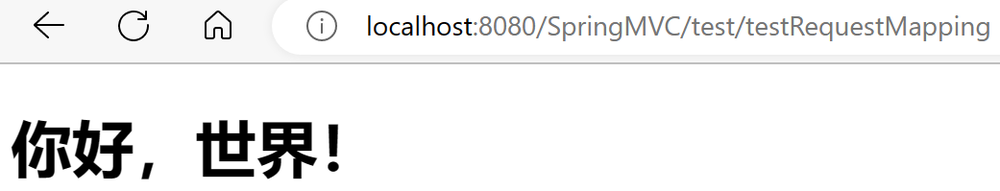
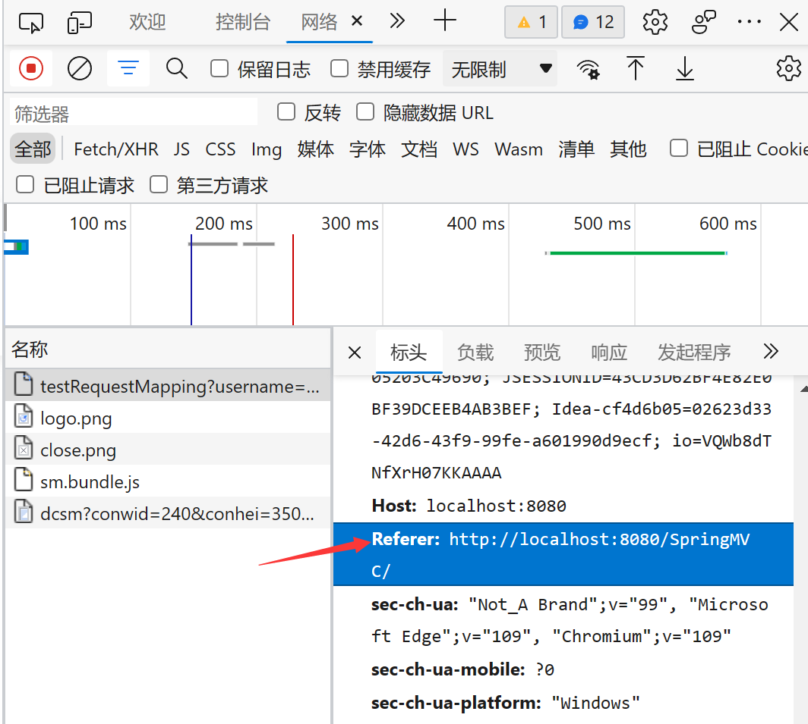
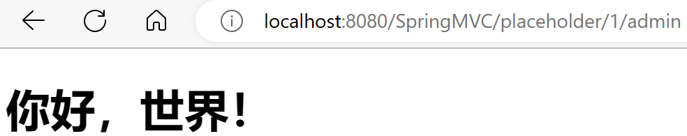

# @RequestMapping注解

> 从注解名称代表@RequestMapping注解的作用就是**将请求和处理请求的控制器方法**关联起来，建立映射关系。SpringMVC 接收到指定的请求，就会来找到在**映射关系**中**对应的控制器方法**来处理这个请求

## 注解位置

- @RequestMapping标识一个类：设置映射请求的请求路径的**初始信息**
- @RequestMapping标识一个方法：设置映射请求路径的**具体信息**

SuccessController.java

```java
package com.atguigu.SpringMVC.controller;

import org.springframework.stereotype.Controller;
import org.springframework.web.bind.annotation.RequestMapping;

@Controller
@RequestMapping("/test")
public class SuccessController {
    @RequestMapping("/testRequestMapping")
    //此时请求映射所映射的请求的请求路径为：/test/testRequestMapping
    public String testRequestMapping(){
        return "success";
    }
}
```



## value属性

- @RequestMapping注解的value属性通过请求的请求地址匹配请求映射
- @RequestMapping注解的value属性是一个**字符串类型**的**数组**，表示该请求映射能够匹配多个请求地址所对应的请求
- @RequestMapping注解的value属性必须设置，**至少通过请求地址匹配请求映射**

SuccessController.java

```java
package com.atguigu.SpringMVC.controller;

import org.springframework.stereotype.Controller;
import org.springframework.web.bind.annotation.RequestMapping;

@Controller
public class SuccessController {
    @RequestMapping(value = {"/testRequestMapping","/testRequestMapping1"})
    //此时value属性中的两个请求路径都可以访问到
    public String testRequestMapping(){
        return "success";
    }
}
```

## method属性

- @RequestMapping注解的method属性通过请求的请求方式（get或post）匹配请求映射
- @RequestMapping注解的method属性是一个**RequestMethod类型**的**数组**，表示该请求映射**能够匹配多种请求方式**的请求

> 若当前请求的请求地址**满足请求映射的value属性**，但是**请求方式不满足method属性**，则浏览器报错 405 - Request method 'POST' not supported

存在如下几种请求方式：`GET、POST、HEAD、OPTIONS、PUT、PATCH、DELETE、TRACE`

> 注：
>
> 1、对于处理指定请求方式的控制器方法，SpringMVC中提供了`@RequestMapping`的**派生注解**
>
> - 处理get请求的映射-->@GetMapping
> - 处理post请求的映射-->@PostMapping
> - 处理put请求的映射-->@PutMapping
> - 处理delete请求的映射-->@DeleteMapping
>
> 2、常用的请求方式有get，post，put，delete
>
> - 但是目前浏览器只支持get和post，若在form表单提交时，为method设置了其他请求方式的字符串（put或delete），则按照**表单默认的请求方式get处理**
> - 若要发送put和delete请求，则需要**通过spring提供的过滤器`HiddenHttpMethodFilter`**

## params属性（了解）

- @RequestMapping注解的params属性通过请求的请求参数匹配请求映射
- @RequestMapping注解的params属性是一个**字符串类型**的**数组**，可以通过四种表达式设置请求参数和请求映射的匹配关系

四种表达式：

- "param"：要求请求映射所匹配的请求必须携带param请求参数
- "!param"：要求请求映射所匹配的请求必须不能携带param请求参数
- "param=value"：要求请求映射所匹配的请求必须携带param请求参数且值为value
- "param!=value"：要求请求映射所匹配的请求可以不携带param，如果携带则值不能为value

SuccessController.java

```java
    @RequestMapping(value = {"/testRequestMapping","/testRequestMapping1"},
            method = {RequestMethod.GET},
            params = {"username"})
    //params属性需要在满足前面两个条件的前提下再满足params
    public String testRequestMapping(){
        return "success";
    }
```

index.html

```html
    <a th:href="@{/testRequestMapping(username=admin)}">带参数请求</a>
```

> 带参数"username=admin"才能请求成功，如果满足前面条件，但是不满足param属性，此时页面回报错 400：Parameter conditions "username" not met for actual request parameters:
>

## headers属性（了解）

- @RequestMapping注解的headers属性通过请求的请求头信息匹配请求映射
- @RequestMapping注解的headers属性是一个字符串类型的数组，可以通过四种表达式设置请求头信
  息和请求映射的匹配关系

四种表达式：

- "header"：要求请求映射所匹配的请求必须携带header请求头信息
- "!header"：要求请求映射所匹配的请求必须不能携带header请求头信息
- "header=value"：要求请求映射所匹配的请求必须携带header请求头信息且header=value
- "header!=value"：要求请求映射所匹配的请求必须携带header请求头信息且header!=value

SuccessController.java

```java
    @RequestMapping(value = {"/testRequestMapping","/testRequestMapping1"},
            method = {RequestMethod.GET},
            params = {"username"},
            headers = {"referer"})
    //需要有"来源"，不能是直接新标签输入地址访问
    public String testRequestMapping(){
        return "success";
    }
```



> 若当前请求满足@RequestMapping注解的value和method属性，但是不满足headers属性，此时页面显示404错误，即资源未找到

## ant风格的路径

- `?`：表示任意的单个(不能为空)字符
  - `@RequestMapping(value = {"/testRequestMapping?"})`：结尾带任意**单个字符**都可以访问到

- `*`：表示任意的0个或多个字符
  - `@RequestMapping(value = {"/testRequestMapping*"})`：结尾带任意**多个字符**都可以访问到

- `**`：表示任意层数的任意目录，在使用`**`时，只能使用`/**/xxx`的方式
  - `@RequestMapping(value = {"/**/testRequestMapping"})`：前面可以有**任意层级的任意目录**都可以访问到

注意：涉及到**地址栏信息**的特殊字符是不可以作为任意字符来访问的(`"?"、"/"`)

## 路径中的占位符

- 原始方式：`/deleteUser?id=1`
- RESTful方式：`/user/delete/1`

SpringMVC路径中的占位符常用于**RESTful风格**中，当请求路径中将某些数据通过路径的方式传输到服务器中，就可以在相应的`@RequestMapping`注解的value属性中通过**占位符{xxx}**表示传输的数据，在通过`@PathVariable`注解，将**占位符所表示的数据**赋值给**控制器方法的形参**

index.html

```html
    <a th:href="@{/placeholder/1/admin}">测试路径中的占位符</a>
```

SuccessController.java

```java
    @RequestMapping(value = "/placeholder/{id}/{username}")
    //声明为值
    public String testPlaceholder(
            //通过@PathVariable以键值对方式获取到值并赋值给变量
            @PathVariable("id") Integer id,
            @PathVariable("username") String username){
        System.out.println("id为："+id+"，username为："+username);
        return "success";
    }
```



> 控制台成功获取到值并输出