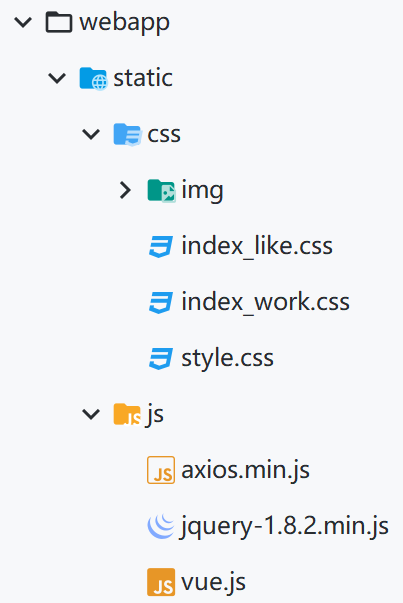
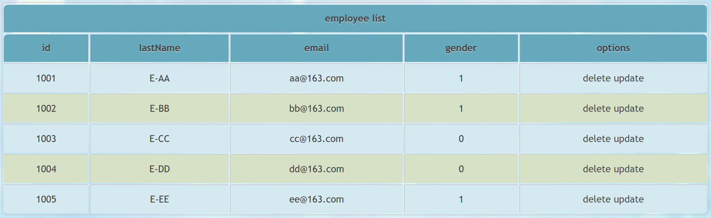
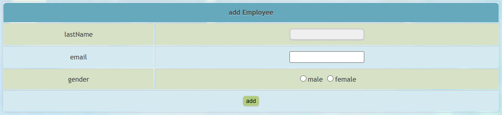
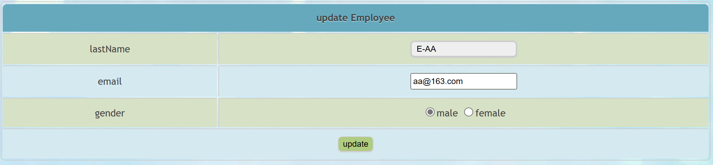

# RESTful案例

## 准备环境

Employee.java

```java
public class Employee {
    private Integer id;
    private String lastName;
    private String email;
    //1 male, 0 female
    private Integer gender;
}
//省略get、set和构造方法
```

EmployeeDao.java

```java
package com.atguigu.SpringMVC.dao;

import com.atguigu.SpringMVC.pojo.Employee;
import org.springframework.stereotype.Repository;
import java.util.Collection;
import java.util.HashMap;
import java.util.Map;

@Repository
public class EmployeeDao {
    //模拟数据库的数据
    private static Map<Integer, Employee> employees = null;
    static{
        employees = new HashMap<Integer, Employee>();
        employees.put(1001, new Employee(1001, "E-AA", "aa@163.com", 1));
        employees.put(1002, new Employee(1002, "E-BB", "bb@163.com", 1));
        employees.put(1003, new Employee(1003, "E-CC", "cc@163.com", 0));
        employees.put(1004, new Employee(1004, "E-DD", "dd@163.com", 0));
        employees.put(1005, new Employee(1005, "E-EE", "ee@163.com", 1));
    }
    private static Integer initId = 1006;
    public void save(Employee employee){
        if(employee.getId() == null){
            employee.setId(initId++);
        }
        employees.put(employee.getId(), employee);
    }
    public Collection<Employee> getAll(){
        return employees.values();
    }
    public Employee get(Integer id){
        return employees.get(id);
    }
    public void delete(Integer id){
        employees.remove(id);
    }
}
```

> 将之前仅扫描"控制层组件"，更改为扫描`SpringMVC`目录

## 功能清单

|        功能        |   URL地址    | 请求方式 |
| :----------------: | :----------: | :------: |
|      访问首页      |      /       |   GET    |
|    查询全部数据    |  /employee   |   GET    |
| 跳转到添加数据页面 | /addEmployee |   GET    |
|      执行保存      |  /employee   |   POST   |
| 跳转到更新数据页面 | /employee/2  |   GET    |
|      执行更新      |  /employee   |   PUT    |
|      执行删除      | /employee/2  |  DELETE  |

## 查询所有员工信息

EmployeeController.java

```java
package com.atguigu.SpringMVC.controller;

import com.atguigu.SpringMVC.dao.EmployeeDao;
import com.atguigu.SpringMVC.pojo.Employee;
import org.springframework.beans.factory.annotation.Autowired;
import org.springframework.stereotype.Controller;
import org.springframework.ui.Model;
import org.springframework.web.bind.annotation.GetMapping;

import java.util.Collection;

@Controller
public class EmployeeController {
    @Autowired
    private EmployeeDao employeeDao;

    @GetMapping("/employee")
    public String getAllEmployee(Model model){
        //获取所有员工信息
        Collection<Employee> allEmployee = employeeDao.getAll();
        //将所有的员工信息在请求域中共享
        model.addAttribute("allEmployees",allEmployee);
        //跳转到列表页面
        return "employee_list";
    }
}
```

employee_list.html

```html
<!DOCTYPE html>
<html lang="en" xmlns:th="http://www.thymeleaf.org">
<head>
    <meta charset="UTF-8">
    <title>Title</title>
    <link rel="stylesheet" th:href="@{/static/css/index_work.css}">
</head>
<body>
    <table>
        <tr>
            <!--合并五列内容为一列显示-->
            <th colspan="5">employee list</th>
        </tr>
        <tr>
            <th>id</th>
            <th>lastName</th>
            <th>email</th>
            <th>gender</th>
            <th>options</th>
        </tr>
        <!--employee为在循环列中的别名，通过${allEmployees}将request域中的数据取出来，两者通过":"分隔-->
        <tr th:each="employee:${allEmployees}">
            <td th:text="${employee.id}"></td>
            <td th:text="${employee.lastName}"></td>
            <td th:text="${employee.email}"></td>
            <td th:text="${employee.gender}"></td>
            <td>
                <a>delete</a>
                <a>update</a>
            </td>
        </tr>
    </table>
</body>
</html>
```

### 静态资源

将`static`目录放入`webapp`目录下



> 当Tomcat的默认配置文件与`WEB-INF`目录下的`web.xml`存在配置冲突时，以当前工程的`web.xml`为准
>
> 静态资源的处理应该**由默认的servlet进行处理**，但是这里与配置的`DispatcherServlet`代替处理了请求，所以在配置默认的servlet的同时也要**开启mvc注解驱动**

### 运行效果



## 添加员工信息

添加流程：前端发送添加请求(**GET**)(`th:href="@{/addEmployee}"`)-->后端转发到添加页面(`view-name="employee_add"`)-->用户在表单填写信息后发送请求(**POST**)-->后端执行信息保存(`employeeDao.save(employee)`)后回到显示页(`return "redirect:/employee"`)

> 因为SpringMVC是通过**请求处理再转发页面**，而不是像JavaWeb一样通过**地址直接转发到页面**

### 发送添加请求

index.html

```html
	<a th:href="@{/addEmployee}">添加员工信息</a>
```

> 为了方便，在`employee_list.html`中修改语句为：
>
> ```html
> 	<th>options(<a th:href="@{/addEmployee}">add</a>)</th>
> ```

### 转发到添加页面

> 对于发送添加请求只需要执行转发到添加页面即可，所以配置视图控制器即可

SpringMVC.xml

```xml
    <mvc:view-controller path="/addEmployee" view-name="employee_add" />
```

employee_add.html

```html
<form th:action="@{/employee}" method="post">
    <table>
        <tr>
            <th colspan="2">add Employee</th>
        </tr>
        <tr>
            <td>lastName</td>
            <td><input type="text" name="lastName"></td>
        </tr>
        <tr>
            <td>email</td>
            <td><input type="email" name="email"></td>
        </tr>
        <tr>
            <td>gender</td>
            <td>
                <input type="radio" name="gender" value="1">male
                <input type="radio" name="gender" value="0">female
            </td>
        </tr>
        <tr>
            <td colspan="2">
                <input type="submit" value="add">
            </td>
        </tr>
    </table>
</form>
```

### 保存信息后回到显示页

EmployeeController.java

```java
    //添加员工信息
    @PostMapping("/employee")
	//自动匹配提交的表单信息将匹配成功的变量调用set方法保存到employee中
    public String addEmployee(Employee employee){
        employeeDao.save(employee);
        //重定向到显示员工信息的方法中-->这里不能使用转发，因为转发则依旧会将POST请求转发出去，导致又调用了自身，进入了死循环，所以需要通过重定向的方式发送GET请求进入"显示页"方法中
        return "redirect:/employee";
    }
```

> 注意：EmployeeDao中的数据是用`static`关键字定义的，在没有保存数据的前提下重定向后数据没有丢失

### 运行效果



## 修改员工信息

更新流程：前端发送修改请求(**GET**)(`th:href="@{'/employee/'+${employee.id}}`)-->后端获取员工信息后(`employeeDao.get(id)`)在前端更新页面中显示(`return "employee_update"`)--->用户在表单更新信息后发送请求(**PUT**)-->后端执行数据保存(`employeeDao.save(employee)`)后回到显示页(`return "redirect:/employee"`)

### 发送修改请求

在`employee_list.html`修改语句为：

```html
    <!--如果采用"/employee/${employee.id}"的写法后面的$运算符也会被当成地址-->
    <a th:href="@{'/employee/'+${employee.id}}">update</a>
```

### 定义请求方法体

EmployeeController.java

```java
    //转发更新请求定位到更新页面
    @GetMapping("/employee/{id}")
    public String toUpdateEmployee(@PathVariable("id") Integer id,Model model){
        //根据id查询员工信息
        Employee employee = employeeDao.get(id);
        //将员工信息共享到请求域中
        model.addAttribute("employee",employee);
        //跳转到employee_update.html
        return "employee_update";
    }

    //更新员工信息
    @PutMapping("/employee")
    public String updateEmployee(Employee employee){
        //修改员工信息
        employeeDao.save(employee);
        //重定向到显示员工信息的方法中
        return "redirect:/employee";
    }
```

### 定义更新页面内容

employee_update.html

```html
<form th:action="@{/employee}" method="post">
    <input name="_method" value="put" type="hidden">
    <input name="id" th:value="${employee.id}" type="hidden">
    <table>
        <tr>
            <th colspan="2">update Employee</th>
        </tr>
        <tr>
            <td>lastName</td>
            <td><input type="text" name="lastName" th:value="${employee.lastName}"></td>
        </tr>
        <tr>
            <td>email</td>
            <td><input type="email" name="email" th:value="${employee.email}"></td>
        </tr>
        <tr>
            <td>gender</td>
            <td>
                <!--如果"gender"的value值和${employee.gender}的值相同就会被选中-->
                <input type="radio" name="gender" value="1" th:field="${employee.gender}">male
                <input type="radio" name="gender" value="0" th:field="${employee.gender}">female
            </td>
        </tr>
        <tr>
            <td colspan="2">
                <input type="submit" value="update">
            </td>
        </tr>
    </table>
</form>
```

### 运行结果



## 删除员工信息

删除流程：前端通过VUE实现点击超链接时提交绑定的表单-->前端通过表单发送删除请求(**DELETE**)-->后端执行数据删除后回到显示页(`return "redirect:/employee"`)

### 发送删除请求

将`employee_list.html`为：

```html
<!DOCTYPE html>
<html lang="en" xmlns:th="http://www.thymeleaf.org">
<head>
    <meta charset="UTF-8">
    <title>Title</title>
    <link rel="stylesheet" th:href="@{/static/css/index_work.css}">
</head>
<body>
<div id="app">
    <table>
        <tr>
            <!--合并五列内容为一列显示-->
            <th colspan="5">employee list</th>
        </tr>
        <tr>
            <th>id</th>
            <th>lastName</th>
            <th>email</th>
            <th>gender</th>
            <th>options(<a th:href="@{/addEmployee}">add</a>)</th>
        </tr>
        <!--employee为在循环列中的别名，通过${allEmployees}将request域中的数据取出来，两者通过":"分隔-->
        <tr th:each="employee:${allEmployees}">
            <td th:text="${employee.id}"></td>
            <td th:text="${employee.lastName}"></td>
            <td th:text="${employee.email}"></td>
            <td th:text="${employee.gender}"></td>
            <td>
                <!--通过绑定表单事件实现点击时调用表单进行提交实现发送delete请求(VUE实现)-->
                <a @click="deleteEmployee()" th:href="@{'/employee/'+${employee.id}}">delete</a>
                <!--如果采用"/employee/${employee.id}"的写法后面的$运算符也会被当成地址-->
                <a th:href="@{'/employee/'+${employee.id}}">update</a>
            </td>
        </tr>
    </table>
</div>

    <form method="post">
        <input type="hidden" name="_method" value="delete">
    </form>

    <!--引入VUE-->
    <script type="text/javascript" th:src="@{/static/js/vue.js}"></script>
    <!--实现点击超链接时提交对应的表单-->
    <script type="text/javascript">
        var vue = new Vue({
            el:"#app",
            methods:{
                deleteEmployee(){
                    //获取form表单
                    var form = document.getElementsByTagName("form")[0];
                    //将超链接的href属性给form表单的action属性
                    form.action = event.target.href; //event.target表示当前触发事件的标签
                    //将表单提交
                    form.submit();
                    //阻止超链接的默认跳转行为
                    event.preventDefault();
                }
            }
        });
    </script>
</body>
</html>
```

### 定义方法体行为

EmployeeController.java

```java
    //删除员工信息
    @DeleteMapping("/employee/{id}")
    public String deleteEmployee(@PathVariable("id") Integer id){
        //根据id删除员工信息
        employeeDao.delete(id);
        //重定向到显示员工信息的方法中
        return "redirect:/employee";
    }
```

> 运行结果：成功实现删除操作
