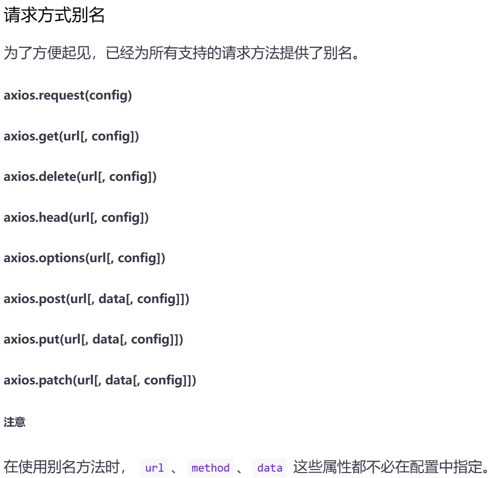

# SpringMVC处理Ajax请求

## axious数据

```js
axios({
    url:"/SpringMVC/testAjax", //请求路径(无法使用thymeleaf，需要写全)
    method:"post", //请求方式
    //param请求参数-->以"?name&value&name=value"的方式发送请求参数(可以直接写url里面)，无论提交方式为get还是post，通过request.getParameter()获取
    params:{name:value}, //请求参数
    //data请求参数-->以json格式发送的请求参数，请求参数会被保存到请求报文的请求体传输到服务器(get方式没有请求体)，通过处理json的架包处理
    data:{name:value} //请求参数
}).then(response=>{ //then返回请求成功的结果
    console.log(response.data); //服务器响应回来的数据封装为response
});
```

简略写法：



## 测试Ajax

TestAjaxController.java

```java
    //定位到TestAjax页面
    @RequestMapping("/Ajax")
    public String Ajax(){
        return "TestAjax";
    }

    @RequestMapping("/testAjax")
    //方法不能返回"String"类型，Ajax是在页面不刷新的情况下实现对页面的更新
    public void testAjax(Integer id, HttpServletResponse response) throws IOException {
        System.out.println("id为"+id); //这没有使用RESTful方式，可以自动获取到地址栏中的参数
        response.getWriter().write("Hello,Ajax");
    }
```

TestAjax.html

```html
<!DOCTYPE html>
<html lang="en" xmlns:th="http://www.thymeleaf.org">
<head>
    <meta charset="UTF-8">
    <title>TestAjax</title>
</head>
<body>
    <div id="app">
        <input type="button" value="测试Ajax请求" @click="testAjax()">
    </div>

    <script type="text/javascript" th:src="@{/static/js/vue.js}"></script>
    <script type="text/javascript" th:src="@{/static/js/axios.min.js}"></script>
    <script type="text/javascript">
        var vue = new Vue({
            el:"#app",
            methods:{
                testAjax(){
                    axios.post("/SpringMVC/testAjax?id=2",{
                        id:2,name:"123"
                    }).then(response=>{ //then返回请求成功的结果(catch为处理错误情况)
                        console.log(response.data); //服务器响应回来的数据封装为response
                    });
                }
            }
        });
    </script>
</body>
</html>
```

> 点击即可发送Ajax请求，并会将返回的数据("Hello,Ajax")打印到浏览器控制台当中

## @RequestBody

> `@RequestBody`可以获取请求体信息，通过标识控制器方法的形参，当前**请求的请求体**就会为当前**注解所标识的形参赋值**

TestAjaxController.java

```java
    @RequestMapping("/testAjax")
    //方法不能返回"String"类型，Ajax是在页面不刷新的情况下实现对页面的更新
    public void testAjax(Integer id, @RequestBody String requestBody, HttpServletResponse response) throws IOException {
        System.out.println("id为"+id); //这没有使用RESTful方式，可以自动获取到地址栏中的参数
        System.out.println("数据为"+requestBody);
        response.getWriter().write("Hello,Ajax"); //提示信息输出到浏览器控制台
    }
```

> 成功输出请求头中的数据

## @RequestBody获取json格式的请求参数

@RequestBody获取json格式的请求参数的条件：

- 导入jackson依赖

  - ```xml
        <!--jackson的依赖-->
        <dependency>
            <groupId>com.fasterxml.jackson.core</groupId>
            <artifactId>jackson-databind</artifactId>
            <version>2.12.1</version>
        </dependency>
    ```

- SpringMVC的配置文件中设置开启mvc的注解驱动

  - ```xml
        <!--开启mvc的注解驱动-->
        <mvc:annotation-driven />
    ```

- **在控制器方法的形参位置**进行标识，并设置json格式的请求参数要转换成的java类型（实体类或map）的参数

TestAjaxController.java

```java
    @RequestMapping("/testRequestBody")
    //和MyBatis一样，如果没有对应的实体类可以用Map集合来接收对应的数据
    public void testRequestBody(@RequestBody User user, HttpServletResponse response) throws IOException {
        System.out.println(user); //User{id=2, name='123'}
        response.getWriter().write("Hello,RequestBody");
    }
```

> 后端成功处理json数据并存储到bean对象中(**如果存在不匹配的不会接收，如果需要全部接受，可以定义为Map类型，这样方便通过键值对的方法取出值**)

## @ResponseBody

> @ResponseBody用于标识一个控制器方法，可以将**该方法的返回值**直接作为**响应报文的响应体**响应到浏览器

```java
    @RequestMapping("/testAjax1")
    @ResponseBody
    public String testAjax1(){
        //响应浏览器数据为success，而不是跳转到页面
        return "success";
    }
```

> 页面显示"success"

## @ResponseBody响应浏览器json数据

> 服务器处理ajax请求之后，大多数情况都需要向浏览器响应一个java对象，此时必须**将java对象转换为json字符串**才可以响应到浏览器
>
> - 实体类-->json对象
> - Map-->json对象
> - List-->json数组

JavaWeb中，通过操作json数据的jar包`json`或`jackson`将java对象转换为json字符串，在SpringMVC中，可以直接使用`@ResponseBody`注解实现此功能

@ResponseBody响应浏览器json数据的条件：

- 导入jackson依赖

  - ```xml
        <!--jackson的依赖-->
        <dependency>
            <groupId>com.fasterxml.jackson.core</groupId>
            <artifactId>jackson-databind</artifactId>
            <version>2.12.1</version>
        </dependency>
    ```

- SpringMVC的配置文件中设置开启mvc的注解驱动

  - ```xml
        <!--开启mvc的注解驱动-->
        <mvc:annotation-driven />
    ```

- **标识控制器方法**，将java对象转换为json字符串**作为方法的返回值**响应到浏览器

TestAjax.html

```html
<script type="text/javascript" th:src="@{/static/js/vue.js}"></script>
<script type="text/javascript" th:src="@{/static/js/axios.min.js}"></script>
<script type="text/javascript">
    var vue = new Vue({
        el:"#app",
        methods:{
            //发送json数据
            testRequestBody(){
                axios.post("/SpringMVC/testRequestBody",{
                    id:2,name:"123"
                }).then(response=>{ //then返回请求成功的结果(catch为处理错误情况)
                    console.log(response.data); //服务器响应回来的数据封装为response
                });
            },
            //接收json数据
            testResponseBody(){
                axios.post("/SpringMVC/testResponseBody",{
                    //无需发送数据
                }).then(response=>{
                    console.log(response.data); //接收json数据打印到控制台
                })
            }
        }
    });
</script>
```

TestAjaxController.java

```java
    //响应集合类
    @RequestMapping("/testResponseBody")
    @ResponseBody
    public User testResponseBody(){
        return new User(1,"y");
    }

    //响应Map集合
    @RequestMapping("/testResponseBody1")
    @ResponseBody
    public Map<String,Object> testResponseBody1(){
        User user = new User(1,"y");
        Map<String,Object> map = new HashMap<>();
        map.put("100",user);
        return map;
    }

    //响应List集合
    @RequestMapping("/testResponseBody2")
    @ResponseBody
    public List<User> testResponseBody2(){
        return Arrays.asList(new User(1,"u"));
    }
```

> 前端浏览器控制台成功接收json数据

## @RestController注解

@RestController注解是SpringMVC提供的一个复合注解，**标识在控制器的类上**，就相当于**为类添加了`@Controller`注解**，并且为其中的**每个方法添加了`@ResponseBody`注解**