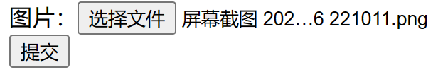
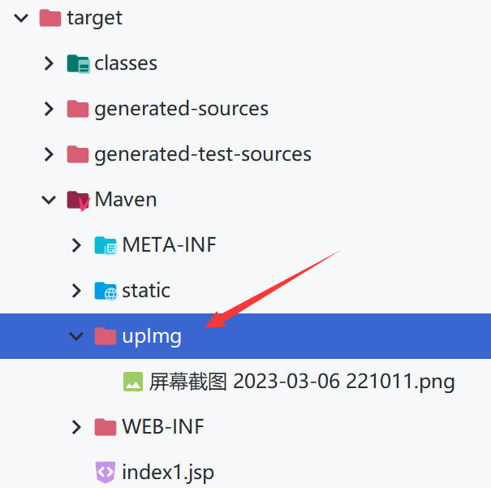

# SpringMVC实现下载和上传功能

## 下载

`ResponseEntity`用于控制器方法的返回值类型，该控制器方法的**返回值**就是响应到**浏览器的响应报文**

index.html

```html
	<a th:href="@{/testDown}">下载图片</a>
```

使用`ResponseEntity`实现下载文件的功能`FileUpAndDownController.java`

FileUpAndDownController.java

```java
package com.atguigu.SpringMVC.controller;

import org.springframework.http.HttpHeaders;
import org.springframework.http.HttpStatus;
import org.springframework.http.ResponseEntity;
import org.springframework.util.MultiValueMap;
import org.springframework.web.bind.annotation.RequestMapping;

import javax.servlet.ServletContext;
import javax.servlet.http.HttpSession;
import java.io.File;
import java.io.FileInputStream;
import java.io.IOException;
import java.io.InputStream;

@Controller
public class FileUpAndDownController {
    @RequestMapping("/testDown")
    //ResponseEntity：作为控制器方法的返回值，表示相应到浏览器的完整响应报文
    public ResponseEntity<byte[]> testResponseEntity(HttpSession session) throws IOException {
        //获取ServletContext对象
        ServletContext servletContext = session.getServletContext();
        //获取服务器中文件的真实路径
        String realPath = servletContext.getRealPath("/static/img");
        //拼接(File.separator自动根据系统匹配拼接符)
        realPath = realPath + File.separator + "a.png";
        //创建输入流
        InputStream is = new FileInputStream(realPath);
        //创建字节数组
        byte[] bytes = new byte[is.available()];
        //将流读到字节数组中
        is.read(bytes);
        //创建HttpHeaders对象设置响应头信息
        MultiValueMap<String, String> headers = new HttpHeaders();
        //设置要下载方式以及下载文件的名字
        headers.add("Content-Disposition", "attachment;filename=a.png");
        //设置响应状态码
        HttpStatus statusCode = HttpStatus.OK;
        //创建ResponseEntity对象
        ResponseEntity<byte[]> responseEntity = new ResponseEntity<>(bytes, headers, statusCode);
        //关闭输入流
        is.close();
        return responseEntity;
    }
}
```

运行结果：点击下载后-->可以成功下载并打开


## 上传

SpringMVC中将上传的文件封装到`MultipartFile`对象中，通过此对象可以获取文件相关信息

上传步骤：

- 添加依赖：`pom.xml`

  - ```xml
        <!-- https://mvnrepository.com/artifact/commons-fileupload/commons-fileupload -->
        <dependency>
            <groupId>commons-fileupload</groupId>
            <artifactId>commons-fileupload</artifactId>
            <version>1.3.1</version>
        </dependency>
    ```

- 配置文件上传解析器：`SpringMVC.xml`

  - ```xml
        <!--配置文件上传解析器-->
        <!--必须通过文件解析器的解析才能将文件转换为MultipartFile对象-->
        <bean id="multipartResolver" class="org.springframework.web.multipart.commons.CommonsMultipartResolver">
            <!--编码方式(默认为UTF-8)-->
            <property name="defaultEncoding" value="UTF-8"/>
        </bean>
    ```

- 表单method必须为post

- 属性enctype为浏览器向服务器传输请求参数的方式
  - `application/x-www-form-urlencoded`(默认)：对于Get请求，将参数转换为`key=value&key=value`格式
  - `multipart/form-data`：以二进制的形式向服务传输数据

- 设置文件域：`<input type="file" name="photo">`

**最终的代码实现**：

index.html

```html
    <form th:action="@{/testUp}" method="post" enctype="multipart/form-data">
        图片：<input type="file" name="photo"><br>
        <input type="submit" value="提交">
    </form>
```

FileUpAndDownController.java

```java
    @RequestMapping("testUp")
    //和表单中name属性的值保持一致就会自动获取并赋值
    public String testUp(MultipartFile photo, HttpSession session) throws IOException {
        //获取所上传文件的文件名
        String fileName = photo.getOriginalFilename();
        //获取ServerContext对象
        ServletContext servletContext = session.getServletContext();
        //获取当前工程目录下的upImg目录的真实路径
        String photoPath = servletContext.getRealPath("upImg");
        //创建photoPath所对应的File对象
        File file = new File(photoPath);
        //判断file所对应的upImg目录是否存在
        if(!file.exists()){
            //没有则创建
            file.mkdir();
        }
        //最终上传路径(文件目录+分隔符+文件名称)
        String finalPath = photoPath + File.separator + fileName;
        //将文件上传到指定的位置
        photo.transferTo(new File(finalPath));
        return "success";
    }
```

### 解决上传文件重名问题

当上传的文件再次上传，因为默认的策略为不追加，而是进行覆盖，此时就会因为文件名相同的缘故而**被覆盖掉**

修改`FileUpAndDownController.java`

```java
    @RequestMapping("testUp")
    //和表单中name属性的值保持一致就会自动获取并赋值
    public String testUp(MultipartFile photo, HttpSession session) throws IOException {
        //获取所上传文件的文件名
        String fileName = photo.getOriginalFilename();

        //解决重名问题
        //获取文件的后缀名(从最后一个"."开始截)
        String hzName = fileName.substring(fileName.lastIndexOf("."));
        //获取uuid
        String uuid = UUID.randomUUID().toString();
        //拼接一个新的文件名
        fileName = uuid + hzName;

        //获取ServerContext对象
        ServletContext servletContext = session.getServletContext();
        //获取当前工程目录下的upImg目录的真实路径
        String photoPath = servletContext.getRealPath("upImg");
        //创建photoPath所对应的File对象
        File file = new File(photoPath);
        //判断file所对应的upImg目录是否存在
        if(!file.exists()){
            //没有则创建
            file.mkdir();
        }
        //最终上传路径(文件目录+分隔符+文件名称)
        String finalPath = photoPath + File.separator + fileName;
        //将文件上传到指定的位置
        photo.transferTo(new File(finalPath));
        return "success";
    }
```

运行效果：



提交后的`target`目录变化：(文件会一直保存到此目录下，直到删除目录或者清除war包并重新部署)



## 以流的形式发送浏览器图片

PictureController.java

```java
package com.atguigu.SSMConcordance.controller;

import org.springframework.web.bind.annotation.GetMapping;
import org.springframework.web.bind.annotation.PathVariable;
import org.springframework.web.bind.annotation.RestController;

import javax.servlet.ServletOutputStream;
import java.io.File;
import java.io.FileInputStream;
import java.io.FileNotFoundException;
import java.io.IOException;

@RestController
public class PictureController {
    @GetMapping("/picture/{avatar}")
    public void avatar(@PathVariable String avatar, ServletOutputStream outputStream) throws IOException {
        //返回byte[]和void都可以，只要读取了文件流
        String os = System.getProperty("os.name");
        if (os.contains("Window"))
            avatar = "D:" + "/京东内存卡/壁纸/" + avatar + ".png";

        byte[] bytes = null;
        try {
            FileInputStream inputStream = new FileInputStream(new File(avatar));
            try {
                int len;
                bytes = new byte[1024];
                while ((len = inputStream.read(bytes)) != -1){
                    outputStream.write(bytes,0,len);
                    outputStream.flush();
                }
            } catch (IOException e) {
                throw new RuntimeException(e);
            } finally {
                outputStream.close();
                inputStream.close();
            }
        }catch (FileNotFoundException e){
            System.out.println("文件未找到");
        }
        System.out.println("图片返回成功");
    }
}
```

python读取代码，也可以使用aipfox发送请求`http://localhost:8080/SSMConcordance/picture/2`

```python
import urllib.request

# 直接下载
# urllib.request.urlretrieve(url='http://localhost:8080/SSMConcordance/picture/2', filename="2.png")

response = urllib.request.urlopen(url='http://localhost:8080/SSMConcordance/picture/2')

with open('2.png', 'wb') as fb:
    # 以二进制读取后写入
    fb.write(response.read())

```

