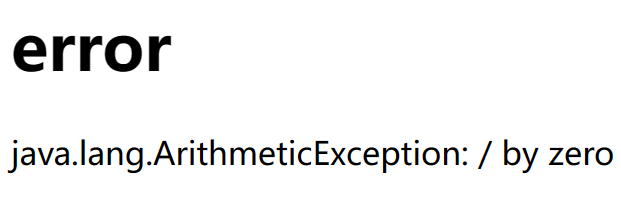

# SpringMVC拦截器和异常处理器

> 过滤器：在浏览器和目标资源之间过滤
>
> 拦截器：用于拦截控制器方法的执行

SpringMVC中的拦截器需要实现`HandlerInterceptor`接口，使用拦截器必须在SpringMVC的配置之前先进行配置

## 拦截器的三个抽象方法

- preHandle：控制器方法执行之前执行，其boolean类型的返回值表示是否拦截或放行，**返回true为放行，即调用控制器方法**；**返回false表示拦截，即不调用控制器方法**
- postHandle：**控制器方法执行之后执行**
- afterCompletion：处理完视图和模型数据，**渲染视图完毕之后执行**

FirstInterceptor.java

```java
package com.atguigu.SpringMVC.interceptor;

import org.springframework.stereotype.Component;
import org.springframework.web.servlet.HandlerInterceptor;
import org.springframework.web.servlet.ModelAndView;

import javax.servlet.http.HttpServletRequest;
import javax.servlet.http.HttpServletResponse;
@Component
public class FirstInterceptor implements HandlerInterceptor {
    //Ctrl＋O提示可以重写的方法
    @Override
    public boolean preHandle(HttpServletRequest request, HttpServletResponse response, Object handler) throws Exception {
        System.out.println("FirstInterceptor-->preHandle");
        //为true则放行
        return true;
    }

    @Override
    public void postHandle(HttpServletRequest request, HttpServletResponse response, Object handler, ModelAndView modelAndView) throws Exception {
        System.out.println("FirstInterceptor-->postHandle");
    }

    @Override
    public void afterCompletion(HttpServletRequest request, HttpServletResponse response, Object handler, Exception ex) throws Exception {
        System.out.println("FirstInterceptor-->afterCompletion");
    }
}
```

SpringMVC.xml

```xml
    <mvc:interceptors>
<!--        <bean id="firstInterceptor" class="com.atguigu.SpringMVC.interceptor.FirstInterceptor"/>-->
<!--        <ref bean="firstInterceptor"/>-->
        <!-- 以上两种配置方式都是对DispatcherServlet所处理的所有的请求进行拦截 -->
        <mvc:interceptor>
            <!--设置需要拦截请求："/*"代表拦截下一层目录的所有请求，"/**"代表拦截任意层数所有请求-->
            <mvc:mapping path="/**"/>
            <!--排除不需要拦截的请求-->
            <mvc:exclude-mapping path="/hello"/>
            <ref bean="firstInterceptor"/>
        </mvc:interceptor>
    </mvc:interceptors>
```

> 成功拦截控制器跳转：
>
> FirstInterceptor-->preHandle
> FirstInterceptor-->postHandle
> FirstInterceptor-->afterCompletion
>
> 满足条件放行(访问/hello)：
>
> FirstInterceptor-->preHandle

## 多个拦截器的执行顺序

- 若每个拦截器的preHandle()都返回true
  - 此时多个拦截器的执行顺序和拦截器在SpringMVC的配置文件的配置顺序有关：
    - preHandle()会**按照配置的顺序执行**，而postHandle()和afterCompletion()会按照配置的**反序执行**

- 若某个拦截器的preHandle()返回了false
  - 拦截器的preHandle()返回false和它之前的拦截器的**preHandle()都会执行**，**postHandle()都不执行**，返回false的拦截器**之前的拦截器的afterCompletion()会执行**

## 异常处理器

### 基于配置的异常处理

SpringMVC提供了一个处理控制器方法执行过程中所出现的异常的接口：`HandlerExceptionResolver`

HandlerExceptionResolver接口的实现类有：`DefaultHandlerExceptionResolver`和`SimpleMappingExceptionResolver`

使用方式：`SpringMVC.xml`

```xml
    <bean class="org.springframework.web.servlet.handler.SimpleMappingExceptionResolver">
        <!--设置跳转位置-->
        <property name="exceptionMappings">
            <props>
                <!--
                    properties的键(key)表示处理器方法执行过程中出现的异常
                    properties的值(value)表示若出现指定异常时，设置一个新的视图名称，跳转到指定页面
                -->
                <!--这里表示出现算术异常时返回逻辑视图跳转到error.html页面-->
                <prop key="java.lang.ArithmeticException">error</prop>
            </props>
        </property>
        <!--将异常信息共享到请求域中，属性名为ex-->
        <property name="exceptionAttribute" value="ex"/>
    </bean>
```

error.html

```html
<!DOCTYPE html>
<html lang="en" xmlns:th="http://www.thymeleaf.org">
<head>
    <meta charset="UTF-8">
    <title>Title</title>
</head>
<body>
    <h1>error</h1>
    <!--访问保存在请求域中的共享数据-->
    <p th:text="${ex}"></p>
</body>
</html>
```

给("/hello")添加输出——1 / 0，触发数学运算异常，运行效果



### 基于注解配置的异常

ExceptionController.java

```java
package com.atguigu.SpringMVC.controller;

import org.springframework.ui.Model;
import org.springframework.web.bind.annotation.ControllerAdvice;
import org.springframework.web.bind.annotation.ExceptionHandler;

@ControllerAdvice //将当前类标识为异常处理的组件
public class ExceptionController {
    //用于设置方法需要处理的异常
    @ExceptionHandler(ArithmeticException.class)
    //ex表示当前请求处理中出现的异常对象
    public String handlerException(Throwable ex, Model model){
        model.addAttribute("ex",ex);
        return "error";
    }
}
```

> 运行结果：和上面保持一致