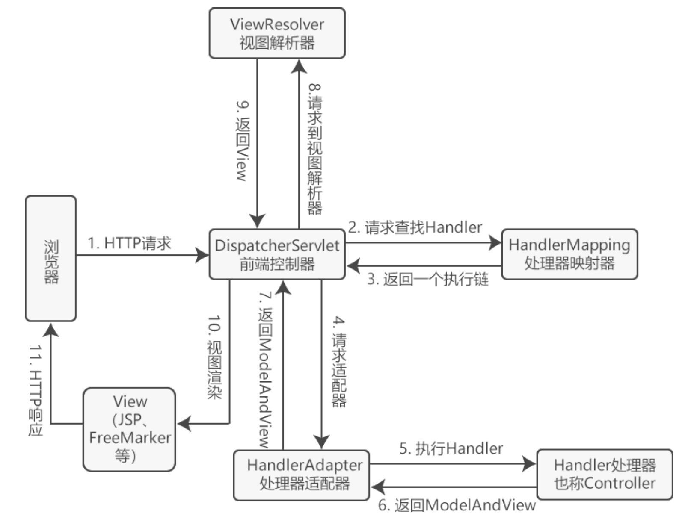

# SpringMVC的常用组件和执行流程

## SpringMVC常用组件

- DispatcherServlet：**前端控制器**，不需要工程师开发，由框架提供
  - 作用：统一处理请求和响应，整个流程控制的中心，由它调用其它组件处理用户的请求

- HandlerMapping：**处理器映射器**，不需要工程师开发，由框架提供
  - 作用：根据请求的url、method等信息查找Handler，即控制器方法
- Handler：**处理器**，需要工程师开发
  - 作用：在DispatcherServlet的控制下Handler对具体的用户请求进行处理
- HandlerAdapter：**处理器适配器**，不需要工程师开发，由框架提供
  - 作用：通过HandlerAdapter对处理器（控制器方法）进行执行
- ViewResolver：**视图解析器**，不需要工程师开发，由框架提供
  - 作用：进行视图解析，得到相应的视图，例如：ThymeleafView、InternalResourceView、RedirectView
- View：**视图**
  - 作用：将模型数据通过页面展示给用户

## SpringMVC的执行流程

SpringMVC 的执行流程如下：

1. 用户点击某个请求路径，发起一个 HTTP request 请求，该请求会被提交到 DispatcherServlet（前端控制器）
2. 由 DispatcherServlet 请求一个或多个 HandlerMapping（处理器映射器），并返回一个执行链（HandlerExecutionChain）
3. DispatcherServlet 将执行链返回的 Handler 信息发送给 HandlerAdapter（处理器适配器）
4. HandlerAdapter 根据 Handler 信息找到并执行相应的 Handler（常称为 Controller）
5. Handler 执行完毕后会返回给 HandlerAdapter 一个 ModelAndView 对象（Spring MVC的底层对象，包括 Model 数据模型和 View 视图信息）
6. HandlerAdapter 接收到 ModelAndView 对象后，将其返回给 DispatcherServlet 
7. DispatcherServlet 接收到 ModelAndView 对象后，会请求 ViewResolver（视图解析器）对视图进行解析；
8. ViewResolver 根据 View 信息匹配到相应的视图结果，并返回给 DispatcherServlet
9. DispatcherServlet 接收到具体的 View 视图后，进行视图渲染，将 Model 中的模型数据填充到 View 视图中的 request 域，生成最终的 View（视图）
10. 视图负责将结果显示到浏览器（客户端）
