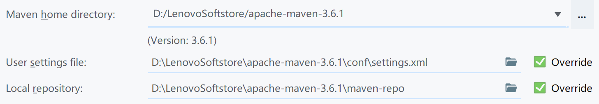
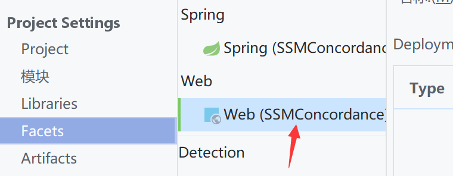
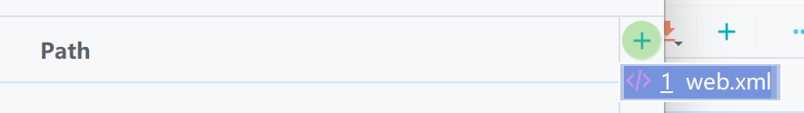
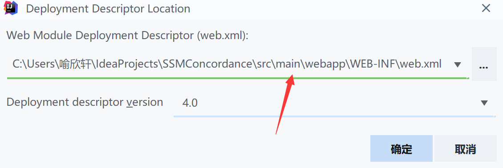
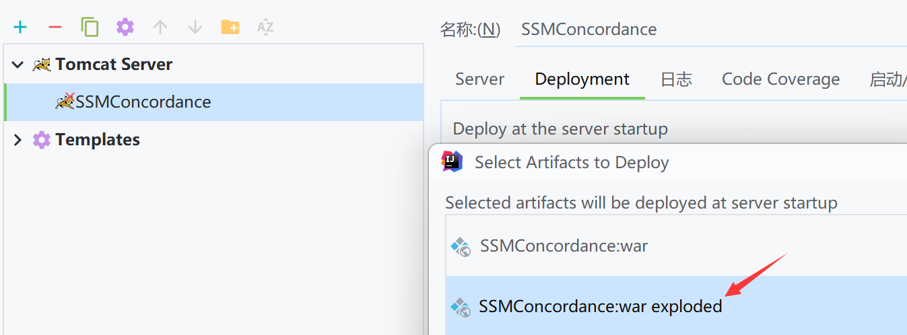
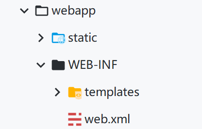
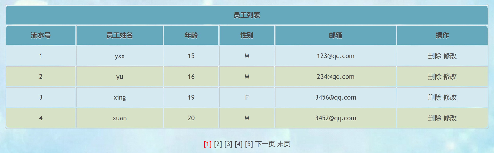
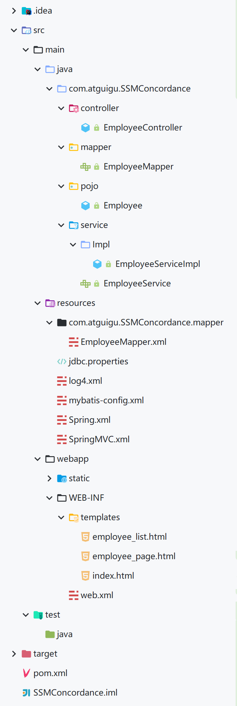

# SSM整合

## ContextLoaderListener

> Spring提供了监听器ContextLoaderListener，实现ServletContextListener接口，可监听ServletContext的状态，在web服务器的启动，读取Spring的配置文件，创建Spring的IOC容器（web 应用中必须在`web.xml`中配置）

web.xml

```xml
    <listener>
    <!--
        配置Spring的监听器，在服务器启动时加载Spring的配置文件
        Spring配置文件默认位置和名称：/WEB-INF/applicationContext.xml
        可通过上下文参数自定义Spring配置文件的位置和名称
     -->
        <listener-class>org.springframework.web.context.ContextLoaderListener</listener-class>
    </listener>

    <!--自定义Spring配置文件的位置和名称-->
    <context-param>
        <param-name>contextConfigLocation</param-name>
        <param-value>classpath:Spring.xml</param-value>
    </context-param>
```

> 让Spring的IOC容器在SpringMVC的IOC容器之前创建（在监听器`<listener>`中创建，早于`DispatcherServlet`)
>
> Spring的IOC容器为父容器，无法访问到子容器SpringMVC的IOC容器，但子容器可以访问到父容器的IOC容器，所以父容器需要优先创建

## 导入依赖

新建一个Maven工程——SSMConcordance，配置项目的Maven



pom.xml

```xml
<?xml version="1.0" encoding="UTF-8"?>
<project xmlns="http://maven.apache.org/POM/4.0.0"
         xmlns:xsi="http://www.w3.org/2001/XMLSchema-instance"
         xsi:schemaLocation="http://maven.apache.org/POM/4.0.0 http://maven.apache.org/xsd/maven-4.0.0.xsd">
    <modelVersion>4.0.0</modelVersion>

    <groupId>org.example</groupId>
    <artifactId>SSMConcordance</artifactId>
    <version>1.0-SNAPSHOT</version>
    <packaging>war</packaging>
    <!-- 自定义属性配置版本号 -->
    <properties>
        <spring.version>5.3.1</spring.version>
    </properties>

    <dependencies>
        <dependency>
            <groupId>org.springframework</groupId>
            <artifactId>spring-context</artifactId>
            <version>${spring.version}</version>
        </dependency>
        <dependency>
            <groupId>org.springframework</groupId>
            <artifactId>spring-beans</artifactId>
            <version>${spring.version}</version>
        </dependency>
        <!--springmvc-->
        <dependency>
            <groupId>org.springframework</groupId>
            <artifactId>spring-web</artifactId>
            <version>${spring.version}</version>
        </dependency>
        <dependency>
            <groupId>org.springframework</groupId>
            <artifactId>spring-webmvc</artifactId>
            <version>${spring.version}</version>
        </dependency>
        <dependency>
            <groupId>org.springframework</groupId>
            <artifactId>spring-jdbc</artifactId>
            <version>${spring.version}</version>
        </dependency>
        <dependency>
            <groupId>org.springframework</groupId>
            <artifactId>spring-aspects</artifactId>
            <version>${spring.version}</version>
        </dependency>
        <dependency>
            <groupId>org.springframework</groupId>
            <artifactId>spring-test</artifactId>
            <version>${spring.version}</version>
        </dependency>
        <!-- Mybatis核心 -->
        <dependency>
            <groupId>org.mybatis</groupId>
            <artifactId>mybatis</artifactId>
            <version>3.5.7</version>
        </dependency>
        <!--mybatis和spring的整合包-->
        <dependency>
            <groupId>org.mybatis</groupId>
            <artifactId>mybatis-spring</artifactId>
            <version>2.0.6</version>
        </dependency>
        <!-- 连接池 -->
        <dependency>
            <groupId>com.alibaba</groupId>
            <artifactId>druid</artifactId>
            <version>1.0.9</version>
        </dependency>
        <!-- junit测试 -->
        <dependency>
            <groupId>junit</groupId>
            <artifactId>junit</artifactId>
            <version>4.12</version>
            <scope>test</scope>
        </dependency>
        <!-- MySQL驱动 -->
        <dependency>
            <groupId>mysql</groupId>
            <artifactId>mysql-connector-java</artifactId>
            <version>8.0.16</version>
        </dependency>
        <!-- log4j日志 -->
        <dependency>
            <groupId>log4j</groupId>
            <artifactId>log4j</artifactId>
            <version>1.2.17</version>
        </dependency>
        <!-- https://mvnrepository.com/artifact/com.github.pagehelper/pagehelper -->
        <dependency>
            <groupId>com.github.pagehelper</groupId>
            <artifactId>pagehelper</artifactId>
            <version>5.2.0</version>
        </dependency>
        <!-- 日志 -->
        <dependency>
            <groupId>ch.qos.logback</groupId>
            <artifactId>logback-classic</artifactId>
            <version>1.2.3</version>
        </dependency>
        <!-- ServletAPI -->
        <dependency>
            <groupId>javax.servlet</groupId>
            <artifactId>javax.servlet-api</artifactId>
            <version>3.1.0</version>
            <scope>provided</scope>
        </dependency>
        <dependency>
            <groupId>com.fasterxml.jackson.core</groupId>
            <artifactId>jackson-databind</artifactId>
            <version>2.12.1</version>
        </dependency>
        <dependency>
            <groupId>commons-fileupload</groupId>
            <artifactId>commons-fileupload</artifactId>
            <version>1.3.1</version>
        </dependency>
        <!-- Spring5和Thymeleaf整合包 -->
        <dependency>
            <groupId>org.thymeleaf</groupId>
            <artifactId>thymeleaf-spring5</artifactId>
            <version>3.0.12.RELEASE</version>
        </dependency>
    </dependencies>
</project>
```

## 创建webapp目录

点开项目结构



选择添加web.xml



修改创建的目录



## 创建表

创建数据库SSMConcordance，执行sql语句

```sql
CREATE TABLE `t_emp` (
    `emp_id` int(11) NOT NULL AUTO_INCREMENT,
    `emp_name` varchar(20) DEFAULT NULL,
    `age` int(11) DEFAULT NULL,
    `gender` char(1) DEFAULT NULL,
    `email` varchar(50) DEFAULT NULL,
    PRIMARY KEY (`emp_id`)
) ENGINE=InnoDB DEFAULT CHARSET=utf8
```

## 配置web.xml

```xml
<?xml version="1.0" encoding="UTF-8"?>
<web-app xmlns="http://xmlns.jcp.org/xml/ns/javaee"
         xmlns:xsi="http://www.w3.org/2001/XMLSchema-instance"
         xsi:schemaLocation="http://xmlns.jcp.org/xml/ns/javaee http://xmlns.jcp.org/xml/ns/javaee/web-app_4_0.xsd"
         version="4.0">
    <!-- 配置Spring的编码过滤器 -->
    <filter>
        <filter-name>CharacterEncodingFilter</filter-name>
        <filter-class>org.springframework.web.filter.CharacterEncodingFilter</filter-class>
    <init-param>
        <param-name>encoding</param-name>
        <param-value>UTF-8</param-value>
    </init-param>
        <init-param>
            <param-name>forceEncoding</param-name>
            <param-value>true</param-value>
        </init-param>
    </filter>
    <filter-mapping>
        <filter-name>CharacterEncodingFilter</filter-name>
        <url-pattern>/*</url-pattern>
    </filter-mapping>

    <!-- 配置处理请求方式PUT和DELETE的过滤器 -->
    <filter>
        <filter-name>HiddenHttpMethodFilter</filter-name>
        <filter-class>org.springframework.web.filter.HiddenHttpMethodFilter</filter-class>
    </filter>
    <filter-mapping>
        <filter-name>HiddenHttpMethodFilter</filter-name>
        <url-pattern>/*</url-pattern>
    </filter-mapping>

    <!-- 配置SpringMVC的前端控制器 -->
    <servlet>
        <servlet-name>DispatcherServlet</servlet-name>
        <servlet-class>org.springframework.web.servlet.DispatcherServlet</servlet-class>
        <!-- 设置SpringMVC的配置文件的位置和名称 -->
        <init-param>
            <param-name>contextConfigLocation</param-name>
            <param-value>classpath:SpringMVC.xml</param-value>
        </init-param>
        <load-on-startup>1</load-on-startup>
    </servlet>
    <servlet-mapping>
        <servlet-name>DispatcherServlet</servlet-name>
        <url-pattern>/</url-pattern>
    </servlet-mapping>

    <!-- 设置Spring的配置文件的位置和名称 -->
    <context-param>
        <param-name>contextConfigLocation</param-name>
        <param-value>classpath:Spring.xml</param-value>
    </context-param>

    <!-- 配置Spring的监听器 -->
    <listener>
        <listener-class>org.springframework.web.context.ContextLoaderListener</listener-class>
    </listener>
</web-app>
```

> ```
>         <dependency>
>             <groupId>org.projectlombok</groupId>
>             <artifactId>lombok</artifactId>
>             <version>1.18.24</version>
>         </dependency>
> ```

## 配置SpringMVC的配置文件

SpringMVC.xml

```xml
<?xml version="1.0" encoding="UTF-8"?>
<beans xmlns="http://www.springframework.org/schema/beans"
       xmlns:xsi="http://www.w3.org/2001/XMLSchema-instance"
       xmlns:context="http://www.springframework.org/schema/context"
       xmlns:mvc="http://www.springframework.org/schema/mvc"
       xsi:schemaLocation="http://www.springframework.org/schema/beans http://www.springframework.org/schema/beans/spring-beans.xsd http://www.springframework.org/schema/context https://www.springframework.org/schema/context/spring-context.xsd http://www.springframework.org/schema/mvc https://www.springframework.org/schema/mvc/spring-mvc.xsd">

    <!-- 扫描组件 -->
    <context:component-scan base-package="com.atguigu.SSMConcordance.controller"/>

    <!--配置视图解析器-->
    <bean id="viewResolver" class="org.thymeleaf.spring5.view.ThymeleafViewResolver">
        <property name="order" value="1"/>
        <property name="characterEncoding" value="UTF-8"/>
        <property name="templateEngine">
            <bean class="org.thymeleaf.spring5.SpringTemplateEngine">
                <property name="templateResolver">
                    <bean class="org.thymeleaf.spring5.templateresolver.SpringResourceTemplateResolver">
                        <!-- 视图前缀 -->
                        <property name="prefix" value="/WEB-INF/templates/"/>
                        <!-- 视图后缀 -->
                        <property name="suffix" value=".html"/>
                        <property name="templateMode" value="HTML5"/>
                        <property name="characterEncoding" value="UTF-8" />
                    </bean>
                </property>
            </bean>
        </property>
    </bean>

    <!-- 配置访问首页的视图控制 -->
    <mvc:view-controller path="/" view-name="index"/>

    <!-- 配置默认的servlet处理静态资源 -->
    <mvc:default-servlet-handler />

    <!-- 开启MVC的注解驱动 -->
    <mvc:annotation-driven />
</beans>
```

## 配置Tomcat



## 搭建MyBatis环境

### 创建映射类

```java
package com.atguigu.SSMConcordance.pojo;

public class Employee {
    private Integer empId;

    private String empName;

    private Integer age;

    private String gender;

    private String email;
    //省略构造函数、toString方法和Get、Set方法
}
```

### 创建属性文件jdbc.properties

```properties
jdbc.username=root
jdbc.password=yuxingxuan
jdbc.url=jdbc:mysql://localhost:3306/SSMConcordance?serverTimezone=UTC
jdbc.driver=com.mysql.cj.jdbc.Driver
```

### 创建MyBatis的核心配置文件mybatis-config.xml

```xml
<?xml version="1.0" encoding="UTF-8" ?>
<!DOCTYPE configuration
        PUBLIC "-//mybatis.org//DTD Config 3.0//EN"
        "http://mybatis.org/dtd/mybatis-3-config.dtd">
<configuration>
    <settings>
        <!--将下划线映射为驼峰-->
        <setting name="mapUnderscoreToCamelCase" value="true"/>
    </settings>
    <plugins>
        <!--配置分页插件-->
        <plugin interceptor="com.github.pagehelper.PageInterceptor"/>
    </plugins>
</configuration>
```

> 其它的配置都在后面通过Spring去整合了

## 配置Spring的配置文件

> Spring的IOC用于管理service和dao的bean，SpringMVC的IOC用于管理controller的bean

```xml
<?xml version="1.0" encoding="UTF-8"?>
<beans xmlns="http://www.springframework.org/schema/beans"
       xmlns:xsi="http://www.w3.org/2001/XMLSchema-instance"
       xmlns:context="http://www.springframework.org/schema/context" xmlns:tx="http://www.springframework.org/schema/tx"
       xsi:schemaLocation="http://www.springframework.org/schema/beans http://www.springframework.org/schema/beans/spring-beans.xsd http://www.springframework.org/schema/context https://www.springframework.org/schema/context/spring-context.xsd http://www.springframework.org/schema/tx http://www.springframework.org/schema/tx/spring-tx.xsd">

    <!-- 扫描组件(除控制层) -->
    <context:component-scan base-package="com.atguigu.SSMConcordance">
        <!-- 扫描除Controller注解的bean -->
        <context:exclude-filter type="annotation" expression="org.springframework.stereotype.Controller"/>
    </context:component-scan>

    <!-- 整合MaBatis -->
    <!-- 引入jdbc.properties -->
    <context:property-placeholder location="classpath:jdbc.properties"/>
    <!-- 配置数据源 -->
    <bean id="druidDataSource" class="com.alibaba.druid.pool.DruidDataSource">
        <property name="driverClassName" value="${jdbc.driver}"/>
        <property name="url" value="${jdbc.url}"/>
        <property name="username" value="${jdbc.username}"/>
        <property name="password" value="${jdbc.password}"/>
    </bean>

    <!-- 配置事务管理器 -->
    <bean id="transactionManager" class="org.springframework.jdbc.datasource.DataSourceTransactionManager">
        <property name="dataSource" ref="druidDataSource"/>
    </bean>

    <!-- 开启事务的注解驱动(后缀为"tx"的)，将使用@Transactional标识(Service层添加)的方法或类中所有的方法进行事务管理 -->
    <tx:annotation-driven transaction-manager="transactionManager"/>

    <!-- 配置SqlSessionFactoryBean，之后在Spring的IOC容器中直接获取 -->
    <bean class="org.mybatis.spring.SqlSessionFactoryBean">
        <!-- 设置MyBatis的核心配置文件(由MyBatis核心配置文件和Spring共同配置) -->
        <property name="configLocation" value="classpath:mybatis-config.xml"/>
        <!-- 设置数据源 -->
        <property name="dataSource" ref="druidDataSource"/>
        <!-- 设置类型别名所对应的包 -->
        <property name="typeAliasesPackage" value="com.atguigu.SSMConcordance.pojo"/>
        <!-- 映射文件的路径(只有当映射文件所的包和Mapper接口所对应的包不一致时才需要设置) -->
<!--        <property name="mapperLocations" value="classpath:com/atguigu/SSMConcordance/mapper/*.xml"/>-->
    </bean>

    <!-- 配置mapper接口的扫描，可以将指定包下所有的mapper接口，通过sqlSession创建代理实现类对象，并将这些对象交给IOC容器管理 -->
    <bean class="org.mybatis.spring.mapper.MapperScannerConfigurer">
        <property name="basePackage" value="com.atguigu.SSMConcordance.mapper"/>
    </bean>
</beans>
```

## 配置log4j日志

log4j.xml

```xml
<?xml version="1.0" encoding="UTF-8" ?>
<!DOCTYPE log4j:configuration SYSTEM "log4j.dtd">

<log4j:configuration xmlns:log4j="http://jakarta.apache.org/log4j/">

	<appender name="STDOUT" class="org.apache.log4j.ConsoleAppender">
		<param name="Encoding" value="UTF-8" />
		<layout class="org.apache.log4j.PatternLayout">
			<param name="ConversionPattern" value="%-5p %d{MM-dd HH:mm:ss,SSS}%m (%F:%L) \n" />
		</layout>
	</appender>
    
	<logger name="java.sql">
		<level value="debug" />
	</logger>
	<logger name="org.apache.ibatis">
		<level value="info" />
	</logger>
    
	<root>
		<level value="debug" />
		<appender-ref ref="STDOUT" />
	</root>
</log4j:configuration>
```

## 复制static文件

将之前的`static`文件放入`webapp`目录下



## 示例

### 持久层(Dao、Mapper)

EmployeeMapper.java

```java
package com.atguigu.SSMConcordance.mapper;

import com.atguigu.SSMConcordance.pojo.Employee;

import java.util.List;

public interface EmployeeMapper {

    /**
     * 查询所有的员工信息
     * @return
     */
    List<Employee> getAllEmployee();
}
```

EmployeeMapper.xml

```xml
<?xml version="1.0" encoding="UTF-8" ?>
<!DOCTYPE mapper
        PUBLIC "-//mybatis.org//DTD Mapper 3.0//EN"
        "https://mybatis.org/dtd/mybatis-3-mapper.dtd">

<mapper namespace="com.atguigu.SSMConcordance.mapper.EmployeeMapper">
    <!--List<Employee> getAllEmployee()-->
    <select id="getAllEmployee" resultType="Employee">
        select * from t_emp
    </select>
</mapper>
```

### 业务层(Service)

EmployeeService.java

```java
package com.atguigu.SSMConcordance.service;

import com.atguigu.SSMConcordance.pojo.Employee;
import com.github.pagehelper.PageInfo;

import java.util.List;

public interface EmployeeService {
    /**
     * 查询所有员工的信息
     * @return
     */
    List<Employee> getAllEmployee();

    /**
     * 查询分页员工信息
     * @param pageNum
     * @return
     */
    PageInfo<Employee> getEmployeePage(Integer pageNum);
}
```

EmployeeServiceImpl.java

```java
package com.atguigu.SSMConcordance.service.Impl;

import com.atguigu.SSMConcordance.mapper.EmployeeMapper;
import com.atguigu.SSMConcordance.pojo.Employee;
import com.atguigu.SSMConcordance.service.EmployeeService;
import com.github.pagehelper.PageHelper;
import com.github.pagehelper.PageInfo;
import org.springframework.beans.factory.annotation.Autowired;
import org.springframework.stereotype.Service;
import org.springframework.transaction.annotation.Transactional;

import java.util.List;

@Service
@Transactional
public class EmployeeServiceImpl implements EmployeeService {
    @Autowired
    private EmployeeMapper employeeMapper;

    @Override
    public List<Employee> getAllEmployee() {
        return employeeMapper.getAllEmployee();
    }

    @Override
    public PageInfo<Employee> getEmployeePage(Integer pageNum) {
        //开启分页功能(设置当前页码和页面大小)
        PageHelper.startPage(pageNum,4);
        //查询所有员工信息
        List<Employee> list = employeeMapper.getAllEmployee();
        //获取分页相关的数据(将链表放入进行分页并设置导航分页的页码数)
        return new PageInfo<>(list,5);
    }
}
```

### 控制层(Controller)

```java
package com.atguigu.SSMConcordance.controller;

import com.atguigu.SSMConcordance.pojo.Employee;
import com.atguigu.SSMConcordance.service.EmployeeService;
import com.github.pagehelper.PageInfo;
import org.springframework.beans.factory.annotation.Autowired;
import org.springframework.stereotype.Controller;
import org.springframework.ui.Model;
import org.springframework.web.bind.annotation.PathVariable;
import org.springframework.web.bind.annotation.RequestMapping;
import org.springframework.web.bind.annotation.RequestMethod;

import java.util.List;

/**
 * 查询所有员工信息-->/employee-->get
 * 查询员工的分页信息-->/employee/page/1-->get
 * 根据id查询员工信息-->/employee/1-->get
 * 跳转到添加页面-->/to/add-->get
 * 添加员工信息-->/employee-->post
 * 修改员工信息-->/employee-->put
 * 删除员工信息-->/employee/1-->delete
 */
@Controller
public class EmployeeController {
    @Autowired
    private EmployeeService employeeService;

    @RequestMapping(value = "/employee_list",method = RequestMethod.GET)
    public String getAllEmployee(Model model){
        List<Employee> list = employeeService.getAllEmployee();
        //将员工信息在请求域中共享
        model.addAttribute("list",list);
        return "employee_list";
    }

    @RequestMapping(value = "/employee/page/{pageNum}",method = RequestMethod.GET)
    public String getEmployeePage(@PathVariable("pageNum") Integer pageNum,Model model){
        //获取员工的分页信息(请求的页面放入)
        PageInfo<Employee> pageInfo = employeeService.getEmployeePage(pageNum);
        //将分页数据共享到请求域中
        model.addAttribute("page",pageInfo);
        return "employee_page";
    }
}
```

### View层

index.html

```html
<!DOCTYPE html>
<html lang="en" xmlns:th="http://www.thymeleaf.org">
<head>
    <meta charset="UTF-8">
    <title>Title</title>
</head>
<body>
    <h2>你好，世界！</h2>
    <a th:href="@{/employee_list}">查询所有的员工信息</a><br>
    <a th:href="@{/employee/page/1}">查询员工的分页信息</a><br>
</body>
</html>
```

employee_list.html

```html
<!DOCTYPE html>
<html lang="en" xmlns:th="http://www.thymeleaf.org">
<head>
    <meta charset="UTF-8">
    <title>员工列表</title>
    <link rel="stylesheet" th:href="@{/static/css/index_work.css}">
</head>
<body>
    <table>
        <tr>
            <th colspan="6">员工列表</th>
        </tr>
        <tr>
            <th>流水号</th>
            <th>员工姓名</th>
            <th>年龄</th>
            <th>性别</th>
            <th>邮箱</th>
            <th>操作</th>
        </tr>
        <!-- 将请求域中的信息"list"拿出来并在作用域内设置别名为"employee"
            "status"是辅助对象，可以获取有关循环的信息 -->
        <tr th:each="employee,status : ${list}">
            <td th:text="${status.count}"></td>
            <td th:text="${employee.empName}"></td>
            <td th:text="${employee.age}"></td>
            <td th:text="${employee.gender}"></td>
            <td th:text="${employee.email}"></td>
            <td>
                <a href="">删除</a>
                <a href="">修改</a>
            </td>
        </tr>
    </table>
</body>
</html>
```

employee_page.html

```html
<!DOCTYPE html>
<html lang="en" xmlns:th="http://www.thymeleaf.org">
<head>
    <meta charset="UTF-8">
    <title>员工分页</title>
    <link rel="stylesheet" th:href="@{/static/css/index_work.css}">
</head>
<body>
    <table>
        <tr>
            <th colspan="6">员工列表</th>
        </tr>
        <tr>
            <th>流水号</th>
            <th>员工姓名</th>
            <th>年龄</th>
            <th>性别</th>
            <th>邮箱</th>
            <th>操作</th>
        </tr>
        <!-- 将请求域中的信息"list"拿出来并在作用域内设置别名为"employee"
            "status"是辅助对象，可以获取有关循环的信息 -->
        <tr th:each="employee,status : ${page.list}">
            <td th:text="${status.count}"></td>
            <td th:text="${employee.empName}"></td>
            <td th:text="${employee.age}"></td>
            <td th:text="${employee.gender}"></td>
            <td th:text="${employee.email}"></td>
            <td>
                <a href="">删除</a>
                <a href="">修改</a>
            </td>
        </tr>
    </table>
    <br>
    <div style="text-align: center;">
        <a th:if="${page.hasPreviousPage}" th:href="@{/employee/page/1}">首页</a>
        <a th:if="${page.hasPreviousPage}" th:href="@{'/employee/page/'+${page.prePage}}">上一页</a>
        <span th:each="num : ${page.navigatepageNums}">
            <!--"th:text"控制标签里面的内容(覆盖原本的内容)-->
            <a th:if="${page.pageNum == num}" style="color: red" th:href="@{'/employee/page/'+${num}}" th:text="'['+${num}+']'"></a>
            <a th:if="${page.pageNum != num}" th:href="@{'/employee/page/'+${num}}" th:text="'['+${num}+']'"></a>
        </span>
        <a th:if="${page.hasNextPage}" th:href="@{'/employee/page/'+${page.nextPage}}">下一页</a>
        <a th:if="${page.hasNextPage}" th:href="@{'/employee/page/'+${page.pages}}">末页</a>
    </div>
</body>
</html>
```

### 运行效果



## 目录结构



> 这里应该是log4j.xml，文件命名错了
