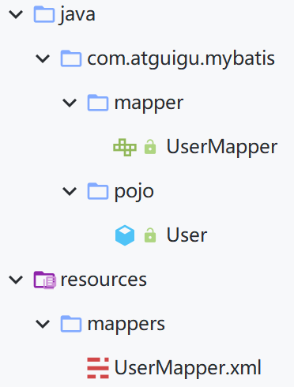
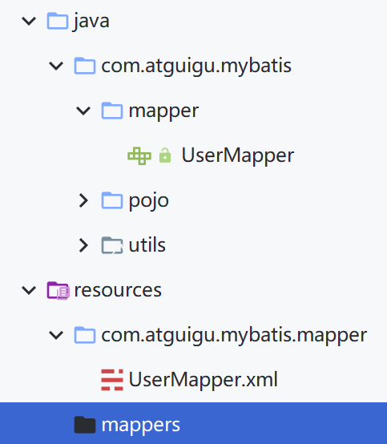
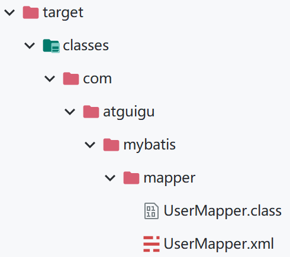

# MyBatis核心配置文件mybatis-config.xml

## 标签配置顺序

> 核心配置文件中的标签必须按照固定的顺序properties?,settings?,typeAliases?,typeHandlers?,objectFactory?,objectWrapperFactory?,refl ectorFactory?,plugins?,environments?,databaseIdProvider?,mappers?

## environments：配置数据库连接环境

```xml
<!--配置连接数据库的环境-->
    <!--默认使用id="development"的配置项-->
    <environments default="development">

        <environment id="development">
            <!--事务管理器-->
            <!--
            type：设置事务的管理方式
                "JDBC"：表示使用JDBC原生的事务管理方式
                "MANAGED"：被管理，例如Spring
            -->
            <transactionManager type="JDBC"/>
            <!--数据源-->
            <!--
            type：设置数据源的类型
                POOLED：使用数据库连接池
                UNPOOLED：不使用数据库连接池
                JNDI：使用上下文中的数据源
            -->
            <dataSource type="POOLED">
                <!--按照自己的数据库配置-->
                <!--<property name="driver" value="${driver}"/>
                <property name="url" value="${url}"/>
                <property name="username" value="${username}"/>
                <property name="password" value="${password}"/>-->
                <property name="driver" value="com.mysql.cj.jdbc.Driver"/>
                <property name="url" value="jdbc:mysql://localhost:3306/ssm?serverTimezone=UTC"/>
                <property name="username" value="root"/>
                <property name="password" value="yuxingxuan"/>
            </dataSource>
        </environment>

    </environments>
```

---

## properties：存储连接数据库的数据

在`resources`目录下新建后缀为`properties`文件`jdbc.properties`：


写入数据库相关连接配置：(key = 内容)

```properties
jdbc.driver = com.mysql.cj.jdbc.Driver
jdbc.url = jdbc:mysql://localhost:3306/ssm?serverTimezone=UTC
jdbc.username = root
jdbc.password = yuxingxuan
```

在核心配置文件的`<configuration>`内的**最前面**引入`jdbc.properties`文件

```xml
<!--引入properties文件，此后就可以在当前文件中使用${key}的方式访问value-->
    <properties resource="jdbc.properties"/>
	<!--关于数据库连接配置就可以这样写-->
	<!--<property name="driver" value="${jdbc.driver}"/>
        <property name="url" value="${jdbc.url}"/>
        <property name="username" value="${jdbc.username}"/>
        <property name="password" value="${jdbc.password}"/>-->
```

---

## typeAliases：设置类型别名

typeAliases为设置类型别名，即可以为某个具体的类型设置一个别名，就在可在**MyBatis的范围中**使用别名表示一个具体的类型

```xml
<!--typeAliases为设置类型别名，即可以为某个具体的类型设置一个别名，就在可在MyBatis的范围中使用别名表示一个具体的类型-->
    <typeAliases>
        <!--
            type：需要起别名的类型
            alias：设置类型的别名
        -->
        <typeAlias type="com.atguigu.mybatis.pojo.User" alias="UserTest"/>
    </typeAliases>
```

然后在`UserMapper.xml`就可以使用"User"代替"com.atguigu.mybatis.pojo.User"

```xml
	<select id="AllUser" resultType="UserTest">
        select * from t_user
    </select>
```

以包为单位，统一设置别名

```xml
	<typeAliases>
        <!--将包下所有的类型设置默认的类型别名，且类名不区分大小写-->
        <package name="com.atguigu.mybatis.pojo"/>
	</typeAliases>
```

---

## mapper：以包的形式引入映射文件

在之前引入映射文件需要**通过mapper一个个设置**，现在可以**通过`package`以包的方式引入映射文件**，但是必须满足两个条件

- mapper接口和映射文件所在的包必须一致(**当两者的包名一致时，打包之后`targer`目录下的`classes`目录下的位置也会一致**)
- mapper接口的名字和映射文件的名字必须一致

```xml
    <!--引入mybatis的映射文件(sql语句)-->
    <mappers>
<!--        <mapper resource="org/mybatis/example/BlogMapper.xml"/>-->
        <!--这里配置文件和映射文件都是处于resources目录下，直接写目录和文件名就可以访问到映射文件-->
<!--        <mapper resource="mappers/UserMapper.xml"/>-->

        <!--以包的方式引入映射文件-->
        <package name="com.atguigu.mybatis.mapper"/>
    </mappers>
```

**关于创建包和创建目录的细节方面的不同**

- 创建包：依据`.`来创建次级目录
- 创建目录：依据`/`来创建次级目录

## 完整的配置

mybatis-config.xml

```xml
<?xml version="1.0" encoding="UTF-8" ?>
<!DOCTYPE configuration
        PUBLIC "-//mybatis.org//DTD Config 3.0//EN"
        "https://mybatis.org/dtd/mybatis-3-config.dtd">
<configuration>
    <!--
        核心配置文件中的标签必须按照固定的顺序：
        properties?,settings?,typeAliases?,typeHandlers?,
        objectFactory?,objectWrapperFactory?,reflectorFactory?,
        plugins?,environments?,databaseIdProvider?,mappers?
    -->

    <!--引入properties文件，此后就可以在当前文件中使用${key}的方式访问value-->
    <properties resource="jdbc.properties"/>
    
    <!--字段名的下划线映射为驼峰-->
    <settings>
        <setting name="mapUnderscoreToCamelCase" value="true"/>
    </settings>
    
    <!--typeAliases为设置类型别名，即可以为某个具体的类型设置一个别名，就在可在MyBatis的范围中使用别名表示一个具体的类型-->
    <typeAliases>
        <!--
            type：需要起别名的类型
            alias：设置类型的别名
        -->
        <typeAlias type="com.atguigu.mybatis.pojo.User" alias="User"/>
        <typeAlias type="com.atguigu.mybatis.pojo.Emp" alias="Emp"/>
        <typeAlias type="com.atguigu.mybatis.pojo.Dept" alias="Dept"/>
    </typeAliases>

    <!--配置连接数据库的环境-->
    <!--默认使用id="development"的配置项-->
    <environments default="development">

        <environment id="development">
            <!--事务管理器-->
            <!--
            type：设置事务的管理方式
                "JDBC"：表示使用JDBC原生的事务管理方式
                "MANAGED"：被管理，例如Spring
            -->
            <transactionManager type="JDBC"/>
            <!--数据源-->
            <!--
            type：设置数据源的类型
                POOLED：使用数据库连接池
                UNPOOLED：不使用数据库连接池
                JNDI：使用上下文中的数据源
            -->
            <dataSource type="POOLED">
                <!--按照自己的数据库配置-->
                <property name="driver" value="com.mysql.cj.jdbc.Driver"/>
                <property name="url" value="jdbc:mysql://localhost:3306/ssm?serverTimezone=UTC"/>
                <property name="username" value="root"/>
                <property name="password" value="yuxingxuan"/>
            </dataSource>
        </environment>

    </environments>

    <!--引入mybatis的映射文件(sql语句)-->
    <mappers>
<!--        <mapper resource="org/mybatis/example/BlogMapper.xml"/>-->
        <!--这里配置文件和映射文件都是处于resources目录下，直接写目录和文件名就可以访问到映射文件-->
<!--        <mapper resource="mappers/UserMapper.xml"/>-->

        <!--以包的方式引入映射文件-->
        <package name="com.atguigu.mybatis.mapper"/>
    </mappers>

</configuration>
```

**目录结构变化**

原本：



修改后：





