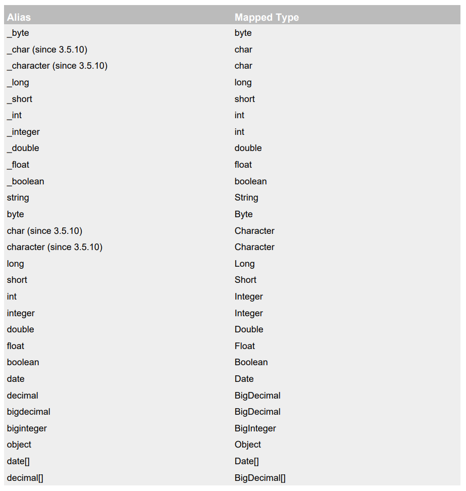
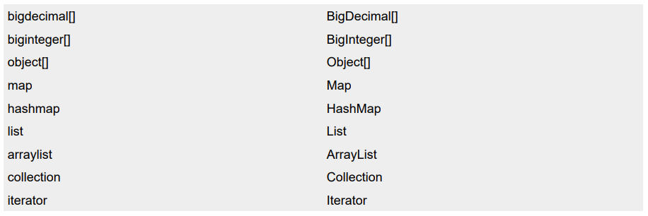

# MyBatis获取参数值和查询处理

## MyBatis获取参数值的两种方式：${}和#{}

${}的本质就是**字符串拼接(''+'')**，#{}的本质就是**占位符赋值(?)**

- ${}：
  - ${}使用字符串拼接的方式拼接sql，若为**字符串类型**或**日期类型**的字段进行赋值时，需要在外面手动加单引号(**'${}'**)

- #{}：
  - #{}使用占位符赋值的方式拼接sql，此时为**字符串类型**或**日期类型**的字段进行赋值时，可以自动添加单引号

## 关于方法参数和括号里的内容

- mapper接口方法的参数为**单个字面量类型**时：
  - ${}：括号内是可以输入提示信息的，但是如果括号里的内容加**引号**，则会**当成数据库的信息**进行直接输入到sql语句中去。除此之外，括号内**还可以进行表达式的运算**，所以出现纯数字也会当成表达式并会将运算的结果直接输入sql语句中去
  - #{}：括号内可以输入任意提示信息
- mapper接口方法的参数为**多个字面量类型**时：

  - **不自定义map集合**
    - 以**arg0,arg1...为键**，以参数为值；以**param1,param2...为键**，以参数为值
  - **定义@Param键值对**(import org.apache.ibatis.annotations.Param)：在方法形参列表创建@Param(`@Param("username") String username`)
    - 以自定义的@Param为准，此时自定义的键值对**会覆盖arg0,arg1**，除了使用自定义的键，还**可以使用param1,param2**
  - **定义map集合类型**：在方法形参列表创建Map集合(`Map<String,Object>`)，将这些数据放在Map集合中
    - 以自定义的Map集合类型为准，此时自定义的键值对**会覆盖arg0,arg1**，除了使用自定义的键，还**可以使用param1,param2**
- mapper接口方法的参数为对象时：**会将对象方法中的get和set去掉后并将第一字母小写作为key值**
  - 值得注意的是，此时arg键和param键都会被覆盖，也就是说**参数列表传入对象后就无法再传入其他参数了**。如果**检测到sql语句中使用到了arg键或者param键**，则会要求全部使用MyBatis自带的键，而无法读取到对象中的键。


### 示例

UserMapper.java

```java
    /**
     * 以Map方式获取参数后查找对应用户
     * @param map
     * @return
     */
    User seekMapUser(Map<String,Object> map);

    /**
     * 以@Param方式获取参数后查找对应用户
     * @param username
     * @param gender
     * @return
     */
    User seekParamUser(@Param("username") String username, @Param("gender") String gender);

    /**
     * 以对象的get和set方法获取参数后添加用户
     * @param user
     */
    void insertUserUser(User user);
```

UserMapper.xml

```xml
    <!--select的查询结果的表数据一定得能和JavaBean映射对得上-->
	<!--void seekMapUser-->
    <select id="seekMapUser" resultType="User"><!--前面在配置文件中设置了别名，所以这里可以直接用User代替复杂的包路径-->
        <!--如果key值不对，则结果为空，不会报错-->
        select * from t_user where username = '${key1}' and gender = '${key2}'
    </select>

    <!--void seekParamUser-->
    <select id="seekParamUser" resultType="User">
        <!--如果key值不对，会报错-->
        select * from t_user where username = '${username}' and gender = '${gender}'
    </select>

    <!--void insertUserUser(User user)-->
    <insert id="insertUserUser">
        <!--这里获取对象的值本质上是调用对象的get和set方法(去掉get和set后将第一字母小写即为key值)-->
        insert into t_user value(#{param1},#{username},#{password},#{age},#{gender},#{email})
    </insert>
```

MyBatisTest.java

```java
    @Test
    public void testSeekMapUser(){
        SqlSession sqlSession = SqlSessionUtils.getSqlSession();
        UserMapper userMapper = sqlSession.getMapper(UserMapper.class);
        Map<String,Object> map = new HashMap<>();
        //存入两个键值对
        map.put("key1","admin");
        map.put("key2","男");
        User user = userMapper.seekMapUser(map);
        System.out.println(user);
    }

    @Test
    public void testSeekParamUser(){
        SqlSession sqlSession = SqlSessionUtils.getSqlSession();
        UserMapper userMapper = sqlSession.getMapper(UserMapper.class);
        User user = userMapper.seekParamUser("admin","男");
        System.out.println(user);
    }

    @Test
    public void testInsertUserUser(){
        SqlSession sqlSession = SqlSessionUtils.getSqlSession();
        UserMapper userMapper = sqlSession.getMapper(UserMapper.class);
        //int类型是不允许为null的，修改User.java将其id属性设置为Integer包装类类型即可
        User user = new User(null,"root","123456",24,"男","12345@qq.com");
        userMapper.insertUserUser(user);
        System.out.println("添加成功");
    }
```

## 查询的结果处理

在调用mapper接口中的方法时，在**底层实际调用的是Sqlsession对象**提供的方法。Sqlsession对象提供的查询方法有很多：select、selectOne、selectCursor、selectList、selectMap，至于用的是哪一个方法，MyBatis会根据方法的返回值自动选择。

MyBatis的类型别名：常见Java类型有许多内置类型别名，它们都**不区分大小写**





- 查询结果为实体类类型(`resultType="JavaBean"`)
  - 查询结果为一个实体类对象：方法返回值为对象(resultType="JavaBean"，方法返回值为JavaBean)
  - 查询结果为多个实体类对象：方法返回值为链表(**MyBatis自动调用selectList方法，将每一行的数据压入链表**)(resultType="JavaBean"，**方法返回值为List**)

- 查询结果为数据类型(`resultType="date"`)：
  - 查询结果为一个数据时：MyBatis会先将sql查询结果表中的**数据转换为resultType设置的数据类型**，然后再将数据**转换为方法的返回值类型**进行返回
  - 查询结果为多个数据时(无法映射实体类或者不方便映射)：**resultType设置为Map**，**方法返回值也设置为Map**，返回后对Map进行遍历输出即可

- 查询结果为**多行**且**多个**数据时：
  - 使用`List<Map<String,Object>>`对结果集进行处理：**resultType设置为Map**，**方法返回值设置为List**
  - 使用`@MapKey`注解对结果集进行处理：

（注：@MapKey是**用在返回值为Map的方法上的注解**，它能够将存放对象的List转化为key值为对象的某一属性的Map，属性有value，填入的是对象的属性名，作为Map的key值）

### 示例

UserMapper.java

```java
/**
     *根据密码查询用户id-->返回单个数据
     * @param password
     * @return
     */
    Object selectObject(@Param("password") String password);

    /**
     * 根据密码将用户所有信息返回为一个Map集合-->返回多个数据
     * @param password
     * @return
     */
    Map<String,Object> selectMap(@Param("password") String password);

    /**
     * 以Map为返回结果查询出所有结果-->List保存
     * @return
     */
    List<Map<String,Object>> selectListMap();

    /**
     * 通过@MapKey将存放对象的List转化为key值为对象的某一属性的Map
     * 注解设置Map集合的键，值是每条数据所对应的Map集合
     * @return
     */
    @MapKey("id")//这里得填id
    Map<String,Object> selectMapKey();


	/*Map可以用于存储单行中无法和JavaBean对应上的数据，还可以通过List和@MapKey实现存储多行*/
```

UserMapper.xml

```xml
	<!--Object selectObject(@Param("id") int id)：将结果类型String转换为Object类型后返回-->
    <select id="selectObject" resultType="String"><!--将sql返回的表数据转换为String类型-->
        select id from t_user where password = #{password}
    </select>

    <!--Map<String,Object> selectMap(@Param("password") String password)-->
    <select id="selectMap" resultType="Map">
        select * from t_user where password = #{password}
    </select>

    <!--List<Map<String,Object>> selectListMap()-->
    <select id="selectListMap" resultType="Map">
        select * from t_user
    </select>

    <!--Map<String,Object> selectMapKey()-->
    <select id="selectMapKey" resultType="Map">
        select * from t_user
    </select>
```

MyBatisTest.java

```java
	@Test
    public void selectSelect(){
        SqlSession sqlSession = SqlSessionUtils.getSqlSession();
        UserMapper userMapper = sqlSession.getMapper(UserMapper.class);

        System.out.println(userMapper.selectObject("12345678"));

        Map<String,Object> map = userMapper.selectMap("1234560");
        System.out.println(map);//不需要遍历，直接输出即可(因为Map数据类型无序，所以顺序会乱)

        List<Map<String,Object>> list = userMapper.selectListMap();
        list.forEach(System.out::println);

        Map<String,Object> map1 = userMapper.selectMapKey();
        System.out.println(map1);
    }
```

运行结果：

```
DEBUG 12-28 19:45:33,762 ==>  Preparing: select id from t_user where password = ? (BaseJdbcLogger.java:137) 
DEBUG 12-28 19:45:33,824 ==> Parameters: 12345678(String) (BaseJdbcLogger.java:137) 
DEBUG 12-28 19:45:33,856 <==      Total: 1 (BaseJdbcLogger.java:137) 
1

DEBUG 12-28 19:45:33,856 ==>  Preparing: select * from t_user where password = ? (BaseJdbcLogger.java:137) 
DEBUG 12-28 19:45:33,856 ==> Parameters: 1234560(String) (BaseJdbcLogger.java:137) 
DEBUG 12-28 19:45:33,856 <==      Total: 1 (BaseJdbcLogger.java:137) 
{password=1234560, gender=男, id=6, age=24, email=12345@qq.com, username=root}

DEBUG 12-28 19:45:33,856 ==>  Preparing: select * from t_user (BaseJdbcLogger.java:137) 
DEBUG 12-28 19:45:33,856 ==> Parameters:  (BaseJdbcLogger.java:137) 
DEBUG 12-28 19:45:33,871 <==      Total: 5 (BaseJdbcLogger.java:137) 
{password=12345678, gender=女, id=1, age=23, email=1312@qq/com, username=admin}
{password=123456, gender=男, id=3, age=23, email=1312@qq.com, username=admin}
{password=123456, gender=男, id=4, age=24, email=12345@qq.com, username=root}
{password=123456, gender=男, id=5, age=24, email=12345@qq.com, username=root}
{password=1234560, gender=男, id=6, age=24, email=12345@qq.com, username=root}

DEBUG 12-28 19:45:33,871 ==>  Preparing: select * from t_user (BaseJdbcLogger.java:137) 
DEBUG 12-28 19:45:33,871 ==> Parameters:  (BaseJdbcLogger.java:137) 
DEBUG 12-28 19:45:33,871 <==      Total: 5 (BaseJdbcLogger.java:137) 
{1={password=12345678, gender=女, id=1, age=23, email=1312@qq/com, username=admin}, 3={password=123456, gender=男, id=3, age=23, email=1312@qq.com, username=admin}, 4={password=123456, gender=男, id=4, age=24, email=12345@qq.com, username=root}, 5={password=123456, gender=男, id=5, age=24, email=12345@qq.com, username=root}, 6={password=1234560, gender=男, id=6, age=24, email=12345@qq.com, username=root}}
```

## 模糊查询

模糊查询因为涉及到字符串拼接，所以是无法在`''`内直接使用`#{}`的，所以需要使用字符串拼接(`${}`)，拼接函数(`concat('%',#{},'%')`)，或者(`"%"#{}"%"`)来拼接。

UserMapper.java

```java
	/**
     * 模糊查询
     * @param username
     * @return
     */
    List<User> fuzzyQuery(@Param("username") String username);
```

UserMapper.xml

```xml
	<!--List<User> fuzzyQuery()-->
    <select id="fuzzyQuery" resultType="User">
        <!--这里无法使用#{}，因为语句里面加了"''"，"?"会被当成字符串的一部分来处理('%?%')，而不是被当成占位符，所以这里得使用字符串拼接——${}-->
        <!--还可以可以使用字符串拼接函数(concat('%',#{},'%'))，或者("%"#{}"%")来拼接-->
        select * from t_user where username like '%${username}%'
    </select>
```

## 实现添加功能的同时获取自增的主键

UserMapper.java

```java
	/**
     * 获取添加操作后主键的id值
     * @param user
     */
    void insertUser1(User user);
```

UserMapper.xml

```xml
    <!--
        useGeneratedKeys：是否允许获取自增主键的值
        keyProperty：获取到的值存储JavaBean中的位置(会在进行完增加操作后指定的JavaBean属性中)
    -->
    <!--void insertUser(User user)-->
    <insert id="insertUser1" useGeneratedKeys="true" keyProperty="id">
        insert into t_user values(null,#{username},#{password},#{age},#{gender},#{email})
    </insert>
```

MyBatisTest.java

```java
    @Test
    public void testInsertUser(){
        SqlSession sqlSession = SqlSessionUtils.getSqlSession();
        UserMapper userMapper = sqlSession.getMapper(UserMapper.class);
        User user = new User(null,"admin5","admin",21,"女","12312@qq.com");
        userMapper.insertUser1(user);
        System.out.println(user);
    }
```

运行结果：

```
User{id=7, username='admin5', password='admin', age=21, gender='女', email='12312@qq.com'}
```

此时user的属性id的值被赋予为主键递增后的值——7(**如果JavaBean属性id有初始值则无法成功赋值**)
