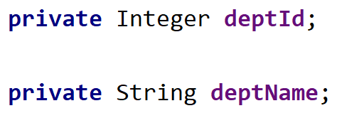

# MyBatis映射关系

## 处理字段名和属性名

MySQL要求使用"_"命名，而Java采用骆驼峰命名，所以有时候**字段名和属性名的名称会不一致**

表的字段名：


属性名：


**解决方法**

- 第一种：查询时将表中的字段名**设置别名**和属性名**一致**即可
- 第二种：通过全局配置`<settings>`在config中设置`mapUnderscoreToCamelCase`属性值为`true`**实现自动匹配**
- 第三种：使用`<resultMap>`在mapper中自定义映射处理

### 查询时数据库字段名和属性名一致

```xml
	<!--这里事先在mybatis-config.xml设置了Emp的别名-->
	<select id="select" resultType="Emp">
        <!--将emp_id字段名设置为empId与属性名一致，可以正确查询出结果-->
        select emp_id empId,emp_name empName,gender from t_emp
    </select>
```

```
Emp{empId=1, empName='yu', gender='男'}
```

### 通过全局配置(mapUnderscoreToCamelCase)

在mybatis-config.xml中通过`<settings>`设置——将**字段名的下划线映射为驼峰(emp_id-->empId)**

注意：在使用**resultMap**内使用二级标签时(`association`和`collection`)**会导致失效**，需要全部手动配置

```xml
	<!--字段名的下划线映射为驼峰-->
	<settings>
        <setting name="mapUnderscoreToCamelCase" value="true"/>
    </settings>
```

关于`<settings>`设置的全部属性可以参考MyBatis帮助文档有关settings的全部属性


```xml
	<!--这里事先在mybatis-config.xml设置了Emp的别名-->
	<select id="select" resultType="Emp">
        <!--将emp_id字段名设置为empId与属性名一致，可以正确查询出结果-->
        select * from t_emp
    </select>
```

```
Emp{empId=1, empName='yu', gender='男'}
```

### 使用resultMap自定义映射处理

resultMap可以设置自定义映射(**默认映射是按照字段名和属性名相同来进行匹配的，使用resultMap之后所有映射需要全部重新写**)

EmpMapper.xml

```xml
    <!--
        resultMap：设置自定义映射
        属性：
            id：唯一标识
            type：处理映射关系的实体类的类型
    -->
    <resultMap id="empResult" type="Emp">
        <!--
            子标签：
                id：设置主键的映射关系
                result：设置普通字段的映射关系
                association：设置多对一的映射关系
                collection：设置一对多的映射关系
            属性：
                column：设置映射关系中表中的字段名，必须是sql查询出的字段名
                property：设置映射关系中实体类中的属性名，必须是处理实体类中的属性名
        -->
        <id column="emp_id" property="empId"></id>
        <result column="emp_name" property="empName"></result>
    </resultMap>
    
    <select id="select" resultMap="empResult">
        select * from t_emp where emp_id=1
    </select>
```

```
Emp{empId=1, empName='yu', gender='男'}
```

## 处理多对一的映射关系

在联立查询时，查询结果覆盖多个表，与Java的映射也会存在嵌套关系，此时需要考虑**查询的结果与JavaBean中的属性存在多对一和一对多的映射关系**

> 例如：查询员工信息以及员工对应的部门信息，需要将两个表的信息汇总为一个JavaBean(多对一)

创建表Dept


将dept_id作为表Emp中的外键


创建Dept.java



在Emp.java(员工信息)中加入一个属性Dept.java(对应的部门)


**解决方法**

- 第一种：通过resultMap进行**级联处理**
- 第二种：通过resultMap的`association`属性进行处理
- 第三种：分步查询

### 通过resultMap进行级联处理

`property`属性内的值可以**通过`.`映射到类中对应的属性**

EmpMapper.xml

```xml
    <!--
        通过resultMap进行级联处理
    -->
    <resultMap id="getEmpAndDept" type="Emp">
        <id column="emp_id" property="empId"></id>
        <result column="emp_name" property="empName"></result>
        <result column="dept_id" property="dept.deptId"></result>
        <result column="dept_name" property="dept.deptName"></result>
    </resultMap>
	
    <select id="getEmpAndDept" resultMap="getEmpAndDept">
        select t_emp.*,t_dept.dept_name from t_emp join t_dept on t_emp.dept_id = t_dept.dept_id where t_emp.emp_id=#{empId}
    </select>
```

```
Emp{empId=1, empName='yu', gender='男', dept=Dept{deptId=10, deptName='管理部门'}}
```

### 通过resultMap的association直接进行处理

**在使用二级标签时，所有字段和属性的对应关系需要重新设置，系统不再依据名称相同匹配或者骆驼峰匹配**

`association`将类中的**一个属性**作为**类**来处理

EmpMapper.xml

```xml
	<resultMap id="getEmpAndDept" type="Emp">
        <id column="emp_id" property="empId"></id>
        <result column="emp_name" property="empName"></result>
        <!--
            association：处理多对一的映射关系(处理实体类类型的属性)
                property：设置需要处理映射关系的属性的属性名
                javaType：设置要处理的属性的类型
        -->
        <association property="dept" javaType="Dept">
            <id column="dept_id" property="deptId"></id>
            <result column="dept_name" property="deptName"></result>
        </association>
    </resultMap>
```

```
Emp{empId=1, empName='yu', gender='null', dept=Dept{deptId=10, deptName='管理部门'}}
```

### 分步查询(association进行分步处理)

`resultMap`中的`association`可以让JavaBean中**一对多参数**的**值**为调用**另外一个select查询出来的结果**，并可以让第一步查询的**一个字段**作为**下一步查询的参数**

- 第一步：先依据条件查出员工(Emp)表中的信息后，调用`association`将**字段dept_id**作为下一个select查询的参数并执行**`select * from t_emp where emp_id = ?`**
- 第二步：执行另外一个select查询后，将查询的部门(Dept)信息表结果返回给JavaBean参数(dept)**`select * from t_dept where dept_id = ?`**

EmpMapper.java

```java
    /**
     * 分步查询员工以及对应的部门信息
     * @param empId
     * @return
     */
    Emp getEmpAndDeptStep(@Param("empId") Integer empId);
```

EmpMapper.xml

```xml
	<resultMap id="getEmpAndDeptStepOne" type="Emp">
        <id column="emp_id" property="empId"></id>
        <result column="emp_name" property="empName"></result>

        <!--
            select：设置分步查询，查询某个属性的值的sql的标识（namespace.sqlId）
            column：将sql以及查询结果中的某个字段设置为分步查询的条件(作为下一步方法的参数)
        -->
        <association property="dept"
                     select="com.atguigu.mybatis.mapper.DeptMapper.getEmpAndDeptStepTwo"
                     column="dept_id">
        </association>
    </resultMap>

    <select id="getEmpAndDeptStep" resultMap="getEmpAndDeptStepOne">
        select * from t_emp where emp_id = #{empId}
    </select>
```

为了第二步有关部门(Dept)的查询，需要在对应目录下新建`DeptMapper.java`和`DeptMapper.xml`

DeptMapper.java

```java
	/**
     * 分布查询第二步，依据查询出来的deptId查询部门信息
     * @param deptId
     * @return
     */
    Dept getEmpAndDeptStepTwo(@Param("deptId") Integer deptId);
```

DeptMapper.xml

```xml
<mapper namespace="com.atguigu.mybatis.mapper.DeptMapper">

    <!--
        mybatis-config.xml文件中有配置字段名的下划线映射为驼峰
        参数会自动赋值为association上一步查询结果字段dept_id中的值
    -->
    <select id="getEmpAndDeptStepTwo" resultType="Dept">
        select * from t_dept where dept_id = #{deptId}
    </select>
</mapper>
```

```
Emp{empId=1, empName='yu', gender='男', dept=Dept{deptId=10, deptName='管理部门'}}
```

## 处理一对多的映射关系

> 例如：查询出在这个部门的所有员工，需要将表里面的多行信息对应为一个JavaBean(一对多)

在Dept.java添加属性`List<Emp> emps`用于存储多个员工信息


### 通过resultMap的collection直接进行处理

`collection`将**多个结果**(多行)处理存入类中的一个**属性**

DeptMapper.xml

```xml
    <!--
        ofType：设置collection标签所处理的集合属性中存储数据的类型
    -->
    <resultMap id="DeptAndEmp" type="Dept">
        <id column="dept_id" property="deptId"></id>
        <result column="dept_name" property="deptName"></result>
        <collection property="emps" ofType="Emp">
            <id column="emp_id" property="empId"></id>
            <result column="emp_name" property="empName"></result>
            <result column="gender" property="gender"></result>
        </collection>
    </resultMap>

    <select id="getDeptAndEmp" resultMap="DeptAndEmp">
        select t_dept.dept_name,t_emp.* from t_dept join t_emp on t_dept.dept_id = t_emp.dept_id where t_dept.dept_id = #{deptId}
    </select>
```

```
Dept{deptId=10, deptName='管理部门', emps=[Emp{empId=1, empName='yu', gender='男', dept=null}, Emp{empId=2, empName='xuan', gender='男', dept=null}]}
```

### 分步查询(collection进行分步处理)

`resultMap`中的`collection`可以让JavaBean中**一对多参数**的**值**为调用**另外一个select查询出来的结果**，并可以让第一步查询的**一个字段**作为**下一步查询的参数**

- 第一步：先依据条件查出部门(Dept)表中的信息后，调用`collection`将**字段dept_id**作为下一个select查询的参数并执行**`select * from t_dept where dept_id = ?`**
- 第二步：执行另外一个select查询后，将查询的员工(Emp)信息表结果返回给JavaBean参数(emps)**`select * from t_emp where dept_id = ?`**

DeptMapper.java

```java
    /**
     * 通过分步查询出某个部门的所有人员信息
     * @param deptId
     * @return
     */
    Dept getDeptAndEmpStep(@Param("deptId") Integer deptId);
```

DeptMapper.xml

```xml
    <resultMap id="getDeptAndEmpStepOne" type="Dept">
        <id column="dept_id" property="deptId"></id>
        <result column="dept_name" property="deptName"></result>
        <!--将查出来的值depy_id作为下一步查询的参数-->
        <collection property="emps"
                    select="com.atguigu.mybatis.mapper.EmpMapper.getDeptAndEmpStepTwo"
                    column="dept_id"></collection>
    </resultMap>
    
    <select id="getDeptAndEmpStep" resultMap="getDeptAndEmpStepOne">
        select * from t_dept where dept_id = #{deptId}
    </select>
```

EmpMapper.java

```java
    /**
     * 分布查询第二步，依据查询出来的empId查询员工信息
     * @param deptId
     * @return
     */
    List<Emp> getDeptAndEmpStepTwo(@Param("deptId") Integer deptId);
```

EmpMapper.xml

```xml
<mapper namespace="com.atguigu.mybatis.mapper.EmpMapper">
	<select id="getDeptAndEmpStepTwo" resultType="Emp">
        select * from t_emp where dept_id = #{deptId}
    </select>
</mapper>
```

```
Dept{deptId=10, deptName='管理部门', emps=[Emp{empId=1, empName='yu', gender='男', dept=null}, Emp{empId=2, empName='xuan', gender='男', dept=null}]}
```

> 分布查询是解决复杂查询和映射的最好的方法，当JavaBean中存在对象和对象列表时，使用association和collection的分布查询方法才能映射结果上去，否则会一致报错，因为结果超过两条，单通过assciation映射对象的属性时无法处理这种情况的，单用collection更不用说了

## 延迟加载

> 分步查询的优点：可以实现延迟加载
>
> 但是必须在核心配置文件中设置全局配置信息：
>
> lazyLoadingEnabled：延迟加载的全局开关。当开启时，所有关联对象都会延迟加载
>
> aggressiveLazyLoading：当开启时，任何方法的调用都会加载该对象的所有属性。否则，每个属性会按需加载此时就可以实现按需加载，获取的数据是什么，就只会执行相应的sql。(为false时为按需加载)
>
> 此时可通过`association`和`collection`中的fetchType属性设置当前的分步查询是否使用延迟加载，fetchType="lazy(延迟加载)|eager(立即加载)"

### 通过全局配置实现

MyBatis-config.xml

```xml
    <settings>
        <!--开启延迟加载-->
        <setting name="lazyLoadingEnabled" value="true"/>
        <!--按需加载(默认为false,为true则会执行全部sql语句)-->
        <setting name="aggressiveLazyLoading" value="false"/>
    </settings>
```

MyBatisTest.java

```java
		Emp emp2 = empMapper.getEmpAndDeptStep(1);
        //按需加载，这里不涉及到部门信息，所以不会执行到部门的sql语句
        System.out.println(emp2.getEmpId());
```

```
DEBUG 01-11 14:58:59,452 ==>  Preparing: select * from t_emp where emp_id = ? (BaseJdbcLogger.java:137) 
DEBUG 01-11 14:58:59,499 ==> Parameters: 1(Integer) (BaseJdbcLogger.java:137) 
DEBUG 01-11 14:58:59,593 <==      Total: 1 (BaseJdbcLogger.java:137) 
1
```

### 单独配置实现

EmpMapper.xml

```xml
        <!--
            fetchType：设置当前的分步查询是否使用延迟加载
                lazy(延迟加载)|eager(立即加载)
        -->
		<association property="dept" fetchType="lazy"
                     select="com.atguigu.mybatis.mapper.DeptMapper.getEmpAndDeptStepTwo"
                     column="dept_id">
        </association>
```

MyBatisTest.java

```java
		Emp emp2 = empMapper.getEmpAndDeptStep(1);
        //按需加载，这里不涉及到部门信息，所以不会执行到部门的sql语句
        System.out.println(emp2.getEmpId());
```

```
DEBUG 01-11 15:07:45,008 ==>  Preparing: select * from t_emp where emp_id = ? (BaseJdbcLogger.java:137) 
DEBUG 01-11 15:07:45,050 ==> Parameters: 1(Integer) (BaseJdbcLogger.java:137) 
DEBUG 01-11 15:07:45,141 <==      Total: 1 (BaseJdbcLogger.java:137) 
1
```

