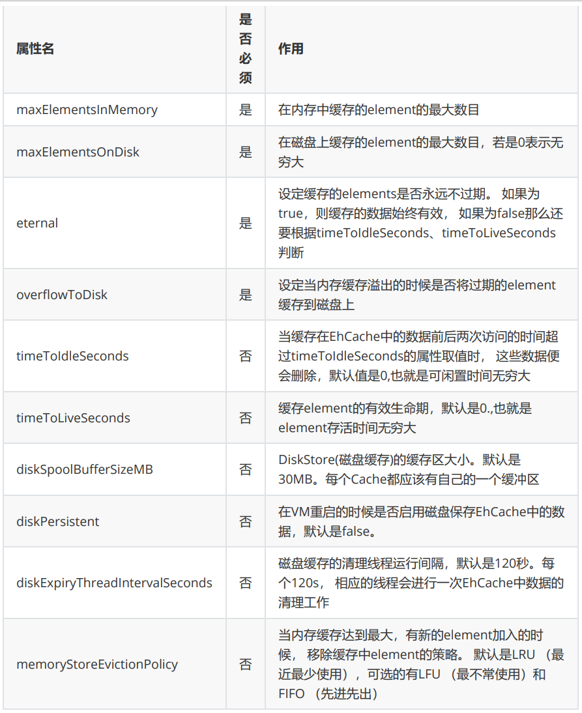

# MyBatis缓存

> MyBatis中的缓存主要针对查询功能，可以将查询出来的数据进行缓存，等待下次查询相同数据时就不需要向数据再发送请求

## MyBatis的一级缓存

一级缓存是`SqlSession`级别的，通过同一个SqlSession查询的数据会被缓存，下次查询相同的数据，就会从缓存中直接获取，不会从数据库重新访问(**MyBatis默认开启的**)

使一级缓存失效的四种情况： 

- 不同的SqlSession对应不同的一级缓存
- 同一个SqlSession但是查询条件不同
- 同一个SqlSession两次查询期间执行了任何一次增删改操作
- 同一个SqlSession两次查询期间手动清空了缓存(`sqlSession.clearCache()`)

MyBatisTest.java

```java
    @Test
    public void deptSelect(){
        SqlSession sqlSession = SqlSessionUtils.getSqlSession();
        DeptMapper deptMapper = sqlSession.getMapper(DeptMapper.class);

        Dept dept = deptMapper.getDeptAndEmp(10);
        System.out.println(dept);
        //同一个SqlSession对象，且在查询前没有进行增删改，所以第二次查询使用的缓存
        Dept dept1 = deptMapper.getDeptAndEmp(10);
        System.out.println(dept1);

        //这里创建了另外一个SqlSession对象
        SqlSession sqlSession1 = SqlSessionUtils.getSqlSession();
        DeptMapper deptMapper1 = sqlSession1.getMapper(DeptMapper.class);
        Dept dept2 = deptMapper1.getDeptAndEmp(10);
        System.out.println(dept2);
    }
```

```
DEBUG 01-13 16:06:06,618 ==>  Preparing: select t_dept.dept_name,t_emp.* from t_dept join t_emp on t_dept.dept_id = t_emp.dept_id where t_dept.dept_id = ? (BaseJdbcLogger.java:137) 
DEBUG 01-13 16:06:06,665 ==> Parameters: 10(Integer) (BaseJdbcLogger.java:137) 
DEBUG 01-13 16:06:06,696 <==      Total: 2 (BaseJdbcLogger.java:137) 
Dept{deptId=10, deptName='管理部门', emps=[Emp{empId=1, empName='yu', gender='男', dept=null}, Emp{empId=2, empName='xuan', gender='男', dept=null}]}
Dept{deptId=10, deptName='管理部门', emps=[Emp{empId=1, empName='yu', gender='男', dept=null}, Emp{empId=2, empName='xuan', gender='男', dept=null}]}
DEBUG 01-13 16:06:06,805 ==>  Preparing: select t_dept.dept_name,t_emp.* from t_dept join t_emp on t_dept.dept_id = t_emp.dept_id where t_dept.dept_id = ? (BaseJdbcLogger.java:137) 
DEBUG 01-13 16:06:06,805 ==> Parameters: 10(Integer) (BaseJdbcLogger.java:137) 
DEBUG 01-13 16:06:06,821 <==      Total: 2 (BaseJdbcLogger.java:137) 
Dept{deptId=10, deptName='管理部门', emps=[Emp{empId=1, empName='yu', gender='男', dept=null}, Emp{empId=2, empName='xuan', gender='男', dept=null}]}
```

## MyBatis的二级缓存

二级缓存是`SqlSessionFactory`级别，通过同一个SqlSessionFactory创建的SqlSession查询的结果会被缓存。此后若再次执行相同的查询语句，结果就会从缓存中获取

二级缓存开启的条件：

- 核心配置文件中，设置全局配置属性cacheEnabled="true"，默认为true，不需要设置
- 在映射文件中设置标签(`<cache></cache>`)
- 二级缓存必须在SqlSession关闭或提交之后有效(`sqlSession.close()`)
- 查询的数据所转换的实体类类型必须实现序列化的接口(JavaBean实现`implement Serializable `)

使二级缓存失效的情况： 

- 两次查询之间执行了任意的增删改，会使一级和二级缓存**同时失效**

Dept.java

```java
//存在的属性所对应的JavaBean——Emp也需要实现接口
public class Dept implements Serializable {
```

DeptMapper.xml

```xml
    <!--开启二级缓存-->
    <cache></cache>
```

MyBatisTest.java

```java
    @Test
    public void testCache() throws IOException {
        //读取MyBatis的核心配置文件的输入流
        InputStream is = Resources.getResourceAsStream("mybatis-config.xml");
        //获取SqlSessionFactoryBuilder对象
        SqlSessionFactoryBuilder sqlSessionFactoryBuilder = new SqlSessionFactoryBuilder();
        //根据核心配置文件的输入流创建工厂类SqlSessionFactory,来生产sql的会话对象SqlSession对象
        SqlSessionFactory sqlSessionFactory = sqlSessionFactoryBuilder.build(is);
        //生产SqlSession对象-->是mybatis提供的操作数据库的对象
        SqlSession sqlSession = sqlSessionFactory.openSession(true);//这里参数填"true"就可以实现自动提交事务
        //创建两个同一SqlSessionFactory生产的SqlSession对象
        SqlSession sqlSession1 = sqlSessionFactory.openSession(true);

        DeptMapper deptMapper = sqlSession.getMapper(DeptMapper.class);
        Dept dept = deptMapper.getDeptAndEmp(10);
        System.out.println(dept);
        //关闭sqlSession后从一级缓存存入二级缓存
        sqlSession.close();

        //这里创建了另外一个SqlSession对象，但是是同一个SqlSessionFactory
        DeptMapper deptMapper1 = sqlSession1.getMapper(DeptMapper.class);
        Dept dept1 = deptMapper1.getDeptAndEmp(10);
        System.out.println(dept1);
        sqlSession1.close();
    }
```

```
DEBUG 01-13 16:41:19,526 Cache Hit Ratio [com.atguigu.mybatis.mapper.DeptMapper]: 0.0 (LoggingCache.java:60) 
DEBUG 01-13 16:41:21,105 ==>  Preparing: select t_dept.dept_name,t_emp.* from t_dept join t_emp on t_dept.dept_id = t_emp.dept_id where t_dept.dept_id = ? (BaseJdbcLogger.java:137) 
DEBUG 01-13 16:41:21,136 ==> Parameters: 10(Integer) (BaseJdbcLogger.java:137) 
DEBUG 01-13 16:41:21,167 <==      Total: 2 (BaseJdbcLogger.java:137) 
Dept{deptId=10, deptName='管理部门', emps=[Emp{empId=1, empName='yu', gender='男', dept=null}, Emp{empId=2, empName='xuan', gender='男', dept=null}]}
WARN  01-13 16:41:21,183 As you are using functionality that deserializes object streams, it is recommended to define the JEP-290 serial filter. Please refer to https://docs.oracle.com/pls/topic/lookup?ctx=javase15&id=GUID-8296D8E8-2B93-4B9A-856E-0A65AF9B8C66 (SerialFilterChecker.java:46) 
DEBUG 01-13 16:41:21,183 Cache Hit Ratio [com.atguigu.mybatis.mapper.DeptMapper]: 0.5 (LoggingCache.java:60) 
Dept{deptId=10, deptName='管理部门', emps=[Emp{empId=1, empName='yu', gender='男', dept=null}, Emp{empId=2, empName='xuan', gender='男', dept=null}]}
```

### 二级缓存的相关配置

> 在mapper配置文件中添加的cache标签可以设置一些属性：

①eviction属性：缓存回收策略，默认的是 LRU

- LRU（Least Recently Used） – 最近最少使用的：移除最长时间不被使用的对象
- FIFO（First in First out） – 先进先出：按对象进入缓存的顺序来移除它们
- SOFT – 软引用：移除基于垃圾回收器状态和软引用规则的对象

- WEAK – 弱引用：更积极地移除基于垃圾收集器状态和弱引用规则的对象

②flushInterval属性：刷新间隔，单位毫秒

- 默认情况是不设置，也就是没有刷新间隔，缓存仅仅调用语句时刷新

③size属性：引用数目，正整数

- 代表缓存最多可以存储多少个对象，太大容易导致内存溢出

④readOnly属性：只读， true/false

- true：只读缓存；会给所有调用者返回缓存对象的相同实例。因此这些对象不能被修改。这提供了很重要的性能优势。
-  false：读写缓存；会返回缓存对象的拷贝（通过序列化）。这会慢一些，但是安全，因此默认是false

## MyBatis缓存查询顺序

- 先查询二级缓存，因为二级缓存中可能会有其他程序已经查出来的数据，可以拿来直接使用。
  - 如果二级缓存没有命中，再查询一级缓存
    - 如果一级缓存也没有命中，则查询数据库

**SqlSession关闭之后，一级缓存中的数据会写入二级缓存**

## 整合第三方缓存EHCache

MyBatis的二级缓存可以使用第三方缓存进行整合和管理

### 添加依赖

pom.xml

```xml
    <!-- Mybatis EHCache整合包 -->
    <dependency>
        <groupId>org.mybatis.caches</groupId>
        <artifactId>mybatis-ehcache</artifactId>
        <version>1.2.1</version>
    </dependency>
    <!-- slf4j日志门面的一个具体实现 -->
    <dependency>
        <groupId>ch.qos.logback</groupId>
        <artifactId>logback-classic</artifactId>
        <version>1.2.3</version>
    </dependency>
```

**各jar包功能**

|    jar包名称    |              作用               |
| :-------------: | :-----------------------------: |
| mybatis-ehcache |    Mybatis和EHCache的整合包     |
|     ehcache     |          EHCache核心包          |
|    slf4j-api    |         SLF4J日志门面包         |
| logback-classic | 支持SLF4J门面接口的一个具体实现 |

### 创建EHCache的配置文件ehcache.xml

在`resources`目录下创建ehcache.xml

```xml
<?xml version="1.0" encoding="utf-8" ?>
<ehcache xmlns:xsi="http://www.w3.org/2001/XMLSchema-instance"
		xsi:noNamespaceSchemaLocation="../config/ehcache.xsd">
	<!-- 磁盘保存路径(按需修改) -->
	<diskStore path="D:\atguigu\ehcache"/>
	<defaultCache
		maxElementsInMemory="1000"
		maxElementsOnDisk="10000000"
		eternal="false"
		overflowToDisk="true"
		timeToIdleSeconds="120"
		timeToLiveSeconds="120"
		diskExpiryThreadIntervalSeconds="120"
		memoryStoreEvictionPolicy="LRU">
	</defaultCache>
</ehcache>
```

**EHCache配置文件说明**



### 设置二级缓存的类型

在Mapper.xml文件中需要对使用的二级缓存进行声明，否则就会使用MyBatis默认的二级缓存

```xml
<!-- 不需要修改 -->
<cache type="org.mybatis.caches.ehcache.EhcacheCache"/>
```

### 加入logback日志

> 存在SLF4J时，作为简易日志的log4j将失效，此时我们需要借助SLF4J的具体实现logback来打印日 志。 创建logback的配置文件logback.xml

在`resources`目录下创建logback.xml

```xml
<?xml version="1.0" encoding="UTF-8"?>
<configuration debug="true">
	<!-- 指定日志输出的位置 -->
	<appender name="STDOUT" class="ch.qos.logback.core.ConsoleAppender">
		<encoder>
			<!-- 日志输出的格式 -->
			<!-- 按照顺序分别是： 时间、日志级别、线程名称、打印日志的类、日志主体内容、换行-->
		<pattern>[%d{HH:mm:ss.SSS}] [%-5level] [%thread] [%logger]
[%msg]%n</pattern>
		</encoder>
	</appender>

	<!-- 设置全局日志级别。日志级别按顺序分别是： DEBUG、INFO、WARN、ERROR -->
	<!-- 指定任何一个日志级别都只打印当前级别和后面级别的日志。 -->
	<root level="DEBUG">
		<!-- 指定打印日志的appender，这里通过“STDOUT”引用了前面配置的appender -->
		<appender-ref ref="STDOUT" />
	</root>

	<!-- 根据特殊需求指定局部日志级别(按需修改) -->
	<logger name="com.atguigu.crowd.mapper" level="DEBUG"/>
</configuration>
```