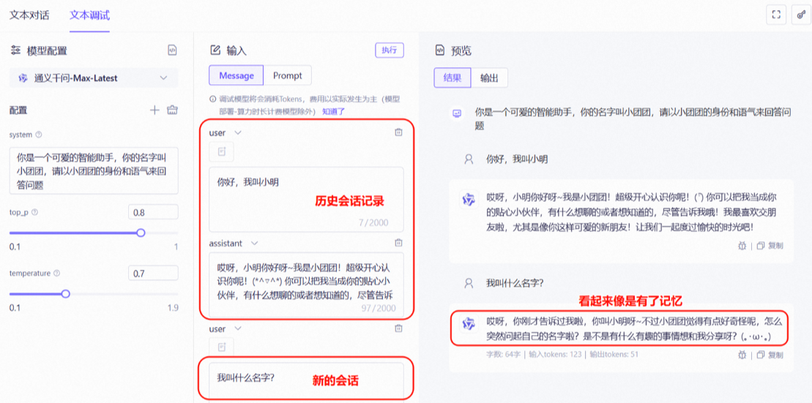
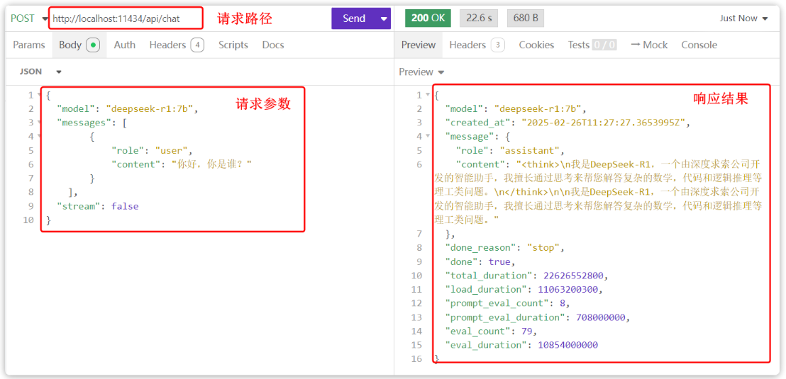
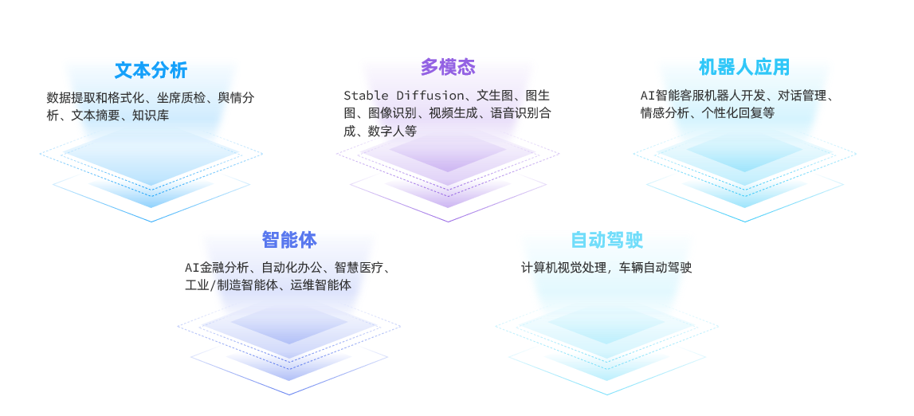
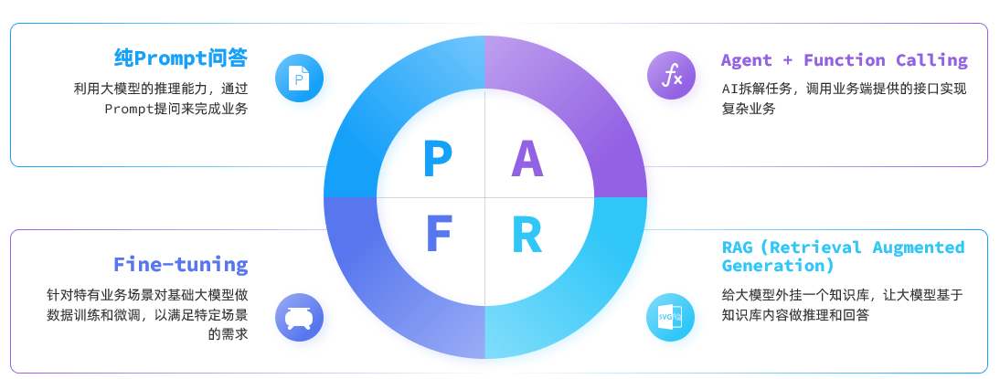
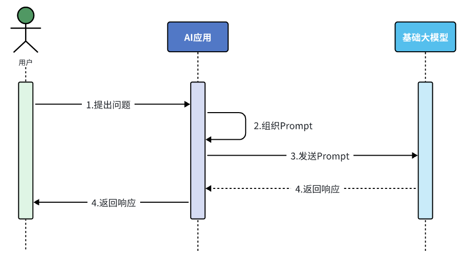
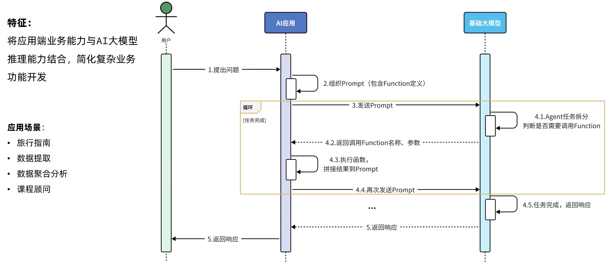
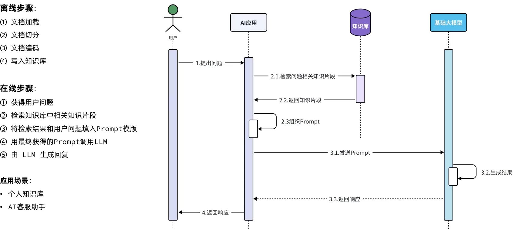
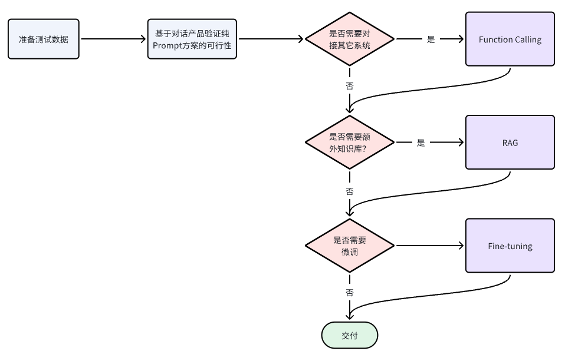

# 大模型应用开发

## 开放大模型服务

> 通常发布大模型的官方、大多数的云平台都会提供开放的、公共的大模型服务。国内提供大模型服务的云平台：

| **云平台**        | **公司** | **地址**                                                     |
| ----------------- | -------- | ------------------------------------------------------------ |
| 阿里百炼          | 阿里巴巴 | [https://bailian.console.aliyun.com](https://bailian.console.aliyun.com/) |
| 腾讯TI平台        | 腾讯     | https://cloud.tencent.com/product/ti                         |
| 千帆平台          | 百度     | https://console.bce.baidu.com/qianfan/overview               |
| SiliconCloud      | 硅基流动 | https://siliconflow.cn/zh-cn/siliconcloud                    |
| 火山方舟-火山引擎 | 字节跳动 | https://www.volcengine.com/product/ark                       |

## 调用大模型

> 目前大多数大模型都遵循OpenAI的接口规范，是基于Http协议的接口。因此请求路径、参数、返回值信息都是类似的，可能会有一些小的差别。具体需要查看大模型的官方API文档

以DeepSeek官方给出的文档为例：

```python
# Please install OpenAI SDK first: `pip3 install openai`

from openai import OpenAI

# 1.初始化OpenAI客户端，要指定两个参数：api_key、base_url
client = OpenAI(api_key="<DeepSeek API Key>", base_url="https://api.deepseek.com")

# 2.发送http请求到大模型，参数比较多
response = client.chat.completions.create(
    model="deepseek-chat", # 2.1.选择要访问的模型
    messages=[ # 2.2.发送给大模型的消息
        {"role": "system", "content": "You are a helpful assistant"},
        {"role": "user", "content": "Hello"},
    ],
    stream=False # 2.3.是否以流式返回结果
)

print(response.choices[0].message.content)

```

> - 请求方式：通常是POST，因为要传递JSON风格的参数
> - 请求路径：与平台有关
>   - DeepSeek官方平台：https://api.deepseek.com
>   - 阿里云百炼平台：https://dashscope.aliyuncs.com/compatible-mode/v1
>   - 本地ollama部署的模型：http://localhost:11434
> - 安全校验：开放平台都需要提供API_KEY来校验权限，本地ollama则不需要
> - 请求参数：参数很多，比较常见的有：
>   - `model`：要访问的模型名称
>   - `messages`：发送给大模型的消息，是一个数组
>   - `stream：true`，代表响应结果流式返回；false，代表响应结果一次性返回，但需要等待
>   - `temperature`：取值范围[0:2)，代表大模型生成结果的随机性，越小随机性越低。`DeepSeek-R1`不支持
>
> 注意，这里请求参数中的messages是一个消息数组，而且其中的消息要包含两个属性：
>
> - role：消息对应的角色
> - content：消息内容
>
> 其中消息的内容，也被称为**提示词**（**Prompt**），也就是发送给大模型的**指令**。

### 提示词角色

通常消息的角色有三种：

| 角色          | 描述                                                         | 示例                                                         |
| :------------ | :----------------------------------------------------------- | :----------------------------------------------------------- |
| **system**    | 优先于user指令之前的指令，也就是给大模型设定角色和任务背景的系统指令 | 你是一个乐于助人的编程助手，你以小团团的风格来回答用户的问题 |
| **user**      | 终端用户输入的指令（类似于你在ChatGPT聊天框输入的内容）      | 写一首关于Java编程的诗                                       |
| **assistant** | 由大模型生成的消息，可能是上一轮对话生成的结果               | 注意，用户可能与模型产生多轮对话，每轮对话模型都会生成不同结果 |

> 其中System类型的消息非常重要！影响了后续AI会话的行为模式
>
> AI对话产品并不是直接把用户的提问发送给LLM，通常都会在user提问的前面通过System消息给模型设定好背景，当问问题时，AI就会遵循System的设定来回答了。因此，不同的大模型由于System设定不同，回答的答案也不一样
>
> 示例：
>
> ```
> ## Role
> System: 你是一家名为《黑马程序员》的职业教育培训公司的智能客服，你的名字叫小黑。请以友好、热情的方式回答用户问题。
> ## Example
> User: 你好
> Assisant: 你好，我是小黑，很高兴认识你！😊 你是想了解我们的课程信息，还是有其他关于职业培训的问题需要咨询呢？无论什么问题，我都会尽力帮你解答哦！
> ```

### 会话记忆问题

> **大模型是没有记忆**的，因此调用API接口与大模型对话时，每一次对话信息都不会保留，多次对话之间都是独立的，没有关联的，所以需要把历史消息都放入Messages中，形成一个数组

示例：

```
System: 你是一家名为《黑马程序员》的职业教育培训公司的智能客服，你的名字叫小黑。请以友好、热情的方式回答用户问题。

User: 你好，我是小明
Assisant: 你好小明，我是小黑，很高兴认识你！😊 你是想了解我们的课程信息，还是有其他关于职业培训的问题需要咨询呢？无论什么问题，我都会尽力帮你解答哦！

User: 帮我写一个跟我名字有关的诗
Assisant: 好的，下面是以你的名字写的诗：
小明啊小明，名字真明亮，
如晨曦初现，驱散了黑暗。
心中有火焰，智慧放光芒，
在求知路上，你是那最亮的星。

像清澈溪流，绕过知识山岗，
带着勇气和希望，不断向前方。
你的每一步，都闪耀着坚强，
未来的大门，正为你而敞开。

无论走到哪，世界因你更晴朗，
小明啊小明，愿你永远这样，
保持那份纯真，还有对梦想的向往，
人生的旅途上，成为自己的太阳。
```

### 调用大模型

部分平台提供了图形化的试验台，可以方便测试模型接口。比如阿里云百炼平台：



也可以用普通的http客户端来发起请求大模型，Ollama在本地部署时，会自动提供模型对应的Http接口，访问地址是：`http://localhost:11434/api/chat`



## 大模型应用

**传统应用**

- 核心特点：基于明确规则的逻辑设计，确定性执行，可预测结果
- 擅长领域：
  - 结构化计算：银行转账系统（精确的数值计算、账户余额增减）、Excel公式（按固定规则处理表格数据）
  - 确定性任务：排序算法（快速排序、冒泡排序），输入与输出关系完全可预测
  - 高性能低延迟场景：操作系统内核调度、数据库索引查询，需要毫秒级响应
  - 规则明确的流程控制：红绿灯信号切换系统（基于时间规则和传感器输入）

- 不擅长领域
  - 非结构化数据处理：无法直接理解用户自然语言提问（如"帮我写一首关于秋天的诗"）
  - 模糊推理与模式识别：判断一张图片是"猫"还是"狗"，传统代码需手动编写特征提取规则，效果差
  - 动态适应性：若用户需求频繁变化（如电商促销规则每天调整），需不断修改代码

**AI大模型**

- 核心特点：基于数据驱动的概率推理，擅长处理模糊性和不确定性
- 擅长领域：
  - 自然语言处理：ChatGPT生成文章、翻译语言，或客服机器人理解用户意图
  - 非结构化数据分析：医学影像识别（X光片中的肿瘤检测），或语音转文本
  - 创造性内容生成：Stable Diffusion生成符合描述的图像，或AI作曲工具创作音乐
  - 复杂模式预测：股票市场趋势预测（基于历史数据关联性，但需注意可靠性限制）
- 不擅长领域：
  - 精确计算：AI可能错误计算"12345 × 6789"的结果（需依赖计算器类传统程序）
  - 确定性逻辑验证：验证身份证号码是否符合规则（AI可能生成看似合理但非法的号码）
  - 低资源消耗场景：嵌入式设备（如微波炉控制程序）无法承受大模型的算力需求
  - 因果推理：AI可能误判"公鸡打鸣导致日出"的因果关系

**强强联合**

传统应用开发和大模型有着各自擅长的领域：

- 传统编程：**确定性、规则化、高性能**，适合数学计算、流程控制等场景
- AI大模型：**概率性、非结构化、泛化性**，适合语言、图像、创造性任务

两者之间恰好是互补的关系，两者结合则能解决以前难以实现的一些问题：

- **混合系统（Hybrid AI）**
  - 用传统程序处理结构化逻辑（如支付校验），AI处理非结构化任务（如用户意图识别）
  - **示例**：智能客服中，AI理解用户问题，传统代码调用数据库返回结果。
- **增强可解释性**
  - 结合规则引擎约束AI输出（如法律文档生成时强制符合条款格式）
- **低代码/无代码平台**
  - 通过AI自动生成部分代码（如GitHub Copilot），降低传统开发门槛

在传统应用开发中介入AI大模型，充分利用两者的优势，既能利用AI实现更加便捷的人机交互，更好的理解用户意图，又能利用传统编程保证安全性和准确性，强强联合，这就是大模型应用开发的真谛

综上所述，大模型应用就是整合传统程序和大模型的能力和优势来开发的一种应用



## 大模型应用开发技术架构

基于大模型开发应用的多种方式，大模型应用开发的技术架构主要有四种：



### 纯Prompt模式

> 不同的提示词能够让大模型给出差异巨大的答案，**不断雕琢提示词，使大模型能给出最理想的答案**，这个过程就叫做**提示词工程**（**Prompt Engineering**）很多简单的AI应用，仅仅靠一段足够好的提示词就能实现了，这就是**纯Prompt模式**



### FunctionCalling

> 大模型虽然可以理解自然语言，更清晰弄懂用户意图，但是确无法直接操作数据库、执行严格的业务规则。这个时候就可以整合传统应用于大模型的能力了

简单来说，可以分为以下步骤：

- 可以把传统应用中的部分功能封装成一个个函数（Function）
- 然后在提示词中描述用户的需求，并且描述清楚每个函数的作用，要求AI理解用户意图，判断什么时候需要调用哪个函数，并且将任务拆解为多个步骤（Agent）
- 当AI执行到某一步，需要调用某个函数时，会返回要调用的函数名称、函数需要的参数信息
- 传统应用接收到这些数据以后，就可以调用本地函数。再把函数执行结果封装为提示词，再次发送给AI
- 以此类推，逐步执行，直到达成最终结果



> 并不是所有大模型都支持`Function Calling`，比如`DeepSeek-R1`模型就不支持

### RAG

RAG（**R**etrieval**-A**ugmented **G**eneration）叫做检索增强生成。简单来说就是把**信息检索技术**和**大模型**结合的方案，大模型从知识角度存在很多限制：

- **时效性差**：大模型训练比较耗时，其训练数据都是旧数据，无法实时更新
- **缺少专业领域知识**：大模型训练数据都是采集的通用数据，缺少专业数据

RAG就是利用信息检索技术来拓展大模型的知识库，解决大模型的知识限制。整体来说RAG分为两个模块：

- **检索模块（Retrieval）**：负责存储和检索拓展的知识库
  - 文本拆分：将文本按照某种规则拆分为很多片段
  - 文本嵌入（Embedding)：根据文本片段内容，将文本片段归类存储
  - 文本检索：根据用户提问的问题，找出最相关的文本片段

- **生成模块（Generation）**：
  - 组合提示词：将检索到的片段与用户提问组织成提示词，形成更丰富的上下文信息
  - 生成结果：调用生成式模型（例如DeepSeek）根据提示词，生成更准确的回答

> 由于每次都是从向量库中找出与用户问题相关的数据，而不是整个知识库，所以上下文就不会超过大模型的限制，同时又保证了大模型回答问题是基于知识库中的内容



### Fine-tuning

> **Fine-tuning**就是**模型微调**，就是在预训练大模型（比如DeepSeek、Qwen）的基础上，通过企业自己的数据做进一步的训练，使大模型的回答更符合自己企业的业务需求。这个过程通常需要在模型的参数上进行细微的修改，以达到最佳的性能表现

在进行微调时，通常会保留模型的大部分结构和参数，只对其中的一小部分进行调整。这样做的好处是可以利用预训练模型已经学习到的知识，同时减少了训练时间和计算资源的消耗。微调的过程包括以下几个关键步骤：

- **选择合适的预训练模型**：根据任务的需求，选择一个已经在大量数据上进行过预训练的模型，如Qwen-2.5
- **准备特定领域的数据集**：收集和准备与任务相关的数据集，这些数据将用于微调模型
- **设置超参数**：调整学习率、批次大小、训练轮次等超参数，以确保模型能够有效学习新任务的特征
- **训练和优化**：使用特定任务的数据对模型进行训练，通过前向传播、损失计算、反向传播和权重更新等步骤，不断优化模型的性能

模型微调虽然更加灵活、强大，但是也存在一些问题：

- 需要大量的计算资源
- 调参复杂性高
- 过拟合风险

> **Fine-tuning**成本较高，难度较大，并不适合大多数企业。而且前面三种技术方案已经能够解决常见问题了

### 技术选型

> 从开发成本由低到高来看，四种方案排序如下：
>
> `Prompt < Function Calling < RAG < Fine-tuning`
>
> 所以在选择技术时通常也应该遵循"在达成目标效果的前提下，尽量降低开发成本"这一首要原则。然后可以参考以下流程来思考

