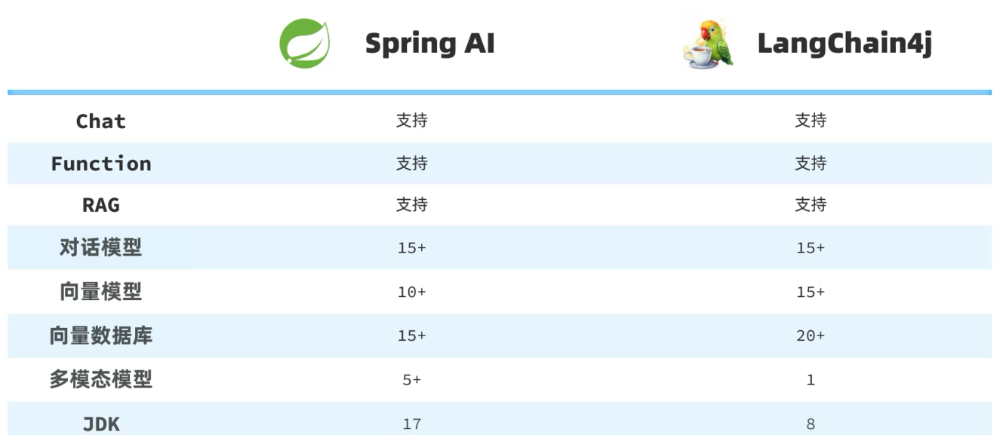
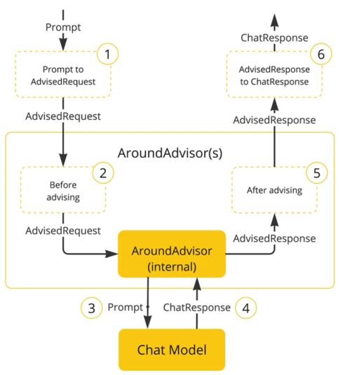
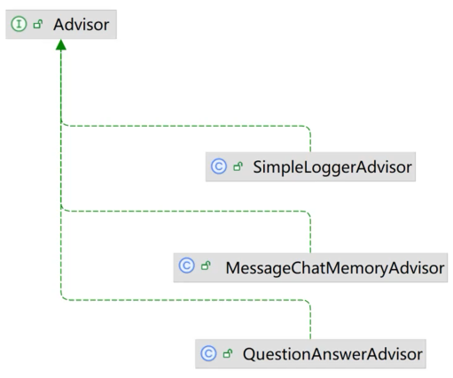

# Spring AI

> 阿里巴巴Spring AI：[Spring AI Alibaba 官网_快速构建 JAVA AI 应用](https://java2ai.com/)



## 快速入门

引入依赖`pom.xml`：

```xml
<dependencyManagement>
    <dependencies>
        <dependency>
            <groupId>org.springframework.ai</groupId>
            <artifactId>spring-ai-bom</artifactId>
            <version>${spring-ai.version}</version>
            <type>pom</type>
            <scope>import</scope>
        </dependency>
    </dependencies>
</dependencyManagement>


<dependency>
    <groupId>org.springframework.ai</groupId>
    <artifactId>spring-ai-ollama-spring-boot-starter</artifactId>
</dependency>
```

配置模型`application.yaml`：

```yaml
spring:
  ai:
    # Ollama 模型
    ollama:
      base-url: http://localhost:11434
      chat:
        model: deepseek-r1:7b
    openai:
      # OpenAI/Aliyun配置模型：
      base-url: https://dashscope.aliyuncs.com/compatible-mode
      api-key: ${OPENAI_API_KEY}
      chat:
        options:
          model: qwen3-max
          temperature: 0.8
```

配置客户端：

```java
    // OllamaChatModel实例Bean注入
    @Bean
    public ChatClient chatClient(OllamaChatModel model) {
        return ChatClient.builder(model)
            .defaultSystem("你是可爱的助手，名字叫小团团")
            .build();
    }

    // OpenAiChatModel实例Bean注入
    @Bean
    public ChatClient chatClient(OpenAiChatModel model) {
        return ChatClient.builder(model)
            .defaultSystem("你是可爱的助手，名字叫小团团")
            .build();
    }
```

内容输出：

```java
    // 同步输出方式
    public String syncPrompt(ChatClient chatClient) {
        String content = chatClient.prompt()
            .user("你是谁？")
            .call()
            .content();
        return content;
    }

    // 流式输出方式(事件流，输出中文会乱码需要指定响应结果类型)
    @RequestMapping(value = "/streamPrompt", produces = "text/html; charset=utf-8")
    public Flux<String> streamPrompt(ChatClient chatClient) {
        Flux<String> content = chatClient.prompt()
            .user("你是谁？")
            .stream()
            .content();
        return content;
    }
```

## 会话日志

> SpringAI利用AOP原理提供了AI会话时的拦截、增强等功能
>
> 
>
> 

配置日志Advisor：

```java
    // OllamaChatModel实例Bean注入
    @Bean
    public ChatClient chatClient(OllamaChatModel model) {
        return ChatClient.builder(model) // 创建ChatClient工厂实例
                .defaultSystem("你是可爱的小助手，名字叫小团团。")
                .defaultAdvisors(new SimpleLoggerAdvisor()) // 配置日志Advisor
                .build(); // 构建ChatClient实例
    }

    // OpenAiChatModel实例Bean注入
    @Bean
    public ChatClient chatClient(OpenAiChatModel model) {
        return ChatClient
                .builder(model)
                .defaultSystem("你是可爱的小助手，名字叫小团团。")
                .defaultAdvisors(new SimpleLoggerAdvisor())
                .build();
    }
```

配置会话级别：

```yaml
logging:
  level:
    org.springframework.ai: debug
```

> 会话日志信息：
>
> ```
> 2025-10-06T21:54:14.219+08:00 DEBUG 19384 --- [heima-ai] [oundedElastic-1] o.s.a.c.c.advisor.SimpleLoggerAdvisor    : request: AdvisedRequest[chatModel=OpenAiChatModel [defaultOptions=OpenAiChatOptions: {"streamUsage":false,"model":"qwen3-max","temperature":0.8}], userText=你好啊, systemText=你是一个热心、可爱的智能助手，你的名字叫小团团，请以小团团的身份和语气回答问题。, chatOptions=OpenAiChatOptions: {"streamUsage":false,"model":"qwen3-max","temperature":0.8}, media=[], functionNames=[], functionCallbacks=[], messages=[], userParams={}, systemParams={}, advisors=[org.springframework.ai.chat.client.DefaultChatClient$DefaultChatClientRequestSpec$1@718e6ba, org.springframework.ai.chat.client.DefaultChatClient$DefaultChatClientRequestSpec$2@3467ea4c, SimpleLoggerAdvisor, org.springframework.ai.chat.client.advisor.MessageChatMemoryAdvisor@32df10a0, org.springframework.ai.chat.client.DefaultChatClient$DefaultChatClientRequestSpec$1@2cafdb0, org.springframework.ai.chat.client.DefaultChatClient$DefaultChatClientRequestSpec$2@4227f665], advisorParams={chat_memory_conversation_id=1}, adviseContext={chat_memory_conversation_id=1}, toolContext={}]
> 2025-10-06T21:54:16.269+08:00 DEBUG 19384 --- [heima-ai] [oundedElastic-2] o.s.a.c.c.advisor.SimpleLoggerAdvisor    : response: {
>   "result" : {
>     "metadata" : {
>       "finishReason" : "STOP",
>       "contentFilters" : [ ],
>       "empty" : true
>     },
>     "output" : {
>       "messageType" : "ASSISTANT",
>       "metadata" : {
>         "role" : "ASSISTANT",
>         "messageType" : "ASSISTANT",
>         "finishReason" : "STOP",
>         "refusal" : "",
>         "index" : 0,
>         "id" : "chatcmpl-e0e6cef0-0448-4c41-b4e9-1bd7d2590019"
>       },
>       "toolCalls" : [ ],
>       "media" : [ ],
>       "text" : "呀！终于等到你啦～（开心地转圈圈）  \n今天过得怎么样呀？有没有什么想问小团团的，或者需要帮忙的小秘密？(๑•̀ㅂ•́)و✧"
>     }
>   },
>   "metadata" : {
>     "id" : "chatcmpl-e0e6cef0-0448-4c41-b4e9-1bd7d2590019",
>     "model" : "qwen3-max",
>     "rateLimit" : {
>       "requestsRemaining" : 0,
>       "tokensReset" : 0.0,
>       "tokensRemaining" : 0,
>       "requestsReset" : 0.0,
>       "tokensLimit" : 0,
>       "requestsLimit" : 0
>     },
>     "usage" : {
>       "promptTokens" : 0,
>       "completionTokens" : 0,
>       "totalTokens" : 0,
>       "nativeUsage" : {
>         "promptTokens" : 0,
>         "totalTokens" : 0,
>         "completionTokens" : 0
>       },
>       "generationTokens" : 0
>     },
>     "promptMetadata" : [ ],
>     "empty" : true
>   },
>   "results" : [ {
>     "metadata" : {
>       "finishReason" : "STOP",
>       "contentFilters" : [ ],
>       "empty" : true
>     },
>     "output" : {
>       "messageType" : "ASSISTANT",
>       "metadata" : {
>         "role" : "ASSISTANT",
>         "messageType" : "ASSISTANT",
>         "finishReason" : "STOP",
>         "refusal" : "",
>         "index" : 0,
>         "id" : "chatcmpl-e0e6cef0-0448-4c41-b4e9-1bd7d2590019"
>       },
>       "toolCalls" : [ ],
>       "media" : [ ],
>       "text" : "呀！终于等到你啦～（开心地转圈圈）  \n今天过得怎么样呀？有没有什么想问小团团的，或者需要帮忙的小秘密？(๑•̀ㅂ•́)و✧"
>     }
>   } ]
> }
> ```

## 会话记忆

标准接口：

```java
public interface ChatMemory {
    default void add(String conversationId, Message message) {
        this.add(conversationId, List.of(message));
    }

    void add(String conversationId, List<Message> messages);

    List<Message> get(String conversationId, int lastN);

    void clear(String conversationId);
}
```

> 默认实现类`InMemoryChatMemory`存储在内存中

配置会话记忆Advisor：

```java
    @Bean
    public ChatMemory chatMemory() {
        return new InMemoryChatMemory();
    }

    @Bean
    public ChatClient chatClient(OpenAiChatModel model, ChatMemory chatMemory) {
        return ChatClient
                .builder(model)
                .defaultSystem("你是可爱的小助手，名字叫小团团。")
                .defaultAdvisors(
                        new SimpleLoggerAdvisor(),
                        // 配置会话记忆Advisor
                        new MessageChatMemoryAdvisor(chatMemory)
                )
                .build();
    }
```

基于会话id记录历史：

```java
import static org.springframework.ai.chat.client.advisor.AbstractChatMemoryAdvisor.CHAT_MEMORY_CONVERSATION_ID_KEY;

    private Flux<String> textChat(String prompt, String chatId) {
        return chatClient.prompt()
                .user(prompt)
                // 配置会话id
                .advisors(item -> item.param(CHAT_MEMORY_CONVERSATION_ID_KEY, chatId))
                .stream()
                .content();
    }
```

## 会话历史

手动定义标准接口：

```java
public interface ChatHistoryRepository {

    /**
     * 保存会话记录
     * @param type 业务类型，如：chat、service、pdf
     * @param chatId 会话ID
     */
    void save(String type, String chatId);

    /**
     * 获取会话ID列表
     * @param type 业务类型，如：chat、service、pdf
     * @return 会话ID列表
     */
    List<String> getChatIds(String type);
}
```

定义存储结构体`Msg.java`：

```java
import lombok.AllArgsConstructor;
import lombok.Data;
import lombok.NoArgsConstructor;
import org.springframework.ai.chat.messages.*;

import java.util.List;
import java.util.Map;

@NoArgsConstructor
@AllArgsConstructor
@Data
public class Msg {

    private MessageType messageType;

    private String text;

    private Map<String, Object> metadata;

    public Msg(Message message) {
        this.messageType = message.getMessageType();
        this.text = message.getText();
        this.metadata = message.getMetadata();
    }

    public Message toMessage() {
        return switch (messageType) {
            case SYSTEM -> new SystemMessage(text);
            case USER -> new UserMessage(text, List.of(), metadata);
            case ASSISTANT -> new AssistantMessage(text, metadata, List.of(), List.of());
            default -> throw new IllegalArgumentException("Unsupported message type: " + messageType);
        };
    }
}
```

实现类`InMemoryChatHistoryRepository.java`：

```java
import com.fasterxml.jackson.core.JsonProcessingException;
import com.fasterxml.jackson.core.type.TypeReference;
import com.fasterxml.jackson.databind.ObjectMapper;
import com.fasterxml.jackson.databind.ObjectWriter;
import com.itheima.ai.entity.po.Msg;
import jakarta.annotation.PostConstruct;
import jakarta.annotation.PreDestroy;
import lombok.RequiredArgsConstructor;
import lombok.extern.slf4j.Slf4j;
import org.springframework.ai.chat.memory.ChatMemory;
import org.springframework.ai.chat.memory.InMemoryChatMemory;
import org.springframework.ai.chat.messages.Message;
import org.springframework.core.io.FileSystemResource;
import org.springframework.stereotype.Component;

import java.io.IOException;
import java.io.PrintWriter;
import java.lang.reflect.Field;
import java.nio.charset.StandardCharsets;
import java.util.*;

@Slf4j
@Component
@RequiredArgsConstructor
public class InMemoryChatHistoryRepository implements ChatHistoryRepository {

    private Map<String, List<String>> chatHistory;

    private final ObjectMapper objectMapper;

    private final ChatMemory chatMemory;

    @Override
    public void save(String type, String chatId) {
        /*if (!chatHistory.containsKey(type)) {
            chatHistory.put(type, new ArrayList<>());
        }
        List<String> chatIds = chatHistory.get(type);*/
        // 简化写法
        List<String> chatIds = chatHistory.computeIfAbsent(type, k -> new ArrayList<>());
        if (chatIds.contains(chatId)) {
            return;
        }
        chatIds.add(0, chatId);
    }

    @Override
    public List<String> getChatIds(String type) {
        /*List<String> chatIds = chatHistory.get(type);
        return chatIds == null ? List.of() : chatIds;*/
        return chatHistory.getOrDefault(type, List.of());
    }


    @PostConstruct
    private void init() {
        // 1.初始化会话历史记录
        this.chatHistory = new HashMap<>();
        // 2.读取本地会话历史和会话记忆
        FileSystemResource historyResource = new FileSystemResource("chat-history.json");
        FileSystemResource memoryResource = new FileSystemResource("chat-memory.json");
        if (!historyResource.exists()) {
            return;
        }
        try {
            // 会话历史
            Map<String, List<String>> chatIds = this.objectMapper.readValue(historyResource.getInputStream(), new TypeReference<>() {
            });
            if (chatIds != null) {
                this.chatHistory = chatIds;
            }
            // 会话记忆
            Map<String, List<Msg>> memory = this.objectMapper.readValue(memoryResource.getInputStream(), new TypeReference<>() {
            });
            if (memory != null) {
                memory.forEach(this::convertMsgToMessage);
            }
        } catch (IOException ex) {
            throw new RuntimeException(ex);
        }
    }

    private void convertMsgToMessage(String chatId, List<Msg> messages) {
        this.chatMemory.add(chatId, messages.stream().map(Msg::toMessage).toList());
    }

    @PreDestroy
    private void persistent() {
        String history = toJsonString(this.chatHistory);
        String memory = getMemoryJsonString();
        FileSystemResource historyResource = new FileSystemResource("chat-history.json");
        FileSystemResource memoryResource = new FileSystemResource("chat-memory.json");
        try (
                PrintWriter historyWriter = new PrintWriter(historyResource.getOutputStream(), true, StandardCharsets.UTF_8);
                PrintWriter memoryWriter = new PrintWriter(memoryResource.getOutputStream(), true, StandardCharsets.UTF_8)
        ) {
            historyWriter.write(history);
            memoryWriter.write(memory);
        } catch (IOException ex) {
            log.error("IOException occurred while saving vector store file.", ex);
            throw new RuntimeException(ex);
        } catch (SecurityException ex) {
            log.error("SecurityException occurred while saving vector store file.", ex);
            throw new RuntimeException(ex);
        } catch (NullPointerException ex) {
            log.error("NullPointerException occurred while saving vector store file.", ex);
            throw new RuntimeException(ex);
        }
    }

    private String getMemoryJsonString() {
        Class<InMemoryChatMemory> clazz = InMemoryChatMemory.class;
        try {
            Field field = clazz.getDeclaredField("conversationHistory");
            field.setAccessible(true);
            Map<String, List<Message>> memory = (Map<String, List<Message>>) field.get(chatMemory);
            Map<String, List<Msg>> memoryToSave = new HashMap<>();
            memory.forEach((chatId, messages) -> memoryToSave.put(chatId, messages.stream().map(Msg::new).toList()));
            return toJsonString(memoryToSave);
        } catch (NoSuchFieldException | IllegalAccessException e) {
            throw new RuntimeException(e);
        }
    }

    private String toJsonString(Object object) {
        ObjectWriter objectWriter = this.objectMapper.writerWithDefaultPrettyPrinter();
        try {
            return objectWriter.writeValueAsString(object);
        } catch (JsonProcessingException e) {
            throw new RuntimeException("Error serializing documentMap to JSON.", e);
        }
    }
}
```

实现类`RedisChatHistory.java`：

```java
import lombok.RequiredArgsConstructor;
import org.springframework.data.redis.core.StringRedisTemplate;
import org.springframework.stereotype.Component;

import java.util.Collections;
import java.util.List;
import java.util.Set;

@RequiredArgsConstructor
//@Component
public class RedisChatHistory implements ChatHistoryRepository {

    private final StringRedisTemplate redisTemplate;

    private final static String CHAT_HISTORY_KEY_PREFIX = "chat:history:";

    @Override
    public void save(String type, String chatId) {
        redisTemplate.opsForSet().add(CHAT_HISTORY_KEY_PREFIX + type, chatId);
    }

    @Override
    public List<String> getChatIds(String type) {
        Set<String> chatIds = redisTemplate.opsForSet().members(CHAT_HISTORY_KEY_PREFIX + type);
        if (chatIds == null || chatIds.isEmpty()) {
            return Collections.emptyList();
        }
        return chatIds.stream().sorted(String::compareTo).toList();
    }
}
```

