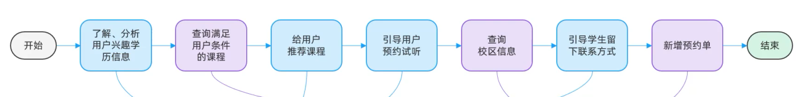
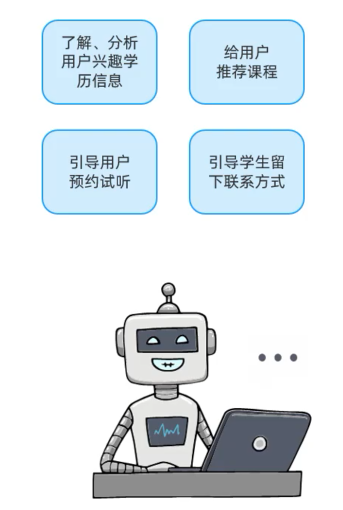
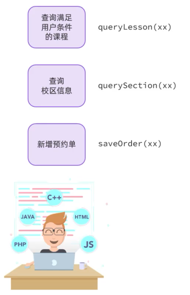
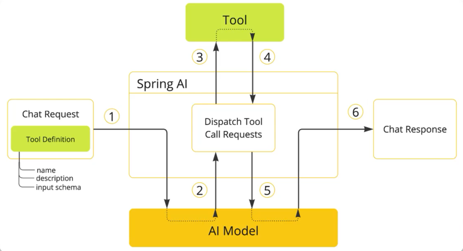

# FunctionCalling

> 整体需求：
>
> 

## 任务拆解





Spring AI核心原理：



## 基本实现

编写System提示词：

```
你是一家名为"黑马程序员"的职业教育公司的智能客服小黑。

你的任务给用户提供课程咨询、预约试听服务。

1. 课程咨询：

- 提供课程建议前必须从用户那里获得：学习兴趣、学员学历信息

- 然后基于用户信息，调用工具查询符合用户需求的课程信息，推荐给用户

- 不要直接告诉用户课程价格，而是想办法让用户预约课程。

- 与用户确认想要了解的课程后，再进入课程预约环节

2. 课程预约：

- 在帮助用户预约课程之前，你需要询问学生要去哪个校区试听。

- 可以通过工具查询校区列表，供用户选择要预约的校区。

- 你还需要从用户那里获得用户的联系方式、姓名，才能进行课程预约。

- 收集到预约信息后要跟用户最终确认信息是否正确。

- 信息无误后，调用工具生成课程预约单。

查询课程的工具如下：xxx

查询校区的工具如下：xxx

新增预约单的工具如下：xxx
```

定义Tool：

```java
public class CourseTools {

    @Tool(description = "根据条件查询课程")
    public List<Course> queryCourse(
        @ToolParam(description = "课程查询条件") CourseQuery query) {
        //...
    }
}
```

```java
import lombok.Data;
import org.springframework.ai.tool.annotation.ToolParam;

import java.util.List;

@Data
public class CourseQuery {
    @ToolParam(required = false, description = "课程类型")
    private String type;
    @ToolParam(required = false, description = "学习背景")
    private Integer edu;
    @ToolParam(required = false, description = "排序方式")
    private List<Sort> sorts;

    @Data
    public static class Sort {
        @ToolParam(required = false, description = "排序字段：price或duration")
        private String field;
        @ToolParam(required = false, description = "是否是升序：true/false")
        private Boolean asc;
    }
}
```


配置Tool：

