# Swagger

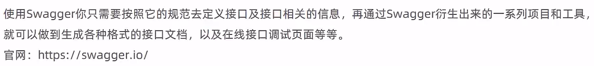

默认地址有：`http://localhost:8080/swagger-ui.html`、`http://localhost:8080/swagger`、`http://localhost:8080/swagger-ui/index.html`、`http://localhost:8080/swagger-ui`

获取json数据：

- 对于swagger3：`http://localhost:8080/v3/api-docs`
- 对于swagger2：`http://localhost:8080/v2/api-docs`

## Knife4j

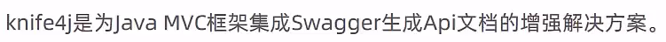

## 使用方式

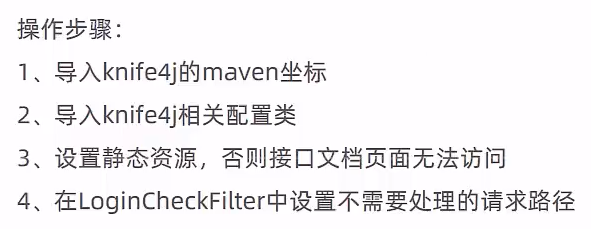

### 导入maven配置

```xml
        <!-- knife4j -->
        <dependency>
            <groupId>com.github.xiaoymin</groupId>
            <artifactId>knife4j-spring-boot-starter</artifactId>
            <version>3.0.2</version>
        </dependency>
```

### 导入相关配置类

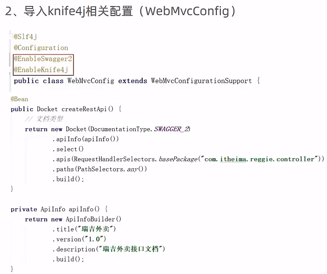

WebMvcConfig.java

```java
import springfox.documentation.service.ApiInfo;
import springfox.documentation.spring.web.plugins.Docket;


@Slf4j
@Configuration
@EnableSwagger2
@EnableKnife4j
public class WebMvcConfig extends WebMvcConfigurationSupport {


    @Bean
    public Docket createRestApi() {
        // 文档类型
        return new Docket(DocumentationType.SWAGGER_2)
                .apiInfo(apiInfo())
                .select()
                // 指定生成接口文档所需要扫描的包
                .apis(RequestHandlerSelectors.basePackage("com.itheima.reggie.controller"))
                .paths(PathSelectors.any())
                .build();
    }

    private ApiInfo apiInfo() {
        return new ApiInfoBuilder()
                .title("瑞吉外卖")
                .version("1.0")
                .description("瑞吉外卖接口文档")
                .build();
    }
}
```

### 设置静态资源映射

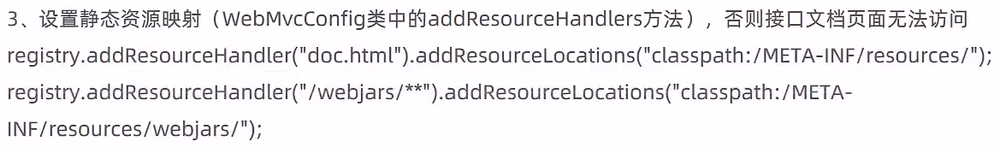

WebMvcConfig.java

```java
    /**
     * 设置静态资源映射
     * @param registry
     */
    @Override
    protected void addResourceHandlers(ResourceHandlerRegistry registry) {
        log.info("开始进行静态资源映射...");
        // 默认ui界面访问地址为项目端口号加"/swagger-ui.html"，这里设置为了"doc.html"
        registry.addResourceHandler("doc.html").addResourceLocations("classpath:/META-INF/resources/");
        registry.addResourceHandler("/webjars/**").addResourceLocations("classpath:/META-INF/resources/webjars/");


    }
```

### 设置不需要处理的请求路径

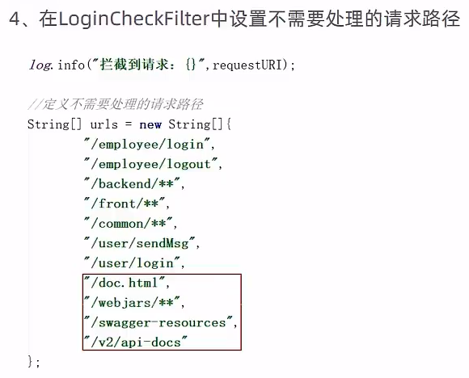

LoginCheckFilter.java

```java
        //定义不需要处理的请求路径
        String[] urls = new String[]{
                "/employee/login",
                "/employee/logout",
                "/backend/**",
                "/front/**",
                "/common/**",
                "/user/sendMsg",
                "/user/login",
                "/doc.html",
                "/webjars/**",
                "/swagger-resources",
                "/v2/api-docs"
        };
```

### 访问

```
http://localhost:8080/doc.html
```

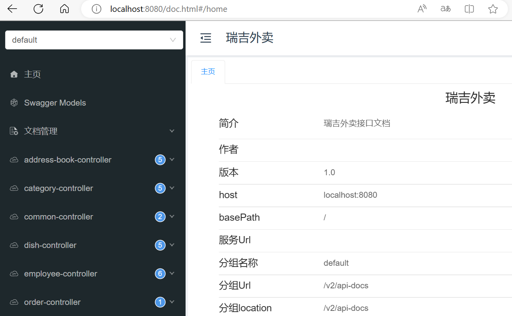

> Swagger会在运行时动态生成HTML页面，并在访问时处理，不会在项目目录中生成HTML文件

## 常用注解

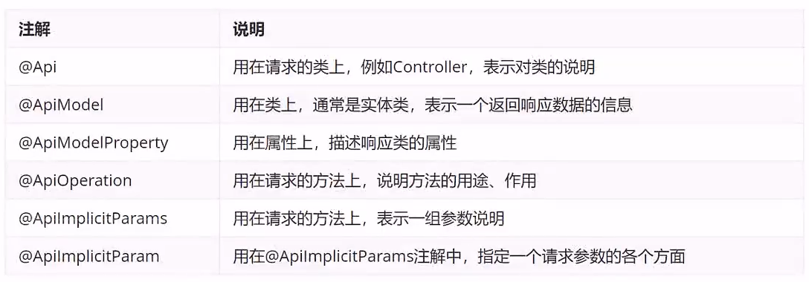

> 用于提高生成文档的可读性，swagger v2版本：
>
> ```
> @Api：用在请求的类上，表示对类的说明
> 	tags="说明该类的作用，可以在UI界面上看到的注解"
> 	value="该参数没什么意义，在UI界面上也看到，所以不需要配置"
> 
> @ApiOperation：用在请求的方法上，说明方法的用途、作用
> 	value="说明方法的用途、作用"
> 	notes="方法的备注说明"
> 
> @ApiImplicitParams：用在请求的方法上，表示一组参数说明
> 	@ApiImplicitParam：用在@ApiImplicitParams注解中，指定一个请求参数的各个方面
> 		name：参数名
> 		value：参数的汉字说明、解释
> 		required：参数是否必须传
> 		paramType：参数放在哪个地方
>  			· header --> 请求参数的获取：@RequestHeader
> 			· query --> 请求参数的获取：@RequestParam
> 			· path（用于restful接口）--> 请求参数的获取：@PathVariable
> 			· body（不常用）
> 			· form（不常用）    
> 		dataType：参数类型，默认String，其它值dataType="Integer"       
> 		defaultValue：参数的默认值
> 
> @ApiResponses：用在请求的方法上，表示一组响应
> 	@ApiResponse：用在@ApiResponses中，一般用于表达一个错误的响应信息
> 		code：数字，例如400
> 		message：信息，例如"请求参数没填好"
> 		response：抛出异常的类
> 
> @ApiModel：用于响应类上，表示一个返回响应数据的信息
>          （这种一般用在post创建的时候，使用@RequestBody这样的场景，
>          请求参数无法使用@ApiImplicitParam注解进行描述的时候）
> 	@ApiModelProperty：用在属性上，描述响应类的属性
> ```
>
> swagger v3版本：
>
> ```
> tags:
>   - name: 类说明
>     description: 说明该类的作用，可以在UI界面上看到的注解
> ```
>
> 

修改Setmeal.java

```java
/**
 * 套餐
 */
@Data
@ApiModel("套餐")
public class Setmeal implements Serializable {

    private static final long serialVersionUID = 1L;

    @ApiModelProperty("主键")
    private Long id;


    //分类id
    @ApiModelProperty("分类id")
    private Long categoryId;


    //套餐名称
    @ApiModelProperty("套餐名称")
    private String name;


    //套餐价格
    @ApiModelProperty("套餐价格")
    private BigDecimal price;


    //状态 0:停用 1:启用
    @ApiModelProperty("状态")
    private Integer status;


    //编码
    @ApiModelProperty("套餐编号")
    private String code;


    //描述信息
    @ApiModelProperty("描述信息")
    private String description;


    //图片
    @ApiModelProperty("图片")
    private String image;


    @TableField(fill = FieldFill.INSERT)
    private LocalDateTime createTime;


    @TableField(fill = FieldFill.INSERT_UPDATE)
    private LocalDateTime updateTime;


    @TableField(fill = FieldFill.INSERT)
    private Long createUser;


    @TableField(fill = FieldFill.INSERT_UPDATE)
    private Long updateUser;

}
```

修改R.java

```java
/**
 * 通用返回结果，服务端响应的数据最终都会封装成此对象
 * @param <T>
 */
@Data
@ApiModel("返回结果")
public class R<T> implements Serializable{

    @ApiModelProperty("编码")
    private Integer code; //编码：1成功，0和其它数字为失败

    @ApiModelProperty("错误信息")
    private String msg; //错误信息

    @ApiModelProperty("数据")
    private T data; //数据

    @ApiModelProperty("动态数据")
    private Map map = new HashMap(); //动态数据

    public static <T> R<T> success(T object) {
        R<T> r = new R<T>();
        r.data = object;
        r.code = 1;
        return r;
    }

    public static <T> R<T> error(String msg) {
        R r = new R();
        r.msg = msg;
        r.code = 0;
        return r;
    }

    public R<T> add(String key, Object value) {
        this.map.put(key, value);
        return this;
    }

}
```

修改SetmealController.java

```java
@RestController
@RequestMapping("/setmeal")
@Slf4j
@Api(tags = "套餐相关接口")
public class SetmealController {

    @Autowired
    private SetmealService setmealService;

    @Autowired
    private CategoryService categoryService;

    @Autowired
    private SetmealDishService setmealDishService;

    /**
     * 新增套餐
     * @param setmealDto
     * @return
     */
    @PostMapping
    @CacheEvict(value = "setmealCache",allEntries = true) // allEntries代表清理value分类下的所有缓存
    @ApiOperation(value = "新增套餐接口")
    public R<String> save(@RequestBody SetmealDto setmealDto){
        log.info("套餐信息：{}",setmealDto);

        setmealService.saveWithDish(setmealDto);

        return R.success("新增套餐成功");
    }

    /**
     * 套餐分页查询
     * @param page
     * @param pageSize
     * @param name
     * @return
     */
    @GetMapping("/page")
    @ApiOperation(value = "套餐分页查询接口")
    @ApiImplicitParams({
            @ApiImplicitParam(name = "page",value = "页码",required = true),
            @ApiImplicitParam(name = "pageSize",value = "每页记录数",required = true),
            @ApiImplicitParam(name = "name",value = "套餐名称",required = false)
    })
    public R<Page> page(int page,int pageSize,String name){
        //分页构造器对象
        Page<Setmeal> pageInfo = new Page<>(page,pageSize);
        Page<SetmealDto> dtoPage = new Page<>();

        LambdaQueryWrapper<Setmeal> queryWrapper = new LambdaQueryWrapper<>();
        //添加查询条件，根据name进行like模糊查询
        queryWrapper.like(name != null,Setmeal::getName,name);
        //添加排序条件，根据更新时间降序排列
        queryWrapper.orderByDesc(Setmeal::getUpdateTime);

        setmealService.page(pageInfo,queryWrapper);

        //对象拷贝
        BeanUtils.copyProperties(pageInfo,dtoPage,"records");
        List<Setmeal> records = pageInfo.getRecords();

        List<SetmealDto> list = records.stream().map((item) -> {
            SetmealDto setmealDto = new SetmealDto();
            //对象拷贝
            BeanUtils.copyProperties(item,setmealDto);
            //分类id
            Long categoryId = item.getCategoryId();
            //根据分类id查询分类对象
            Category category = categoryService.getById(categoryId);
            if(category != null){
                //分类名称
                String categoryName = category.getName();
                setmealDto.setCategoryName(categoryName);
            }
            return setmealDto;
        }).collect(Collectors.toList());

        dtoPage.setRecords(list);
        return R.success(dtoPage);
    }

    /**
     * 删除套餐
     * @param ids
     * @return
     */
    @DeleteMapping
    @CacheEvict(value = "setmealCache",allEntries = true)
    @ApiOperation(value = "套餐删除接口")
    public R<String> delete(@RequestParam List<Long> ids){
        log.info("ids:{}",ids);

        setmealService.removeWithDish(ids);

        return R.success("套餐数据删除成功");
    }

    @GetMapping("/list")
    @Cacheable(value = "setmealCache",key = "#setmeal.categoryId + '_' + #setmeal.status")
    @ApiOperation(value = "套餐条件查询接口")
    public R<List<Setmeal>> list(Setmeal setmeal) {
        log.info("setmeal:{}", setmeal);
        //条件构造器
        LambdaQueryWrapper<Setmeal> queryWrapper = new LambdaQueryWrapper<>();
        queryWrapper.like(StringUtils.isNotEmpty(setmeal.getName()), Setmeal::getName, setmeal.getName());
        queryWrapper.eq(null != setmeal.getCategoryId(), Setmeal::getCategoryId, setmeal.getCategoryId());
        queryWrapper.eq(null != setmeal.getStatus(), Setmeal::getStatus, setmeal.getStatus());
        queryWrapper.orderByDesc(Setmeal::getUpdateTime);

        return R.success(setmealService.list(queryWrapper));
    }
}
```

> 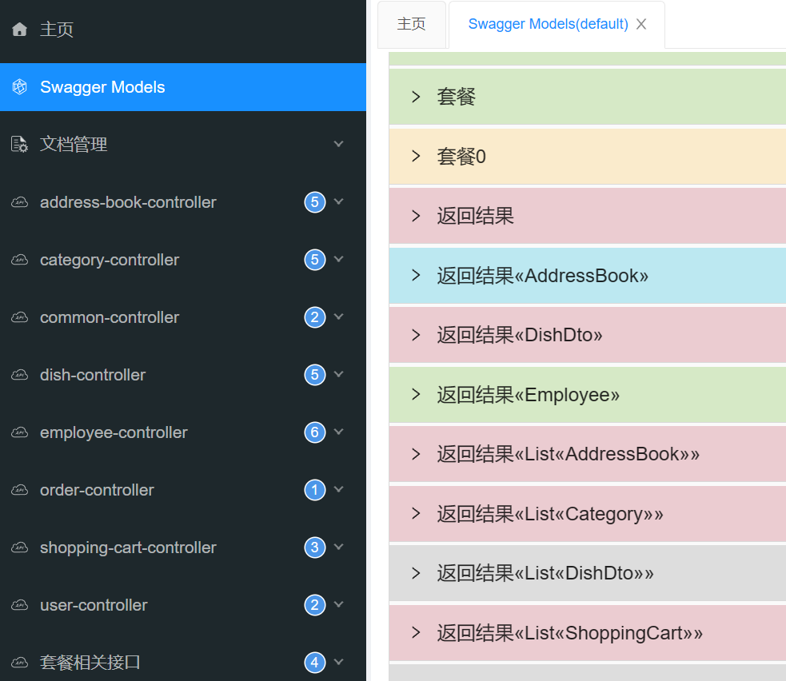
>
> 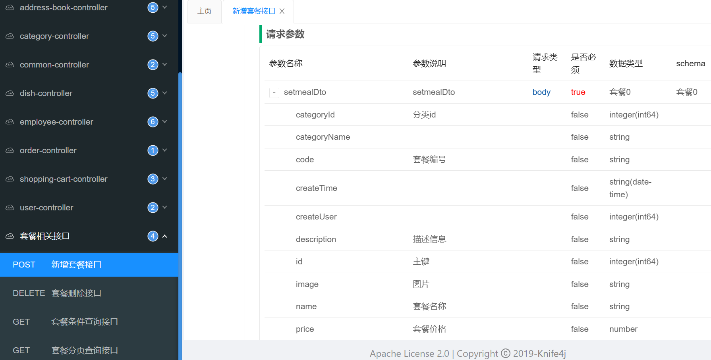
>
> 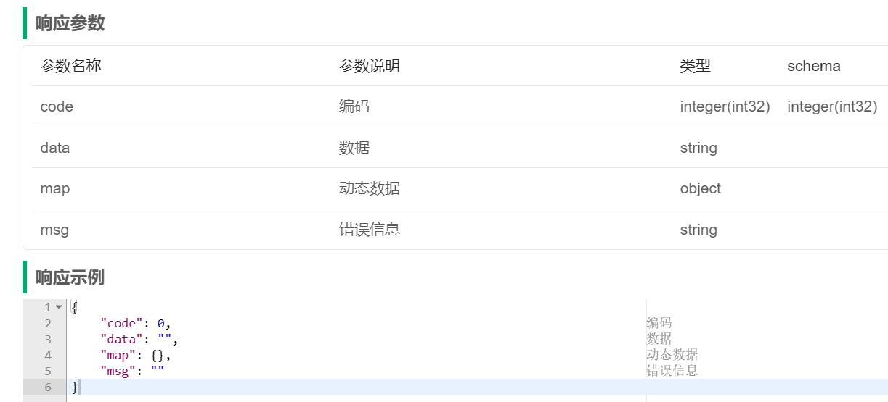