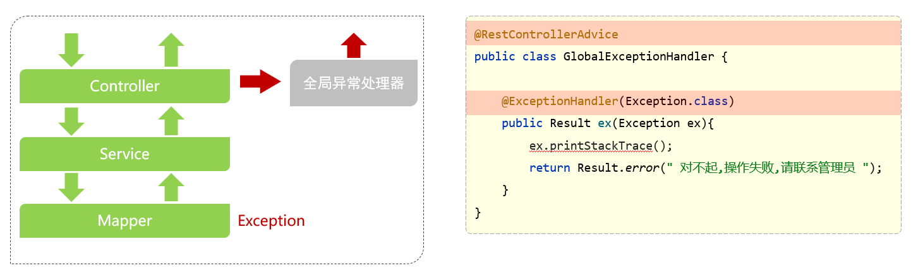
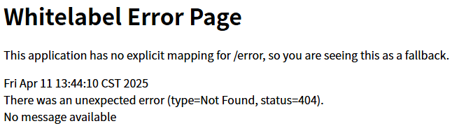

# 全局异常处理

## 全局异常处理器



> `@RestControllerAdvice = @ControllerAdvice + @ResponseBody`

## 代码示例

GlobalExceptionHandler.java

```java
import com.aliyun.oss.ClientException;
import com.aliyun.oss.OSSException;
import org.springframework.stereotype.Controller;
import org.springframework.web.bind.annotation.ControllerAdvice;
import org.springframework.web.bind.annotation.ExceptionHandler;
import org.springframework.web.bind.annotation.ResponseBody;
import org.springframework.web.bind.annotation.RestController;


/**
 * 全局异常处理
 * (这里监听所有加了RestController和Controller注解的类，合并注解为@RestControllerAdvice)
 */
@ControllerAdvice(annotations = {RestController.class, Controller.class})
@ResponseBody
public class GlobalExceptionHandler {

    // 多个不同方法上的@ExceptionHandler中的指定抓取的异常类不能重复

    /**
     * 抓取OSSException异常
     * @param oe OSSException异常对象
     * @return
     */
    @ExceptionHandler({OSSException.class})
    public R<String> OSSExceptionHandler(OSSException oe){
        System.out.println("Caught an OSSException, which means your request made it to OSS, "
                + "but was rejected with an error response for some reason.");
        System.out.println("Error Message:" + oe.getErrorMessage());
        System.out.println("Error Code:" + oe.getErrorCode());
        System.out.println("Request ID:" + oe.getRequestId());
        System.out.println("Host ID:" + oe.getHostId());

        return R.error(oe.getClass().toString());
    }

    /**
     * 抓取ClientException异常
     * @param ce ClientException异常
     * @return
     */
    @ExceptionHandler({ClientException.class})
    public R<String> ClientExceptionHandler(ClientException ce){
        System.out.println("Caught an ClientException, which means the client encountered "
                + "a serious internal problem while trying to communicate with OSS, "
                + "such as not being able to access the network.");
        System.out.println("Error Message:" + ce.getMessage());

        return R.error(ce.getClass().toString());
    }

//    /**
//     * 可以处理所有继承RuntimeException的错误
//     * @param re 两个异常的父类
//     * @return
//     */
//    @ExceptionHandler({OSSException.class, ClientException.class, RuntimeException.class})
//    public R<String> exceptionHandler(RuntimeException re){
//        if (re.getClass().toString().contains("OSSException")){
//            return R.error("出现OSSException错误");
//        }else if(re.getClass().toString().contains("ClientException")){
//            return R.error("出现ClientException错误");
//        }else {
//            return R.error("出现预期以外的错误：" + re.getClass().toString());
//        }
//    }
}
```

> 也可以不指定处理的异常类型，通过处理程序方法的参数列表决定可以处理哪些类型的异常
>
> 完整写法：
>
> ```java
> @ExceptionHandler({SQLIntegrityConstraintViolationException.class})
> public Result exceptionHandler(SQLIntegrityConstraintViolationException ex){
>        // 处理代码
> }
> ```
>
> 简化写法：
>
> ```java
> @ExceptionHandler
> public Result exceptionHandler(SQLIntegrityConstraintViolationException ex){
>        // 处理代码
> }
> ```

## 404错误

> Spring MVC的异常处理机制只能捕获**控制器层抛出的异常**，而**404页面错误**是由Spring的DispatcherServlet在路由阶段直接返回的，不会进入控制器方法，因此也不会触发`@RestControllerAdvice`中定义的全局异常处理器
>
> 

### ErrorController

> Spring Boot提供了一个`ErrorController`接口，允许自定义错误处理逻辑，默认`/error`接口返回的结果

```java
import com.yxx.generator.common.core.domain.AjaxResult;
import org.springframework.boot.web.servlet.error.ErrorController;
import org.springframework.http.HttpStatus;
import org.springframework.http.ResponseEntity;
import org.springframework.stereotype.Controller;
import org.springframework.web.bind.annotation.RequestMapping;
import javax.servlet.RequestDispatcher;
import javax.servlet.http.HttpServletRequest;

@Controller
public class CustomErrorController implements ErrorController {

    @RequestMapping("/error")
    public ResponseEntity<AjaxResult> handleError(HttpServletRequest request)
    {
        // 获取错误状态码
        Object status = request.getAttribute(RequestDispatcher.ERROR_STATUS_CODE);

        if (status != null) {
            int statusCode = Integer.parseInt(status.toString());
            HttpStatus httpStatus = HttpStatus.valueOf(statusCode);

            // 处理404错误
            if (httpStatus == HttpStatus.NOT_FOUND) {
                return ResponseEntity
                        .status(httpStatus)
                        // 获取原始的资源请求地址
                        .body(AjaxResult.error(httpStatus.value(), String.format("资源'%s'未找到", request.getAttribute(RequestDispatcher.ERROR_REQUEST_URI))));
            }

            // 处理其他错误（如500）
            return ResponseEntity
                    .status(httpStatus)
                    .body(AjaxResult.error(httpStatus.value(), httpStatus.getReasonPhrase()));
        }

        // 未知错误（默认502 错误网关）
        return ResponseEntity
                .status(HttpStatus.BAD_GATEWAY)
                .body(AjaxResult.error(HttpStatus.BAD_GATEWAY.value(), "服务器未知错误"));
    }
}
```

> ```
> {"msg":"资源未找到","code":404}
> ```

### throwExceptionIfNoHandlerFound

application.yaml

```yaml
spring:
  mvc:
    # 当没有匹配的控制器方法时，抛出 NoHandlerFoundException
    throw-exception-if-no-handler-found: true
  web:
    resources:
      # 不自动注册默认的静态资源路径，所有静态资源请求（如/css/style.css）都会经过 DispatcherServlet
      # 会影响swagger，需要手动配置资源处理器，如果没有添加静态资源会直接抛出异常，如果映射但没有匹配到到也会报404页面异常
      add-mappings: false
```

GlobalExceptionHandler.java

```java
@ControllerAdvice
public class GlobalExceptionHandler {
    
    /**
     * 404异常
     */
    @ExceptionHandler(NoHandlerFoundException.class)
    public AjaxResult handleNoHandlerFoundException(NoHandlerFoundException e, HttpServletRequest request)
    {
        String requestURI = request.getRequestURI();
        log.error("请求地址'{}',发生系统异常.", requestURI, e);
        return AjaxResult.error(HttpStatus.NOT_FOUND, String.format("路径'%s'不存在，错误：%s", requestURI, e.getMessage()));
    }
}
```

> 当请求路径不存在时，Spring会抛出`NoHandlerFoundException`，此时可以由`@RestControllerAdvice`捕获并处理