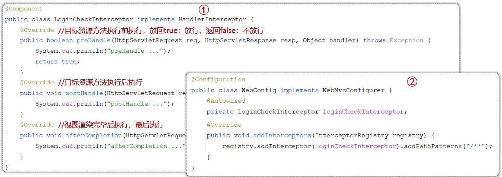

# 过滤器Filter和拦截器Interceptor

## 过滤器Filter

- 概念：Filter 过滤器，是JavaWeb 三大组件(Servlet、Filter、Listener)之一
- 过滤器可以把对资源的请求拦截下来，从而实现一些特殊的功能
- 过滤器一般完成一些通用的操作，比如：**登录校验、统一编码处理、敏感字符处理**等


### Filter入门

- 定义Filter：定义一个类，实现 `Filter` 接口(`javax.servlet`)，重写其所有方法
- 配置Filter：Filter类上加 `@WebFilter` 注解，配置拦截资源的路径。引导类上加 `@ServletComponentScan` 开启Servlet组件支持


DemoFilter.java

```java
import javax.servlet.*;
import javax.servlet.annotation.WebFilter;
import javax.servlet.http.HttpServletRequest;
import javax.servlet.http.HttpServletResponse;
import java.io.IOException;

@WebFilter(urlPatterns = "/*")
public class DemoFilter implements Filter {

    @Override
    public void init(FilterConfig filterConfig) throws ServletException {
        System.out.println("DemoFilter注册成功...");
    }

    @Override
    public void doFilter(ServletRequest servletRequest, ServletResponse servletResponse, FilterChain filterChain) throws IOException, ServletException {
        HttpServletRequest request = (HttpServletRequest) servletRequest;
        HttpServletResponse response = (HttpServletResponse) servletResponse;

        System.out.println("拦截到了请求" + request.getRequestURL());

        // 放行
        filterChain.doFilter(servletRequest, servletResponse);

        // 写入内容(当没有返回结果时才可用，否则会报错)
        // response.getWriter().write("请求处理完成");
    }

    @Override
    public void destroy() {
        System.out.println("DemoFilter销毁成功...");
    }

}
```

### 执行流程


### 拦截路径


### 过滤器链

在一个web应用中，可以配置多个过滤器，这些过滤器形成了过滤器链


> 注解配置的Filter，优先级是按照类名(字符串)的自然排序

## 拦截器Interceptor

- 概念：是一种动态拦截方法调用的机制，类似于过滤器。Spring框架中提供的，用来动态拦截控制器方法的执行
- 作用：拦截请求，**在指定的方法调用前后，根据业务需要执行预先设定的代码**


### Interceptor入门

- 定义拦截器：定义一个类，实现 `HandlerInterceptor` 接口，重写其所有方法
- 注册拦截器：定义一个配置类，实现`WebMvcConfigurer`接口，重写`addInterceptors()`方法



DemoInterceptor.java

```java
import org.springframework.stereotype.Component;
import org.springframework.web.servlet.HandlerInterceptor;
import org.springframework.web.servlet.ModelAndView;

import javax.servlet.http.HttpServletRequest;
import javax.servlet.http.HttpServletResponse;

@Component
public class DemoInterceptor implements HandlerInterceptor {

    // 在目标资源方法运行前运行，返回true代表放行，返回false代表不放行
    @Override
    public boolean preHandle(HttpServletRequest request, HttpServletResponse response, Object handler) throws Exception {
        System.out.println("preHandle...");
        return true;
    }

    // 在目标资源方法运行后运行
    @Override
    public void postHandle(HttpServletRequest request, HttpServletResponse response, Object handler, ModelAndView modelAndView) throws Exception {
        System.out.println("postHandle...");
    }

    // 视图渲染完毕后运行，为最后执行的方法
    @Override
    public void afterCompletion(HttpServletRequest request, HttpServletResponse response, Object handler, Exception ex) throws Exception {
        System.out.println("afterCompletion...");
    }
}
```

WebConfig.java

```java
import com.atguigu.boot.Interceptor.DemoInterceptor;
import org.springframework.beans.factory.annotation.Autowired;
import org.springframework.context.annotation.Configuration;
import org.springframework.web.servlet.config.annotation.InterceptorRegistry;
import org.springframework.web.servlet.config.annotation.WebMvcConfigurer;

@Configuration
public class WebConfig implements WebMvcConfigurer {

    @Autowired
    private DemoInterceptor demoInterceptor;

    // 重写addInterceptors，注册拦截器
    @Override
    public void addInterceptors(InterceptorRegistry registry) {
        // 添加拦截器并配置拦截的请求(这里拦截所有的请求是"/**"，和Filter的"/*"不同)
        registry.addInterceptor(demoInterceptor).addPathPatterns("/**");
    }
}
```

### 拦截路径


### 执行流程


## Filter和Interceptor对比

- 接口规范：过滤器需要实现Filter接口，而拦截器需要实现HandlerInterceptor接口
- 拦截范围：过滤器Filter会拦截所有的资源，而Interceptor只会拦截Spring环境中的资源
