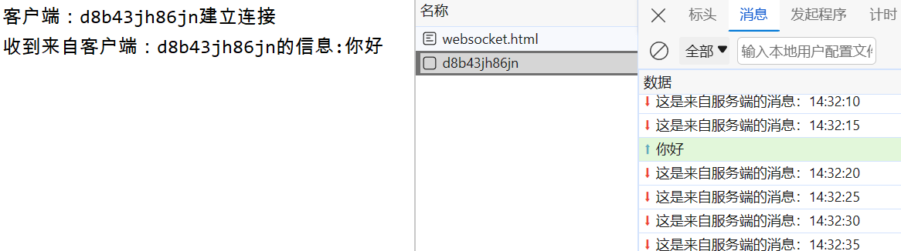

# WebSocket

> WebSocket 是基于TCP 的一种新的网络协议。它实现了浏览器与服务器全双工通信——浏览器和服务器**只需要完成一次握手**，两者之间就可以创建持久性的连接，并进行双向数据传输
>
> - 全双工：允许数据在两个方向上同时传播
> - 半双工：允许数据在两个方向上传播，但是同一个时间段内只允许一个方向上传播

pom.xml

```xml
        <!-- websocket -->
        <dependency>
            <groupId>org.springframework.boot</groupId>
            <artifactId>spring-boot-starter-websocket</artifactId>
        </dependency>
```

## 原理解析


切换WebSocket的HTTP协议数据：


## 其它消息推送方式

- 轮询：浏览器以指定时间间隔向服务器发出HTTP请求，服务器实时返回数据给浏览器


- 长轮询：浏览器发出ajax请求，服务器端接收到请求后，会阻塞请求直到有数据或者超时才返回


- SSE(服务器发送事件)：使用HTTP协议，SSE在服务器和客户端之间打开一个单向通道，服务端响应的不再是一次性的数据包，而是text/event-stream类型的数据流信息，服务器有数据变更时将数据流式传输到客户端


## Http协议和WebSocket协议

- HTTP是短连接
- WebSocket是长连接
- HTTP通信是单向的，基于请求响应模式
- WebSocket支持双向通信
- HTTP和WebSocket底层都是TCP连接


WebSocket的缺点：

- 服务器长期维护长连接需要一定的成本
- 各个浏览器支持程度不一
- WebSocket 是长连接，受网络限制比较大，需要处理好重连

## 代码示例

客户端代码：

```html
<!DOCTYPE HTML>
<html>
<head>
    <meta charset="UTF-8">
    <title>WebSocket Demo</title>
</head>
<body>
    <input id="text" type="text" />
    <button onclick="send()">发送消息</button>
    <button onclick="closeWebSocket()">关闭连接</button>
    <div id="message">
    </div>
</body>
<script type="text/javascript">
    var websocket = null;
    var clientId = Math.random().toString(36).substr(2);

    //判断当前浏览器是否支持WebSocket
    if('WebSocket' in window){
        //连接WebSocket节点
        websocket = new WebSocket("ws://localhost:8080/ws/"+clientId);
    }
    else{
        alert('Not support websocket')
    }

    //连接发生错误的回调方法
    websocket.onerror = function(){
        setMessageInnerHTML("error");
    };

    //连接成功建立的回调方法
    websocket.onopen = function(){
        setMessageInnerHTML("连接成功");
    }

    //接收到消息的回调方法
    websocket.onmessage = function(event){
        setMessageInnerHTML(event.data);
    }

    //连接关闭的回调方法
    websocket.onclose = function(){
        setMessageInnerHTML("close");
    }

    //监听窗口关闭事件，当窗口关闭时，主动去关闭websocket连接，防止连接还没断开就关闭窗口，server端会抛异常。
    window.onbeforeunload = function(){
        websocket.close();
    }

    //将消息显示在网页上
    function setMessageInnerHTML(innerHTML){
        document.getElementById('message').innerHTML += innerHTML + '<br/>';
    }

    //发送消息
    function send(){
        var message = document.getElementById('text').value;
        websocket.send(message);
    }
	
	//关闭连接
    function closeWebSocket() {
        websocket.close();
    }
</script>
</html>
```

服务端代码：

WebSocketConfiguration.java

```java
import org.springframework.context.annotation.Bean;
import org.springframework.context.annotation.Configuration;
import org.springframework.web.socket.server.standard.ServerEndpointExporter;

/**
 * WebSocket配置类，用于注册WebSocket的Bean
 */
@Configuration
public class WebSocketConfiguration {

    @Bean
    //注入ServerEndpointExporter，自动注册使用了@ServerEndpoint注解的bean
    public ServerEndpointExporter serverEndpointExporter() {
        return new ServerEndpointExporter();
    }

}
```

WebSocketTask.java

```java
import com.sky.websocket.WebSocketServer;
import org.springframework.beans.factory.annotation.Autowired;
import org.springframework.scheduling.annotation.Scheduled;
import org.springframework.stereotype.Component;
import java.time.LocalDateTime;
import java.time.format.DateTimeFormatter;

@Component
public class WebSocketTask {
    @Autowired
    private WebSocketServer webSocketServer;

    /**
     * 通过WebSocket每隔5秒向客户端发送消息
     */
    @Scheduled(cron = "0/5 * * * * ?")
    public void sendMessageToClient() {
        webSocketServer.sendToAllClient("这是来自服务端的消息：" + DateTimeFormatter.ofPattern("HH:mm:ss").format(LocalDateTime.now()));
    }
}
```

WebSocketServer.java

```java
import org.springframework.stereotype.Component;
import javax.websocket.OnClose;
import javax.websocket.OnMessage;
import javax.websocket.OnOpen;
import javax.websocket.Session;
import javax.websocket.server.PathParam;
import javax.websocket.server.ServerEndpoint;
import java.util.Collection;
import java.util.HashMap;
import java.util.Map;

/**
 * WebSocket服务
 */
@Component
// 对应url为：ws://localhost:8080/ws/j9gz6rqhxff
@ServerEndpoint("/ws/{sid}")
public class WebSocketServer {

    //存放会话对象(websocket下的Session)
    private static Map<String, Session> sessionMap = new HashMap();

    /**
     * 连接建立成功调用的方法
     */
    @OnOpen
    public void onOpen(Session session, @PathParam("sid") String sid) {
        System.out.println("客户端：" + sid + "建立连接");
        sessionMap.put(sid, session);
    }

    /**
     * 收到客户端消息后调用的方法
     *
     * @param message 客户端发送过来的消息
     */
    @OnMessage
    public void onMessage(String message, @PathParam("sid") String sid) {
        System.out.println("收到来自客户端：" + sid + "的信息:" + message);
    }

    /**
     * 连接关闭调用的方法
     *
     * @param sid
     */
    @OnClose
    public void onClose(@PathParam("sid") String sid) {
        System.out.println("连接断开:" + sid);
        sessionMap.remove(sid);
    }

    /**
     * 群发
     *
     * @param message
     */
    public void sendToAllClient(String message) {
        Collection<Session> sessions = sessionMap.values();
        for (Session session : sessions) {
            try {
                //服务器向客户端发送消息(getBasicRemote()为同步，getAsyncRemote()为异步)
                session.getBasicRemote().sendText(message);
            } catch (Exception e) {
                e.printStackTrace();
            }
        }
    }

}
```

> 请求头信息：
>
> 
>
> 消息中查看通信内容(因为是群发，对每个客户端都是可以发送到的)：
>
> 
>
> 向客户端发送信息：
>
> 
>
> 

## 获取HttpSession

> 可以使用HttpSession去获取请求中的数据，但需要在发送WebSocket连接之前，先进行一次Http请求，否则HttpSession为空

GetHttpSessionConfig.java

```java
import javax.servlet.http.HttpSession;
import javax.websocket.HandshakeResponse;
import javax.websocket.server.HandshakeRequest;
import javax.websocket.server.ServerEndpointConfig;

public class GetHttpSessionConfig extends ServerEndpointConfig.Configurator {

    @Override
    public void modifyHandshake(ServerEndpointConfig sec, HandshakeRequest request, HandshakeResponse response) {
        // 获取HttpSession对象
        HttpSession httpSession = (HttpSession) request.getHttpSession();

        // 存入HttpSession对象，实现和EndpointConfig的数据共享
        if (httpSession != null) {
            sec.getUserProperties().put(HttpSession.class.getName(), httpSession);
        }
    }
}
```

WebSocketServer.java

```java
// 引入配置器
@ServerEndpoint(value = "/ws/{sid}", configurator = GetHttpSessionConfig.class)


    @OnOpen
    // EndpointConfig共享ServerEndpointConfig
    public void onOpen(Session session, @PathParam("sid") String sid, EndpointConfig config) {
        HttpSession o = config.getUserProperties().get(HttpSession.class.getName());
```

