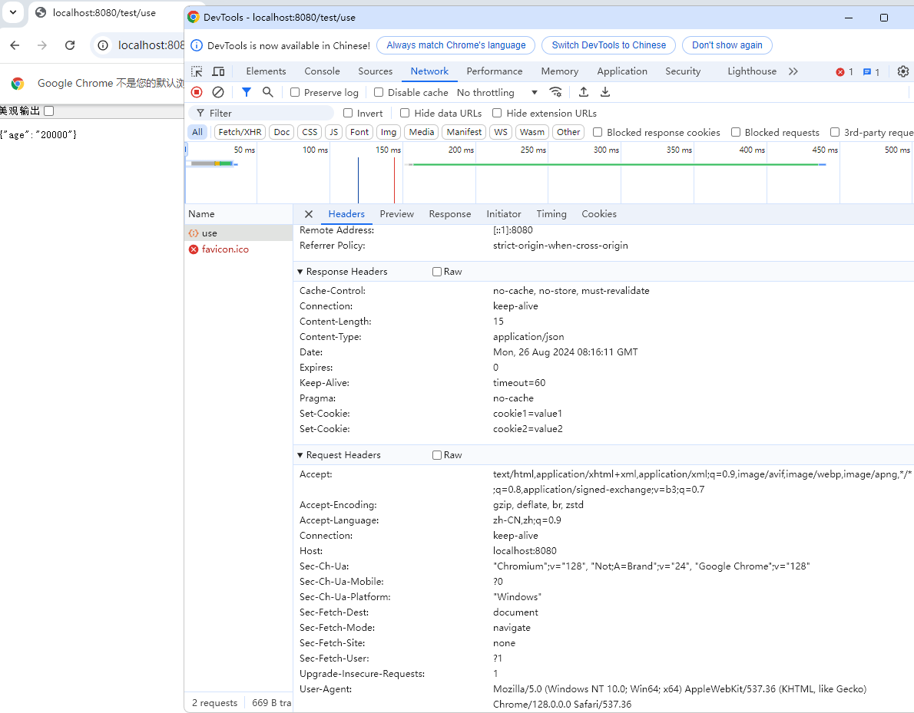

# RestTemplate

## 使用介绍

> - 发送GET请求：使用`getForObject`或`getForEntity`方法发送GET请求。这些方法接受URL和响应类型等参数，并返回响应体或包含响应体的ResponseEntity对象
> - 发送POST请求：使用`postForObject`或`postForEntity`方法发送POST请求。这些方法接受URL、请求体、请求头和响应类型等参数，并返回响应体或包含响应体的ResponseEntity对象
> - 发送其他类型的请求：RestTemplate还提供了用于发送PUT、DELETE等其他类型HTTP请求的方法，如`put`、`delete`等
> - 自定义请求头和参数：可以在发送请求时设置自定义的请求头和参数，以满足特定的需求
> - 异常处理：RestTemplate在发送请求或处理响应时可能会抛出异常，如`HttpClientErrorException`和`HttpServerErrorException`等。可以根据需要捕获这些异常并进行适当的处理
> - 异步支持：RestTemplate还提供了异步版本的HTTP请求方法，如`asyncGetForObject`和`asyncPostForObject`等，用于在异步场景下发送HTTP请求
> - 底层HTTP客户端的配置：RestTemplate允许配置底层的HTTP客户端库，如设置连接超时时间、读取超时时间、最大连接数等
> - 泛型支持：RestTemplate的方法支持使用泛型来指定响应体的类型，这样可以方便地处理不同类型的响应数据
> - 自定义转换器：RestTemplate允许注册自定义的转换器，用于将HTTP响应体转换为Java对象或将Java对象转换为HTTP请求体
> - 与Spring集成：RestTemplate可以与Spring的其他功能集成，如使用Spring的`@Autowired`注解注入RestTemplate实例，或使用Spring Boot的自动配置功能简化RestTemplate的配置和使用
>
> 从Spring 5开始，RestTemplate已被标记为废弃，推荐使用新的WebClient类来替代RestTemplate进行HTTP通信。WebClient提供了更现代、更灵活的API，支持反应式编程和异步操作，是Spring 5中推荐的HTTP客户端库

## 示例代码

RestTemplateService.java

```java
import lombok.extern.slf4j.Slf4j;
import org.aidier.commonservice.cstentity.R;
import org.aidier.paymentservice.common.exception.MyException;
import org.springframework.beans.factory.annotation.Autowired;
import org.springframework.beans.factory.annotation.Value;
import org.springframework.context.annotation.Bean;
import org.springframework.http.*;
import org.springframework.stereotype.Service;
import org.springframework.web.client.RestTemplate;

@Service
@Slf4j
public class RestTemplateService<T> {

    @Autowired
    private RestTemplate restTemplate;
    @Value("${yicifang.jwt}")
    private String token;

    @Bean
    public RestTemplate restTemplate() {
        RestTemplate restTemplate = new RestTemplate();
        HttpHeaders httpHeaders = new HttpHeaders();
        httpHeaders.add("token", token);
        return restTemplate;
    }

    /**
     * 无返回值的post请求,失败三次重试机制
     *
     * @param url  请求路径
     * @param data 数据
     * @return
     */
    public boolean noReturnPost(String url, T data) {
        int i = 3;
        boolean flag = false;
        ResponseEntity<R> response = null;
        HttpHeaders httpHeaders = new HttpHeaders();
        httpHeaders.add("token", token);
        HttpEntity<T> httpEntity = new HttpEntity<>(data, httpHeaders);
        try {
            while (!flag && i > 0) {
                response = restTemplate.exchange(url, HttpMethod.POST, httpEntity, R.class);
                log.info(response.toString());
                R body = response.getBody();
                if (body.getCode().equals(200) && response.getStatusCodeValue() == HttpStatus.OK.value()) {
                    flag = true;
                    continue;
                }
                flag = false;
                i--;
            }
        } catch (Exception e) {
            flag = false;
            log.error("远程调用出错：" + response);
            throw new MyException("远程调用出错");
        } finally {
            return flag;
        }
    }

    public R post(String url, T data) {
        int i = 3;
        boolean flag = false;
        ResponseEntity<R> response = null;
        HttpHeaders httpHeaders = new HttpHeaders();
        // 这里可以使用枚举代替MediaType.APPLICATION_JSON_UTF8，从Spring 5.0开始，APPLICATION_JSON_UTF8已被弃用，建议直接使用`APPLICATION_JSON`，Spring会自动处理UTF-8字符集的问题：MediaType.APPLICATION_JSON
        httpHeaders.setContentType(MediaType.parseMediaType("application/json; charset=UTF-8"));
        httpHeaders.add("Accept", MediaType.APPLICATION_JSON.toString());
        HttpEntity<T> httpEntity = new HttpEntity<>(data, httpHeaders);
        R r = null;
        try {
            while (!flag && i > 0) {
                response = restTemplate.exchange(url, HttpMethod.POST, httpEntity, R.class);
                log.info(response.toString());
                R body = response.getBody();
                if (body.getCode().equals(200) && response.getStatusCodeValue() == HttpStatus.OK.value()) {
                    r = body;
                    flag = true;
                    continue;
                }
                flag = false;
                i--;
            }
        } catch (Exception e) {
            log.error("远程调用出错：" + response);
            throw new MyException("远程调用出错");
        } finally {
            return r;
        }
    }
}
```

## ResponseEntity

> `ResponseEntity`表示整个HTTP响应，包括状态码、标头和正文

构造方法

- `ResponseEntity(HttpStatus status)`：创建一个没有正文和标头的响应实体，只有状态码
- `ResponseEntity<T>(T body)`：创建一个具有正文和默认状态码（200 OK）的响应实体
- `ResponseEntity<T>(T body, HttpStatus status)`：创建一个具有正文和指定状态码的响应实体
- `ResponseEntity<T>(T body, MultiValueMap<String, String> headers, HttpStatus status)`：创建一个具有正文、标头和指定状态码的响应实体

常用方法

- `getStatusCode()`：获取响应的状态码
- `getHeaders()`：获取响应的标头
- `getBody()`：获取响应的正文
- `hasBody()`：检查响应是否有正文

### MultiValueMap

> `MultiValueMap`是 Spring 框架中的一个接口，它扩展了`Map`接口，允许一个键对应多个值

```
MultiValueMap<String, String> headers = new LinkedMultiValueMap<>();
```

- `add(K key, V value)`：添加一个键值对，如果键已存在，则将值添加到该键的列表中
- `set(K key, V value)`：设置键值对，如果键已存在，则替换该键的值列表
- `get(K key)`：获取与键关联的值列表
- `remove(K key)`：移除与键关联的值列表

### 控制层通用响应

```java
import org.springframework.http.HttpHeaders;
import org.springframework.http.HttpStatus;
import org.springframework.http.MediaType;
import org.springframework.http.ResponseEntity;


    @RequestMapping("/use")
    public ResponseEntity<String> test() {
        UserInfo userInfo = new UserInfo();
        userInfo.setAge(20000);

        // 使用MultiValueMap创建响应头
        MultiValueMap<String, String> headers = new LinkedMultiValueMap<>();
        // 添加响应头，手动告知浏览器返回的为json数据
        headers.add(HttpHeaders.CONTENT_TYPE, MediaType.APPLICATION_JSON_VALUE);
        headers.add("Cache-Control", "no-cache, no-store, must-revalidate");
        headers.add("Pragma", "no-cache");
        headers.add("Expires", "0");

        ResponseEntity<String> responseEntity = new ResponseEntity<>(JSONObject.toJSONString(userInfo), headers, HttpStatus.OK);

        // 如果设置一个响应头的多个值
        headers.set("Set-Cookie", "cookie1=value1");
        headers.add("Set-Cookie", "cookie2=value2");
        return responseEntity;
    }
```

> 第一次请求
>
> 
>
> 第二次请求
>
> 

## RequestEntity

> `RequestEntity`表示一个HTTP请求，包括请求方法、URI、标头和正文
>
> 关于URI和URL的区别
>
> - URI（统一资源标识符）：`scheme:[//authority]path[?query][#fragment]`
>   - `scheme`：定义资源应该使用哪种协议（如 `http`、`https`、`ftp` 等）
>   - `authority`：通常包含服务器的地址（例如 `www.example.com`）
>   - `path`：标识资源在服务器上的位置
>   - `query`：查询字符串，通常用于传递参数
>   - `fragment`：片段标识符，用于引用资源内的一个位置
> - URL（统一资源定位符）：`scheme://authority/path?query#fragment`
>   - URL的组成部分与URI相同，但URL必须包含`scheme`和`authority`

构造方法

- `RequestEntity.BodyBuilder`: 使用构建器模式创建`RequestEntity`。可以通过链式调用设置方法、URI、标头和正文
- `RequestEntity<T>(HttpMethod method, URI url)`：创建一个具有指定方法和URI的请求实体，没有正文和标头
- `RequestEntity<T>(HttpMethod method, URI url, T body)`：创建一个具有指定方法、URI和正文的请求实体
- `RequestEntity<T>(HttpMethod method, URI url, MultiValueMap<String, String> headers, T body)`：创建一个具有指定方法、URI、标头和正文的请求实体

常用方法

- `getMethod()`：获取请求方法
- `getUrl()`：获取请求的URI
- `getHeaders()`：获取请求的标头
- `getBody()`：获取请求的正文

```java
import org.springframework.http.HttpMethod;
import org.springframework.http.RequestEntity;
import org.springframework.http.ResponseEntity;
import org.springframework.web.client.RestTemplate;

import java.net.URI;

public class RestClient {

    public static void main(String[] args) {
        RestTemplate restTemplate = new RestTemplate();
        URI uri = URI.create("http://www.baidu.com");

        RequestEntity<Void> requestEntity = RequestEntity.method(HttpMethod.GET, uri).build();

        ResponseEntity<String> responseEntity = restTemplate.exchange(requestEntity, String.class);
        // Response Status: 200 OK
        System.out.println("Response Status: " + responseEntity.getStatusCode());
        // Response Body: <!DOCTYPE html><!--STATUS OK--><html> <head>...
        System.out.println("Response Body: " + responseEntity.getBody());
    }
}
```

> ```
> 16:47:55.902 [main] DEBUG org.springframework.web.client.RestTemplate - HTTP GET http://www.baidu.com
> 16:47:55.940 [main] DEBUG org.springframework.web.client.RestTemplate - Accept=[text/plain, application/json, application/*+json, */*]
> 16:47:56.031 [main] DEBUG org.springframework.web.client.RestTemplate - Response 200 OK
> 16:47:56.037 [main] DEBUG org.springframework.web.client.RestTemplate - Reading to [java.lang.String] as "text/html"
> ```
