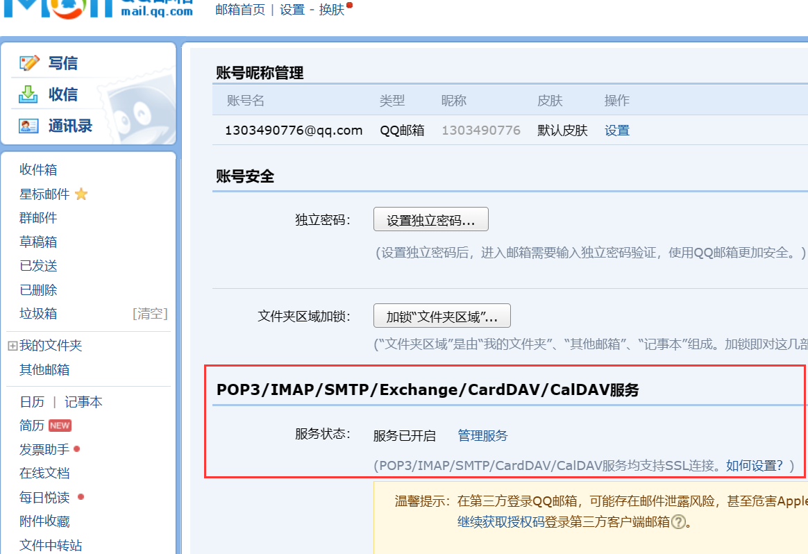
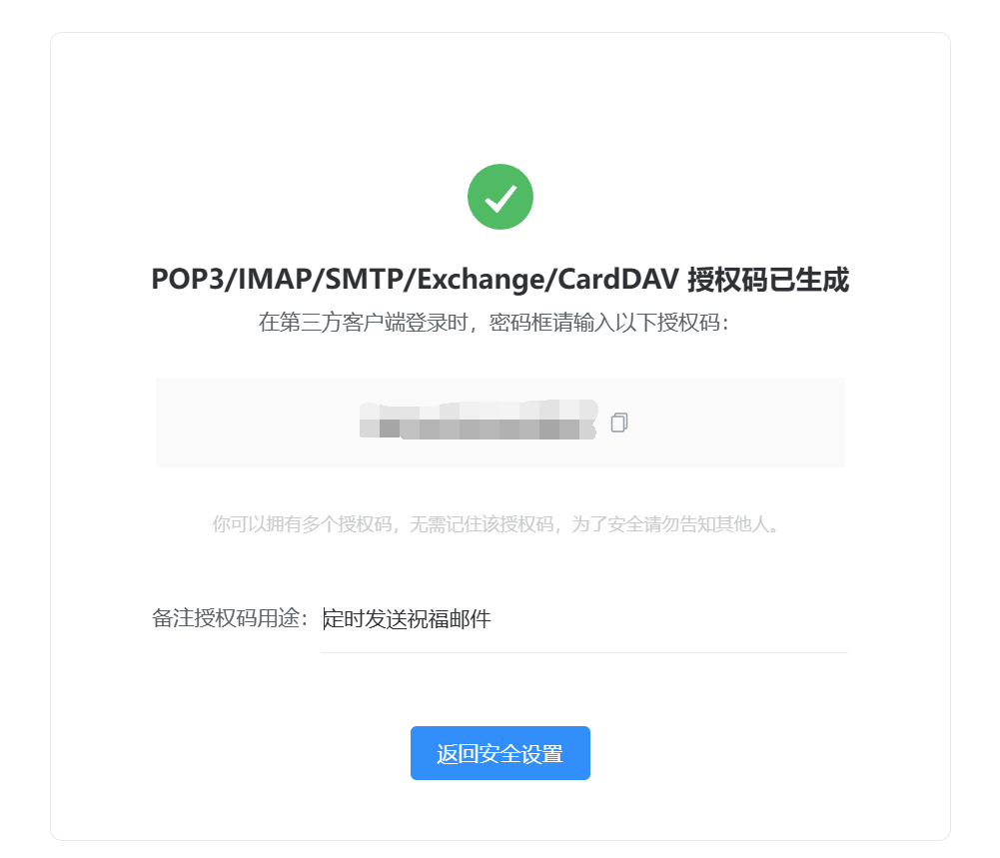

# 邮件发送

pom.xml

```xml
        <!-- Mail邮件服务启动器 -->
        <dependency>
            <groupId>org.springframework.boot</groupId>
            <artifactId>spring-boot-starter-mail</artifactId>
        </dependency>
```

## 申请授权码

> 授权码是QQ邮箱用于登录第三方客户端的专用密码，适用于登录以下服务：POP3/IMAP/SMTP/Exchange/CardDAV/CalDAV服务），授权码仅用于邮件客户端登录，而不能登录你的邮箱网页后台管理端，还是考虑到安全问题，即使泄露授权码，对方也无法登录网易或腾讯系统账号后台，这样影响也相对较小，从而保证邮箱的安全

在QQ邮箱的设置->账户中申请授权码



获取授权码



## 示例代码

> - `SimpleMailMessage`是Spring Framework中用于简单邮件发送的类，它提供了一种简单的方式来创建和发送邮件，适用于发送纯文本的简单邮件。通常情况下，`SimpleMailMessage`适用于简单的文本邮件发送，但对于复杂的邮件格式或包含附件的邮件，则需要使用`MimeMessage`
>
> - `MimeMessage`是JavaMail API中表示MIME（Multipurpose Internet Mail Extensions）格式的邮件消息的类。MIME是一种标准的邮件格式，支持发送HTML内容、附件、内嵌图片等复杂的邮件格式。通过`MimeMessage`类，您可以更灵活地控制邮件的格式和内容，包括设置邮件的头部信息、多种类型的内容和附件等
>
> password为授权码

### 直接发送

```java
    @Test
    public void testEmail() throws MessagingException {
        JavaMailSenderImpl mailSender = new JavaMailSenderImpl();
        mailSender.setHost("smtp.qq.com");
        mailSender.setPort(587);
        mailSender.setUsername("xxx@qq.com");
        mailSender.setPassword("password");

        Properties properties = mailSender.getJavaMailProperties();
        properties.put("mail.smtp.auth", "true");
        properties.put("mail.smtp.starttls.enable", "true");

//        SimpleMailMessage simpleMailMessage = new SimpleMailMessage();
//        simpleMailMessage.setTo("xxx@qq.com");
//        simpleMailMessage.setSubject("你好，世界");
//        simpleMailMessage.setText("世界你好");
//        mailSender.send(simpleMailMessage);

        MimeMessage message = mailSender.createMimeMessage();
        MimeMessageHelper helper;
        helper = new MimeMessageHelper(message, true);
        helper.setTo("xxx@qq.com");
        helper.setSubject("我的小号");
        // 是否为html
//        helper.setText("你好世界", true);
        helper.setText("你好");
        helper.setFrom("xxx@qq.com");  // 设置有效的发件人地址
        mailSender.send(message);
        System.out.println("发送成功");
    }
```

### Spring环境发送

application.yaml

```yaml
spring:
  mail:
    host: smtp.qq.com
    port: 587
    username: xxx@qq.com
    password: password
    properties:
      mail:
        auth: true
        starttls:
          enable: true
```

MainApplication.java

```java
    //程序运行入口
    public static void main(String[] args) throws MessagingException {
        //主方法返回IOC容器
        ConfigurableApplicationContext ioc = SpringApplication.run(MainApplication.class, args);

        JavaMailSenderImpl mailSender = ioc.getBean(JavaMailSenderImpl.class);

        MimeMessage message = mailSender.createMimeMessage();
        MimeMessageHelper helper;
        helper = new MimeMessageHelper(message, true);
        helper.setTo("xxx@qq.com");
        helper.setSubject("我的小号");
        // 是否为html
//        helper.setText("你好世界", true);
        helper.setText("你好");
        helper.setFrom("xxx@qq.com");  // 设置有效的发件人地址
        mailSender.send(message);
        System.out.println("发送成功");
    }
```

