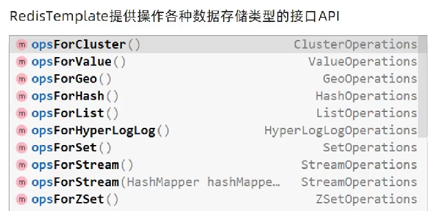
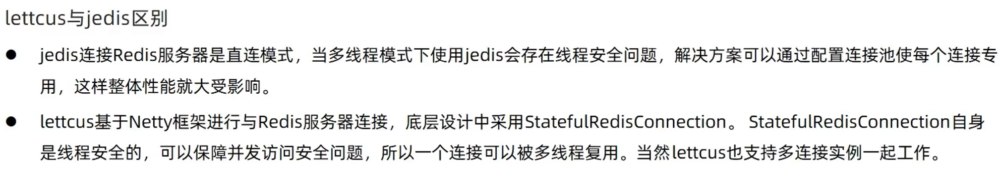

# 整合Redis

> Redis是一款key-value存储结构的内存级NoSql数据库
>
> - 支持多种数据存储格式
> - 支持持久化
> - 支持集群

## Redis基本使用

在服务端开启之后，可以使用客户端进行连接(**使用字符串为操作的基本单位**)

常用的指令：

- k-v形式：`set key value`对应`get key`
- k-hash形式：`hset key hashKey value`对应`hget key hashKey`(**一个key中可以存多个hashKey**)
- `keys *`：查看当前的所有的key

## Spring Boot整合

在pom.xml引入依赖

```xml
        <!--整合Redis-->
        <dependency>
            <groupId>org.springframework.boot</groupId>
            <artifactId>spring-boot-starter-data-redis</artifactId>
        </dependency>
```

在application.yaml配置Redis

```yaml
spring:
  redis:
    # 默认属性
    host: localhost
    port: 6379
```

> 
>
> RedisTemplate是为以对象为操作的基本单位，还有一个为StringRedisTemplate是以字符串为操作的基本单位，两者是不同的api接口，数据不互通

测试

```java
    @Resource
    private RedisTemplate<String,Object> redisTemplate;

    @Test
    public void testRedisTemplate(){
        ValueOperations<String,Object> valueOperations = redisTemplate.opsForValue();
        //k-v形式存入值
        valueOperations.set("age",50);
        //取出值并打印
        System.out.println(valueOperations.get("age")); //50
        HashOperations<String, Object, Object> ops = redisTemplate.opsForHash();
        //以k-hash形式存入值(有两个key对应一个值)
        ops.put("key","hashKey","yxx");
        //取出值并打印
        System.out.println(ops.get("key","hashKey")); //yxx
    }

    @Resource
    private StringRedisTemplate stringRedisTemplate;

    @Test
    public void testStringRedisTemplate(){
        HashOperations<String, Object, Object> ops = stringRedisTemplate.opsForHash();
        System.out.println(ops.get("key","hashKey"));
    }
```

## Redis实现技术lettuce和jedis

Spring Boot默认使用的是lettuce技术

> 

导入jedis实现技术所需要的包

```xml
        <!--Redis实现技术jedis-->
        <dependency>
            <groupId>redis.clients</groupId>
            <artifactId>jedis</artifactId>
        </dependency>
```

修改配置

```yaml
spring:
  redis:
    # 默认属性
    host: localhost
    port: 6379
    # 修改实现技术为jedis
    client-type: jedis
```

