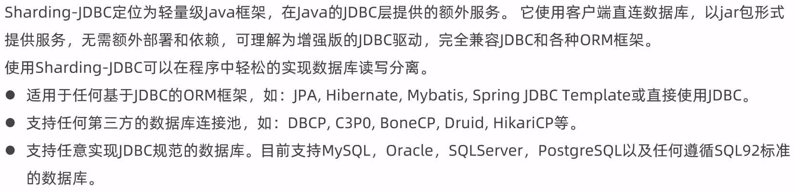
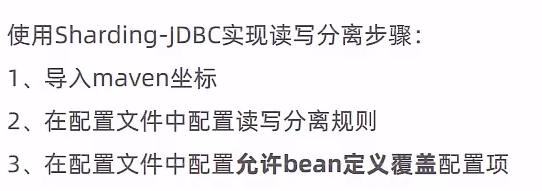
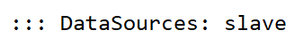
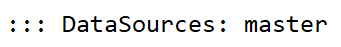

# Sharding-JDBC

## 介绍



## 使用方式



导入maven坐标

```xml
        <!-- 读写分离 -->
        <dependency>
            <groupId>org.apache.shardingsphere</groupId>
            <artifactId>sharding-jdbc-spring-boot-starter</artifactId>
            <version>4.0.0-RC1</version>
        </dependency>
```

配置application.yml

```yaml
spring:
  shardingsphere:
    datasource:
      names:
        master,slave
      # 主数据源
      master:
        type: com.alibaba.druid.pool.DruidDataSource
        driver-class-name: com.mysql.cj.jdbc.Driver
        url: jdbc:mysql://192.168.138.100:3306/rw?characterEncoding=utf-8
        username: root
        password: root
      # 从数据源
      slave:
        type: com.alibaba.druid.pool.DruidDataSource
        driver-class-name: com.mysql.cj.jdbc.Driver
        url: jdbc:mysql://192.168.138.101:3306/rw?characterEncoding=utf-8
        username: root
        password: root
    masterslave:
      # 读写分离配置
      load-balance-algorithm-type: round_robin #从库轮询
      # 最终的数据源名称
      name: dataSource
      # 主库数据源名称
      master-data-source-name: master
      # 从库数据源名称列表，多个逗号分隔
      slave-data-source-names: slave
    props:
      sql:
        show: true #开启SQL显示，默认false
```

> 如果原来的配置文件有datasource配置，则需要删除

开启允许bean定义覆盖，修改`application.yml`

```yaml
  main:
    allow-bean-definition-overriding: true
```

## 测试案例

```java
@RestController
@RequestMapping("/user")
@Slf4j
public class UserController {

    @Autowired
    private DataSource dataSource;

    @Autowired
    private UserService userService;

    @PostMapping
    public User save(User user){
        userService.save(user);
        return user;
    }

    @DeleteMapping("/{id}")
    public void delete(@PathVariable Long id){
        userService.removeById(id);
    }

    @PutMapping
    public User update(User user){
        userService.updateById(user);
        return user;
    }

    @GetMapping("/{id}")
    public User getById(@PathVariable Long id){
        User user = userService.getById(id);
        return user;
    }

    @GetMapping("/list")
    public List<User> list(User user){
        LambdaQueryWrapper<User> queryWrapper = new LambdaQueryWrapper<>();
        queryWrapper.eq(user.getId() != null,User::getId,user.getId());
        queryWrapper.eq(user.getName() != null,User::getName,user.getName());
        List<User> list = userService.list(queryWrapper);
        return list;
    }
}
```

> 对于查询操作
>
> 
>
> 对于写操作
>
> 