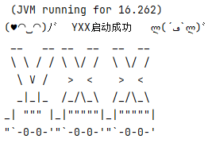
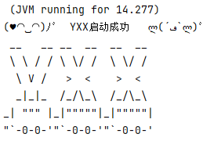
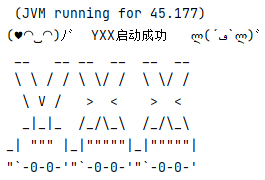

# Spring Boot懒加载

> 优化启动性能：
>
> - 默认情况下，Spring Boot在启动时会初始化所有单例Bean，如果Bean的初始化过程复杂或耗时，会导致启动时间显著增加
> - 懒加载通过延迟初始化Bean（仅在首次使用时初始化），减少启动时的资源消耗，从而加快应用启动速度
>
> 降低内存占用
>
> - 如果某些Bean在应用运行期间极少被使用（例如后台任务、备用服务等），懒加载可以避免这些Bean占用内存，直到真正需要时才加载
>
> 避免不必要的初始化
>
> - 对于某些条件性依赖（如根据配置动态加载的模块），懒加载可以避免在不需要时初始化这些Bean
>
> 资源优化
>
> - 在资源受限的环境中（如云原生、容器化部署），懒加载能更高效地利用CPU和内存资源
> - 解决循环依赖问题某些循环依赖问题可以通过懒加载缓解，因为部分Bean的初始化被延迟到需要时

## 阶段影响

**延迟的阶段**

- **实例化**：Bean实例的创建推迟到第一次实际使用（如被注入或通过`getBean()`获取时）
- **属性填充**：依赖注入操作延迟到初始化时
- **初始化**：`@PostConstruct`、`afterPropertiesSet()`等方法在第一次使用时触发

**不受影响的阶段**

- **销毁阶段**：即使Bean是懒加载的，只要被初始化过，容器关闭时仍会调用销毁方法
- **Bean 后置处理器**：`BeanPostProcessor`对懒加载Bean依然生效，但处理时机延后到首次使用时

## 指定包懒加载

LazyLoadConfig.java

```java
import lombok.extern.slf4j.Slf4j;
import org.springframework.beans.factory.config.BeanDefinition;
import org.springframework.beans.factory.config.BeanFactoryPostProcessor;
import org.springframework.boot.autoconfigure.condition.ConditionalOnProperty;
import org.springframework.context.annotation.Bean;
import org.springframework.context.annotation.Configuration;
import org.springframework.context.annotation.Lazy;
import org.springframework.util.ClassUtils;

@Slf4j
@Configuration
@ConditionalOnProperty(name = "spring.profiles.active", havingValue = "dev")
public class LazyLoadConfig {

    // 目标包名
    private static final String TARGET_PACKAGE = "com.yxx.business";

    // 显式注册 BeanFactoryPostProcessor
    @Bean
    public static BeanFactoryPostProcessor lazyLoadBeanFactoryPostProcessor() {
        return factory -> {
            String[] beanNames = factory.getBeanDefinitionNames();
            for (String beanName : beanNames) {
                BeanDefinition beanDef = factory.getBeanDefinition(beanName);
                String className = beanDef.getBeanClassName();
                if (className != null) {
                    try {
                        Class<?> clazz = ClassUtils.forName(className, null);
                        if (clazz.getPackage() != null && clazz.getPackage().getName().startsWith(TARGET_PACKAGE)) {
                            Lazy annotation = clazz.getAnnotation(Lazy.class);
                            // 如果没有设置@Lazy注解，或者注解值为true
                            if (annotation == null || annotation.value()) {
                                // 设置懒加载
                                beanDef.setLazyInit(true);
                            } else {
                                log.info("Bean " + beanName + " is not already lazy-initialized\n");
                            }
                        }
                    } catch (ClassNotFoundException e) {
                        // 处理异常（例如：类未找到，可能由动态代理导致）
                        throw new RuntimeException(e);
                    }
                }
            }
        };
    }
}
```

## 全局懒加载

application.yml

```yaml
spring:
  main:
    # 全局懒加载
    lazy-initialization: true
```

## 启动时间对比

> 初始启动(由于指定包下的bean数量较少，速度差异不大)：
>
> 
>
> 
>
> 分别创建333个Controller、Service、ServiceImpl，多了666个Bean

启用懒加载：




> 使用`@Autowired`字段注入：
>
> 
>
> 

关闭懒加载：



