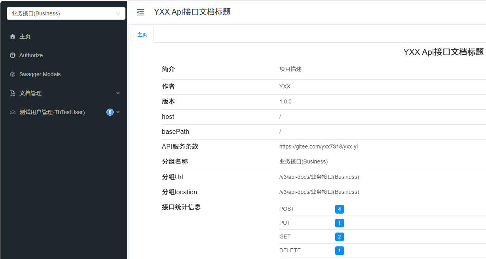

# SpringDoc

## 相关概念

**Swagger**

> Swagger是一个用于设计、构建、记录以及使用RESTful风格Web服务的开源软件框架。它提供了开发、生产及版本控制等阶段所需的一系列工具。Swagger主要指的是Swagger工具链，包括但不限于Swagger Editor、Swagger UI等
>
> - `Swagger 2`：指的是使用Swagger 2规范来描述API的版本
> - `OpenAPI 3`：是Swagger规范的演进版本，由OpenAPI Initiative维护。它提供了一个与语言无关的接口来描述现代API，包括RESTful接口

**OpenAPI**

> OpenAPI是一种规范和语言无关的界面描述，允许人类和计算机发现服务的功能而无需访问源代码、附加文档或通过网络流量检查。OpenAPI规范（以前称为 Swagger 规范）定义了一组标准的、可编程的接口说明

**Springfox**

> Springfox是一个基于 Spring 的项目，用于自动为项目API 生成Swagger文档。Springfox支持Swagger 2.0和OpenAPI 3.0规范。开发者可以通过简单的配置让Springfox自动扫描Spring MVC或Spring Boot应用中的控制器和模型，并生成相应的Swagger文档

**Springdoc-openapi**

> Springdoc-openapi是另一个用于自动生成 API 文档的库，专门为Spring Boot应用程序设计。与Springfox不同的是，Springdoc-openapi直接支持OpenAPI 3规范，并且更加现代化。它的目标是简化API文档的创建过程，减少手动配置的需求

**Knife4j**

> Knife4j是一个专注于优化和增强Swagger UI的前端项目。它是基于原生的Swagger UI进行二次封装的，旨在提供更美观、更友好的用户界面以及一些额外的功能。Knife4j可以集成到基于Spring Boot的应用中，既可以与Springfox一起使用，也可以与Springdoc-openapi配合工作，从而为 API 文档提供一个改进的查看体验

## 依赖引入

pom.xml

```xml
        <!-- 继任Springfox，支持Springboot3 -->
        <dependency>
            <groupId>org.springdoc</groupId>
            <artifactId>springdoc-openapi-ui</artifactId>
            <version>1.7.0</version>
        </dependency>

        <!-- knife4j增强swagger界面 -->
        <dependency>
            <groupId>com.github.xiaoymin</groupId>
            <artifactId>knife4j-openapi3-spring-boot-starter</artifactId>
            <version>4.5.0</version>
        </dependency>
```

> 兼容关系：
>
> 
>
> 对于`knife4j`
>
> - springboot2.x坐标为：`knife4j-openapi3-spring-boot-starter`
> - springboot3.x坐标为：`knife4j-openapi3-jakarta-spring-boot-starter`
>
> 

添加放行`/swagger-ui/**`、`/swagger-resources/**`、 `/v3/api-docs**`、 `/v3/api-docs/**`、`/*/api-docs`、`/webjars/**`

- json格式：`http://localhost:7318/v3/api-docs`
- yaml格式：`http://localhost:7318/v3/api-docs.yaml`

## 基本配置

OpenapiConfig.java

```java
import io.swagger.v3.oas.models.Components;
import io.swagger.v3.oas.models.OpenAPI;
import io.swagger.v3.oas.models.info.Contact;
import io.swagger.v3.oas.models.info.Info;
import io.swagger.v3.oas.models.info.License;
import io.swagger.v3.oas.models.security.SecurityRequirement;
import io.swagger.v3.oas.models.security.SecurityScheme;
import io.swagger.v3.oas.models.servers.Server;
import lombok.extern.slf4j.Slf4j;
import org.springdoc.core.*;
import org.springframework.beans.factory.annotation.Value;
import org.springframework.context.annotation.Bean;

import org.springframework.context.annotation.Configuration;

import java.util.ArrayList;
import java.util.List;

/**
 * springdoc-openapi 配置
 */
@Slf4j
@Configuration
public class OpenapiConfig {

    @Value("com.yxx.business")
    private String businessPath;

    @Bean
    public OpenAPI api() {
        // 联系人信息(contact)，构建API的联系人信息，用于描述API开发者的联系信息，包括名称、URL、邮箱等
        Contact contact = new Contact()
                .name("YXX")  // 作者名称
                .email("1303490776@qq.com") // 作者邮箱
                .url("https://gitee.com/yxx7318"); // 介绍作者的URL地址

        License license = new License()
                .name("MIT")                         // 授权名称
                .url("https://www.apache.org/licenses/LICENSE-2.0.html")    // 授权信息
                .identifier("MIT");                   // 标识授权许可

        //创建Api帮助文档的描述信息、联系人信息(contact)、授权许可信息(license)
        Info info = new Info()
                .title("YXX Api接口文档标题")      // Api接口文档标题（必填）
                .description("项目描述")     // Api接口文档描述
                .version("1.0.0")                                  // Api接口版本
                .termsOfService("https://gitee.com/yxx7318/yxx-yi")    // Api接口的服务条款地址
                .license(license)  //   授权名称
                .contact(contact); // 设置联系人信息

        //多服务
        List<Server> servers = new ArrayList<>();
        // 表示服务器地址或者URL模板列表，多个服务地址随时切换（只不过是有多台IP有当前的服务API）
        servers.add(new Server().url("/"));
        servers.add(new Server().url("https://dev.domain.com/dev-api/").description("开发环境"));
        servers.add(new Server().url("https://test.domain.com/test-api/").description("测试环境"));
        servers.add(new Server().url("https://prod.domain.com/test-api/").description("正式环境"));

        // 设置 spring security apikey accessToken 认证的请求头 Authorization: Bearer xxxxxxxx
        SecurityScheme securityScheme = new SecurityScheme()
                .scheme("Bearer")                     // 指定认证方案类型为 Bearer（即 Token 认证）
                .name("Authorization")               // 定义请求头名称为 "Authorization"
                .type(SecurityScheme.Type.APIKEY)    // 安全方案类型为 APIKEY（通过请求头传递 Token）
                .description("请输入token,格式为[Bearer xxxxxxxx]")  // 描述认证格式
                .in(SecurityScheme.In.HEADER);       // 指定 Token 传递位置为请求头（HEADER）

        // 将定义好的 SecurityScheme（Bearer Token 认证方案）注册到 OpenAPI 的 Components 组件中
        Components components = new Components().addSecuritySchemes("Authorization", securityScheme);

        // 创建全局安全需求对象，声明所有 API 接口需要使用 "Authorization" 安全方案进行认证
        SecurityRequirement authorization = new SecurityRequirement().addList("Authorization");

        return new OpenAPI()
                .components(components)
                .info(info)
                .addSecurityItem(authorization)
                .servers(servers);
    }

    @Bean
    public GroupedOpenApi businessApi() {
        return GroupedOpenApi.builder()
                .group("业务接口(Business)")
                .packagesToScan(businessPath)
                .build();

    }

    @Bean
    public GroupedOpenApi supportApi() {
        return GroupedOpenApi.builder()
                .group("支撑接口(Support)")
                .pathsToMatch("/**")
                .packagesToExclude(businessPath)
                .build();
    }
}
```

> 访问：`http://localhost:7318/doc.html`
>
> 
>
> 访问：`http://localhost:7318/swagger-ui/index.html`
>
> 
