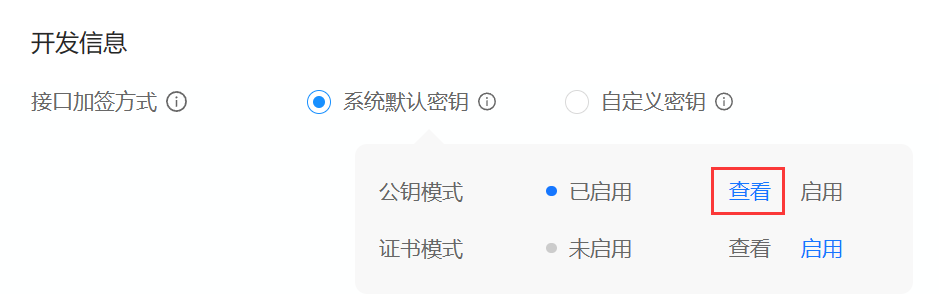

# 支付宝支付

## 沙箱支付

> 沙箱环境是协助开发者进行接口开发及主要功能联调的模拟环境，目前仅支持网页/移动应用和小程序两种应用类型。在沙箱完成接口调试后，需要在正式环境进行完整的功能验收测试

访问地址：[支付宝开放平台 (alipay.com)](https://open.alipay.com/develop/sandbox/app)


公钥模式




沙箱这里用到的是"应用私钥"和"支付宝公钥"

## 示例代码

> 接口查询：[统一收单交易退款接口 - 支付宝文档中心 (alipay.com)](https://opendocs.alipay.com/open/4b7cc5db_alipay.trade.refund?scene=common&pathHash=d98b006d)

- `trade_no`：该交易在支付宝系统中的交易流水号。最短 16 位，最长 64 位。和out_trade_no不能同时为空，如果同时传了 out_trade_no和 trade_no，则以 trade_no为准
- `out_trade_no`：订单支付时传入的商户订单号,和支付宝交易号不能同时为空。 trade_no,out_trade_no如果同时存在优先取trade_no
- `setNotifyUrl()`：异步接收地址，仅支持http/https，公网可访问
- `setReturnUrl()`：同步跳转地址，仅支持http/https

### 唤起支付

**扫码支付**：收银员通过收银台或商户后台调用支付宝接口，生成二维码后，展示给用户，由用户扫描二维码完成订单支付。

AlipayDemo.java

```java
import com.alipay.api.AlipayApiException;
import com.alipay.api.AlipayClient;
import com.alipay.api.DefaultAlipayClient;
import com.alipay.api.domain.AlipayTradePayModel;
import com.alipay.api.request.AlipayTradePrecreateRequest;
import com.alipay.api.response.AlipayTradePrecreateResponse;

public class Precreate {
    public static void main(String[] args) {
        // 创建支付宝客户端
        AlipayClient alipayClient = new DefaultAlipayClient(
                "https://openapi-sandbox.dl.alipaydev.com/gateway.do",
                "APP_ID",
                "YOUR_PRIVATE_KEY",
                "json",
                "utf-8",
                "ALIPAY_PUBLIC_KEY",
                "RSA2");
        // 创建API对应的request类
        AlipayTradePrecreateRequest request = new AlipayTradePrecreateRequest();
        request.setNotifyUrl("");

        // 参数类
        AlipayTradePayModel model = new AlipayTradePayModel();
        // 订单号
        model.setOutTradeNo("2015042001045643223101");
        model.setTotalAmount("88.88");
        model.setSubject("Iphone6 16G");

        //// 商品明细信息，按需传入
        //JSONArray goodsDetail = new JSONArray();
        //JSONObject goods1 = new JSONObject();
        //goods1.put("goods_id", "goodsNo1");
        //goods1.put("goods_name", "子商品1");
        //goods1.put("quantity", 1);
        //goods1.put("price", 0.01);
        //goodsDetail.add(goods1);
        //bizContent.put("goods_detail", goodsDetail);
        
        //// 扩展信息，按需传入
        //JSONObject extendParams = new JSONObject();
        //extendParams.put("sys_service_provider_id", "2088511833207846");
        //bizContent.put("extend_params", extendParams);
        
        //// 结算信息，按需传入
        //JSONObject settleInfo = new JSONObject();
        //JSONArray settleDetailInfos = new JSONArray();
        //JSONObject settleDetail = new JSONObject();
        //settleDetail.put("trans_in_type", "defaultSettle");
        //settleDetail.put("amount", 0.01);
        //settleDetailInfos.add(settleDetail);
        //settleInfo.put("settle_detail_infos", settleDetailInfos);
        //bizContent.put("settle_info", settleInfo);
        
        //// 二级商户信息，按需传入
        //JSONObject subMerchant = new JSONObject();
        //subMerchant.put("merchant_id", "2088000603999128");
        //bizContent.put("sub_merchant", subMerchant);
        
        //// 业务参数信息，按需传入
        //JSONObject businessParams = new JSONObject();
        //businessParams.put("busi_params_key", "busiParamsValue");
        //bizContent.put("business_params", businessParams);
        
        //// 营销信息，按需传入
        //JSONObject promoParams = new JSONObject();
        //promoParams.put("promo_params_key", "promoParamsValue");
        //bizContent.put("promo_params", promoParams);

        request.setBizModel(model);

        // 通过alipayClient调用API，获得对应的response类
        AlipayTradePrecreateResponse response = null;
        try {
            // 用于API调用，比如查询交易状态，关闭交易等
            response = alipayClient.execute(request);
            // 根据response中的结果继续业务逻辑处理
            if (response.isSuccess()) {
                // 返回的所有结果：code为状态码，成功msg会提示"Success"，out_trade_no为设置的订单号
                // qr_code为二维码的链接，sign为商户请求的签名串
                System.out.println(response.getBody());
                System.out.println(response.getMsg());
                // 二维码链接，使用沙箱支付宝去扫即可付款
                System.out.println(response.getQrCode());
            } else {
                System.out.println("调用失败");
            }
        } catch (AlipayApiException e) {
            e.printStackTrace();
        }
    }
}
```

> ```
> {"alipay_trade_precreate_response":{"code":"10000","msg":"Success","out_trade_no":"2015042001045643223101","qr_code":"https:\/\/qr.alipay.com\/bax07671yksrd57qdhx700e0"},"sign":"XWYzuHKxDv0FJANkmRCm/mSnGtdTLkzp9RyqLWdUWP2i31pQW2gVj8qKBXjE8fo5qv6uNS5P0zy9SiX7z+xGAq9jlOK1EjW6N5cjElvzX/i21wOxlbTASjaJu1TOQomuz2HdH/bWF9NF/H/fnZ1e5JJ+dAVUw9eZV03dM/1JLa3gmlsuFYAA6wesHYoI3mXBJhmkCYCkag319v/9t/95OdRDqNC0veUleNymuhf+051CBp3XzvWOW+COdKwhneCxWHstgu8VTytq3LMiGRbmqJbR8rq5NIDwtPTbQj33cpWWelk/Ff0sf8iMMlFHgwt5eaWBCIz+BcY7Hi5JSG6CgA=="}
> Success
> https://qr.alipay.com/bax07671yksrd57qdhx700e0
> ```

**手机网页支付**：[手机网站支付接口2.0 - 支付宝文档中心 (alipay.com)](https://opendocs.alipay.com/open/29ae8cb6_alipay.trade.wap.pay?scene=21&pathHash=0a6313c7)

```java
        AlipayTradeWapPayRequest request = new AlipayTradeWapPayRequest();
        //异步接收地址，仅支持http/https，公网可访问
        request.setNotifyUrl("");
        //同步跳转地址，仅支持http/https
        request.setReturnUrl("");

        /******必传参数******/
        JSONObject bizContent = new JSONObject();
        //商户订单号，商家自定义，保持唯一性
        bizContent.put("out_trade_no", "2021081141234453451004");
        //支付金额，最小值0.01元
        bizContent.put("total_amount", 1999);
        //订单标题，不可使用特殊符号
        bizContent.put("subject", "小米14");

        /******可选参数******/
        //手机网站支付默认传值FAST_INSTANT_TRADE_PAY
        bizContent.put("product_code", "QUICK_WAP_WAY");
        //bizContent.put("time_expire", "2022-08-01 22:00:00");

        //// 商品明细信息，按需传入
        //JSONArray goodsDetail = new JSONArray();
        //JSONObject goods1 = new JSONObject();
        //goods1.put("goods_id", "goodsNo1");
        //goods1.put("goods_name", "子商品1");
        //goods1.put("quantity", 1);
        //goods1.put("price", 0.01);
        //goodsDetail.add(goods1);
        //bizContent.put("goods_detail", goodsDetail);

        //// 扩展信息，按需传入
        //JSONObject extendParams = new JSONObject();
        //extendParams.put("sys_service_provider_id", "2088511833207846");
        //bizContent.put("extend_params", extendParams);

        request.setBizContent(bizContent.toString());
        try {
            AlipayTradeWapPayResponse response = alipayClient.pageExecute(request);
            if (response.isSuccess()) {
                System.out.println(response.getBody());
            } else {
                System.out.println("调用失败");
            }
        } catch (AlipayApiException e) {
            e.printStackTrace();
        }
```

> ```
> <form name="punchout_form" method="post" action="https://openapi-sandbox.dl.alipaydev.com/gateway.do?charset=utf-8&method=alipay.trade.wap.pay&sign=flYjrSww%2F1XazKXnAgam893CWPPRF9gMfHG2c2vEvgSGWph5jtENH%2FGJW15c2Fn5awDlzXNKy1r213EwZGfOQx3Nk3sPK8tipwS48Feclme4pN0ZATthJmNtdyBF6CHQw3Z4QjJ%2FjQLt3CFVY4co1U003ovwdc5wUVBXeQ5XnNpSENW4eFY4OuYgDlhJmNBxpm%2FaMMUN1qiVvGY4rTSS6FUiDRtLYyhqn5wu%2Bv4WHP88a2V6uJoWSraKuft1YEL6aHPfgawxTXWx%2FfAkSOsVBHcUKZ%2F6c8feqRj9VngyRS%2FVbrcO2dWR1WiAsyzwMHzmCTXXCTfit4TjuGQvku8fPA%3D%3D&version=1.0&app_id=9021000131660249&sign_type=RSA2&timestamp=2023-12-17+20%3A03%3A34&alipay_sdk=alipay-sdk-java-dynamicVersionNo&format=json">
> <input type="hidden" name="biz_content" value="{&quot;out_trade_no&quot;:&quot;202143251141234453451004&quot;,&quot;total_amount&quot;:1999,&quot;subject&quot;:&quot;小米14&quot;,&quot;product_code&quot;:&quot;QUICK_WAP_WAY&quot;}">
> <input type="submit" value="立即支付" style="display:none" >
> </form>
> <script>document.forms[0].submit();</script>
> ```
>
> 示例嵌入前端的代码
>
> ```java
>     response.setContentType("text/html;charset=utf-8");
>     response.getWriter().write(body);
> ```
>
> 

**电脑网页支付**：[统一收单下单并支付页面接口 - 支付宝文档中心 (alipay.com)](https://opendocs.alipay.com/open/028r8t?scene=22)

```java
        AlipayTradePagePayRequest request = new AlipayTradePagePayRequest();
        // 异步接收地址，仅支持http/https，公网可访问
        request.setNotifyUrl("");
        // 同步跳转地址，仅支持http/https
        request.setReturnUrl("");

        // 参数类
        AlipayTradePayModel model = new AlipayTradePayModel();
        // 订单号
        model.setOutTradeNo("201504200104563251100");
        model.setTotalAmount("88.88");
        model.setSubject("Iphone6 16G");

        /******可选参数******/
        //bizContent.put("time_expire", "2022-08-01 22:00:00");

        //// 商品明细信息，按需传入
        //JSONArray goodsDetail = new JSONArray();
        //JSONObject goods1 = new JSONObject();
        //goods1.put("goods_id", "goodsNo1");
        //goods1.put("goods_name", "子商品1");
        //goods1.put("quantity", 1);
        //goods1.put("price", 0.01);
        //goodsDetail.add(goods1);
        //bizContent.put("goods_detail", goodsDetail);

        //// 扩展信息，按需传入
        //JSONObject extendParams = new JSONObject();
        //extendParams.put("sys_service_provider_id", "2088511833207846");
        //bizContent.put("extend_params", extendParams);

        // 电脑网站支付场景固定传值FAST_INSTANT_TRADE_PAY
        model.setProductCode("FAST_INSTANT_TRADE_PAY");
        request.setBizModel(model);

        try {
            AlipayTradePagePayResponse response = alipayClient.pageExecute(request);
            if (response.isSuccess()) {
                // 返回的所有结果，结果为html代码，需要内嵌到网页中来
                System.out.println(response.getBody());
            } else {
                System.out.println("调用失败");
            }
        } catch (AlipayApiException e) {
            e.printStackTrace();
        }
    }
```

> ```
> <form name="punchout_form" method="post" action="https://openapi-sandbox.dl.alipaydev.com/gateway.do?charset=utf-8&method=alipay.trade.page.pay&sign=YLXrRG95ezsEl%2Bdz4WaZAA9K2YJs1eugEflpCZ806LxGkooMawFZGUrpdsGxPw%2FpEqP0S7Lc1EKpMbuNaAFHoRry7oWg2M0ZdPeK77o3My0vihL0aOjHRysKGwSyD3zxoE%2Bj3TLCKXljZjzdG7%2Fo6wJDOzcsT5XTf6QflCgS%2B5v5qNAtJc9HX2kwEOow70eD8EZfAJdP9bKazhEoX%2Bpjv2zbJEUQCpRry43UuWchh9eUHbeasCFa7i86T7hMAw1iSR3P5tFgpw9lBahsv0Y59rCrYoOqIKGUSF3PPUndK3YjgIj81GpU1tZJ2iLKYuL07xJUrrOQ6NUbvKYKhPge7g%3D%3D&version=1.0&app_id=9021000131660249&sign_type=RSA2&timestamp=2023-12-17+19%3A28%3A18&alipay_sdk=alipay-sdk-java-dynamicVersionNo&format=json">
> <input type="hidden" name="biz_content" value="{&quot;out_trade_no&quot;:&quot;201504200104563251100&quot;,&quot;product_code&quot;:&quot;FAST_INSTANT_TRADE_PAY&quot;,&quot;subject&quot;:&quot;Iphone6 16G&quot;,&quot;total_amount&quot;:&quot;88.88&quot;}">
> <input type="submit" value="立即支付" style="display:none" >
> </form>
> <script>document.forms[0].submit();</script>
> ```
>
> 示例嵌入前端的代码
>
> ```java
>         response.setContentType("text/html;charset=utf-8");
>         response.getWriter().write(body);
> ```
>
> 

### 交易查询结果

> - 该接口提供所有支付宝支付订单的查询，商户可以通过该接口主动查询订单状态，完成下一步的业务逻辑
>   需要调用查询接口的情况
> - 当商户后台、网络、服务器等出现异常，商户系统最终未接收到支付通知
> - 调用支付接口后，返回系统错误或未知交易状态情况
> - 调用alipay.trade.pay，返回INPROCESS的状态
> - 调用alipay.trade.cancel之前，需确认支付状态

```java
        // 创建API对应的查询请求类
        AlipayTradeQueryRequest request = new AlipayTradeQueryRequest();

        // 订单号
        JSONObject bizContent = new JSONObject();
        bizContent.put("out_trade_no", "20150420010101105");
        // 设置查询参数
        request.setBizContent(bizContent.toString());

        // 通过alipayClient调用API，获得对应的response类
        AlipayTradeQueryResponse response = null;
        try {
            // 用于API调用，比如查询交易状态，关闭交易等
            response = alipayClient.execute(request);
            // 根据response中的结果继续业务逻辑处理
            if (response.isSuccess()) {
                System.out.println(response.getBody());
                System.out.println("查询成功");
            } else {
                System.out.println("调用失败");
            }
```

> ```
> {"alipay_trade_query_response":{"code":"10000","msg":"Success","buyer_logon_id":"pdq***@sandbox.com","buyer_pay_amount":"0.00","buyer_user_id":"2088722020868784","buyer_user_type":"PRIVATE","invoice_amount":"0.00","out_trade_no":"20150420010101105","point_amount":"0.00","receipt_amount":"0.00","send_pay_date":"2023-12-17 16:55:22","total_amount":"88.88","trade_no":"2023121722001468780502243281","trade_status":"TRADE_CLOSED"},"sign":"ZqFYJVcz7K3o21/CmqfKbV1uReDELO75vpwe6Bd37SWcVJGjAEFoJM4DlpvJuJjo10MYCkuKVRYfA4+q1DTv/MoWXF3f/j3Y5TVz+F3J/fXCxbHuoEB1Yd7LCLgfPPd7JjW/W9wnkgFCL+KDr+dNY/e+YP+UsWDvbkXSILyvezQn7ccb19kGegaNxq6iMfC+o/1E0BPdYhqMq8DLnE4dTUOqO4GPhxidPkdvrWXJZAyVDKwYBTB6I+jbEw2/5+IV85uMz5AUlP2UWxlaHcnWfCYb3uejv+htLAhD1l0wtbBljG6CQO1Iql1HY+FhO3UthWEOyDQ/DDLqVaZN51wgQQ=="}
> 支付成功
> ```

### 交易退款接口

> - 当交易发生之后一段时间内，由于买家或者卖家的原因需要退款时，卖家可以通过退款接口将支付款退还给买家，支付宝将在收到退款请求并且验证成功之后，按照退款规则将支付款按原路退到买家帐号上
> - 交易超过约定时间（签约时设置的可退款时间）的订单无法进行退款
> - 支付宝退款支持单笔交易分多次退款，多次退款需要提交原支付订单的订单号和设置不同的退款请求号。一笔退款失败后重新提交，要保证重试时退款请求号不能变更，防止该笔交易重复退款
> - 同一笔交易累计提交的退款金额不能超过原始交易总金额
>
> 注意：
>
> - 同一笔交易的退款至少间隔3s后发起
> - 请严格按照接口文档中的参数进行接入。若在此接口中传入【非当前接口文档中的参数】会造成【退款失败或重复退款】
> - 该接口不可与其他退款产品混用。若商户侧同一笔退款请求已使用了当前接口退款的情况下，【再使用其他退款产品进行退款】可能会造成【重复退款】
> - 退款成功判断说明：接口返回fund_change=Y为退款成功，fund_change=N或无此字段值返回时需通过退款查询接口进一步确认退款状态。详见[退款成功判断指导](https://opendocs.alipay.com/support/01rawa)。注意，接口中code=10000，仅代表本次退款请求成功，不代表退款成功

```java
        AlipayTradeRefundRequest request = new AlipayTradeRefundRequest();
        JSONObject bizContent = new JSONObject();
        // 订单号
        bizContent.put("out_trade_no", "20150420010101005");
        // 退款金额
        bizContent.put("refund_amount", 0.01);
        // 退款请求号。标识一次退款请求，需要保证在交易号下唯一，如需部分退款，则此参数必传。
        // 如果调用接口失败或异常了，重试时需要保证退款请求号不能变更，防止该笔交易重复退款，多次退款需要变更退款请求号
        bizContent.put("out_request_no", "HZ01RF0013");
        request.setBizContent(bizContent.toString());
        try {
            AlipayTradeRefundResponse response = alipayClient.execute(request);
            // 根据response中的结果继续业务逻辑处理
            if (response.isSuccess()) {
                System.out.println(response.getBody());
                System.out.println("退款成功");
            } else {
                System.out.println("调用失败");
            }
        } catch (AlipayApiException e) {
            e.printStackTrace();
        }
```

> ```
> {"alipay_trade_refund_response":{"code":"10000","msg":"Success","buyer_logon_id":"pdq***@sandbox.com","buyer_user_id":"2088722020868784","fund_change":"N","gmt_refund_pay":"2023-12-17 17:36:56","out_trade_no":"20150420010101005","refund_detail_item_list":[{"amount":"0.01","fund_channel":"ALIPAYACCOUNT"}],"refund_fee":"88.45","send_back_fee":"0.01","trade_no":"2023121722001468780502243279"},"sign":"mQ31+ZIjC+xoBzjvjT+u3gcsehyMrFs9JSaSJaL0vOE+gMt+jYQswk6JMqf2TEt8/PPtne+nWCI61vQZK+FUhzOa6YXeQb6OXPciajpdpx9R/2ikEFlyv6/O+zBFAH/xFJZ4+r3W/Nq0GuK9kmvdoLLu/Zrzvq9PoOfJXG0+RwFOzVqZnQAuXs5vyT74z0Y9hGGy5srMU3MNz9PhXWwJs9AAfMBHyC3ar1lMduVU0U02mxuQ4Ka51SA73Wh/iJddoBx6BghFWbD7d00Vil2RVF0DvXGC1+2K7qQDaXuL8Z7yhI+08O388eich2pxymzH1KauZRAkoe8tQx/YcGdmIQ=="}
> 退款成功
> ```

### 交易关闭接口

> 用于交易创建后，用户在一定时间内未进行支付，可调用该接口直接将未付款的交易进行关闭

```java
        AlipayTradeCloseRequest request = new AlipayTradeCloseRequest();

        JSONObject bizContent = new JSONObject();
        // 订单号
        bizContent.put("out_trade_no", "20150420010101111");
        request.setBizContent(bizContent.toString());
        try {
            AlipayTradeCloseResponse response = alipayClient.execute(request);
            // 根据response中的结果继续业务逻辑处理
            if (response.isSuccess()) {
                System.out.println(response.getBody());
            } else {
                System.out.println("调用失败");
            }
        } catch (AlipayApiException e) {
            e.printStackTrace();
        }
```

> ```
> {"alipay_trade_close_response":{"code":"10000","msg":"Success","out_trade_no":"20150420010100000","trade_no":"2023121722001468780502252760"},"sign":"ZEXXlWFtutp3R+N+ndC/Y3WT8+oOQU/27wMfCGngHdn9/VrXjj+R40c1glceEzgM2ImMybGQJHIPn+ZYuzQ0LRgGPQRQLk8YYhVJc9hAMnHg0WGqjy45yaUrFjWPNiVDhsChYOutrFtuXij3s+u397YizTuP96evOEmGag8dJ4OoyMnekwYtKwk/4oYw6dFgd/oMUFAF+mAl9rPmQBMfRtm23TFvxZU1bHaDswdcRG9KH8gVGlHQ8BtGYw2qkUBw4Lhu8kquAnM8gWEwGoPyICb8CkIGVwYuv2KRsCfe1pJ33b0C+n4qt3FFrkklxGtJoYKu3KYxZx+vAsQH7OHabw=="}
> ```